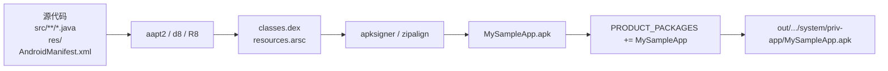
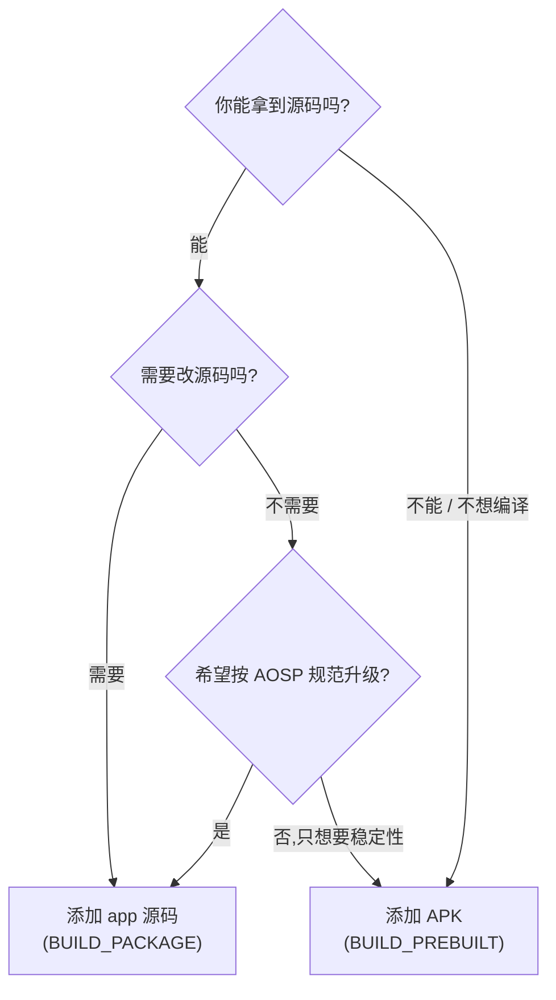

我先看一下 `addApk/read.md` 目前写了哪些,再决定是补"区别 & 原因"小节,还是新增一份。
`addApk/read.md` 是我上一轮把那份"添加 APK 实例"对话原样粘进去了,实际上**没有落盘**。下面给你"添加 app 源码 vs 添加 APK"的**对比 & 动因**总结,方便你直接挑一段贴到 Obsidian。

# 添加 app 源码 vs 添加 APK:区别与原因

## 1. 一句话区别

| 维度 | **添加 app 源码**(addSrc) | **添加 APK**(addApk) |
|---|---|---|
| 拿到的东西 | 源代码(`.java/.kt` + `AndroidManifest.xml` + 资源) | 编译**好**的 `.apk`(甚至 `.aar`/原生 `.so`) |
| AOSP 构建动作 | `BUILD_PACKAGE` / `android_app{}` → **自己编译** | `BUILD_PREBUILT` / `android_app_import{}` → **直接打包,不编译** |
| 工具链要求 | 需要装 JDK / aapt2 / d8 / R8 / 资源编译器 | **不需要** app 的构建工具链,只要有 APK |
| 源码可读 | ✅ 能改 Java / 资源 | ❌ 看不到代码,只能改 Manifest / smali |
| 产物大小 | 通常更大(dex 没优化过) | 通常更小(发布包已 R8) |
| 启动速度 | 默认无 dexpreopt,冷启动慢 | 可继承上游的 dexpreopt |
| 维护成本 | 高(每次 AOSP 升级要重新适配) | 低(只换 APK 就行) |
| 适用来源 | 你自己写的 app / GMS / AOSP 内置 app | 第三方厂商给的 release apk / aar |

## 2. 流程图对比

### 2.1 添加 app 源码(`BUILD_PACKAGE`)

### 2.2 添加 APK(`BUILD_PREBUILT`)

> **关键差异**:添加 APK **没有 aapt2 / d8 / R8 / 资源合并**这几步,只是"包一层 + 重签"。

## 3. 核心 API 与权限差异

| 项 | 添加 app 源码 | 添加 APK |
|---|---|---|
| `platform_apis: true` | ✅ 通常开,能调 `@hide` API | ❌ 默认不开,因为预编译 APK 已经在某个 SDK 版本编好了,改不动 |
| `LOCAL_CERTIFICATE := platform` | ✅ | ✅(几乎**必须**,否则装不上 system image) |
| `LOCAL_PRIVILEGED_MODULE := true` | ✅ | ✅ |
| `LOCAL_OVERRIDES_PACKAGES` | ✅ | ✅ |
| `LOCAL_REQUIRED_MODULES` | ✅ | ✅ |
| dexpreopt 自动优化 | 取决于 `WITH_DEXPREOPT` | 同上,但**预编译 APK 的 dex 是 odex / vdex 格式时,要先还原** |
| AOSP 升级影响 | 大(要重新编一遍,可能改 API) | 极小(直接换下一个 release apk) |

## 4. 什么时候用哪个?—— 选型决策

**经验法则**:
- **新写**一个系统特性、调试 API、调 `SystemServer` / `IPowerManager` 等内部 API → **加源码**。
- **集成厂商交付物**、GMS、闭源 SDK、要的就是稳定黑盒 → **加 APK**。
- 同一项目里**两种常常混用**:AOSP 标准 app 加源码、厂商或合作方 app 加 APK。

## 5. 为什么要这么做?(动机)

### 5.1 为什么要"把 app 加进 AOSP"而不是"装到用户区"?

- **预装到 system image**:开机即可用,`/system`/`/system/priv-app`/`/vendor` 不会被 factory reset 清除,设备启动后立刻可用,符合 OEM 集成需求。
- **拿到系统权限**:`platform_apis` / `signature` / `privileged` 权限,普通 APK 拿不到(比如 `INSTALL_PACKAGES`、`MANAGE_USERS`、`READ_FRAME_BUFFER`)。
- **同签名互信**:与 `system_server` 同签后,可使用 `signature` 级 `permission` 互相调用;厂商定制场景里,自研 app 和 framework 之间需要这种"自家权限"互信。
- **首启优化 + 编译时优化**:编译进 system image 后,`dex2oat` / `dexpreopt` 可以把 dex 预编译为 OAT,首启比 `pm install` 快几倍。
- **OTA 可控**:AOSP 整编后,系统升级时 app 跟系统一起升级,版本一致。

### 5.2 为什么要"加源码"而不是"加 APK"?

- **可调 @hide API**:Android 平台内部 API 标注 `@hide`,`android.jar` 不导出,只有 `platform.jar`(`platform_apis: true`)才能调。闭源 APK 看不到这些。
- **源码可调试**:可设断点、可改 framework jar、可加 log,可和 framework 代码一起调试。
- **AOSP 编译链统一**:源码走 `aapt2 → d8 → R8 → apksigner`,生成产物与 AOSP 其他 app 一致,共用 dexpreopt 流水线。
- **支持自定义资源 / 资源覆盖**:`aapt2` 可以在 `frameworks/base/core/res/res` 里加资源,然后你的 app 引用,不需要运行时反射。

### 5.3 为什么要"加 APK"而不是"加源码"?

- **拿不到源码** —— 商业 SDK / GMS / 第三方交付物只给 APK。
- **编译时间敏感** —— 第三方 APK 可能在 NDK 16 + 旧 aapt2 编的,在新 AOSP 编译链上重编会失败。
- **稳定性优先** —— 升级时只换下一个 release APK,不需要每次 AOSP 升级都重新适配源码。
- **保护知识产权** —— 商业代码不希望被加进 AOSP 主仓,只放二进制。
- **避免重复依赖** —— APK 已自带 `.so` / 资源,集成简单,避免污染 `classpath`。

### 5.4 为什么签名必须用 `platform`?

- AOSP `platform.pk8` 配 `platform.x509.pem` 是 `system_server`、`SettingsProvider`、`InputMethodManagerService` 等所有系统服务**统一**使用的签名。
- 你的 app 用 platform 签 → 与系统服务同签 → 可使用 `signature` 级 permission,例如:
  - 自定义 `<permission android:protectionLevel="signature" />` 只允许"系统同签"app 调用。
  - `INSTALL_PACKAGES`、`RESTART_PACKAGES`、`MANAGE_USB`、`MOUNT_FORMAT_FILESYSTEMS` 等 OEM 权限。
- 不重签 → 只能走 `dangerous` 权限 + 用户授权,且装不到 `priv-app` 拿不到 `privileged` 权限。
- `PRESIGNED` 保留原签名,适用场景:APK 不需要 signature 权限,或者你**故意**要保留原签名做版权声明。

## 6. 一句话总结(便于贴进 Obsidian)

> **加源码 = 你写 / 你改 / 你控制全生命周期,走 AOSP 编译链,可调 @hide;**
> **加 APK = 拿到的是黑盒二进制,只打包不编译,几乎不依赖构建工具链;**
> **共同的目的是**:预装到 system image,拿到 `platform` 签名 + `priv-app` 位置 + `signature` 权限,以及和系统一起升级 / 优化 / OTA。

---

**需要落盘?** 看你工作区:
- `app源码/addSrc.md` —— 已有"加源码"实例,我**没有**把对比小节放进去。
- `addApk/read.md` —— 上次只存了对话草稿,正文里的内容**没有写入**。

我建议把上面这份"区别与原因"独立成 `c:\D\otherproject\obsidian\assest\app源码\diff_vs_apk.md`,这样它**同时被 addSrc 和 addApk 引用**,结构最干净。要的话告诉我"**写入 diff_vs_apk.md**" 即可,当前在 ask 模式,写文件需要切到 craft 模式。