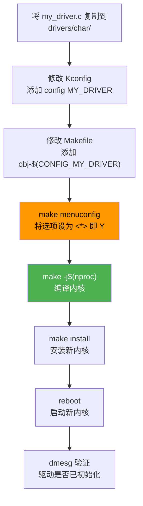

The user is asking about how to compile a module into the Linux kernel (built-in, not as a loadable module). This is a common kernel development topic. Let me provide a comprehensive answer.
## 将模块编译进内核（Built-in）

将驱动从**可加载模块（`.ko`）**变为**内核内置**，需要在内核源码树中进行配置。以下是完整步骤：

---

### 一、核心概念

| 方式             | Makefile 语法              | 效果                                  |
| ---------------- | -------------------------- | ------------------------------------- |
| 编译为可加载模块 | `obj-m += my_driver.o`     | 生成 `my_driver.ko`，需 `insmod` 加载 |
| **编译进内核**   | **`obj-y += my_driver.o`** | **直接编入内核镜像，开机自动可用**    |

---

### 二、完整操作步骤

#### 第 1 步：将驱动源码放入内核源码树

选择合适的目录，例如字符设备放在 `drivers/char/`：

```bash
# 示例：将驱动放入内核源码树
cp my_driver.c ~/linux-source/drivers/char/
```

常见的目录归属：

```
drivers/char/        → 字符设备驱动
drivers/block/       → 块设备驱动
drivers/net/         → 网络设备驱动
drivers/i2c/         → I2C 驱动
drivers/spi/         → SPI 驱动
drivers/usb/        → USB 驱动
drivers/platform/    → 平台设备驱动
drivers/gpio/        → GPIO 驱动
```

#### 第 2 步：修改该目录下的 Kconfig

在 `drivers/char/Kconfig` 中添加配置项：

```kconfig
config MY_DRIVER
    tristate "My custom device driver"
    default y
    help
      This is a simple char device driver for my hardware.
      If unsure, say Y.
```

**`tristate` 三种状态说明：**

```
Y → 编译进内核（built-in）
M → 编译为模块（module）
N → 不编译
```

如果只想允许编入内核、不允许编译为模块，用 `bool` 替代 `tristate`：

```kconfig
config MY_DRIVER
    bool "My custom device driver (built-in only)"
    default y
    help
      This driver can only be built into the kernel.
```

#### 第 3 步：修改该目录下的 Makefile

在 `drivers/char/Makefile` 中添加：

```makefile
obj-$(CONFIG_MY_DRIVER) += my_driver.o
```

> **原理**：当 `CONFIG_MY_DRIVER=y` 时，展开为 `obj-y += my_driver.o`，编译进内核；  
> 当 `CONFIG_MY_DRIVER=m` 时，展开为 `obj-m += my_driver.o`，编译为模块。

#### 第 4 步：确保上层 Kconfig 被 include

检查 `drivers/char/Kconfig` 是否被 `drivers/Kconfig` 包含：

```kconfig
# drivers/Kconfig 中应有：
source "drivers/char/Kconfig"
```

一般内核源码树中已经默认包含，无需额外修改。

#### 第 5 步：配置内核选项

```bash
# 方式一：菜单配置（推荐）
make menuconfig

# 导航路径示例：
# Device Drivers  --->
#     Character devices  --->
#         [*] My custom device driver
#         按 Y 键使其变为 <*>（编入内核）

# 方式二：直接修改 .config 文件
echo "CONFIG_MY_DRIVER=y" >> .config

# 方式三：使用脚本自动设置
scripts/config --enable CONFIG_MY_DRIVER
```

**menuconfig 中的标识含义：**

```
< >  → 未选中（N）
<M>  → 编译为模块（M）
<*>  → 编译进内核（Y）   ← 我们需要这个
```

#### 第 6 步：编译内核

```bash
# 编译整个内核
make -j$(nproc)

# 生成的内核镜像位置（以 x86 为例）：
# arch/x86/boot/bzImage

# 以 ARM 为例：
# arch/arm/boot/zImage
# 或 arch/arm64/boot/Image
```

#### 第 7 步：安装并启动新内核

```bash
# 安装内核模块（如果有 m 类型的模块）
make modules_install

# 安装内核镜像
make install

# 重启后在 GRUB 中选择新内核
reboot

# 验证
uname -r
# 在内核日志中确认驱动已加载
dmesg | grep my_driver
```

---

### 三、编译进内核时的代码注意事项

#### 1. `module_init` / `module_exit` 的行为差异

```c
// 当 CONFIG_MY_DRIVER=y（编入内核）时：
// - module_init() 函数在内核启动时自动调用
// - module_exit() 函数永远不会被调用（无法卸载）

static int __init my_driver_init(void) {
    printk(KERN_INFO "driver init\n");
    return 0;
}

static void __exit my_driver_exit(void) {
    // 编入内核时，此函数不会被链接进最终镜像
    printk(KERN_INFO "driver exit\n");
}

module_init(my_driver_init);
module_exit(my_driver_exit);
```

#### 2. 使用 `__init` / `__initdata` 释放初始化内存

```c
// __init 标记的函数，内核启动完成后其内存会被回收
static int __init my_driver_init(void) { ... }

// __initdata 标记的变量同理
static int __initdata my_init_param = 42;

// __exit 标记的函数在编入内核时不会被链接
static void __exit my_driver_exit(void) { ... }
```

#### 3. 使用 `__maybe_unused` 避免编译警告

```c
// 当编入内核时，module_exit 相关代码不参与编译，
// 可能产生 "unused variable" 警告
static void __exit my_driver_exit(void) { ... }
```

---

### 四、验证模块是否编入内核

```bash
# 方法一：检查 .config
grep CONFIG_MY_DRIVER .config
# 输出应为：CONFIG_MY_DRIVER=y

# 方法二：检查编译后的内核符号表
nm vmlinux | grep my_driver
# 如果有输出，说明已经编入内核

# 方法三：查看 /proc/kallsyms
cat /proc/kallsyms | grep my_driver

# 方法四：运行时验证
dmesg | grep my_driver
# 应看到驱动初始化时的 printk 输出
```

---

### 五、流程总览



---

### 六、常见问题

| 问题                         | 原因                      | 解决方法                                        |
| ---------------------------- | ------------------------- | ----------------------------------------------- |
| `menuconfig` 中找不到选项    | Kconfig 没被 source 包含  | 检查上层 Kconfig 是否有 `source` 指令           |
| 编译报 `multiple definition` | 同名符号冲突              | 检查是否有重复定义或改用 `static`               |
| 驱动编入内核但未初始化       | `__init` 函数返回了非零值 | 检查 `module_init` 返回值                       |
| 内核体积过大                 | 太多驱动编入内核          | 只编必要的驱动为 Y，其余保持 M                  |
| 依赖其他模块                 | 编入内核时加载顺序问题    | 用 `subsys_initcall` / `module_init` 控制优先级 |

---

如果您需要了解具体的**内核启动时驱动的调用顺序控制**（`core_initcall` → `postcore_initcall` → `arch_initcall` → `subsys_initcall` → `module_init`），或者**交叉编译 ARM 内核**的步骤，可以继续提问。