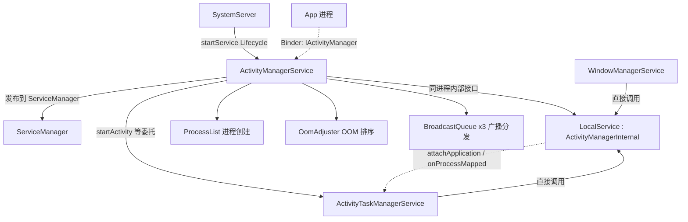

# ActivityManagerService 深度讲解（Android 10）

> 配套索引：[Framework.md → 四大组件](./Framework.md)
> 主源文件：[ActivityManagerService.java](../../frameworks/base/services/core/java/com/android/server/am/ActivityManagerService.java)

---

## 1. 概览

AMS 是 Framework 层的**全局进程与资源调度中心**，而不是 Activity 的直接管理者。Android 10 把 Activity / Task / Stack 的生命周期整体拆到 `ActivityTaskManagerService`（ATMS），因此 **AMS 只管"进程生老病死 + 系统级调度 / 权限 / OOM / ANR / 广播"**，组件细节下沉到：

- `ActiveServices` —— Service
- `ProviderMap` —— ContentProvider
- `BroadcastQueue` ×3 —— 广播
- `ActivityTaskManagerService` —— Activity



一句话：**AMS = 进程维度的大总管；ATMS = Activity 维度的小管家；WMS = 窗口维度的小管家。三者同进程，通过 `LocalService` 直接协作。**

---

## 2. 核心流程

### 2.1 启动链（SystemServer 引导阶段）

```text
SystemServer.startBootstrapServices()
  └─ ActivityManagerService.Lifecycle.startService(...)          // Lifecycle.java:2219
       ├─ new Lifecycle(ctx)  → new ActivityManagerService()      // :2213-2215 构造函数
       └─ onStart()  → mService.start()                           // :2225-2227
  └─ am.setSystemProcess()                                        // :2040 注册进 ServiceManager
  └─ am.systemReady(...)                                          // :9017 系统就绪（桌面可见拐点）
  └─ onBootPhase(PHASE_SYSTEM_SERVICES_READY)                     // :2230 通知各成员 ready
```

关键点（均带真实行号，非凭记忆）：

- `Lifecycle` 是 `SystemService` 子类，`onStart()` 中调用 `mService.start()`（`:2225-2227`）。
- `onBootPhase` 在 `PHASE_SYSTEM_SERVICES_READY` 时联动各子系统（`mBatteryStatsService`、`mServices` 等）的 `systemServicesReady()`（`:2230` 起）。
- `setSystemProcess()`（`:2040`）把 AMS 注册进 `ServiceManager`，并发布 `meminfo` / `procstats` / `permission` 等辅助 Binder 服务。
- `systemReady()`（`:9017`）启动持久进程、拉起 launcher / keyguard，是桌面可见的拐点。

### 2.2 进程启动主干（点击图标 → 应用进程起来）

```text
startProcessLocked(:3102)
  → Zygote fork 出应用进程
  → 应用进程 attachApplication(:5255)
    → attachApplicationLocked(:4842)：bindApplication + mAtmInternal.attachApplication(:5183)
      → ATMS 恢复 Activity / Service / Provider
```

### 2.3 进程死亡对称链

```text
App 进程异常退出
  → AppDeathRecipient.binderDied()
  → handleAppDiedLocked(:3673)：清理进程、回收组件
  → 必要时 restarting 重启
```

---

## 3. 关键代码解析

### 3.1 两个对外接口面（设计核心）

AMS 通过**两套接口**区分"跨进程"与"同进程"调用，避免无谓的 Binder 开销：

- **对外：`IActivityManager`** —— App 侧经 `ActivityManager.getService()` 跨进程调用（如 `startActivity`、`getRunningAppProcesses`）。
- **对内：`ActivityManagerInternal`（`LocalService`，`:17839`）** —— 仅供同进程的 ATMS / WMS 直接调用。典型方法如 `checkContentProviderAccess`（`:17841`）、`attachApplication`、`onProcessMapped`。

```java
// ActivityManagerService.java:17838-17841
@VisibleForTesting
public final class LocalService extends ActivityManagerInternal {
    @Override
    public String checkContentProviderAccess(String authority, int userId) {
        ...
    }
}
```

> 这是理解 AMS 协作边界的钥匙：**ATMS 不直接调 AMS 的方法，而是走 `mAtmInternal`；反过来 AMS 的 `startActivity` 也纯委托给 ATMS。**

### 3.2 AMS → ATMS 的委托边界

```java
// ActivityManagerService.java:3572-3577
@Override
public final int startActivity(IApplicationThread caller, String callingPackage,
        Intent intent, String resolvedType, IBinder resultTo, String resultWho, int requestCode,
        int startFlags, ProfilerInfo profilerInfo, Bundle bOptions) {
    return mActivityTaskManager.startActivity(caller, callingPackage, intent, resolvedType,
            resultTo, resultWho, requestCode, startFlags, profilerInfo, bOptions);
}
```

`startActivity` / `startActivityAsUser` / `startActivityAndWait` / `startActivityFromRecents` 全部一行委托给 `mActivityTaskManager`。AMS 在本仓库中对 `mActivityTaskManager` / `mAtmInternal` 有上百处委托调用，印证 Android 10 的"进程/组件"职责拆分。

### 3.3 核心职责域与关键函数

| 域 | 负责成员 | 关键函数（行号） |
|---|---|---|
| 进程生命周期 | `ProcessList` `mProcessList` | `startProcessLocked`（:3102）→ `attachApplicationLocked`（:4842）→ `handleAppDiedLocked`（:3673） |
| OOM / 内存 | `OomAdjuster` `mOomAdjuster` | `updateOomAdjLocked`（:17027） |
| 广播 | `BroadcastQueue` ×3 | `broadcastIntentLocked`（:14870 重载，:14883 三态分发） |
| 权限 / 用户 | `AppOpsService` 等 | `grantUriPermission`（:6227）、`handleIncomingUser` |
| ANR / 输入超时 | `AppErrors` | `inputDispatchingTimedOut`（:18393）、`appNotResponding` |
| Activity | **委托 ATMS** | `startActivity`（:3572）→ ATMS；`moveTaskToFront`（:6365） |
| Service / CP | `ActiveServices` / `ProviderMap` | `bindServiceLocked`、`removeContentProvider`（:7346） |

---

## 4. 设计意图

1. **进程与组件解耦**：Activity 生命周期交给 ATMS，AMS 只盯"进程这一层"，职责单一，便于多窗口 / 多实例扩展。
2. **跨进程 vs 同进程双接口**：`IActivityManager` 给 App，`ActivityManagerInternal` 给兄弟系统服务，省 Binder 又保持封装边界清晰。
3. **死亡对称**：`AppDeathRecipient` / `handleAppDiedLocked`（:3673）与 `attachApplication`（:5255）成对，保证进程异常退出时组件被干净回收、可重启。
4. **单一可信源**：所有"进程是否存在、是否前台、OOM 权重"的判断都集中在 AMS，其他服务（WMS、ATMS）只读取，不重复记账。

---

## 5. 扩展点（贴合本仓库 cells 多 cell）

### 5.1 多实例隔离（进程视图 / OOM 域）

cells 把系统切成多个虚拟 Phone，每个 cell 需要**独立的进程视图与 OOM 域**。AMS 的 `ProcessList` / `OomAdjuster` 必须按 cell 隔离，否则一个 cell 的 OOM 调整会误杀另一 cell 的进程——这正是 `OomAdjuster`（:17027）与 `ProcessRecord` 需要打 cell 标签的关键位置。

### 5.2 输入坐标联动

AMS 管进程，WMS 管窗口 frame（`getFrameLw()`），SurfaceFlinger 合成缩放后回写 IMS。多 cell 下每个 cell 有独立 `InputFlinger`；AMS 侧通常无需改动，但**进程归属（属于哪个 cell 的 ATMS）必须随窗口一致**，否则输入事件会派发到错误的 cell。

### 5.3 LocalService 上加 cell 感知方法

若需在 ATMS / WMS 与 AMS 之间传递"当前 cell"上下文，最干净的位置是 `LocalService`（:17839）新增 `attachApplicationForCell(...)` 之类方法，而非改动公开 `IActivityManager`（避免破坏 App 侧 Binder 契约）。

---

## 附：快速导航

- 启动入口：`Lifecycle`（:2213）、`onStart`（:2225）
- 注册到 SM：`setSystemProcess`（:2040）
- 系统就绪：`systemReady`（:9017）
- 进程创建：`startProcessLocked`（:3102）
- 应用绑定：`attachApplication`（:5255）/ `attachApplicationLocked`（:4842）
- OOM：`updateOomAdjLocked`（:17027）
- 广播：`broadcastIntentLocked`（:14870）
- 内部接口：`LocalService`（:17839）
