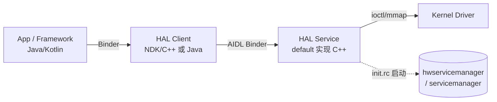

The user is asking about "android 13 hal aidl 实践" which means "Android 13 HAL AIDL practice". This is a general knowledge question about Android HAL (Hardware Abstraction Layer) development using AIDL (Android Interface Definition Language) in Android 13.

This is not really a task-specific coding request for their project - it's a general knowledge question about Android 13 HAL AIDL. Let me think about whether I should look at their project or just answer generally.

Actually, the user is asking about Android 13 HAL AIDL practice. This is a knowledge-based question. I should provide a comprehensive answer about how to implement HAL AIDL in Android 13.

Wait, but this might be related to their project. Let me check if there's any HAL/AIDL related code in their project. The project is an ERP PDA app, which is unlikely to have HAL code. But let me consider.

Actually, this seems like a general learning/practice question. The user wants to know how to practice Android 13 HAL AIDL development.

Let me think about what Android 13 HAL AIDL involves:

1. HAL (Hardware Abstraction Layer) - the layer between Android framework and hardware drivers
2. AIDL (Android Interface Definition Language) - used for IPC, and since Android 10/11, AIDL is used for HAL interfaces (replacing HIDL)
3. Android 13 specific features

Key concepts:
- AIDL for HAL (aidl_interface)
- Building AIDL interfaces with .aidl files
- Stable AIDL
- HAL services implementation
- Client (framework) side
- SELinux policies
- .hal vs .aidl

Let me provide a structured answer with:
1. Overview - why AIDL HAL in Android 13
2. Directory structure
3. Define AIDL interface
4. Build configuration (Android.bp)
5. Implement the HAL service
6. Register/start the service
7. Client usage
8. SELinux
9. Android 13 specific notes

Since this is "ask mode" and the user is asking a general practice question, I should provide educational content. I don't necessarily need to read files, but I could mention that their project is an app project.

Actually, the user query is quite brief and general. Let me give a comprehensive practical guide. Since I'm in ask mode and this is a knowledge question, I should explain the principles and provide a detailed plan/practice.

Let me think about whether to use any tools. The user is asking a general question. I don't think reading their ERP project files would help much since it's an app project, not a HAL/framework project. But I could mention that.

Actually, let me reconsider. The question "android 13 hal aidl 实践" is a request for practical guidance. Let me provide a thorough, well-structured tutorial-style answer covering the key steps. This is appropriate for ask mode - I'm explaining concepts and providing a plan.

Let me write a comprehensive answer in Chinese about Android 13 HAL AIDL practice.

Key points for Android 13 AIDL HAL:

1. **AIDL HAL basics**
   - Since Android 11 (and especially Android 12+), AIDL replaces HIDL for new HALs
   - Stable AIDL (.aidl files with `@aidl` annotations)
   - Interface versioning with `@VintfStability` and version markers

2. **Project structure** (typically in hardware/interfaces or vendor directory)
   ```
   hardware/interfaces/<interface>/aidl/
   ├── Android.bp
   ├── <package>/<Interface>.aidl
   └── default/
       ├── Android.bp
       ├── <Interface>.cpp
       ├── <Interface>.h
       └── service.cpp
   ```

3. **Define AIDL interface**
   ```aidl
   package android.hardware.example@1;
   
   @VintfStability
   interface IExample {
       int doSomething(int param);
       void setCallback(IExampleCallback callback);
   }
   ```

4. **Android.bp for aidl_interface**
   ```bp
   aidl_interface {
       name: "android.hardware.example",
       vendor_available: true,
       stability: "vintf",
       owner: "mycompany",
       srcs: ["android/hardware/example/*.aidl"],
       backend: {
           cpp: { enabled: true },
           java: { enabled: true },
           ndk: { enabled: true },
       },
   }
   ```

5. **Implement the HAL** (C++ default impl)
   ```cpp
   class Example : public BnExample {
   public:
       ndk::ScopedAStatus doSomething(int32_t in_param, int32_t* _aidl_return) override;
   };
   ```

6. **Service registration** in service.cpp, run via init rc file

7. **SELinux**
   - Add to file_contexts
   - Add type for hal service
   - sepolicy for client

8. **Client** (Java NDK or C++)
   ```java
   IExample example = IExample.Stub.asInterface(
       ServiceManager.waitForService("android.hardware.example.IExample/default"));
   ```

9. **Android 13 specifics**
   - More HALs migrated to AIDL
   - `aidl_interface` with stability vintf
   - Compatibility matrix
   - `android.hardware.*` namespaces

Let me write this up well. I should also mention the build system (Soong/Android.bp).

I'll provide a structured practical guide. Since this is ask mode and a knowledge question, I'll explain thoroughly and offer to help implement if they have a specific project.

Let me consider whether I need to look at their project. It's an ERP PDA app - unlikely to need HAL. But maybe they're working on a custom device. Let me just provide the general practice guide since the question is general.

Actually, I should be careful - this is a broad topic. Let me give a focused, practical, step-by-step answer that someone could actually follow to create an AIDL HAL in Android 13.

I won't use tools since this is a general knowledge question and reading their app project won't help. But let me double check - maybe I should quickly verify there's nothing HAL-related. Actually it's an app project under c:/D/android_project/erp-pda, which is a normal app, not AOSP. So HAL work would be in AOSP source. I'll note this.

Let me write the answer.

I think I should provide:
- Context: HAL AIDL replaces HIDL
- A concrete end-to-end example (an "example" HAL)
- Step-by-step with files and code
- Android 13 notes
- How to test

Let me make it comprehensive but organized. I'll use a Mermaid diagram for the architecture, as suggested for plans.

Given this is a "实践" (practice) question, providing a runnable example is best.

Let me write it.
Android 13 上 HAL 已经全面转向 **Stable AIDL**（从 Android 11 起新 HAL 强制使用 AIDL 取代 HIDL，Android 12/13 越来越多系统 HAL 也迁移到了 AIDL）。下面给你一份可以直接落地的实践指南。

先说一个重要前提：HAL 属于 **AOSP / 设备源码** 范畴，普通 App 工程（你这个 `erp-pda` 是应用层工程）是看不到 HAL 的。HAL 代码要放在 AOSP 的 `hardware/interfaces/<xxx>/aidl/` 或厂商 `vendor/<oem>/...` 目录下，随系统一起编译。下面的示例都基于 AOSP 编译环境。

## 一、整体架构



## 二、目录结构

以自定义一个 `example` HAL 为例：

```
hardware/interfaces/example/aidl/
├── Android.bp
├── android/hardware/example/
│   ├── IExample.aidl
│   └── IExampleCallback.aidl
└── default/
    ├── Android.bp
    ├── Example.cpp
    ├── Example.h
    ├── service.cpp
    └── example-default.rc
```

## 三、定义 AIDL 接口

`android/hardware/example/IExample.aidl`：

```aidl
package android.hardware.example;

@VintfStability
interface IExample {
    // 简单方法
    int doSomething(int param);

    // 注册回调（异步通知）
    void setCallback(IExampleCallback callback);

    // 带自定义参数/返回值
    String getVersion();
}
```

`android/hardware/example/IExampleCallback.aidl`：

```aidl
package android.hardware.example;

@VintfStability
interface IExampleCallback {
    void onEvent(int code, String msg);
}
```

要点：
- 包名建议用 `android.hardware.<name>`（系统 HAL）或 `vendor.<oem>.<name>`（厂商 HAL）。
- `@VintfStability` 表示该接口走 **VINTF 稳定性**，会被纳入兼容性矩阵（这是 HAL 与普通 App AIDL 最关键的区别）。
- 数据类型只能用 AIDL 支持的 stable 类型（`int/long/String/List<T>/Parcelable` 等），不能随便用任意 Java 对象。

## 四、构建配置（Soong / Android.bp）

接口定义 `Android.bp`：

```bp
aidl_interface {
    name: "android.hardware.example",
    vendor_available: true,
    stability: "vintf",
    owner: "oem",
    srcs: ["android/hardware/example/*.aidl"],
    backend: {
        cpp: { enabled: true, gen_log: true },
        java: { enabled: true },
        ndk: { enabled: true },
    },
}
```

default 实现 `default/Android.bp`：

```bp
cc_library_shared {
    name: "android.hardware.example-default-impl",
    vendor: true,
    srcs: ["Example.cpp"],
    shared_libs: [
        "libbinder_ndk",
        "android.hardware.example-V1-ndk",
    ],
    export_include_dirs: ["."],
}

cc_binary {
    name: "android.hardware.example-default",
    vendor: true,
    init_rc: ["example-default.rc"],
    srcs: ["service.cpp"],
    shared_libs: [
        "libbinder_ndk",
        "liblog",
        "android.hardware.example-V1-ndk",
        "android.hardware.example-default-impl",
    ],
}
```

注意 `android.hardware.example-V1-ndk` 这个依赖名：`V1` 是接口版本，AIDL HAL 自动带版本号，升级接口时版本会递增。

## 五、实现 HAL 服务（C++）

`Example.h`：

```cpp
#pragma once
#include <android/hardware/example/BnExample.h>
#include <android/binder_ibinder.h>

namespace example {

class Example : public aidl::android::hardware::example::BnExample {
public:
    ndk::ScopedAStatus doSomething(int32_t in_param, int32_t* _aidl_return) override;
    ndk::ScopedAStatus setCallback(const std::shared_ptr<aidl::android::hardware::example::IExampleCallback>& cb) override;
    ndk::ScopedAStatus getVersion(std::string* _aidl_return) override;
private:
    std::shared_ptr<aidl::android::hardware::example::IExampleCallback> mCallback;
};

}  // namespace example
```

`Example.cpp`：

```cpp
#include "Example.h"
#include <android/log.h>

namespace example {

ndk::ScopedAStatus Example::doSomething(int32_t in_param, int32_t* _aidl_return) {
    *_aidl_return = in_param * 2;
    return ndk::ScopedAStatus::ok();
}

ndk::ScopedAStatus Example::setCallback(const std::shared_ptr<aidl::android::hardware::example::IExampleCallback>& cb) {
    mCallback = cb;
    if (mCallback) {
        mCallback->onEvent(0, "callback registered");
    }
    return ndk::ScopedAStatus::ok();
}

ndk::ScopedAStatus Example::getVersion(std::string* _aidl_return) {
    *_aidl_return = "1.0";
    return ndk::ScopedAStatus::ok();
}

}  // namespace example
```

`service.cpp`（把服务注册到 servicemanager，供 client 通过名字获取）：

```cpp
#include "Example.h"
#include <android/binder_process.h>
#include <android/binder_manager.h>

using namespace example;

int main() {
    ABinderProcess_setThreadPoolMaxThreadCount(1);
    std::shared_ptr<Example> hal = ndk::SharedRefBase::make<Example>();
    const std::string instance = std::string() + Example::descriptor + "/default";
    binder_status_t status = AServiceManager_addService(hal->asBinder().get(), instance.c_str());
    if (status != STATUS_OK) return -1;
    ABinderProcess_joinThreadPool();
    return 0;
}
```

`example-default.rc`（由 init 启动）：

```rc
service example-hal /vendor/bin/hw/android.hardware.example-default
    class hal
    user system
    group system
```

## 六、Client 调用（以 NDK/C++ 为例）

```cpp
#include <android/binder_manager.h>
#include <android/hardware/example/IExample.h>

using aidl::android::hardware::example::IExample;

auto svc = IExample::fromBinder(
    ndk::SpAIBinder(AServiceManager_waitForService("android.hardware.example.IExample/default")));
int32_t out = 0;
svc->doSomething(21, &out);  // out == 42
```

Java 侧（Framework/App 层）：

```java
IExample svc = IExample.Stub.asInterface(
    ServiceManager.waitForService("android.hardware.example.IExample/default"));
int r = svc.doSomething(21);
```

## 七、SELinux 与 VINTF

1. **file_contexts**（加在 `vendor/<oem>/sepolicy` 下）：
   ```
   /vendor/bin/hw/android\.hardware\.example-default  u:object_r:hal_example_default_exec:s0
   ```
2. **新增 type**（`hal_example_default.te`）：
   ```
   type hal_example_default, domain;
   type hal_example_default_exec, exec_type, file_type;
   init_daemon_domain(hal_example_default)
   hal_attribute(hal_example)
   ```
3. **兼容性矩阵**（VINTF）：在 `device/<oem>/<device>/manifest.xml` 里声明：
   ```xml
   <hal format="aidl">
       <name>android.hardware.example</name>
       <version>1</version>
       <interface>
           <name>IExample</name>
           <instance>default</instance>
       </interface>
   </hal>
   ```

## 八、编译与验证

```bash
# 单编模块
m android.hardware.example-default
m android.hardware.example

# 刷机/推到设备
adb push out/target/product/xxx/vendor/bin/hw/android.hardware.example-default /vendor/bin/hw/
adb push out/target/product/xxx/vendor/etc/vintf/manifest.xml /vendor/etc/vintf/

# 验证服务已注册
adb shell service list | grep example
# 或
adb shell lshal | grep example
```

## 九、Android 13 相比早期版本的注意点

- **稳定性注解更严格**：`stability: "vintf"` 是 HAL 必备；普通 AIDL（App 间）用 `stability: "local"` 或不写。
- **版本化是强制的**：接口任何变更都要递增版本（`-V1`、`-V2`），client/server 按版本协商，避免破坏已有实现。
- **更多系统 HAL 已是 AIDL**：如 `android.hardware.audio`, `bluetooth`, `graphics` 等，参考它们能少踩坑。
- **`libbinder_ndk` 是 HAL 实现首选**，不要用旧的 `libbinder`（那是 framework 用的）。

---

如果你接下来要**真正动手写**，建议告诉我：
1. 你的 HAL 要提供什么能力（传感器？扫码？打印？还是自定义硬件）？
2. 是系统 HAL（`android.hardware.*`）还是纯厂商 HAL（`vendor.*`）？

我可以据此帮你把上面模板改成贴合你需求的接口定义和实现，或者你也可以把具体的 AOSP 目录结构贴出来。需要的话，请切换到 **Craft 模式** 让我直接帮你产出文件。
