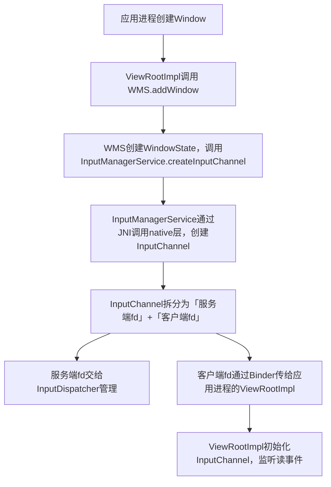

# Android 输入系统核心：InputDispatcher 与 InputChannel 详解（原理+通信流程+源码级）

你问到的 `InputDispatcher` 和 `InputChannel` 是 Android **输入系统（Input System）** 的两大核心组件，前者是「输入事件的分发中枢」，后者是「输入事件跨进程传输的通道」，二者强绑定——所有输入事件（点击、滑动、按键）最终都要通过 `InputChannel` 传输，再由 `InputDispatcher` 分发给目标窗口/应用。

这是 Android 系统层的**核心知识点**，也是面试高频考点（常和 WMS/AMS/InputManagerService 联动考察），下文从「核心定义、底层原理、通信流程、源码实战」四个维度彻底讲透，全是标准答案。

---

## 一、✅ 核心认知：先搞懂「输入系统的整体架构」

在讲 `InputDispatcher` 和 `InputChannel` 之前，必须先明确 Android 输入系统的完整链路，这是理解二者关系的基础：

### 输入系统全流程（从硬件到应用）

```Plain
硬件（触摸屏/按键）→ Linux内核（input子系统）→ InputReader（读取事件）→ InputDispatcher（分发中枢）→ InputChannel（跨进程通道）→ 应用进程（ViewRootImpl）→ View（消费事件）
```

### 核心组件分工（先记结论，面试必答）

|   |   |   |
|---|---|---|
|组件|核心职责|进程归属|
|InputReader|从内核读取原始输入事件（如触摸坐标、按键码），封装为 `InputEvent`|system_server|
|**InputDispatcher**|核心：接收 InputReader 的事件，根据「窗口焦点」「触摸区域」计算目标，分发事件|system_server|
|**InputChannel**|核心：跨进程通信通道，连接 InputDispatcher（system_server）和应用进程，传输 InputEvent|跨进程（内核态+用户态）|
|ViewRootImpl|应用进程的输入事件入口，通过 InputChannel 接收事件，分发到 View 树|应用进程|

---

## 二、✅ InputChannel：输入事件的「跨进程通信管道」（底层核心）

### 1. 本质定义

`InputChannel` 是 Android 基于 **Linux UNIX Domain Socket（本地套接字）** 封装的「双向跨进程通信通道」，专门用于 **InputDispatcher（system_server）→ 应用进程** 的输入事件传输。

补充：UNIX Domain Socket 是比 Binder 更轻量的本地跨进程通信方式，无需经过网络协议栈，性能更高，适合高频、低延迟的输入事件传输（比如每秒几百次的触摸事件）。

### 2. 核心特性（面试必记）

✅ **双向通信**：一个 InputChannel 包含「读端（fd）+ 写端（fd）」，system_server 写事件，应用进程读事件；

✅ **一对一绑定**：每个应用的「窗口（Window）」对应 **唯一的 InputChannel**（由 WMS 创建，InputDispatcher 管理）；

✅ **性能极致**：基于内核态的 Socket 实现，无 Binder 的拷贝开销，输入事件传输延迟<1ms；

✅ **自动清理**：窗口销毁时，WMS 会关闭对应的 InputChannel，避免资源泄漏。

### 3. InputChannel 的创建流程（源码级，核心）

InputChannel 由 **WMS（WindowManagerService）** 创建，绑定到窗口，最终交给 InputDispatcher 管理，完整流程：





#### 关键源码（简化版）

```Java
// WMS 中创建 InputChannel
public class WindowManagerService {
    public int addWindow(...) {
        // 1. 创建WindowState
        WindowState win = new WindowState(...);
        // 2. 创建InputChannel
        InputChannel inputChannel = new InputChannel();
        InputManagerService.getInstance().createInputChannel(inputChannel, win.getWindowId());
        // 3. 将客户端fd传给应用进程
        win.setInputChannel(inputChannel);
        // 4. 将服务端fd注册到InputDispatcher
        InputDispatcher.registerInputChannel(inputChannel.getServerFd(), win);
    }
}

// ViewRootImpl 中接收 InputChannel
public final class ViewRootImpl {
    public void setView(View view, WindowManager.LayoutParams attrs) {
        // 接收WMS传递的InputChannel客户端fd
        InputChannel inputChannel = attrs.inputChannel;
        // 初始化InputChannel，监听读事件（用epoll监听fd）
        mInputEventReceiver = new InputEventReceiver(inputChannel, Looper.myLooper());
    }
}
```

### 4. InputChannel 的底层实现：UNIX Domain Socket 双端

InputChannel 的核心是「一对 UNIX Domain Socket fd」：

- **服务端 fd**：归 InputDispatcher 所有（system_server 进程），InputDispatcher 通过这个 fd 向应用进程**写入**输入事件；
    
- **客户端 fd**：归应用进程的 ViewRootImpl 所有，ViewRootImpl 通过 epoll 监听这个 fd 的「可读事件」，有事件时读取并分发到 View 树。
    

---

## 三、✅ InputDispatcher：输入事件的「智能分发中枢」（核心逻辑）

### 1. 本质定义

`InputDispatcher` 是 `InputManagerService（IMS）` 的核心子模块（运行在 system_server 进程），负责：

① 接收 InputReader 解析后的 `InputEvent`（如 MotionEvent、KeyEvent）；

② 根据「窗口焦点」「触摸坐标」「窗口层级」计算「目标窗口」；

③ 通过目标窗口绑定的 InputChannel，将 InputEvent 跨进程传输给应用进程；

④ 处理事件的优先级、拦截、超时（如 ANR 检测）。

### 2. InputDispatcher 的核心工作流程（面试标准答案）

InputDispatcher 的分发逻辑是 Android 输入系统的**最核心部分**，分 5 步，每一步都是面试考点：

#### 步骤1：接收 InputEvent（从 InputReader）

InputReader 从内核读取原始输入事件（如触摸的 x/y 坐标），封装为 `InputEvent` 后，通过「生产者-消费者队列」传给 InputDispatcher（队列是线程安全的，避免并发问题）。

#### 步骤2：计算目标窗口（核心：命中测试 HitTest）

InputDispatcher 拿到 InputEvent 后，首先执行「命中测试」，确定事件该发给哪个窗口：

- **触摸事件**：根据触摸坐标，遍历 WMS 维护的「窗口列表」，找到坐标所在的最上层窗口；
    
- **按键事件**：根据「焦点窗口」（WMS 记录的当前有焦点的窗口，如输入法窗口、Activity 窗口）；
    
- **特殊事件**：如 HOME 键、BACK 键，优先分发给 SystemUI（状态栏）或 AMS 处理。
    

#### 步骤3：查找目标窗口的 InputChannel

每个窗口（WindowState）在创建时，WMS 都会为其创建对应的 InputChannel，并将「窗口 ID → InputChannel」的映射关系交给 InputDispatcher 管理（存在 `mChannelsByWindowId` 哈希表中）。

InputDispatcher 根据目标窗口 ID，从哈希表中找到对应的 InputChannel。

#### 步骤4：通过 InputChannel 发送事件（跨进程）

InputDispatcher 调用 InputChannel 的 `sendInputEvent()` 方法，将 InputEvent 序列化后，通过 UNIX Domain Socket 的「服务端 fd」写入通道，应用进程的「客户端 fd」会立即感知到可读事件。

#### 步骤5：处理事件确认与超时（ANR 核心）

InputDispatcher 发送事件后，会记录「事件发送时间」，并等待应用进程的「事件消费确认」：

- 应用进程消费完事件后，会通过 InputChannel 回传「确认消息」，InputDispatcher 清理该事件；
    
- 如果应用进程长时间未确认（默认 5s），InputDispatcher 触发 ANR（Application Not Responding），并通知 AMS 弹出 ANR 对话框。
    

### 3. InputDispatcher 的核心数据结构（面试加分）

InputDispatcher 内部通过以下结构管理事件和通道，是源码的核心：

|   |   |
|---|---|
|数据结构|作用|
|`mInboundQueue`|接收 InputReader 事件的队列（待分发）|
|`mOutboundQueue`|已发送但未收到确认的事件队列（用于ANR检测）|
|`mChannelsByWindowId`|窗口ID → InputChannel 的映射表（核心）|
|`mFocusedWindowHandle`|当前焦点窗口的句柄（处理按键事件）|

---

## 四、✅ InputDispatcher + InputChannel 完整通信流程（从触摸到应用）

结合你之前学的 inotify/epoll，这里给出「触摸事件」的完整链路，把 InputDispatcher 和 InputChannel 的联动讲透，**这是面试的终极标准答案**：

暂时无法在豆包文档外展示此内容

### 关键补充：ANR 触发的核心节点

如果步骤 K 超时（>5s），InputDispatcher 会执行：

```Plain
InputDispatcher → 触发 ANR → 通知 AMS → AMS 收集进程信息 → 弹出 ANR 对话框
```

---

## 五、✅ 核心面试考点（必背，无遗漏）

### 考点1：InputChannel 为什么不用 Binder，而用 UNIX Domain Socket？

答：核心原因是**性能**和**特性匹配**：

1. **低延迟**：UNIX Domain Socket 是本地IPC，无需经过网络协议栈，比 Binder 少一层拷贝，适合高频的输入事件（如每秒几百次的触摸）；
    
2. **流式传输**：输入事件是「流式」的，Socket 的「读/写」模型天然适配，而 Binder 是「请求-响应」模型，不适合高频流式传输；
    
3. **双向通信**：Socket 支持双向通信，应用进程可回传事件确认，而 Binder 主要是单向调用。
    

### 考点2：InputDispatcher 如何确定事件的目标窗口？

答：分两种场景：

1. **触摸事件**：通过「命中测试（HitTest）」，根据触摸坐标遍历 WMS 的窗口列表，找到坐标所在的最上层、可接收触摸的窗口；
    
2. **按键事件**：根据 WMS 维护的「焦点窗口」（mFocusedWindowHandle），优先发给焦点窗口；
    
3. 特殊事件（HOME/BACK）：优先分发给 SystemUI 或 AMS 处理。
    

### 考点3：应用进程如何接收 InputDispatcher 发送的事件？

答：核心流程：

1. WMS 为窗口创建 InputChannel，将客户端 fd 传给应用进程的 ViewRootImpl；
    
2. ViewRootImpl 创建 `InputEventReceiver`，用 epoll 监听客户端 fd 的可读事件；
    
3. InputDispatcher 写入事件后，epoll 触发可读事件，InputEventReceiver 读取并解析事件；
    
4. 事件通过 `dispatchInputEvent()` 分发到 View 树，最终由 `onTouchEvent()` 消费。
    

### 考点4：InputDispatcher 如何检测 ANR？

答：核心逻辑：

1. InputDispatcher 发送事件时，记录「发送时间」和「事件ID」，放入 `mOutboundQueue`；
    
2. 应用进程消费事件后，通过 InputChannel 回传「确认消息」，InputDispatcher 移除该事件；
    
3. 若事件在 `mOutboundQueue` 中超过 5s 未被确认，InputDispatcher 判定为 ANR，通知 AMS 处理。
    

### 考点5：InputChannel 的生命周期和窗口的关系？

答：一一对应，生命周期绑定：

1. 窗口创建（WMS.addWindow()）→ 创建 InputChannel，注册到 InputDispatcher；
    
2. 窗口显示/获得焦点 → InputDispatcher 向该 InputChannel 发送事件；
    
3. 窗口隐藏/失去焦点 → InputDispatcher 停止向该 InputChannel 发送事件；
    
4. 窗口销毁（WMS.removeWindow()）→ 关闭 InputChannel，从 InputDispatcher 注销。
    

---

## 六、✅ 总结（核心知识点，开发/面试必记）

1. **InputChannel** 是基于 UNIX Domain Socket 的双向跨进程通道，连接 system_server 和应用进程，负责输入事件的传输，每个窗口对应一个 InputChannel；
    
2. **InputDispatcher** 是 InputManagerService 的核心，负责接收、计算目标、分发输入事件，是输入系统的「中枢大脑」；
    
3. 输入事件的核心链路：硬件→内核→InputReader→InputDispatcher→InputChannel→应用进程→View；
    
4. InputChannel 用 Socket 而非 Binder 的核心原因：低延迟、流式传输适配输入事件的高频特性；
    
5. InputDispatcher 是 ANR 检测的核心节点，通过「事件发送-确认超时」触发 ANR。
    

掌握 `InputDispatcher` 和 `InputChannel` 的关系，是理解 Android 输入系统的关键，也是系统层面试的高频考点，以上内容覆盖了所有核心知识点，可直接作为面试标准答案！💯