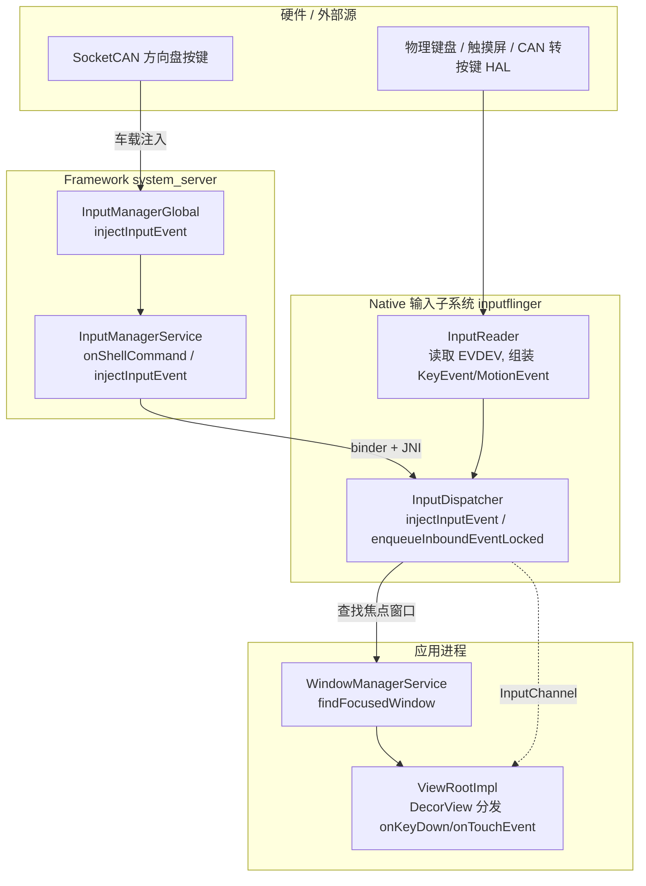
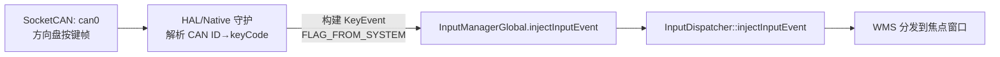

# Android InputEvent 详细代码注解

> 适用范围：AOSP 13 / 14 / 15（Framework + Native 输入子系统）
> 源码基准：`platform/frameworks/base`（master / android-13.0.0_r1）、`platform/frameworks/native`（InputDispatcher）
> 关联仓库：`https://cnb.cool/flybigpig/aosp.git`

---

## 0. 核心结论（先读这段）

1. **`InputEvent` 是一个抽象基类**，只有两个子类：`KeyEvent`（按键）和 `MotionEvent`（指针/轨迹/滚轮等连续输入）。所有"输入事件"在 Framework 层都通过这两个类承载。
2. **`InputEvent` 本身实现 `Parcelable`**，但 `CREATOR` 用 `PARCEL_TOKEN_KEY_EVENT=2` / `PARCEL_TOKEN_MOTION_EVENT=1` 两个 token 在反序列化时区分该 new 出哪个子类——这是跨进程（`InputDispatcher → system_server → App`）传输的基础。
3. **`input`（含 `input motionevent`）在 AOSP 13+ 已不是独立 Java 命令**，而是由 `cmd input` 路由到 `InputManagerService` 的 shell 实现 `com.android.server.input.InputShellCommand`，最终统一走 `InputManagerGlobal.injectInputEvent()`。
4. **注入链路全貌**：`InputShellCommand.injectInputEvent()` → `InputManagerGlobal.injectInputEvent()` → `InputManagerService.injectInputEvent()`（binder）→ JNI `nativeInjectInputEvent()` → `InputDispatcher::injectInputEvent()`（native，inputflinger）→ `enqueueInboundEventLocked()` → 进入和真实硬件事件**完全相同的** dispatch 队列。
5. **注入事件在 native 层被强制打上 `POLICY_FLAG_INJECTED | POLICY_FLAG_TRUSTED`**，deviceId 被改写为 `VIRTUAL_KEYBOARD_ID`（除非经过 `InputFilter`），因此注入事件与硬件事件在权限/去重上有区别。

---

## 1. 总览架构与数据流



> 关键认知：** injected 事件与硬件事件在 `InputDispatcher` 汇合到同一条 inbound 队列**，下游分发逻辑完全一致；区别仅在于 `policyFlags` 上的 `POLICY_FLAG_INJECTED/TRUSTED` 与 `deviceId=VIRTUAL_KEYBOARD_ID`。

---

## 2. Java 层：`InputEvent` 抽象基类注解

文件：`frameworks/base/core/java/android/view/InputEvent.java`

`InputEvent` 是所有输入事件的公共契约，定义了跨进程、跨层传递所需的抽象方法。

```java
public abstract class InputEvent implements Parcelable {
    /** @hide */ protected static final int PARCEL_TOKEN_MOTION_EVENT = 1;
    /** @hide */ protected static final int PARCEL_TOKEN_KEY_EVENT    = 2;

    // 进程内全局自增序列号（用于回收去重、日志追踪，不跨进程保留）
    private static final AtomicInteger mNextSeq = new AtomicInteger();
    /** @hide */ protected int mSeq;

    /** @hide */ protected boolean mRecycled;
    ...
}
```

### 2.1 子类必须实现的抽象方法（契约）

| 方法 | 含义 | KeyEvent 实现要点 | MotionEvent 实现要点 |
|------|------|------------------|---------------------|
| `getDeviceId()` | 来源设备 id，`0` 表示默认 keymap/虚拟设备 | 返回 `mDeviceId` | 返回 `mDeviceId` |
| `getSource()` | 输入源（`InputDevice.SOURCE_*`） | `mSource` | `mSource` |
| `setSource(int)` | 修改来源（@hide） | 写 `mSource` | 写 `mSource` |
| `getDisplayId()` | 事件所属显示器 id（@TestApi） | `mDisplayId` | `mDisplayId` |
| `isTainted()` / `setTainted()` | 事件是否被标记为"与历史序列不一致"（如 key up 但 key 未 down） | 由 `FLAG_TAINTED` 推导 | 由 `FLAG_TAINTED` 推导 |
| `getEventTime()` / `getEventTimeNano()` | 事件发生的 `uptimeMillis` | `mEventTime` | `mEventTime` |
| `copy()` | 深拷贝 | `new KeyEvent(this)` | `obtain(this)` |
| `cancel()` | 标记取消 | `mFlags |= FLAG_CANCELED` | `mFlags |= FLAG_CANCELED` |
| `getId()` | 随机生成的事件 id（用于日志/性能分析，非严格唯一） | `mId` | `mId` |

> **踩坑点**：`KeyEvent` 被 dispatch 到 App 后**不会被回收**（`recycleIfNeededAfterDispatch` 对 KeyEvent 无效），因为应用层假定 KeyEvent 不可变；而 `MotionEvent` 会被回收复用以省 GC。`InputEvent.recycle()` 内部用 `mRecycled` 标志位防止重复回收。

### 2.2 Parcelable 序列化与 `CREATOR`（跨进程关键）

```java
public static final Parcelable.Creator<InputEvent> CREATOR =
        new Parcelable.Creator<InputEvent>() {
    public InputEvent createFromParcel(Parcel in) {
        int token = in.readInt();                       // 先读 1 个 int 作为类型 token
        if (token == PARCEL_TOKEN_KEY_EVENT) {
            return KeyEvent.createFromParcelBody(in);   // token=2 → 重建 KeyEvent
        } else if (token == PARCEL_TOKEN_MOTION_EVENT) {
            return MotionEvent.createFromParcelBody(in);// token=1 → 重建 MotionEvent
        } else {
            throw new IllegalStateException("Unexpected input event type token in parcel.");
        }
    }
    public InputEvent[] newArray(int size) { return new InputEvent[size]; }
};
```

> **修改点位**：如果在 Framework 层新增第三种 `InputEvent` 子类（不推荐，会破坏 Treble 兼容），必须在此处扩展 `PARCEL_TOKEN_*` 并在 `writeToParcel` 首字节写入对应 token，否则跨进程反序列化会 `IllegalStateException`。

---

## 3. `KeyEvent` 详细注解

文件：`frameworks/base/core/java/android/view/KeyEvent.java`

### 3.1 Action 常量（事件动作）

```java
public static final int ACTION_DOWN     = 0;   // 按键按下
public static final int ACTION_UP       = 1;   // 按键抬起
@Deprecated
public static final int ACTION_MULTIPLE = 2;   // 已废弃：连续重复或复杂字符串，现为 string 投递
```

### 3.2 FLAG_* 标志位（驱动/策略层最常用）

来自 master `KeyEvent.java` 实测取值，**车载场景重点关注 `FLAG_FROM_SYSTEM` 与 `FLAG_VIRTUAL_HARD_KEY`**：

| Flag | 值 | 含义 / 车载关联 |
|------|----|----------------|
| `FLAG_FROM_SYSTEM` | `0x8` | **系统注入**（如车载硬按键、电源键）。分发时绕过部分应用拦截逻辑；`InputDispatcher` 对注入事件会据来源决定权限 |
| `FLAG_VIRTUAL_HARD_KEY` | `0x40` | 虚拟硬键（如导航栏/车载面板模拟的 HOME/BACK）。native 侧据此置 `POLICY_FLAG_VIRTUAL` |
| `FLAG_LONG_PRESS` | `0x80` | 系统已识别长按，应用不应再自行计时 |
| `FLAG_CANCELED` | `IInputConstants.INPUT_EVENT_FLAG_CANCELED` | 事件被取消（如在非焦点窗口抬起），`isCanceled()` 据此判断 |
| `FLAG_CANCELED_LONG_PRESS` | `0x100` | 长按被取消 |
| `FLAG_TRACKING` | `0x200` | `startTracking()` 后由系统跟踪到 UP |
| `FLAG_FALLBACK` | `0x400` | 失败回退事件（原事件无人消费时的兜底，如菜单键） |
| `FLAG_IS_ACCESSIBILITY_EVENT` | `INPUT_EVENT_FLAG_IS_ACCESSIBILITY_EVENT` | 无障碍服务注入，App 可据此区分 |
| `FLAG_TAINTED` | `IInputConstants.INPUT_EVENT_FLAG_TAINTED` | 系统检测到事件序列异常（逻辑不一致） |
| `FLAG_START_TRACKING` | `0x40000000` | `startTracking()` 设置，要求框架跟踪 UP |
| `FLAG_PREDISPATCH` | `0x20000000` | 在 dispatch 前由视图处理 |

### 3.3 规范构造函数（canonical constructor）

所有公开构造函数最终都收敛到这个 11 参私有构造——**修改字段初始化只改这一处**：

```java
// frameworks/base/core/java/android/view/KeyEvent.java:2093
private KeyEvent(long downTime, long eventTime, int action, int code, int repeat, int metaState,
        int deviceId, int scancode, int flags, int source, @Nullable String characters) {
    // NOTE: this is the canonical constructor, other constructors that takes KeyEvent
    // attributes should call it
    mId = nativeNextId();                                                  // CSPRNG 生成事件 id
    mDownTime  = TimeUnit.NANOSECONDS.convert(downTime,  TimeUnit.MILLISECONDS); // 转纳秒存储
    mEventTime = TimeUnit.NANOSECONDS.convert(eventTime, TimeUnit.MILLISECONDS);
    mAction      = action;
    mKeyCode     = code;
    mRepeatCount = repeat;        // DOWN 的重复次数：首次 0，系统长按重复 >0
    mMetaState   = metaState;     // Shift/Alt/Ctrl/Meta 组合状态
    mDeviceId    = deviceId;
    mScanCode    = scancode;      // 原始设备扫描码（HAL/EVDEV 层）
    mFlags       = flags;
    mSource      = source;        // SOURCE_KEYBOARD / SOURCE_DPAD ...
    mCharacters  = characters;    // ACTION_MULTIPLE 的字符串载荷
}
```

> **车载注入要点**：从 CAN 总线/HAL 合成按键时，通常调用 `new KeyEvent(downTime, eventTime, action, keyCode, repeat, metaState, deviceId, scancode, flags)`，并置 `flags |= KeyEvent.FLAG_FROM_SYSTEM`，`source = InputDevice.SOURCE_KEYBOARD`。注意 `eventTime` 必须用 `SystemClock.uptimeMillis()` 时间基（native 层会校验）。

### 3.4 关键 getter

```java
public final int getAction()      { return mAction; }       // 3094
public final int getKeyCode()     { return mKeyCode; }      // 3150
public final int getRepeatCount() { return mRepeatCount; }  // 3189
public final int getFlags()       { return mFlags; }        // 2698
public final int getScanCode()    { return mScanCode; }     // 3176
public final int getMetaState()   { return mMetaState; }    // 2659
public final long getDownTime()   { return mDownTime; }     // 3218
public final long getEventTime()  { return mEventTime; }    // 3230
public final boolean isCanceled() { return (mFlags&FLAG_CANCELED) != 0; }
```

---

## 4. `MotionEvent` 详细注解

文件：`frameworks/base/core/java/android/view/MotionEvent.java`

### 4.1 Action 编码（单指针 + 多指针）

`MotionEvent` 的 action 用一个 int 同时编码"基础动作"和"第几个指针"（多指触控）：

```java
public static final int ACTION_MASK           = 0xff;     // 低 8 位：基础动作
public static final int ACTION_DOWN           = 0;
public static final int ACTION_UP             = 1;
public static final int ACTION_MOVE           = 2;
public static final int ACTION_CANCEL         = 3;
public static final int ACTION_OUTSIDE        = 4;
public static final int ACTION_POINTER_DOWN   = 5;        // 非首指按下
public static final int ACTION_POINTER_UP     = 6;        // 非首指抬起

public static final int ACTION_POINTER_INDEX_MASK  = 0xff00; // 高 8 位：指针索引
public static final int ACTION_POINTER_INDEX_SHIFT = 8;
```

```java
// 解析范式（应用层/分发层通用）
int action        = event.getAction();
int maskedAction  = action & MotionEvent.ACTION_MASK;        // 基础动作
int pointerIndex  = (action & ACTION_POINTER_INDEX_MASK)
                    >> ACTION_POINTER_INDEX_SHIFT;            // 多指时的指针下标
```

> **理解要点**：`ACTION_POINTER_DOWN/UP` 的高 8 位记录"是第几根手指"。单指手势只看 `ACTION_DOWN/MOVE/UP`；多指手势必须用 `getActionMasked()` + `getActionIndex()` 拆开处理，否则会漏掉副指事件。

### 4.2 指针属性与坐标（`PointerProperties` / `PointerCoords`）

```java
// 每个指针一份
public static final class PointerProperties implements Parcelable {
    public int id;        // 指针 id（多指去重用，与 DOWN 时一致）
    public int toolType;  // TOOL_TYPE_FINGER=1 / STYLUS=2 / MOUSE=3 / ERASER=4 / UNKNOWN=0
}

public static final class PointerCoords implements Parcelable {
    public float x, y;            // 坐标
    public float pressure;        // 按压力度 0..1
    public float size;            // 接触面积近似
    public float touchMajor, touchMinor;     // 接触椭圆长轴/短轴
    public float toolMajor, toolMinor;
    public float orientation;     // 方向角
    public float vscroll, hscroll;// 滚轮（鼠标/触控板）
    public float z, rX, rY, rZ;   // 3D/旋转轴
    public float hatX, hatY;      // 摇杆帽轴
    // 通过 setAxisValue(axis, value)/getAxisValue(axis) 访问任意 AXIS_*
}
```

工具类型常量：

```java
public static final int TOOL_TYPE_UNKNOWN = 0;
public static final int TOOL_TYPE_FINGER  = 1;
public static final int TOOL_TYPE_STYLUS  = 2;
public static final int TOOL_TYPE_MOUSE   = 3;
public static final int TOOL_TYPE_ERASER  = 4;
```

### 4.3 `MotionEvent.obtain()`（构造/对象池入口）

```java
public static MotionEvent obtain(long downTime, long eventTime, int action,
        int pointerCount, PointerProperties[] pointerProperties,
        PointerCoords[] pointerCoords, int metaState, int buttonState,
        float xPrecision, float yPrecision, int deviceId,
        int edgeFlags, int source, int flags)
```

- `downTime`：首指 `ACTION_DOWN` 的时间（整段手势共享）；`eventTime`：本事件时间。
- `pointerCount`：本次事件携带的指针数（单指=1）。
- `xPrecision/yPrecision`：沿 X/Y 的近似精度（触控屏常为 1.0）。
- **对象池**：`obtain()` 走 `obtain()` 复用池，避免高频触摸事件 GC 抖动；普通业务**不要**自行 `new MotionEvent()`。

### 4.4 FLAG 标志

```java
public static final int FLAG_WINDOW_IS_OBSCURED = MotionEventFlag.WINDOW_IS_OBSCURED;
public static final int FLAG_TAINTED            = MotionEventFlag.TAINTED;
```

---

## 5. `input` / `input motionevent` 命令源码注解

**文件**：`frameworks/base/services/core/java/com/android/server/input/InputShellCommand.java`
**入口**：`adb shell input ...` 实际执行 `input.sh` → `cmd input "$@"` → `InputManagerService.onShellCommand()` → `InputShellCommand`。

> AOSP 13 起 `frameworks/base/cmds/input/` 只剩 `input.sh`（`#!/system/bin/sh\ncmd input "$@"`），真正的逻辑已迁移到 `InputShellCommand`（受 Treble/模块化影响）。

### 5.1 命令分发（`onCommand`）

```java
// InputShellCommand.java:305 片段
} else if ("keyevent".equals(arg)) {
    runKeyEvent(inputSource, displayId);
} else if ("tap".equals(arg)) {
    runTap(inputSource, displayId);
} else if ("swipe".equals(arg)) {
    runSwipe(inputSource, displayId);
} else if ("press".equals(arg)) {
    runPress(inputSource, displayId);
} else if ("roll".equals(arg)) {
    runRoll(inputSource, displayId);
} else if ("scroll".equals(arg)) {
    runScroll(inputSource, displayId);
} else if ("motionevent".equals(arg)) {      // ← 本文主角
    runMotionEvent(inputSource, displayId);
} else if ("keycombination".equals(arg)) {
    runKeyCombination(inputSource, displayId);
}
```

帮助文本明确 `motionevent` 语法：

```text
motionevent <DOWN|UP|MOVE|CANCEL> <x> <y>   (Default: touchscreen)
```

> 另有 `scroll`（`--axis SCROLL,-2`）、`draganddrop`、`keycombination` 等子命令，底层均复用 `injectMotionEvent` / `injectKeyEvent`。

### 5.2 统一注入入口

```java
// InputShellCommand.java:140
private static void injectInputEvent(InputEvent event, Integer injectMode) {
    InputManagerGlobal.getInstance().injectInputEvent(event, injectMode);  // → 见第 6 节
}

// 按键注入（同步/异步两种模式）
private void injectKeyEvent(KeyEvent event, boolean async) {
    int injectMode = async
            ? InputManager.INJECT_INPUT_EVENT_MODE_ASYNC            // 不等分发完成
            : InputManager.INJECT_INPUT_EVENT_MODE_WAIT_FOR_FINISH; // 阻塞到分发完成
    mInputEventInjector.accept(event, injectMode);
}
```

### 5.3 `MotionEvent` 构建与注入（核心）

```java
// InputShellCommand.java:214 —— 把 axis 映射组装成 MotionEvent
private void injectMotionEvent(int inputSource, int action, long downTime, long when,
        Map<Integer, Float> axisValues, int displayId) {
    final int pointerCount = 1;
    MotionEvent.PointerProperties[] pointerProperties = new MotionEvent.PointerProperties[pointerCount];
    for (int i = 0; i < pointerCount; i++) {
        pointerProperties[i] = new MotionEvent.PointerProperties();
        pointerProperties[i].id = i;
        pointerProperties[i].toolType = getToolType(inputSource);   // 由 source 推导 FINGER/MOUSE...
    }
    MotionEvent.PointerCoords[] pointerCoords = new MotionEvent.PointerCoords[pointerCount];
    for (int i = 0; i < pointerCount; i++) {
        pointerCoords[i] = new MotionEvent.PointerCoords();
        pointerCoords[i].size = DEFAULT_SIZE;                       // 1.0f
        for (var entry : axisValues.entrySet()) {
            pointerCoords[i].setAxisValue(entry.getKey(), entry.getValue()); // 写入 X/Y/PRESSURE 等轴
        }
    }
    if (displayId == INVALID_DISPLAY
            && (inputSource & InputDevice.SOURCE_CLASS_POINTER) != 0) {
        displayId = DEFAULT_DISPLAY;                                // 指针事件无 display 则落到默认屏
    }
    MotionEvent event = MotionEvent.obtain(downTime, when, action, pointerCount,
            pointerProperties, pointerCoords, DEFAULT_META_STATE, DEFAULT_BUTTON_STATE,
            DEFAULT_PRECISION_X, DEFAULT_PRECISION_Y, getInputDeviceId(inputSource),
            DEFAULT_EDGE_FLAGS, inputSource, displayId, DEFAULT_FLAGS);
    mInputEventInjector.accept(event,
            InputManager.INJECT_INPUT_EVENT_MODE_WAIT_FOR_FINISH);  // motion 默认同步等待
}
```

### 5.4 `tap` / `swipe` 是怎么用 `injectMotionEvent` 拼出来的

```java
// InputShellCommand.java:488 —— tap = DOWN + UP
private void sendTap(int inputSource, float x, float y, int displayId) {
    final long now = SystemClock.uptimeMillis();
    injectMotionEvent(inputSource, MotionEvent.ACTION_DOWN, now, now, x, y, 1.0f, displayId);
    injectMotionEvent(inputSource, MotionEvent.ACTION_UP,   now, now, x, y, 0.0f, displayId);
}

// InputShellCommand.java:505 —— swipe = DOWN + 多次 MOVE(按 SWIPE_EVENT_HZ 限频) + UP
private void sendSwipe(int inputSource, int displayId, boolean isDragDrop) {
    final float x1 = Float.parseFloat(getNextArgRequired());
    ...
    final long down = SystemClock.uptimeMillis();
    injectMotionEvent(inputSource, MotionEvent.ACTION_DOWN, down, down, x1, y1, 1.0f, displayId);
    ...
    while (now < endTime) {
        ...
        injectMotionEvent(inputSource, MotionEvent.ACTION_MOVE, down, now,
                lerp(x1, x2, alpha), lerp(y1, y2, alpha), 1.0f, displayId);  // 线性插值坐标
    }
    injectMotionEvent(inputSource, MotionEvent.ACTION_UP, down, now, x2, y2, 0.0f, displayId);
}
```

> **性能约束**：`sendSwipe` 用 `SWIPE_EVENT_HZ_DEFAULT` 对 `ACTION_MOVE` 限频，避免一帧内狂灌 MOVE 事件（与车载大屏长滑动同理——高频 MOVE 会放大 binder/分发开销）。

### 5.5 `input motionevent` 的参数解析

```java
// InputShellCommand.java:636
private int getAction() {
    String actionString = getNextArgRequired();
    switch (actionString.toUpperCase()) {
        case "DOWN":   return MotionEvent.ACTION_DOWN;
        case "UP":     return MotionEvent.ACTION_UP;
        case "MOVE":   return MotionEvent.ACTION_MOVE;
        case "CANCEL": return MotionEvent.ACTION_CANCEL;
        default: throw new IllegalArgumentException("Unknown action: " + actionString);
    }
}

// InputShellCommand.java:652
private void runMotionEvent(int inputSource, int displayId) {
    inputSource = getSource(inputSource, InputDevice.SOURCE_TOUCHSCREEN);
    int action = getAction();
    float x = 0, y = 0;
    if (action == MotionEvent.ACTION_DOWN || action == MotionEvent.ACTION_MOVE
            || action == MotionEvent.ACTION_UP) {
        x = Float.parseFloat(getNextArgRequired());   // DOWN/MOVE/UP 必须带坐标
        y = Float.parseFloat(getNextArgRequired());
    } else {
        // ACTION_CANCEL 坐标为可选
        String xString = getNextArg(); String yString = getNextArg();
        if (xString != null && yString != null) { x = Float.parseFloat(xString); y = Float.parseFloat(yString); }
    }
    sendMotionEvent(inputSource, action, x, y, displayId);
}

// InputShellCommand.java:674
private void sendMotionEvent(int inputSource, int action, float x, float y, int displayId) {
    float pressure = NO_PRESSURE;                                  // 0.0f
    if (action == MotionEvent.ACTION_DOWN || action == MotionEvent.ACTION_MOVE) {
        pressure = DEFAULT_PRESSURE;                               // 1.0f（按下/移动视为有压力）
    }
    final long now = SystemClock.uptimeMillis();
    injectMotionEvent(inputSource, action, now, now, x, y, pressure, displayId);
}
```

> **注意**：`input motionevent` 一次只注入**单个 action 的单点事件**（`pointerCount=1`）。要模拟完整手势必须自行按 `DOWN → MOVE* → UP` 顺序连续调用，并保证 `downTime` 一致（`sendMotionEvent` 直接用 `now` 作 downTime，因此同一手势的多次调用需由调用方维护同一 downTime，否则会被 `InputDispatcher` 当作新手势）。

---

## 6. 注入链路：从 `InputManagerGlobal` 到 Native `InputDispatcher`

### 6.1 Framework 侧（binder + JNI）

```text
InputShellCommand.injectInputEvent()
  → InputManagerGlobal.getInstance().injectInputEvent(event, mode)   // frameworks/base/core
    → InputManager.injectInputEvent()                                 // 跨进程到 system_server
      → InputManagerService.injectInputEvent()                        // @SystemApi，校验调用者
        → nativeInjectInputEvent()  (JNI)
          → android::InputDispatcher::injectInputEvent()              // native inputflinger
```

- `INJECT_INPUT_EVENT_MODE_ASYNC`：仅把事件入队后立即返回（命令用 `INJECT_ASYNC` 注入 key 时用此模式）。
- `INJECT_INPUT_EVENT_MODE_WAIT_FOR_FINISH`：阻塞到该事件被目标窗口消费完毕（motion 默认用此，保证时序）。
- **权限校验**：`InputManagerService` 在 binder 侧检查 `android.permission.INJECT_EVENTS`（或调用方为系统/无障碍/拥有该 display 的输入法），否则抛出 `SecurityException`。这是 `input` 命令只能以 `shell`/`system` 身份运行的原因。

### 6.2 Native 侧：`InputDispatcher::injectInputEvent()` 逐段注解

文件：`frameworks/native/services/inputflinger/dispatcher/InputDispatcher.cpp:4826`

```cpp
InputEventInjectionResult InputDispatcher::injectInputEvent(const InputEvent* event,
        std::optional<gui::Uid> targetUid, InputEventInjectionSync syncMode,
        std::chrono::milliseconds timeout, uint32_t policyFlags) {
    // ① 事件合法性校验（类型/字段范围），非法直接 FAILED
    Result<void> eventValidation = validateInputEvent(*event);
    if (!eventValidation.ok()) {
        LOG(INFO) << "Injection failed: invalid event: " << eventValidation.error();
        return InputEventInjectionResult::FAILED;
    }
    ...
    nsecs_t endTime = now() + /* timeout 转为 ns */;

    // ② 强制打标：注入事件 = INJECTED + TRUSTED
    policyFlags |= POLICY_FLAG_INJECTED | POLICY_FLAG_TRUSTED;

    // ③ 注入事件 deviceId 改写为 VIRTUAL_KEYBOARD_ID（除非经过 InputFilter 才保留原 deviceId）
    DeviceId resolvedDeviceId = VIRTUAL_KEYBOARD_ID;
    if (policyFlags & POLICY_FLAG_FILTERED) {
        resolvedDeviceId = event->getDeviceId();
    }

    const bool isAsync = syncMode == InputEventInjectionSync::NONE;
    auto injectionState = std::make_shared<InjectionState>(targetUid, isAsync);

    std::queue<std::unique_ptr<EventEntry>> injectedEntries;
    switch (event->getType()) {
        case InputEventType::KEY: {
            const KeyEvent& incomingKey = static_cast<const KeyEvent&>(*event);
            int32_t action = incomingKey.getAction();
            int32_t flags  = incomingKey.getFlags();
            if (policyFlags & POLICY_FLAG_INJECTED_FROM_ACCESSIBILITY)
                flags |= AKEY_EVENT_FLAG_IS_ACCESSIBILITY_EVENT;

            // ④ 调用 PhoneWindowManager.interceptKeyBeforeQueueing（系统策略拦截，如 HOME/电源）
            if (!(policyFlags & POLICY_FLAG_FILTERED)) {
                mPolicy.interceptKeyBeforeQueueing(keyEvent, /*byref*/ policyFlags);
            }
            mLock.lock();
            // ⑤ 包装成 KeyEntry（native 事件队列节点）
            std::unique_ptr<KeyEntry> injectedEntry =
                std::make_unique<KeyEntry>(incomingKey.getId(), injectionState,
                    incomingKey.getEventTime(), resolvedDeviceId, incomingKey.getSource(),
                    incomingKey.getDisplayId(), policyFlags, action, flags, keyCode,
                    incomingKey.getScanCode(), metaState, incomingKey.getRepeatCount(),
                    incomingKey.getDownTime());
            injectedEntries.push(std::move(injectedEntry));
            break;
        }
        case InputEventType::MOTION: {
            const MotionEvent& motionEvent = static_cast<const MotionEvent&>(*event);
            // ⑥ 指针事件无 displayId → 默认显示器
            const ui::LogicalDisplayId displayId = isPointerEvent && (event->getDisplayId()==INVALID)
                    ? ui::LogicalDisplayId::DEFAULT : event->getDisplayId();

            if (!(policyFlags & POLICY_FLAG_FILTERED)) {
                mPolicy.interceptMotionBeforeQueueing(displayId, source, action, eventTime, policyFlags);
            }
            // ⑦ 拒绝规则：shouldRejectInjectedMotionLocked（权限/display/uid 不匹配则 FAILED）
            if (shouldRejectInjectedMotionLocked(motionEvent, resolvedDeviceId, displayId,
                                                 targetUid, flags)) {
                mLock.unlock();
                return InputEventInjectionResult::FAILED;
            }
            // ⑧ 构造 MotionEntry，并将历史批次(history)拆成多个 MotionEntry 依次入队
            std::unique_ptr<MotionEntry> injectedEntry =
                std::make_unique<MotionEntry>(motionEvent.getId(), injectionState,
                    *sampleEventTimes, resolvedDeviceId, motionEvent.getSource(), displayId,
                    policyFlags, motionEvent.getAction(), motionEvent.getActionButton(), flags,
                    motionEvent.getMetaState(), motionEvent.getButtonState(),
                    motionEvent.getClassification(), motionEvent.getEdgeFlags(),
                    motionEvent.getXPrecision(), motionEvent.getYPrecision(),
                    motionEvent.getRawXCursorPosition(), motionEvent.getRawYCursorPosition(),
                    motionEvent.getDownTime(), pointerProperties,
                    std::vector<PointerCoords>(samplePointerCoords, samplePointerCoords + pointerCount));
            transformMotionEntryForInjectionLocked(*injectedEntry, motionEvent.getTransform());
            injectedEntries.push(std::move(injectedEntry));
            // 历史样本（MotionEvent 的 coalesced/history）逐条展开
            for (size_t i = motionEvent.getHistorySize(); i > 0; i--) { ... injectedEntries.push(...); }
            break;
        }
        default:
            return InputEventInjectionResult::FAILED;
    }

    // ⑨ 统一入队：与硬件事件走同一通道 enqueueInboundEventLocked
    bool needWake = false;
    while (!injectedEntries.empty()) {
        needWake |= enqueueInboundEventLocked(std::move(injectedEntries.front()));
        injectedEntries.pop();
    }
    mLock.unlock();
    if (needWake) mLooper->wake();   // 唤醒 dispatch 循环

    // ⑩ 同步模式：等待 injectionResult 变为 SUCCEEDED / 超时 TIMED_OUT
    InputEventInjectionResult injectionResult;
    {
        std::unique_lock _l(mLock);
        if (syncMode == InputEventInjectionSync::NONE) {
            injectionResult = InputEventInjectionResult::SUCCEEDED;
        } else {
            for (;;) {
                injectionResult = injectionState->injectionResult;
                if (injectionResult != InputEventInjectionResult::PENDING) break;
                nsecs_t remainingTimeout = endTime - now();
                if (remainingTimeout <= 0) { injectionResult = InputEventInjectionResult::TIMED_OUT; break; }
                mInjectionResultAvailable.wait_for(_l, std::chrono::nanoseconds(remainingTimeout));
            }
            // WAIT_FOR_FINISHED：还要等前台分发完成
            if (injectionResult == SUCCEEDED && syncMode == WAIT_FOR_FINISHED) {
                while (injectionState->pendingForegroundDispatches != 0) { ... wait ... }
            }
        }
    }
    return injectionResult;
}
```

### 6.3 Native 数据模型

| 结构 | 角色 | 关键字段 |
|------|------|---------|
| `KeyEntry` | native 键盘事件节点 | `action, flags, keyCode, scanCode, metaState, repeatCount, downTime, deviceId` |
| `MotionEntry` | native 指针事件节点 | `action, pointerProperties[], pointerCoords[], xPrecision, yPrecision, downTime, displayId` |
| `InjectionState` | 注入上下文（共享指针） | `targetUid, isAsync, injectionResult, pendingForegroundDispatches` |
| `EventEntry` | `KeyEntry`/`MotionEntry` 的基类 | `type, eventTime, policyFlags, injectionState` |

> **结论**：native 侧 `injectInputEvent` 本质是把 Java `InputEvent` 转成 `KeyEntry`/`MotionEntry`，打标后 `enqueueInboundEventLocked` 入队。此后 `InputDispatcher` 的 `dispatchOnceInnerLocked` → `dispatchKeyLocked` / `dispatchMotionLocked` → `findTouchedWindowTargetsLocked` 完全不区分来源。

---

## 7. 关键类 / 函数速查表

| 层级 | 类 / 函数 | 文件 | 作用 |
|------|-----------|------|------|
| Java | `InputEvent`（抽象） | `core/java/android/view/InputEvent.java` | 输入事件基类 + Parcelable |
| Java | `KeyEvent` | `core/java/android/view/KeyEvent.java` | 按键事件，含 FLAG_*/构造函数 |
| Java | `MotionEvent` | `core/java/android/view/MotionEvent.java` | 指针事件，含 action 编码/PointerCoords |
| Java | `InputManagerGlobal.injectInputEvent()` | `core/java/android/hardware/input/InputManagerGlobal.java` | 注入入口（应用/系统侧） |
| FW | `InputManagerService.injectInputEvent()` | `services/core/java/com/android/server/input/InputManagerService.java` | binder 服务侧，权限校验 |
| CMD | `InputShellCommand` | `services/core/java/com/android/server/input/InputShellCommand.java` | `cmd input` 实现（`input motionevent` 等） |
| Native | `InputDispatcher::injectInputEvent()` | `services/inputflinger/dispatcher/InputDispatcher.cpp:4826` | native 注入核心 |
| Native | `enqueueInboundEventLocked()` | 同上 | 事件入 inbound 队列 |
| Native | `shouldRejectInjectedMotionLocked()` | 同上 | 注入拒绝规则 |
| NDK | `AInputEvent` / `AINPUT_EVENT_TYPE_*` | `frameworks/native/libs/input/include/android/input.h` | Native 层输入事件 C API |

---

## 8. 调试与验证

```bash
# 1) 查看原始内核事件（确认驱动/EVDEV 层已出事件）
adb shell getevent -l          # -l 显示符号名；可加 -t 显示时间戳

# 2) 命令行注入（AOSP 13+ 走 cmd input）
adb shell input keyevent KEYCODE_HOME
adb shell input tap 500 800
adb shell input swipe 200 1000 800 1000 300     # 300ms 滑动
adb shell input motionevent DOWN 400 400
adb shell input motionevent MOVE 450 450
adb shell input motionevent UP   450 450
adb shell input -d 1 tap 300 300                # 指定 displayId=1（多屏/车载副屏）

# 3) 系统输入服务状态
adb shell dumpsys input            # 设备/输入源/InputDispatcher 队列/连接窗口
adb shell cmd input help           # 查看当前版本支持的子命令

# 4) 验证注入是否被消费（同步模式 WAIT_FOR_FINISH 返回 SUCCEEDED 才代表送达）
#    在 InputDispatcher 打开调试：
adb shell setprop debug.input.dispatcher 1      # 部分版本支持，输出 injection 细节
```

> **车载多显示器**：副屏（如仪表/中控副屏）注入必须带 `-d <displayId>`，否则 `InputDispatcher` 对 pointer 事件回退到 `DEFAULT_DISPLAY`，事件会发到主屏窗口，导致"点了没反应"。

---

## 9. 踩坑清单（高频）

1. **权限拒绝 `SecurityException: Injecting to another application requires INJECT_EVENTS`**
   → `input` 命令以 `shell` 身份运行具备该权限；**普通 App 几乎拿不到 `INJECT_EVENTS`**（仅系统/拥有该 display 的输入法/无障碍服务可注入）。车载自定义注入（如 CAN→按键）应放在 **system 进程**或具备该权限的 HAL 代理中。

2. **`motionevent` 整段手势不连贯（被当成多次点击）**
   → `InputShellCommand.sendMotionEvent` 每次都用 `now` 当 `downTime`。跨次调用构造完整手势时，**必须保证同一手势的 DOWN/MOVE/UP 使用同一个 `downTime`**，否则 `InputDispatcher` 认为每个事件是独立手势。建议业务侧自行 `obtain(downTime, ...)` 并缓存 `downTime`。

3. **注入到错误显示器**
   → 指针事件（`SOURCE_CLASS_POINTER`）若 `displayId=INVALID` 会被强制改到 `DEFAULT_DISPLAY`。多屏车载务必显式传 `displayId`。

4. **注入事件被 `POLICY_FLAG_INJECTED` 影响策略**
   → WMS/PhoneWindowManager 对注入事件与硬件事件的处理可能不同（如某些策略只信任 `FLAG_FROM_SYSTEM` 的硬件源）。车载硬键注入建议 `flags |= KeyEvent.FLAG_FROM_SYSTEM` 以贴近硬件语义。

5. **native 校验 `validateInputEvent` 失败 → FAILED**
   → 最常见原因是 `eventTime`/`downTime` 时间基不对（必须用 `SystemClock.uptimeMillis()`）或 `action`/`source` 非法。注入前务必用 `SystemClock.uptimeMillis()`。

6. **`tainted` 被置位导致事件被丢弃**
   → 若系统检测到事件序列不一致（如 UP 但无对应 DOWN、MOVE 但指针未按下），`setTainted(true)` 后分发可能被跳过。务必保证 DOWN/MOVE/UP 配对完整。

7. **SELinux（vendor/系统分区修改时）**
   → 在 vendor 分区新增 HAL 向 system 注入事件，需确认 `system_app`/`hal_*` 域对 `input_device`/`uhid` 的权限及 `service_manager` 中 `input` 服务的可访问性；改动遵循 **Treble 厂商分区隔离**，HAL 改动放 vendor，Framework 改动区分 system/service。

---

## 10. 车载扩展建议（CAN → InputEvent）

结合本项目"Linux SocketCAN → 安卓按键"场景，推荐链路：



- HAL/守护进程以 **system 身份**运行，规避 `INJECT_EVENTS` 权限问题；
- 按键合成使用 `new KeyEvent(downTime, eventTime, action, keyCode, 0, metaState, devId, scancode, KeyEvent.FLAG_FROM_SYSTEM)`；
- **资源控制**：CAN 帧中断频率高时，在守护进程侧做**去抖 + 限频**（如长按重复不超过系统 `KeyRepeatDelay`），避免短时间狂灌 `ACTION_DOWN`；
- 多屏车型按 `displayId` 路由，方向盘媒体键投到中控 `displayId`，仪表相关键投到仪表 `displayId`。
