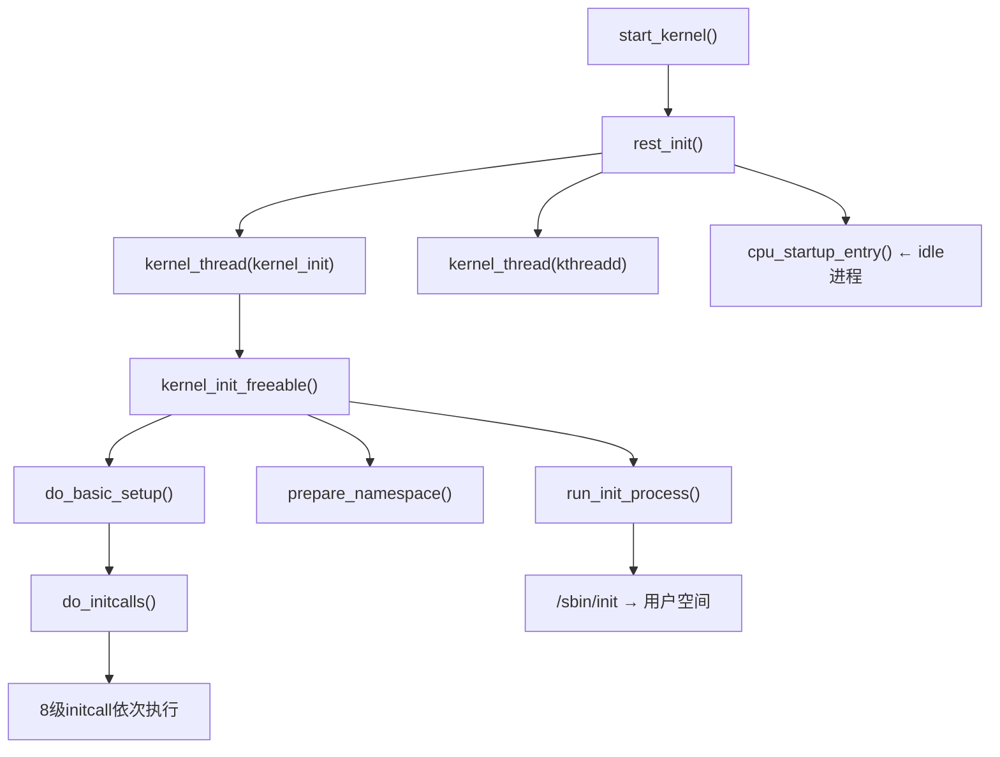

The user wants me to analyze and explain the Linux kernel's `init/main.c` file, which is the entry point of the Linux kernel. This is a classic and important file in the kernel. Let me read through the entire file (which is already provided) and provide a comprehensive analysis.

The file covers:
1. `start_kernel()` - The main kernel initialization function
2. `rest_init()` - Creates kernel threads (init, kthreadd)
3. `kernel_init()` - The init kernel thread that eventually launches userspace init
4. `kernel_init_freeable()` - The bulk of kernel_init work
5. Various helper functions for command line parsing, initcall handling, etc.

Let me provide a thorough analysis.
# Linux 内核 `init/main.c` 深度解读

`init/main.c` 是 Linux 内核的**核心启动文件**，包含了内核从启动到进入用户空间的全部流程。下面逐部分解读。

---

## 一、全局概览：启动流程总链



---

## 二、start_kernel() — 内核主入口

```482:674:d:\frameworks\cells-android10\kernel\init\main.c
asmlinkage __visible void __init start_kernel(void)
{
	char *command_line;
	char *after_dashes;

	set_task_stack_end_magic(&init_task);
	scs_set_init_magic(&init_task);

	smp_setup_processor_id();
	debug_objects_early_init();

	cgroup_init_early();

	local_irq_disable();
	early_boot_irqs_disabled = true;

	boot_cpu_init();
	page_address_init();
	pr_notice("%s", linux_banner);
	setup_arch(&command_line);
	boot_init_stack_canary();
	mm_init_cpumask(&init_mm);
	setup_command_line(command_line);
	setup_nr_cpu_ids();
	setup_per_cpu_areas();
	smp_prepare_boot_cpu();
	boot_cpu_hotplug_init();

	build_all_zonelists(NULL, NULL);
	page_alloc_init();

	pr_notice("Kernel command line: %s\n", boot_command_line);
	jump_label_init();
	parse_early_param();
	after_dashes = parse_args("Booting kernel",
				  static_command_line, __start___param,
				  __stop___param - __start___param,
				  -1, -1, NULL, &unknown_bootoption);
	if (!IS_ERR_OR_NULL(after_dashes))
		parse_args("Setting init args", after_dashes, NULL, 0, -1, -1,
			   NULL, set_init_arg);

	setup_log_buf(0);
	pidhash_init();
	vfs_caches_init_early();
	sort_main_extable();
	trap_init();
	mm_init();

	sched_init();
	preempt_disable();
	// ...
	workqueue_init_early();
	rcu_init();
	trace_init();
	// ... 中断、定时器初始化 ...
	local_irq_enable();

	// ... 后续初始化 ...

	rest_init();
}
```

`start_kernel()` 是内核的 C 语言入口（在此之前是体系结构相关的汇编代码），按顺序完成以下关键初始化：

| 阶段           | 关键调用                                                     | 作用                                   |
| -------------- | ------------------------------------------------------------ | -------------------------------------- |
| **体系结构**   | `setup_arch()`                                               | 架构相关初始化（内存布局、设备树等）   |
| **内存管理**   | `mm_init()` → `mem_init()` / `kmem_cache_init()` / `vmalloc_init()` | 物理内存分配器、slab 分配器、vmalloc   |
| **调度器**     | `sched_init()`                                               | 初始化进程调度器                       |
| **RCU**        | `rcu_init()`                                                 | Read-Copy-Update 机制                  |
| **中断与时钟** | `init_IRQ()` / `tick_init()` / `hrtimers_init()` / `time_init()` | 硬件中断、tick、高精度定时器、系统时间 |
| **内核锁**     | `lockdep_info()` / `locking_selftest()`                      | 锁依赖检测与自测                       |
| **VFS**        | `vfs_caches_init()`                                          | 虚拟文件系统                           |
| **安全**       | `security_init()`                                            | LSM 安全模块                           |
| **cgroup**     | `cgroup_init()`                                              | 控制组                                 |
| **ftrace**     | `ftrace_init()`                                              | 函数跟踪                               |

**关键细节**：

1. **中断使能时机**：`start_kernel()` 开头 `local_irq_disable()`，在初始化完中断控制器后 `local_irq_enable()`（第590行），这是一个重要的分界点。

2. **命令行解析**分两次：
   - `parse_early_param()`：解析 early 参数（如 `console`、`loglevel`）
   - `parse_args("Booting kernel", ...)`：解析普通内核参数

3. **`smp_prepare_boot_cpu()`** 之后，引导 CPU 完成自举；`smp_init()` 在 `kernel_init_freeable()` 中才启动其他 CPU。

---

## 三、rest_init() — 创建 init 和 kthreadd 内核线程

```385:411:d:\frameworks\cells-android10\kernel\init\main.c
static noinline void __ref rest_init(void)
{
	int pid;

	rcu_scheduler_starting();
	/*
	 * We need to spawn init first so that it obtains pid 1, however
	 * the init task will end up wanting to create kthreads, which, if
	 * we schedule it before we create kthreadd, will OOPS.
	 */
	kernel_thread(kernel_init, NULL, CLONE_FS);
	numa_default_policy();
	pid = kernel_thread(kthreadd, NULL, CLONE_FS | CLONE_FILES);
	rcu_read_lock();
	kthreadd_task = find_task_by_pid_ns(pid, &init_pid_ns);
	rcu_read_unlock();
	complete(&kthreadd_done);

	init_idle_bootup_task(current);
	schedule_preempt_disabled();
	cpu_startup_entry(CPUHP_ONLINE);
}
```

这里创建了两个至关重要的内核线程：

| 线程          | PID          | 作用                              |
| ------------- | ------------ | --------------------------------- |
| `kernel_init` | **1** (init) | 最终 exec 到用户空间 `/sbin/init` |
| `kthreadd`    | **2**        | 所有后续内核线程的父进程          |

**创建顺序很重要**：先创建 `kernel_init` 使其获得 PID 1，但必须先创建 `kthreadd` 并 `complete(&kthreadd_done)` 通知 init 线程，否则 init 试图创建内核线程时会 OOPS。

`rest_init()` 本身所在的任务最终变成 **idle 进程 (PID 0)**，调用 `cpu_startup_entry()` 进入无限循环，在没有其他任务可运行时被调度。

---

## 四、kernel_init() — 从内核空间到用户空间的桥梁

```954:997:d:\frameworks\cells-android10\kernel\init\main.c
static int __ref kernel_init(void *unused)
{
	int ret;

	kernel_init_freeable();
	async_synchronize_full();
	free_initmem();
	mark_readonly();
	system_state = SYSTEM_RUNNING;
	numa_default_policy();

	rcu_end_inkernel_boot();

	if (ramdisk_execute_command) {
		ret = run_init_process(ramdisk_execute_command);
		if (!ret)
			return 0;
		pr_err("Failed to execute %s (error %d)\n",
		       ramdisk_execute_command, ret);
	}

	if (execute_command) {
		ret = run_init_process(execute_command);
		if (!ret)
			return 0;
		panic("Requested init %s failed (error %d).",
		      execute_command, ret);
	}
	if (!try_to_run_init_process("/sbin/init") ||
	    !try_to_run_init_process("/etc/init") ||
	    !try_to_run_init_process("/bin/init") ||
	    !try_to_run_init_process("/bin/sh"))
		return 0;

	panic("No working init found.  Try passing init= option to kernel.");
}
```

关键流程：

1. **`kernel_init_freeable()`**：完成内核剩余初始化（见下一节）
2. **`free_initmem()`**：释放 `__init` 段内存（内核启动代码不再需要）
3. **`mark_readonly()`**：标记内核只读段为只读（内核内存保护）
4. **`system_state = SYSTEM_RUNNING`**：系统正式进入运行状态
5. **`run_init_process()`**：通过 `do_execve()` 执行用户空间 init 程序

**init 进程的搜索顺序**：

```
ramdisk_execute_command (/init) → execute_command (init=参数) → /sbin/init → /etc/init → /bin/init → /bin/sh
```

其中 `run_init_process()` 本质是 `do_execve()` 系统调用：

```906:912:d:\frameworks\cells-android10\kernel\init\main.c
static int run_init_process(const char *init_filename)
{
	argv_init[0] = init_filename;
	return do_execve(getname_kernel(init_filename),
		(const char __user *const __user *)argv_init,
		(const char __user *const __user *)envp_init);
}
```

这是**从内核态到用户态的关键跳跃** — `do_execve()` 后，当前内核线程的地址空间完全被替换为用户程序，正式进入用户空间。PID 1 从内核线程变为用户进程。

---

## 五、kernel_init_freeable() — 内核初始化的核心

```999:1064:d:\frameworks\cells-android10\kernel\init\main.c
static noinline void __init kernel_init_freeable(void)
{
	wait_for_completion(&kthreadd_done);

	gfp_allowed_mask = __GFP_BITS_MASK;

	set_mems_allowed(node_states[N_MEMORY]);
	set_cpus_allowed_ptr(current, cpu_all_mask);

	cad_pid = task_pid(current);

	smp_prepare_cpus(setup_max_cpus);

	workqueue_init();

	do_pre_smp_initcalls();
	lockup_detector_init();

	smp_init();
	sched_init_smp();

	page_alloc_init_late();

	do_basic_setup();

	if (sys_open((const char __user *) "/dev/console", O_RDWR, 0) < 0)
		pr_err("Warning: unable to open an initial console.\n");

	(void) sys_dup(0);
	(void) sys_dup(0);

	if (!ramdisk_execute_command)
		ramdisk_execute_command = "/init";

	if (sys_access((const char __user *) ramdisk_execute_command, 0) != 0) {
		ramdisk_execute_command = NULL;
		prepare_namespace();
	}

	integrity_load_keys();
	load_default_modules();
}
```

关键步骤详解：

### 5.1 等待 kthreadd 就绪

```1004:d:\frameworks\cells-android10\kernel\init\main.c
	wait_for_completion(&kthreadd_done);
```

init 线程必须等待 `kthreadd` 完全初始化，否则后续无法创建内核线程。

### 5.2 SMP 多核启动

```1020:1028:d:\frameworks\cells-android10\kernel\init\main.c
	smp_prepare_cpus(setup_max_cpus);

	workqueue_init();

	do_pre_smp_initcalls();
	lockup_detector_init();

	smp_init();
	sched_init_smp();
```

- `smp_prepare_cpus()`：准备从 CPU
- `smp_init()`：正式启动从 CPU，使其进入调度
- `sched_init_smp()`：SMP 调度器初始化

### 5.3 do_basic_setup() — 设备与驱动初始化

```876:885:d:\frameworks\cells-android10\kernel\init\main.c
static void __init do_basic_setup(void)
{
	cpuset_init_smp();
	shmem_init();
	driver_init();
	init_irq_proc();
	do_ctors();
	usermodehelper_enable();
	do_initcalls();
}
```

其中最重要的是 `do_initcalls()` 和 `driver_init()`：

- **`driver_init()`**：初始化设备模型（`/sys`、设备树等）
- **`do_initcalls()`**：按级别执行所有 `__init` 函数

### 5.4 打开控制台

```1034:1039:d:\frameworks\cells-android10\kernel\init\main.c
	if (sys_open((const char __user *) "/dev/console", O_RDWR, 0) < 0)
		pr_err("Warning: unable to open an initial console.\n");

	(void) sys_dup(0);
	(void) sys_dup(0);
```

这是 init 进程的 **stdin(0)、stdout(1)、stderr(2)** — 打开 `/dev/console` 后 dup 两次，建立标准输入/输出/错误。

### 5.5 挂载根文件系统

```1045:1051:d:\frameworks\cells-android10\kernel\init\main.c
	if (!ramdisk_execute_command)
		ramdisk_execute_command = "/init";

	if (sys_access((const char __user *) ramdisk_execute_command, 0) != 0) {
		ramdisk_execute_command = NULL;
		prepare_namespace();
	}
```

- 先尝试执行 ramdisk 上的 `/init`
- 如果 ramdisk 上没有 `/init`，则调用 `prepare_namespace()` 挂载真正的根文件系统

---

## 六、do_initcalls() — 内核初始化调用机制

这是内核最精妙的设计之一，将所有子系统初始化按优先级分级执行。

### 6.1 八级 initcall

```819:841:d:\frameworks\cells-android10\kernel\init\main.c
static initcall_t *initcall_levels[] __initdata = {
	__initcall0_start,
	__initcall1_start,
	__initcall2_start,
	__initcall3_start,
	__initcall4_start,
	__initcall5_start,
	__initcall6_start,
	__initcall7_start,
	__initcall_end,
};

static char *initcall_level_names[] __initdata = {
	"early",
	"core",
	"postcore",
	"arch",
	"subsys",
	"fs",
	"device",
	"late",
};
```

| 级别 | 名称     | 对应宏              | 典型用途                |
| ---- | -------- | ------------------- | ----------------------- |
| 0    | early    | `pure_initcall`     | 最早期，几乎不用        |
| 1    | core     | `core_initcall`     | 核心子系统（IRQ、DMA）  |
| 2    | postcore | `postcore_initcall` | 核心之后（总线注册）    |
| 3    | arch     | `arch_initcall`     | 架构相关（CPU 特性）    |
| 4    | subsys   | `subsys_initcall`   | 子系统（网络、USB核心） |
| 5    | fs       | `fs_initcall`       | 文件系统                |
| 6    | device   | `device_initcall`   | 设备驱动（最常用）      |
| 7    | late     | `late_initcall`     | 晚期初始化              |

### 6.2 执行流程

```843:867:d:\frameworks\cells-android10\kernel\init\main.c
static void __init do_initcall_level(int level)
{
	initcall_t *fn;

	strcpy(initcall_command_line, saved_command_line);
	parse_args(initcall_level_names[level],
		   initcall_command_line, __start___param,
		   __stop___param - __start___param,
		   level, level,
		   NULL, &repair_env_string);

	for (fn = initcall_levels[level]; fn < initcall_levels[level+1]; fn++)
		do_one_initcall(*fn);
}

static void __init do_initcalls(void)
{
	int level;

	for (level = 0; level < ARRAY_SIZE(initcall_levels) - 1; level++) {
		do_initcall_level(level);
		async_synchronize_full();
	}
}
```

每个级别执行完后调用 `async_synchronize_full()` 确保异步任务完成再进入下一级。

### 6.3 单个 initcall 的执行

```777:805:d:\frameworks\cells-android10\kernel\init\main.c
int __init_or_module do_one_initcall(initcall_t fn)
{
	int count = preempt_count();
	int ret;

	if (initcall_blacklisted(fn))
		return -EPERM;

	if (initcall_debug)
		ret = do_one_initcall_debug(fn);
	else
		ret = fn();

	// 检查抢占计数不平衡
	if (preempt_count() != count) {
		sprintf(msgbuf, "preemption imbalance ");
		preempt_count_set(count);
	}
	// 检查中断被意外关闭
	if (irqs_disabled()) {
		strlcat(msgbuf, "disabled interrupts ", sizeof(msgbuf));
		local_irq_enable();
	}
	WARN(msgbuf[0], "initcall %pF returned with %s\n", fn, msgbuf);

	add_latent_entropy();
	return ret;
}
```

注意安全检查：如果某个 initcall 返回后**抢占计数改变**或**中断被关闭**，会发出警告。这是防止驱动初始化代码错误的防护机制。

---

## 七、命令行解析机制

### 7.1 早期参数 (early_param)

```414:451:d:\frameworks\cells-android10\kernel\init\main.c
static int __init do_early_param(char *param, char *val,
				 const char *unused, void *arg)
{
	const struct obs_kernel_param *p;

	for (p = __setup_start; p < __setup_end; p++) {
		if ((p->early && parameq(param, p->str)) ||
		    (strcmp(param, "console") == 0 &&
		     strcmp(p->str, "earlycon") == 0)
		) {
			if (p->setup_func(val) != 0)
				pr_warn("Malformed early option '%s'\n", param);
		}
	}
	return 0;
}

void __init parse_early_param(void)
{
	static int done __initdata;
	static char tmp_cmdline[COMMAND_LINE_SIZE] __initdata;

	if (done)
		return;

	strlcpy(tmp_cmdline, boot_command_line, COMMAND_LINE_SIZE);
	parse_early_options(tmp_cmdline);
	done = 1;
}
```

### 7.2 __setup 宏 vs early_param 宏

内核中有两种注册命令行参数的方式：

```c
// 早期参数 - 在 parse_early_param() 中处理
early_param("debug", debug_kernel);

// 普通参数 - 在 parse_args() 中处理
__setup("init=", init_setup);
__setup("reset_devices", set_reset_devices);
```

- `early_param`：标记 `.early = true`，在 `parse_early_param()` 阶段处理，此时大部分子系统尚未初始化
- `__setup`：标记 `.early = false`，在 `parse_args()` 阶段处理

---

## 八、内存管理初始化 (mm_init)

```466:480:d:\frameworks\cells-android10\kernel\init\main.c
static void __init mm_init(void)
{
	page_ext_init_flatmem();
	mem_init();
	kmem_cache_init();
	percpu_init_late();
	pgtable_init();
	vmalloc_init();
	ioremap_huge_init();
	kaiser_init();
}
```

初始化顺序严格：
1. **`mem_init()`**：释放物理页面到伙伴系统
2. **`kmem_cache_init()`**：SLAB/SLUB 分配器
3. **`percpu_init_late()`**：per-CPU 变量
4. **`pgtable_init()`**：页表
5. **`vmalloc_init()`**：虚拟内存分配器
6. **`kaiser_init()`**：KASLR/KPTI 页表隔离（安全特性，对抗 Meltdown 攻击）

---

## 九、关键数据流与状态转换

```mermaid
flowchart TB
    subgraph early["🔴 早期启动 — IRQ禁用 / 单CPU / bootmem"]
        direction TB
        A1["set_task_stack_end_magic()"]
        A2["setup_arch() — 架构初始化"]
        A3["mm_init() — 内存初始化"]
        A4["sched_init() — 调度器"]
        A5["rcu_init() — RCU系统"]
        A6["init_IRQ() — 中断控制器"]
        A7["time_init() — 系统时钟"]
        A1 --> A2
        A2 --> A3
        A3 --> A4
        A4 --> A5
        A5 --> A6
        A6 --> A7
    end

    subgraph mid["🟡 中期启动 — IRQ使能 / initcalls"]
        direction TB
        B1["console_init() — 早期控制台"]
        B2["lockdep / 自检"]
        B3["vfs_caches_init() / 安全模块"]
        B4["rest_init() — 创建内核线程"]
        B1 --> B2
        B2 --> B3
        B3 --> B4
    end

    subgraph kernel_init_phase["🟢 内核init线程 — PID 1"]
        direction TB
        C1["wait kthreadd_done"]
        C2["smp_init() — 启动多核CPU"]
        C3["do_basic_setup()"]
        C4["do_initcalls() — 8级驱动初始化"]
        C5["open /dev/console"]
        C6["prepare_namespace() — 挂载根文件系统"]
        C1 --> C2
        C2 --> C3
        C3 --> C4
        C4 --> C5
        C5 --> C6
    end

    subgraph userland["🔵 进入用户空间 — SYSTEM_RUNNING"]
        direction TB
        D1["free_initmem() — 释放初始化内存"]
        D2["mark_readonly() — 只读保护"]
        D3["system_state = SYSTEM_RUNNING"]
        D4["do_execve → /sbin/init"]
        D1 --> D2
        D2 --> D3
        D3 --> D4
    end

    early -->|"local_irq_enable()"| mid
    mid -->|"kernel_thread(kernel_init)"| kernel_init_phase
    kernel_init_phase -->|"free_initmem()"| userland

    style early fill:#3c1c1c,stroke:#ff5c5c,stroke-width:2px,color:#fff
    style mid fill:#3c341c,stroke:#ffd55c,stroke-width:2px,color:#fff
    style kernel_init_phase fill:#1c3c1c,stroke:#5cff8c,stroke-width:2px,color:#fff
    style userland fill:#1c1c3c,stroke:#5c8cff,stroke-width:2px,color:#fff
```



| 状态     | `system_state`   | 特征                               |
| -------- | ---------------- | ---------------------------------- |
| 启动早期 | `SYSTEM_BOOTING` | IRQ 禁用，单 CPU，bootmem 分配     |
| 启动中期 | `SYSTEM_BOOTING` | IRQ 使能，initcalls 执行，SMP 启动 |
| 运行态   | `SYSTEM_RUNNING` | `__init` 段已释放，init 进程运行   |

---

## 十、Android 相关的特殊点

这个内核版本包含了一些 Android 安全补丁：

1. **`scs_set_init_magic()`** (第488行)：Shadow Call Stack，ARM64 的安全特性，用于防御 ROP 攻击
2. **`kaiser_init()`** (第479行)：Kernel Page Table Isolation (KPTI)，防御 Meltdown 侧信道攻击
3. **`#include <linux/scs.h>`** (第85行)：Shadow Call Stack 头文件

这些是 Android 内核对标准 Linux 的增强，体现了 Android 对安全性的重视。

---

## 总结：启动流程一句话概括

> **`start_kernel()`** 完成单核上的所有子系统初始化 → **`rest_init()`** 创建 init(PID1) 和 kthreadd(PID2) 内核线程 → **`kernel_init_freeable()`** 启动 SMP、执行 initcalls、打开控制台、挂载根文件系统 → **`kernel_init()`** 释放 init 内存、通过 `do_execve()` 跳入用户空间 `/sbin/init` → 内核启动完成，进入 `SYSTEM_RUNNING`。

