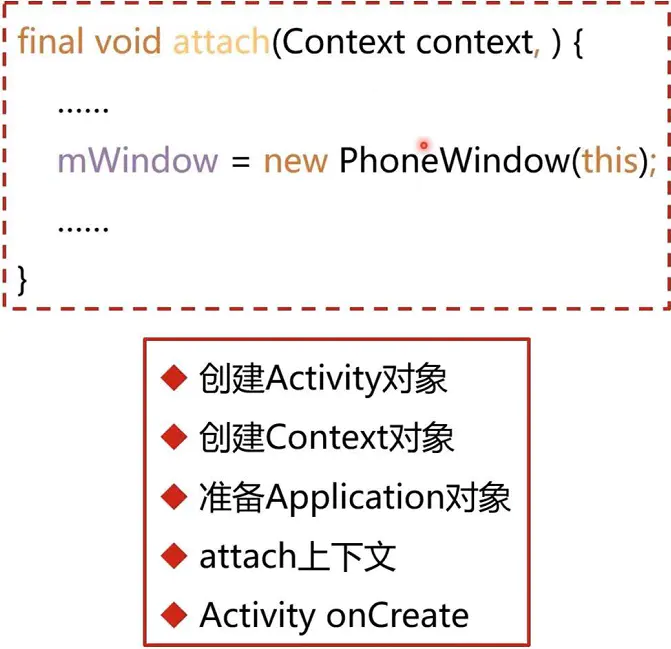

# Activity的显示原理


1.Activity的显示原理（Window、DecorView、ViewRoot）

2.Activity的UI刷新机制(Vsync、Choreographer)

3.UI的绘制原理(Measure、Layout、Draw)

4.Surface原理(Surface、SurfaceFlinger)


创建Activity之后就是把布局通过setContentView函数加载。把写的布局加载到window上。

```

public void setContentView(int LayoutResId){
	
	getWindow().setContentView(layoutResId);
	......

}

```

```
public Window getWindow(){
	return mWindow;
}
```

````
private Window mWindow;
````


 window 对象是在Activity的attach函数初始化的，上文讲过了Activity的初始化流程。phoneWindow是用来管理整个手机的窗口。不光包含应用的显示区域，还包括其他区域

```
final void attach(Context context){
	......
	
	mWindow =new PhoneWindow(this);
	...
}
```




```
public void setContentView(int layoutResID){

	if	(mContentParent == null){
		installDecor();
	}
	mLayoutInflater.inflate(layoutResId,mContentParent);
}
```

```
private void installDecor(){
	mDecor =new DecorView(getContext());
	View in =mLayoutInflater.inflate(layoutResource,null);
	mDecor.addView(in,...);
	mContentParent = findViewById(ID_ANDROID_CONTENT);

}
```


页面显示其实在onResume里的。makeVisible只是触发一次重绘。真正重要的是谁来启动和管理整个view的绘制流程。

```
final void handleResumeActivity(IBinder token){
	ActivityClientRecord r = performResumeActivity(token);
	final Activity a = r.activity;
	if	(r.window == null && !a.mFinished){
		r.window = r.activity.getWindow();
		View decor =r.window.getDecorView();
		
		ViewManager wm = a.getWindowManager();
		a.mDecor =decor;
		wm.addView(decor,l);
	}
	r.activity.makVisible();
}

```

