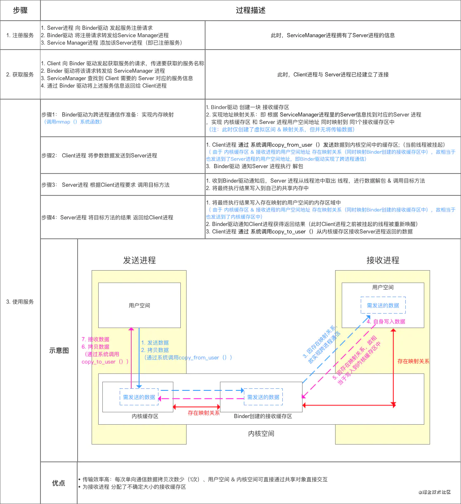
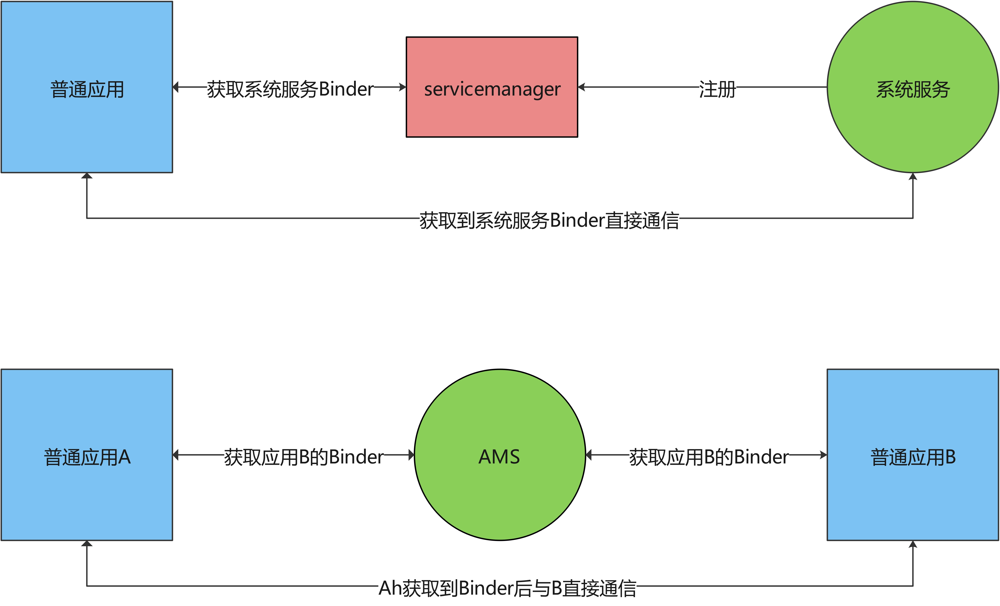

# Binder

# Android进程间通信（一）——Binder机制和AIDL的理解


## 为什么要去理解Android的进程间通信机制

对于Android开发工程师来说，如果不去理解进程间通信机制也可以使用系统提供的API完成应用开发，但如果想要达到更高的层级，那么就不能简单只会调用API。无论是工作中遇到一些疑难问题，还是想要学习源码的一些功能实现，或者是想要提升APP的性能等，这些工作都需要我们去看系统的源码，而系统的源码中进程间通信无处不在，如果不理解进程间通信机制，那么很难看懂系统源码，而且容易迷失在大量的代码中。

## Android 进程间通信机制

### 为什么使用Binder作为Android进程间通信机制

[Android Bander设计与实现 - 设计篇](https://links.jianshu.com/go?to=https%3A%2F%2Fblog.csdn.net%2Funiversus%2Farticle%2Fdetails%2F6211589) 这篇文章写得很好了。主要是为了弥补Linux中其他进程间通信方式得性能和安全性不足。当然Binder机制也并非是谷歌为了Android原创技术，Binder机制源于OpenBinder，OpenBinder要早于Android系统出现。所以如果想要立即Android得进程间通信，主要就是理解Binder机制。

### Binder进程间通信基本框架


在Android中，2个应用或者进程之间的通信都需要经过Binder代理，二者不能直接通信，同样APP在使用系统服务时也需要跨进程通信，比如我们最常用的ActivityManagerService(AMS)也是一个系统服务进程，此外APP使用WIFI 、定位、媒体服务等都是系统进程，APP想要使用这些系统服务的功能一定要通过Binder进行通信。

### Binder到底是什么

我们一直在说利用Binder机制进行进程间通信，那么Binder具体是什么？是一个Java类，还是一个底层驱动？通常我们说Binder机制是Android系统不同层Binder相关代码组成的一套跨进程通信功能。Binder机制相关代码从最底层的驱动层到最顶层的应用层都有，所以要读懂Binder机制，就需要我们耐心的逐层进行分析。


Binder机制代码结构

### 如何理解AIDL

我们从上图没有看到任何AIDL相关的信息，也就是说Binder机制是与AIDL无关的，那么我们日常中如果要跨进程都要写一个AIDL类然后由AS生成一些Java类，我们使用这些类实现进程间通信，这么做的目的其实是由AS帮我们生成一些模板代码，减少我们的工作和出错概率，其实不用AIDL我们也可以实现Binder通信，并且可以更好的理解Binder机制。下面我写一个Demo进程，这个Demo中有AIDL文件并生成相关代码，但我们不用，只是用来作为对比，我们用最少的代码实现Binder通信，并通过对比我们写的代码和AIDL生成的代码来更好的理解AIDL生成的代码的作用。[代码Github](https://links.jianshu.com/go?to=https%3A%2F%2Fgithub.com%2Fsunset768541%2FbinderDemo)

#### 不使用ADIL，手动实现进程间通信


项目结构


代码中client为客户端，server为服务端


客户端进程发送一个字符串给服务端，服务端进程接收到将字符显示到界面上。项目中没有用到AIDL为我们生成Binder通信类，而是用最简单的方式实现Binder通信，因而我们可以看清Binder通信最关键的地方。首先我们要知道，实现了IBinder接口的类的对象是可以跨进程传递的。

###### 服务端

1.服务端RemoteService继承Service
2.创建一个继承Binder的类ServerBinder，并覆写onTransact方法，用于处理Client的调用，Binder实现了IBinder接口
3.服务端覆写Service的onBind方法，返回一个ServerBinder对象(这个ServerBinder对象是最终传递给Client端)


```java
public class RemoteService extends Service {
    public static final int TRANSAVTION_showMessage = IBinder.FIRST_CALL_TRANSACTION;

    @Nullable
    @Override
    public IBinder onBind(Intent intent) {
        return new ServerBinder();
    }

    static class ServerBinder extends Binder   {
        public ServerBinder() {
        }

        @Override
        protected boolean onTransact(int code, @NonNull Parcel data, @Nullable Parcel reply, int flags) throws RemoteException {

            switch (code) {
                case TRANSAVTION_showMessage:
                    String message = data.readString();
                    Log.d("ServerBinder", "showMessage " + message);
                    if (ServerMainActivity.tvShowMessage != null) {//显示收到数据逻辑
                        new Handler(Looper.getMainLooper()).post(new Runnable() {
                            @Override
                            public void run() {
                                ServerMainActivity.tvShowMessage.setText(message);
                            }
                        });
                    }
                    if (reply != null) {
                        reply.writeNoException();
                    }
                    return true;
            }
            return super.onTransact(code, data, reply, flags);
        }


    }
}
```

###### 客户端

1.客户端创建一个ServiceConnection对象，用于与服务端建立连接，并获取到服务端的IBinder对象
2.客户端通过bindService与服务端的RemoteService建立连接


```java
public class ClientMainActivity extends AppCompatActivity {
    private Button mSendString;
    private EditText mStingEditText;
    public static final int TRANSAVTION_showMessage = IBinder.FIRST_CALL_TRANSACTION;
    private IBinder mServer;//服务端的Binder对象
    private boolean isConnection = false;

    private ServiceConnection serviceConnection = new ServiceConnection() {
        @Override
        public void onServiceConnected(ComponentName name, IBinder service) {
            
            isConnection = true;
            mServer = service;//建立连接成功，保存服务端进程的IBinder对象
            Log.d("Client"," onServiceConnected success");
        }

        @Override
        public void onServiceDisconnected(ComponentName name) {
            isConnection = false;
        }
    };

    //与服务端进程中RemoteService建立连接
    private void attemptToBindService() {
        Intent intent = new Intent();
        intent.setClassName("com.binder.server", "com.binder.server.RemoteService");
        bindService(intent, serviceConnection, Context.BIND_AUTO_CREATE);
    }
    @Override
    protected void onCreate(Bundle savedInstanceState) {
        super.onCreate(savedInstanceState);
        setContentView(R.layout.activity_main);
        mSendString = findViewById(R.id.btn_send_string);
        mStingEditText = findViewById(R.id.et_string);
        mSendString.setOnClickListener(new View.OnClickListener() {
            @Override
            public void onClick(View v) {
                if (!isConnection) {
                    attemptToBindService();
                    return;
                }
                //发送数据给服务端进程
                Parcel data = Parcel.obtain();
                Parcel replay = Parcel.obtain();
                if (mServer != null) {
                    try {
                        data.writeString(mStingEditText.getText().toString());
                        Log.d("Client"," mServer.transact call");
                      //发送数据到服务端进程
                        mServer.transact(TRANSAVTION_showMessage, data, replay, 0);
                        replay.readException();
                    } catch (RemoteException e) {
                        e.printStackTrace();
                    } finally {
                        replay.recycle();
                        data.recycle();
                    }
                }


            }
        });
    }

    @Override
    protected void onStart() {
        super.onStart();
        if (!isConnection) {
            attemptToBindService();
        }
    }
```

从上面的代码来看Binder的跨进程通信核心就是客户端获取到服务端的IBinder对象，然后调用这个对象的transact方法发送数据，实现进程间通信。

#### 使用ADIL生成相关类，进行进程间通信


加入AIDL文件


```dart
interface IShowMessageAidlInterface {
    /**
     * Demonstrates some basic types that you can use as parameters
     * and return values in AIDL.
     */
   void showMessage(String msg);
}
```

##### 修改Client端代码


```java
public class ClientMainActivityUseAidl extends AppCompatActivity {
    private Button mSendString;
    private EditText mStingEditText;
    private IShowMessageAidlInterface mServer;//服务端的Binder对象代理
    private boolean isConnection = false;

    private ServiceConnection serviceConnection = new ServiceConnection() {
        @Override
        public void onServiceConnected(ComponentName name, IBinder service) {
            isConnection = true;
            //调用IShowMessageAidlInterface.Stub.asInterface静态方法，将service转换为一接口
            mServer = IShowMessageAidlInterface.Stub.asInterface(service);
            Log.d("Client"," onServiceConnected success");
        }

        @Override
        public void onServiceDisconnected(ComponentName name) {
            isConnection = false;
        }
    };
    private void attemptToBindService() {
        Intent intent = new Intent();
        intent.setClassName("com.binder.server", "com.binder.server.RemoteServiceUseAidl");
        bindService(intent, serviceConnection, Context.BIND_AUTO_CREATE);
    }
    @Override
    protected void onCreate(Bundle savedInstanceState) {
        super.onCreate(savedInstanceState);
        setContentView(R.layout.activity_main);
        mSendString = findViewById(R.id.btn_send_string);
        mStingEditText = findViewById(R.id.et_string);
        mSendString.setOnClickListener(new View.OnClickListener() {
            @Override
            public void onClick(View v) {
                if (!isConnection) {
                    attemptToBindService();
                    return;
                }
                try {
                  //直接调用接口的showMessage方法
                    mServer.showMessage(mStingEditText.getText().toString());
                } catch (RemoteException e) {
                    e.printStackTrace();
                }
            }
        });
    }

    @Override
    protected void onStart() {
        super.onStart();
        if (!isConnection) {
            attemptToBindService();
        }
    }
```

1.客户端利用 IShowMessageAidlInterface生成类中的Stub内部类将接受到的IBinder对象转换为一个接口
2.在发送数据时，直接调用IShowMessageAidlInterface接口的showMessage方法

###### asInterface方法


```java
   public static com.binder.server.IShowMessageAidlInterface asInterface(android.os.IBinder obj)
   {
     if ((obj==null)) {
       return null;
     }
   //查询obj对象是否是本地接口，也就是是不是在同一个进程
     android.os.IInterface iin = obj.queryLocalInterface(DESCRIPTOR);
     if (((iin!=null)&&(iin instanceof com.binder.server.IShowMessageAidlInterface))) {
       如果是同一个进程直接返回
       return ((com.binder.server.IShowMessageAidlInterface)iin);
     }
 //如果是不同进程，则将IBinder对象利用Proxy封装一层
     return new com.binder.server.IShowMessageAidlInterface.Stub.Proxy(obj);
   }
```

###### Proxy类


```java
 private static class Proxy implements com.binder.server.IShowMessageAidlInterface
    {
      private android.os.IBinder mRemote;
      Proxy(android.os.IBinder remote)
      {
        mRemote = remote;
      }
      @Override public android.os.IBinder asBinder()
      {
        return mRemote;
      }
      public java.lang.String getInterfaceDescriptor()
      {
        return DESCRIPTOR;
      }
      /**
           * Demonstrates some basic types that you can use as parameters
           * and return values in AIDL.
           */
      //代理对象做的工作是把AIDL接口中定义的方法中的数据进行封装，方便进行跨进程传输
      @Override public void showMessage(java.lang.String msg) throws android.os.RemoteException
      {
        android.os.Parcel _data = android.os.Parcel.obtain();
        android.os.Parcel _reply = android.os.Parcel.obtain();
        try {
          _data.writeInterfaceToken(DESCRIPTOR);
          _data.writeString(msg);
          boolean _status = mRemote.transact(Stub.TRANSACTION_showMessage, _data, _reply, 0);
          if (!_status && getDefaultImpl() != null) {
            getDefaultImpl().showMessage(msg);
            return;
          }
          _reply.readException();
        }
        finally {
          _reply.recycle();
          _data.recycle();
        }
      }
      public static com.binder.server.IShowMessageAidlInterface sDefaultImpl;
    }
```

所以我们可以知道，客户端用到了AIDL文件生成Stub类中的asInterface方法，把接收到的远程IBinder转换为IShowMessageAidlInterface接口，而这个接口的具体实现其实是Proxy类，代理类对方法传入数据进行封装，然后发送给mRemote 服务端。

##### 修改服务端代码


```java
public class RemoteServiceUseAidl extends Service {
    @Nullable
    @Override
    public IBinder onBind(Intent intent) {
        return new IShowMessageAidlInterface.Stub() {
            @Override
            public void showMessage(String msg) throws RemoteException {
                if (ServerMainActivity.tvShowMessage != null) {
                    new Handler(Looper.getMainLooper()).post(new Runnable() {
                        @Override
                        public void run() {
                            ServerMainActivity.tvShowMessage.setText(msg);
                        }
                    });
                }
            }
        };
    }
}
```

服务端的 onBind方法返回AIDL生成的Stub类的对象，Stub是个抽象类，其中待实现的方法为AIDL中定义的showMessage方法。


```java
 public static abstract class Stub extends android.os.Binder implements com.binder.server.IShowMessageAidlInterface
  {
    private static final java.lang.String DESCRIPTOR = "com.binder.server.IShowMessageAidlInterface";
    static final int TRANSACTION_showMessage = (android.os.IBinder.FIRST_CALL_TRANSACTION + 0);
    /** Construct the stub at attach it to the interface. */
    public Stub()
    {
      this.attachInterface(this, DESCRIPTOR);
    }
    @Override public android.os.IBinder asBinder()
    {
      return this;
    }
    @Override public boolean onTransact(int code, android.os.Parcel data, android.os.Parcel reply, int flags) throws android.os.RemoteException
    {
      java.lang.String descriptor = DESCRIPTOR;
      switch (code)
      {
        case INTERFACE_TRANSACTION:
        {
          reply.writeString(descriptor);
          return true;
        }
        case TRANSACTION_showMessage:
        {
          data.enforceInterface(descriptor);
          java.lang.String _arg0;
          _arg0 = data.readString();
          this.showMessage(_arg0);
          reply.writeNoException();
          return true;
        }
        default:
        {
          return super.onTransact(code, data, reply, flags);
        }
      }
    }
   
  }
```

可以看到Sub抽象类中继承自Binder，也就是客端最终拿到的是这个Stub IBinder对象，客户端调用tansact方法最终会调用到Stub类的onTransact进行处理，Stub的onTransact方法根据code确定客端户调用了哪个方法，然后对接收到的data数据进行读取解析，将处理好的数据交给IShowMessageAidlInterface中对应的方法。

总结:
1.AIDL生成的类中Stub的静态方法asInterface和Proxy类是给客户端用于发送数据的
2.Stub抽象类是由服务端实现，接收处理客户端数据的





------


### Binder 调用流程

> Binder机制中的服务也需要一个类似DNS的服务，帮助客户端找到服务端，这个服务就是servicemanager 需要注意的是 这个servicemanager管理的都是系统服务。
>
> 普通应用间的Binder通信是通过ActivityManagerService进行的。ActivityManagerService类似于普通应用进程通信的serviceManager。




> 可见我们普通的App想要跨进程就得先获取AMS,而获取AMS服务就得先注册到servicemanager，这样App能获取到，所以我们就得先搞明白AMS注册流程是怎样。
>
> servicemanager得工作原理是什么。我们知道servicemanager是一个单独的进程。系统服务也是一个单独的进程， 系统服务注册到servicemanager就需要进程间通信，也就是利用Binder进行通信。所以我们就从AMS注册到servicemanager中这个动作作为入口来分析Binder通信机制。


> 经过发现，AMS通过serviceManager.addService进行注册的。
>
> 我们看到调用serviceManager.addService添加服务的类是SystemServer.java


```

  public static void main(String[] args) {
        new SystemServer().run();
  }

    private void run() {
        try {
            traceBeginAndSlog("InitBeforeStartServices");

        ……

        // Start services.
        try {
            traceBeginAndSlog("StartServices");
            startBootstrapServices();
            startCoreServices();
            startOtherServices();
            SystemServerInitThreadPool.shutdown();
        } catch (Throwable ex) {
            Slog.e("System", "******************************************");
            Slog.e("System", "************ Failure starting system services", ex);
            throw ex;
        } finally {
            traceEnd();
        }

         ……

        // Loop forever.
        Looper.loop();
        throw new RuntimeException("Main thread loop unexpectedly exited");
    }


```


涉及到了android系统启动

```
ZygoteInit.java
     ......
 /* Hardcoded command line to start the system server */
        String args[] = {
            "--setuid=1000",
            "--setgid=1000",
            "--setgroups=1001,1002,1003,1004,1005,1006,1007,1008,1009,1010,1018,1021,1023,1024,1032,1065,3001,3002,3003,3006,3007,3009,3010",
            "--capabilities=" + capabilities + "," + capabilities,
            "--nice-name=system_server",
            "--runtime-args",
            "--target-sdk-version=" + VMRuntime.SDK_VERSION_CUR_DEVELOPMENT,
            "com.android.server.SystemServer",
        };
        ZygoteConnection.Arguments parsedArgs = null;

        int pid;

        try {
            parsedArgs = new ZygoteConnection.Arguments(args);
            ZygoteConnection.applyDebuggerSystemProperty(parsedArgs);
            ZygoteConnection.applyInvokeWithSystemProperty(parsedArgs);

            boolean profileSystemServer = SystemProperties.getBoolean(
                    "dalvik.vm.profilesystemserver", false);
            if (profileSystemServer) {
                parsedArgs.runtimeFlags |= Zygote.PROFILE_SYSTEM_SERVER;
            }

            /* Request to fork the system server process */
            pid = Zygote.forkSystemServer(
                    parsedArgs.uid, parsedArgs.gid,
                    parsedArgs.gids,
                    parsedArgs.runtimeFlags,
                    null,
                    parsedArgs.permittedCapabilities,
                    parsedArgs.effectiveCapabilities);
        } catch (IllegalArgumentException ex) {
            throw new RuntimeException(ex);
        }
     ......
```


> 总结
>  1、我们知道servicemanager用来管理系统服务，servicemanager的启动是手机系统启动时由init进程解析init.rc文件启动
>  2、对于系统服务比如AMS，想要注册到servicemanager中，需要通过ServiceManager.addService方法SystemServer启动时调用,SystemServer是java进程，启动是从Zygote中启动的。
>  3、servicemanager是native层进程，ServerManager是Java层进程。


# ServiceConnection 的onServiceConnected返回的IBinder的流程

代码参考[Android进程间通信（一）——Binder机制和AIDL的理解](https://www.jianshu.com/p/a55305447954),首先我们在客户端，通过bindService来获取指定应用的服务的IBinder对象。下面通过分析bindService的流程来确定返回的IBinder是哪个类
 [源码github地址](https://links.jianshu.com/go?to=https%3A%2F%2Fgithub.com%2Fsunset768541%2Fbinder_source_6.0)


```java
    private ServiceConnection serviceConnection = new ServiceConnection() {
        @Override
        public void onServiceConnected(ComponentName name, IBinder service) {
            isConnection = true;
            //调用IShowMessageAidlInterface.Stub.asInterface静态方法，将service转换为一接口
            mServer = IShowMessageAidlInterface.Stub.asInterface(service);
            Log.d("Client"," onServiceConnected success");
        }

        @Override
        public void onServiceDisconnected(ComponentName name) {
            isConnection = false;
        }
    };
    private void attemptToBindService() {
        Intent intent = new Intent();
        intent.setClassName("com.binder.server", "com.binder.server.RemoteServiceUseAidl");
        bindService(intent, serviceConnection, Context.BIND_AUTO_CREATE);
    }
```

## bindeService实际是调用ContextWrapper的bindService方法


```java
    @Override
    public boolean bindService(Intent service, ServiceConnection conn,
            int flags) {
        return mBase.bindService(service, conn, flags);
    }
```

mBase的赋值是通过


```csharp
    protected void attachBaseContext(Context base) {
        if (mBase != null) {
            throw new IllegalStateException("Base context already set");
        }
        mBase = base;
    }
```

Activity的attach方法中调用了attachBaseContext


```dart
 final void attach(Context context, ActivityThread aThread,
            Instrumentation instr, IBinder token, int ident,
            Application application, Intent intent, ActivityInfo info,
            CharSequence title, Activity parent, String id,
            NonConfigurationInstances lastNonConfigurationInstances,
            Configuration config, String referrer, IVoiceInteractor voiceInteractor,
            Window window, ActivityConfigCallback activityConfigCallback, IBinder assistToken) {
        attachBaseContext(context);
```

可见传入了一个Context


我们知道Context的实现类是ContextImpl，我们看下ContextImpl的bindService


```java
    public boolean bindService(Intent service, ServiceConnection conn, int flags) {
        this.warnIfCallingFromSystemProcess();
        return this.bindServiceCommon(service, conn, flags, Process.myUserHandle());
    }
```

bindServiceCommon


```kotlin
  private boolean bindServiceCommon(Intent service, ServiceConnection conn, int flags, UserHandle user) {
        if (conn == null) {
            throw new IllegalArgumentException("connection is null");
        } else if (this.mPackageInfo != null) {
            IServiceConnection sd = this.mPackageInfo.getServiceDispatcher(conn, this.getOuterContext(), this.mMainThread.getHandler(), flags);
            this.validateServiceIntent(service);

            try {
                IBinder token = this.getActivityToken();
                if (token == null && (flags & 1) == 0 && this.mPackageInfo != null && this.mPackageInfo.getApplicationInfo().targetSdkVersion < 14) {
                    flags |= 32;
                }

                service.prepareToLeaveProcess();
                int res = ActivityManagerNative.getDefault().bindService(this.mMainThread.getApplicationThread(), this.getActivityToken(), service, service.resolveTypeIfNeeded(this.getContentResolver()), sd, flags, user.getIdentifier());
                if (res < 0) {
                    throw new SecurityException("Not allowed to bind to service " + service);
                } else {
                    return res != 0;
                }
            } catch (RemoteException var8) {
                return false;
            }
        } else {
            throw new RuntimeException("Not supported in system context");
        }
    }
```

注意这个IServiceConnection类，这个是一个IInteface接口，具有跨进程的能力,这个跨进程的IServiceConnection中也都一个Stub Binder类，作为服务端 ，Proxy在客户端作为代理，调用服务端。IServiceConnection.Stub的子类实现了connected方法。


```java
public interface IServiceConnection extends IInterface {
    void connected(ComponentName var1, IBinder var2) throws RemoteException;

    public abstract static class Stub extends Binder implements IServiceConnection {
        private static final String DESCRIPTOR = "android.app.IServiceConnection";
        static final int TRANSACTION_connected = 1;

        public Stub() {
            this.attachInterface(this, "android.app.IServiceConnection");
        }

        public static IServiceConnection asInterface(IBinder obj) {
            if (obj == null) {
                return null;
            } else {
                IInterface iin = obj.queryLocalInterface("android.app.IServiceConnection");
                return (IServiceConnection)(iin != null && iin instanceof IServiceConnection ? (IServiceConnection)iin : new IServiceConnection.Stub.Proxy(obj));
            }
        }

        public IBinder asBinder() {
            return this;
        }

        public boolean onTransact(int code, Parcel data, Parcel reply, int flags) throws RemoteException {
            switch(code) {
            case 1:
                data.enforceInterface("android.app.IServiceConnection");
                ComponentName _arg0;
                if (0 != data.readInt()) {
                    _arg0 = (ComponentName)ComponentName.CREATOR.createFromParcel(data);
                } else {
                    _arg0 = null;
                }

                IBinder _arg1 = data.readStrongBinder();
                this.connected(_arg0, _arg1);
                return true;
            case 1598968902:
                reply.writeString("android.app.IServiceConnection");
                return true;
            default:
                return super.onTransact(code, data, reply, flags);
            }
        }

        private static class Proxy implements IServiceConnection {
            private IBinder mRemote;

            Proxy(IBinder remote) {
                this.mRemote = remote;
            }

            public IBinder asBinder() {
                return this.mRemote;
            }

            public String getInterfaceDescriptor() {
                return "android.app.IServiceConnection";
            }

            public void connected(ComponentName name, IBinder service) throws RemoteException {
                Parcel _data = Parcel.obtain();

                try {
                    _data.writeInterfaceToken("android.app.IServiceConnection");
                    if (name != null) {
                        _data.writeInt(1);
                        name.writeToParcel(_data, 0);
                    } else {
                        _data.writeInt(0);
                    }

                    _data.writeStrongBinder(service);
                    this.mRemote.transact(1, _data, (Parcel)null, 1);
                } finally {
                    _data.recycle();
                }

            }
        }
    }
}
```


我们知道，只有InnerConnection继承了IServiceConnection.Stub


```java
        private static class InnerConnection extends Stub {//InnerConnection服务端的具体实现
            final WeakReference<LoadedApk.ServiceDispatcher> mDispatcher;

            InnerConnection(LoadedApk.ServiceDispatcher sd) {
                this.mDispatcher = new WeakReference(sd);
            }
            public void connected(ComponentName name, IBinder service) throws RemoteException {
                LoadedApk.ServiceDispatcher sd = (LoadedApk.ServiceDispatcher)this.mDispatcher.get();
                if (sd != null) {
                    sd.connected(name, service);
                }

            }
        }
```


```java
static final class ServiceDispatcher {
        private final ServiceConnection mConnection;
        public void connected(ComponentName name, IBinder service) {
            if (this.mActivityThread != null) {
                this.mActivityThread.post(new LoadedApk.ServiceDispatcher.RunConnection(name, service, 0));
            } else {
                this.doConnected(name, service);
            }

        }
```


```kotlin
        private final class RunConnection implements Runnable {
            final ComponentName mName;
            final IBinder mService;
            final int mCommand;

            RunConnection(ComponentName name, IBinder service, int command) {
                this.mName = name;
                this.mService = service;
                this.mCommand = command;
            }

            public void run() {
                if (this.mCommand == 0) {
                    ServiceDispatcher.this.doConnected(this.mName, this.mService);
                } else if (this.mCommand == 1) {
                    ServiceDispatcher.this.doDeath(this.mName, this.mService);
                }

            }
        }
```

ServiceDispatcher


```kotlin
 public void doConnected(ComponentName name, IBinder service) {
            LoadedApk.ServiceDispatcher.ConnectionInfo old;
            synchronized(this) {
                if (this.mForgotten) {
                    return;
                }

                old = (LoadedApk.ServiceDispatcher.ConnectionInfo)this.mActiveConnections.get(name);
                if (old != null && old.binder == service) {
                    return;
                }

                if (service != null) {
                    this.mDied = false;
                    LoadedApk.ServiceDispatcher.ConnectionInfo info = new LoadedApk.ServiceDispatcher.ConnectionInfo();
                    info.binder = service;
                    info.deathMonitor = new LoadedApk.ServiceDispatcher.DeathMonitor(name, service);

                    try {
                        service.linkToDeath(info.deathMonitor, 0);
                        this.mActiveConnections.put(name, info);
                    } catch (RemoteException var8) {
                        this.mActiveConnections.remove(name);
                        return;
                    }
                } else {
                    this.mActiveConnections.remove(name);
                }

                if (old != null) {
                    old.binder.unlinkToDeath(old.deathMonitor, 0);
                }
            }

            if (old != null) {
                this.mConnection.onServiceDisconnected(name);//
            }

            if (service != null) {
                this.mConnection.onServiceConnected(name, service);//回调到客户端端的ServiceConnection.onServiceConnected
            }

        }
```

我们再看下            IServiceConnection sd = this.mPackageInfo.getServiceDispatcher(conn, this.getOuterContext(), this.mMainThread.getHandler(), flags);
 做了什么


```cpp
    public final IServiceConnection getServiceDispatcher(ServiceConnection c, Context context, Handler handler, int flags) {
        synchronized(this.mServices) {
            LoadedApk.ServiceDispatcher sd = null;
            ArrayMap<ServiceConnection, LoadedApk.ServiceDispatcher> map = (ArrayMap)this.mServices.get(context);
            if (map != null) {
                sd = (LoadedApk.ServiceDispatcher)map.get(c);
            }

            if (sd == null) {
                sd = new LoadedApk.ServiceDispatcher(c, context, handler, flags);
                if (map == null) {
                    map = new ArrayMap();
                    this.mServices.put(context, map);
                }

                map.put(c, sd);
            } else {
                sd.validate(context, handler);
            }

            return sd.getIServiceConnection();
        }
    }
```

LoadedApk.ServiceDispatcher用于封装ServiceConnection，服务端通过IServiceConnection 通过跨进程将服务的IBinder对象发送给客户端，相当于回调。目前我们已经知道ServiceConnection的onServiceConnected是通过跨进程被调用的。下面我们继续看客户端发送流程


```cpp
int res = ActivityManager.getService().bindService(
                mMainThread.getApplicationThread(), getActivityToken(), service,
                service.resolveTypeIfNeeded(getContentResolver()),
                sd, flags, getOpPackageName(), user.getIdentifier());
```

ActivityManager.java


```java
    public static IActivityManager getService() {
        return IActivityManagerSingleton.get();
    }

    private static final Singleton<IActivityManager> IActivityManagerSingleton =
            new Singleton<IActivityManager>() {
                @Override
                protected IActivityManager create() {
                    final IBinder b = ServiceManager.getService(Context.ACTIVITY_SERVICE);//从ServiceManager获取AMS的IBinder，返回一个IActivityManager的代理对象
                    final IActivityManager am = IActivityManager.Stub.asInterface(b);
                    return am;
                }
            };
```

所以，bindService实际是通过Binder跨进程调用到了AMS中的bindService
 ActivityManagerService


```java
 final ActiveServices mServices;
 public int bindService(IApplicationThread caller, IBinder token, Intent service,
            String resolvedType, IServiceConnection connection, int flags, String callingPackage,
            int userId) throws TransactionTooLargeException {
        enforceNotIsolatedCaller("bindService");

        // Refuse possible leaked file descriptors
        if (service != null && service.hasFileDescriptors() == true) {
            throw new IllegalArgumentException("File descriptors passed in Intent");
        }

        if (callingPackage == null) {
            throw new IllegalArgumentException("callingPackage cannot be null");
        }

        synchronized(this) {
            return mServices.bindServiceLocked(caller, token, service,
                    resolvedType, connection, flags, callingPackage, userId);
        }
    }
```

ActiveServices


```dart
int bindServiceLocked(IApplicationThread caller, IBinder token, Intent service,
            String resolvedType, final IServiceConnection connection, int flags,
            String instanceName, String callingPackage, final int userId)
            throws TransactionTooLargeException {
......
    AppBindRecord b = s.retrieveAppBindingLocked(service, callerApp);
            //c持有IServiceConnection
            ConnectionRecord c = new ConnectionRecord(b, activity,
                    connection, flags, clientLabel, clientIntent,
                    callerApp.uid, callerApp.processName, callingPackage);

            IBinder binder = connection.asBinder();
            //ServiceRecord持有binder和ConnectionRecord
            s.addConnection(binder, c);
            b.connections.add(c);
            if (activity != null) {
                activity.addConnection(c);
            }
            b.client.connections.add(c);

            if ((flags&Context.BIND_AUTO_CREATE) != 0) {
                s.lastActivity = SystemClock.uptimeMillis();
                //1、s为ServiceRecord持有IServiceConnection
                if (bringUpServiceLocked(s, service.getFlags(), callerFg, false,
                        permissionsReviewRequired) != null) {
                    return 0;
                }
```


```java
    private String bringUpServiceLocked(ServiceRecord r, int intentFlags, boolean execInFg,
            boolean whileRestarting, boolean permissionsReviewRequired)
            throws TransactionTooLargeException {
 if (!isolated) {
            app = mAm.getProcessRecordLocked(procName, r.appInfo.uid, false);
            if (DEBUG_MU) Slog.v(TAG_MU, "bringUpServiceLocked: appInfo.uid=" + r.appInfo.uid
                        + " app=" + app);
            if (app != null && app.thread != null) {
                try {
                    app.addPackage(r.appInfo.packageName, r.appInfo.longVersionCode, mAm.mProcessStats);

                    //2、启动服务
                    realStartServiceLocked(r, app, execInFg);
                    return null;
                } catch (TransactionTooLargeException e) {
                    throw e;
                } catch (RemoteException e) {
                    Slog.w(TAG, "Exception when starting service " + r.shortInstanceName, e);
                }

                // If a dead object exception was thrown -- fall through to
                // restart the application.
            }
```


```java
  private final void realStartServiceLocked(ServiceRecord r,
            ProcessRecord app, boolean execInFg) throws RemoteException {
        if (app.thread == null) {
......
  //3、app.thread=ApplicationThread  Binder通信
            //r ServiceRecord 是Binder子类  通过跨进程通信，将ServiceRecord传递给服务端App  
          //ProcessRecord app 
         // thread 为IApplicationThread,这是一个AIDL文件，具体的实现是IApplicationThread.Stub的子类ApplicationThread
            app.thread.scheduleCreateService(r, r.serviceInfo,
                    mAm.compatibilityInfoForPackage(r.serviceInfo.applicationInfo),
                    app.getReportedProcState());
         
.....
```

我们看ApplicationThread是如何创建Service的


```kotlin
public final void scheduleCreateService(IBinder token,
                ServiceInfo info, CompatibilityInfo compatInfo, int processState) {
            updateProcessState(processState, false);
            CreateServiceData s = new CreateServiceData();
            //token表示ServiceRecord Binder
            s.token = token;
            s.info = info;
            s.compatInfo = compatInfo;

            sendMessage(H.CREATE_SERVICE, s);
        }
//查找CREATE_SERVICE对应的case
  case CREATE_SERVICE:
                    Trace.traceBegin(Trace.TRACE_TAG_ACTIVITY_MANAGER, ("serviceCreate: " + String.valueOf(msg.obj)));
                    handleCreateService((CreateServiceData)msg.obj);
                    Trace.traceEnd(Trace.TRACE_TAG_ACTIVITY_MANAGER);
                    break;

 //data持有ServiceRecord
    @UnsupportedAppUsage
    private void handleCreateService(CreateServiceData data) {
        // If we are getting ready to gc after going to the background, well
        // we are back active so skip it.
        unscheduleGcIdler();

        LoadedApk packageInfo = getPackageInfoNoCheck(
                data.info.applicationInfo, data.compatInfo);
        Service service = null;
        try {
            java.lang.ClassLoader cl = packageInfo.getClassLoader();
            service = packageInfo.getAppFactory()
                    .instantiateService(cl, data.info.name, data.intent);//创建一个Service对象
        } catch (Exception e) {
            if (!mInstrumentation.onException(service, e)) {
                throw new RuntimeException(
                    "Unable to instantiate service " + data.info.name
                    + ": " + e.toString(), e);
            }
        }

        try {
            if (localLOGV) Slog.v(TAG, "Creating service " + data.info.name);

            ContextImpl context = ContextImpl.createAppContext(this, packageInfo);
            context.setOuterContext(service);

            Application app = packageInfo.makeApplication(false, mInstrumentation);
            service.attach(context, this, data.info.name, data.token, app,
                    ActivityManager.getService());
            service.onCreate();//调用service的onCreate
            mServices.put(data.token, service);//保存创建好的Service到mServices中
```

到目前为止，服务端的Service创建完成，并且调用了onCreate方法。继续看


```java
private final void realStartServiceLocked(ServiceRecord r,
           ProcessRecord app, boolean execInFg) throws RemoteException {
       if (app.thread == null) {
........
//开始进行Service的绑定
       requestServiceBindingsLocked(r, execInFg);
........
```


```java
    private final void requestServiceBindingsLocked(ServiceRecord r, boolean execInFg)
            throws TransactionTooLargeException {
        for (int i=r.bindings.size()-1; i>=0; i--) {
            IntentBindRecord ibr = r.bindings.valueAt(i);
            if (!requestServiceBindingLocked(r, ibr, execInFg, false)) {
                break;
            }
        }
    }
```


```java
    private final boolean requestServiceBindingLocked(ServiceRecord r, IntentBindRecord i,
            boolean execInFg, boolean rebind) throws TransactionTooLargeException {
        if (r.app == null || r.app.thread == null) {
            // If service is not currently running, can't yet bind.
            return false;
        }
        if (DEBUG_SERVICE) Slog.d(TAG_SERVICE, "requestBind " + i + ": requested=" + i.requested
                + " rebind=" + rebind);
        if ((!i.requested || rebind) && i.apps.size() > 0) {
            try {
                bumpServiceExecutingLocked(r, execInFg, "bind");
                r.app.forceProcessStateUpTo(ActivityManager.PROCESS_STATE_SERVICE);
                //服务端执行scheduleBindService
                r.app.thread.scheduleBindService(r, i.intent.getIntent(), rebind,
                        r.app.getReportedProcState());
```

app.thread.scheduleBindService仍然是调用到服务端进程的ApplicationThread的scheduleBindService


```java
 public final void scheduleBindService(IBinder token, Intent intent,
                boolean rebind, int processState) {
            updateProcessState(processState, false);
            BindServiceData s = new BindServiceData();
            //token ServiceRecord
            s.token = token;
            s.intent = intent;
            s.rebind = rebind;

            if (DEBUG_SERVICE)
                Slog.v(TAG, "scheduleBindService token=" + token + " intent=" + intent + " uid="
                        + Binder.getCallingUid() + " pid=" + Binder.getCallingPid());
            sendMessage(H.BIND_SERVICE, s);
        }
```

找到BIND_SERVICE对应的case


```css
      break;
                case BIND_SERVICE:
                    Trace.traceBegin(Trace.TRACE_TAG_ACTIVITY_MANAGER, "serviceBind");
                    handleBindService((BindServiceData)msg.obj);
                    Trace.traceEnd(Trace.TRACE_TAG_ACTIVITY_MANAGER);
                    break;
```


```kotlin
 private void handleBindService(BindServiceData data) {
        Service s = mServices.get(data.token);//在handCreateService中创建完Service就保存到mService中了
        //s为通过bindService创建好的Service
        if (DEBUG_SERVICE)
            Slog.v(TAG, "handleBindService s=" + s + " rebind=" + data.rebind);
        if (s != null) {
            try {
                data.intent.setExtrasClassLoader(s.getClassLoader());
                data.intent.prepareToEnterProcess();
                try {
                    if (!data.rebind) {
                        IBinder binder = s.onBind(data.intent);
                        //跨进程调用toekn为客户端进程,binder为IBinder
                        ActivityManager.getService().publishService(
                                data.token, data.intent, binder);
                    } else {
```

服务端调用AMS进程的publishService


```java
    final ActiveServices mServices;
    //token为客户端的token，service为服务端的Service
    public void publishService(IBinder token, Intent intent, IBinder service) {
        // Refuse possible leaked file descriptors
        if (intent != null && intent.hasFileDescriptors() == true) {
            throw new IllegalArgumentException("File descriptors passed in Intent");
        }

        synchronized(this) {
            if (!(token instanceof ServiceRecord)) {
                throw new IllegalArgumentException("Invalid service token");
            }
            mServices.publishServiceLocked((ServiceRecord)token, intent, service);
        }
    }
```

调用ActiveServices 的publishServiceLocked


```swift
    void publishServiceLocked(ServiceRecord r, Intent intent, IBinder service) {
        final long origId = Binder.clearCallingIdentity();
        try {
            if (DEBUG_SERVICE) Slog.v(TAG_SERVICE, "PUBLISHING " + r
                    + " " + intent + ": " + service);
            if (r != null) {
                Intent.FilterComparison filter
                        = new Intent.FilterComparison(intent);
                IntentBindRecord b = r.bindings.get(filter);
                if (b != null && !b.received) {
                    b.binder = service;
                    b.requested = true;
                    b.received = true;
                    ArrayMap<IBinder, ArrayList<ConnectionRecord>> connections = r.getConnections();
                    for (int conni = connections.size() - 1; conni >= 0; conni--) {
                        ArrayList<ConnectionRecord> clist = connections.valueAt(conni);
                        for (int i=0; i<clist.size(); i++) {
                            ConnectionRecord c = clist.get(i);
                            if (!filter.equals(c.binding.intent.intent)) {
                                if (DEBUG_SERVICE) Slog.v(
                                        TAG_SERVICE, "Not publishing to: " + c);
                                if (DEBUG_SERVICE) Slog.v(
                                        TAG_SERVICE, "Bound intent: " + c.binding.intent.intent);
                                if (DEBUG_SERVICE) Slog.v(
                                        TAG_SERVICE, "Published intent: " + intent);
                                continue;
                            }
                            if (DEBUG_SERVICE) Slog.v(TAG_SERVICE, "Publishing to: " + c);
                            try {
                                //从AMS中，拿到IServiceConnection.调用connected就调用到了客户端ServiceConnection onServiceConnected
                                c.conn.connected(r.name, service, false);
```

至此服务端把Service通过Binder传递给了客户端。我们发现整个流程涉及了客户端进程、AMS进程、服务端进程。
 涉及的Binder子类有AMS,IServiceConnection，AppicationThread，服务端。所以说Binder是Android中重要的机制，因为系统跨进程到处都需要用到Binder通信。


