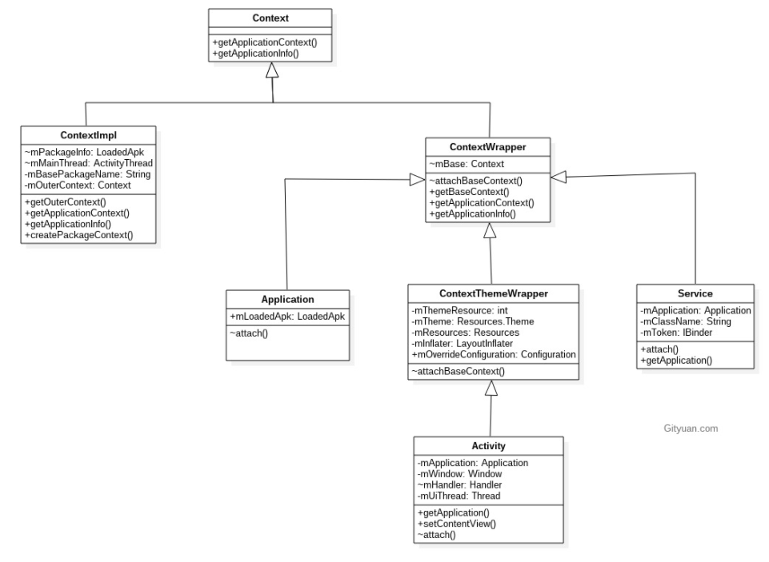
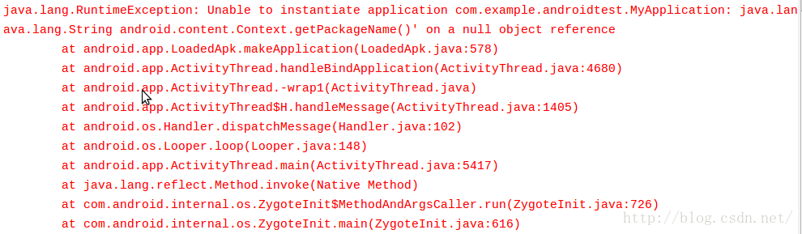
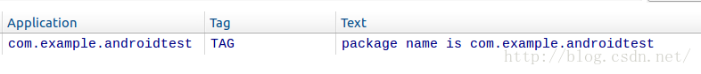
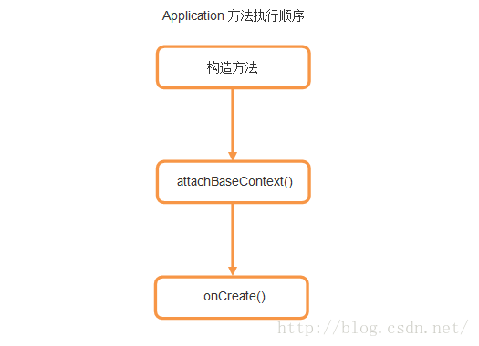

# Context

理解上下文

context 意为上下文，是一个应用程序环境信息的接口

- 启动Activity (startActivity)
- 启动服务 (startService)
- 发送广播 (sendBroadcast), 注册广播接收者 (registerReceiver)
- 获取ContentResolver (getContentResolver)
- 获取类加载器 (getClassLoader)
- 打开或创建数据库 (openOrCreateDatabase)
- 获取资源 (getResources)

 Android Context本身是一个抽象类. ContextImpl, Activity, Service, Application这些都是Context的直接或间接子类



图解:

1. ContextImpl:

   - Application/Activity/Service通过attach() 调用父类ContextWrapper的attachBaseContext(), 从而设置父类成员变量mBase为ContextImpl对象;
   - ContextWrapper的核心工作都是交给mBase(即ContextImpl)来完成;

2. Application: 四大组件属于某一Application, 获取所在Application:

   - Activity/Service: 是通过调用其方法getApplication(),可主动获取当前所在mApplication;

     mApplication是由LoadedApk.makeApplication()过程所初始化的;

   - Receiver: 是通过其方法onReceive()的第一个参数指向通当前所在Application,也就是只有接收到广播的时候才能拿到当前的Application对象;

   - provider: 目前没有提供直接获取当前所在Application的方法, 但可通过getContext()可以获取当前的ContextImpl.


由此，其实我们就已经可以得出结论了，Context一共有三种类型，分别是Application、Activity和Service。这三个类虽然分别各种承担着不同的作用，但它们都属于Context的一种，而它们具体Context的功能则是由ContextImpl类去实现的。


##### Context的数量

Context一共有Application、Activity和Service三种类型，因此一个应用程序中Context数量的计算公式就可以这样写：

> Context数量 = Activity数量 + Service数量 + 1


Application Context的设计

基本上每一个应用程序都会有一个自己的Application,并让它继承自系统的Application类。

然后再自己的Application类中去封装一些通用的操作。其实这并不是Google所推荐的一种做法，因为这样我们只是把Application当成了一个通用工具类来使用的，而实际上使用一个简单的单例类也可以实现同样的功能。


获取是一样的，同一个对象，同一个内存地址

```
public class MainActivity extends Activity {
	
	@Override
	protected void onCreate(Bundle savedInstanceState) {
		super.onCreate(savedInstanceState);
		setContentView(R.layout.activity_main);
		MyApplication myApp = (MyApplication) getApplication();
		Log.d("TAG", "getApplication is " + myApp);
		Context appContext = getApplicationContext();
		Log.d("TAG", "getApplicationContext is " + appContext);
	}
	
}
```


> getBaseContext()方法得到的是一个ContextImpl对象。


ContextImpl正是上下文功能的实现类。也就是说像Application、Activity这样的类其实并不会去具体实现Context的功能，而仅仅是做了一层接口封装而已，Context的具体功能都是由ContextImpl类去完成的。


其实所有ContextWrapper中方法的实现都非常统一，就是调用了mBase对象中对应当前方法名的方法。


##### 使用Application的问题

虽说Application的用法确实非常简单，但是我们平时的开发工作当中也着实存在着不少Application误用的场景，那么今天就来看一看有哪些比较容易犯错的地方是我们应该注意的。


Application是Context的其中一种类型，那么是否就意味着，只要是Application的实例，就能随时使用Context的各种方法呢？我们来做个实验试一下就知道了：


	public class MyApplication extends Application {
		
	public MyApplication() {
		String packageName = getPackageName();
		Log.d("TAG", "package name is " + packageName);
	}


这是一个非常简单的自定义Application，我们在MyApplication的构造方法当中获取了当前应用程序的包名，并打印出来。获取包名使用了getPackageName()方法，这个方法就是由Context提供的。那么上面的代码能正常运行吗？跑一下就知道了，你将会看到如下所示的结果：




应用程序一启动就立刻崩溃了，报的是一个空指针异常。看起来好像挺简单的一段代码，怎么就会成空指针了呢？但是如果你尝试把代码改成下面的写法，就会发现一切正常了：


	public class MyApplication extends Application {
	
	@Override
	public void onCreate() {
		super.onCreate();
		String packageName = getPackageName();
		Log.d("TAG", "package name is " + packageName);
	}





在构造方法中调用Context的方法就会崩溃，在onCreate()方法中调用Context的方法就一切正常，那么这两个方法之间到底发生了什么事情呢？我们重新回顾一下ContextWrapper类的源码，ContextWrapper中有一个attachBaseContext()方法，这个方法会将传入的一个Context参数赋值给mBase对象，之后mBase对象就有值了。而我们又知道，所有Context的方法都是调用这个mBase对象的同名方法，那么也就是说如果在mBase对象还没赋值的情况下就去调用Context中的任何一个方法时，就会出现空指针异常，上面的代码就是这种情况。Application中方法的执行顺序如下图所示：




Application全局只有一个，它本身就已经是单例了，无需再用单例模式去为它做多重实例保护了

```
public class MyApplication extends Application {
	
	private static MyApplication app;
	
	public static MyApplication getInstance() {
		return app;
	}
	
	@Override
	public void onCreate() {
		super.onCreate();
		app = this;
	}
	
}
```

