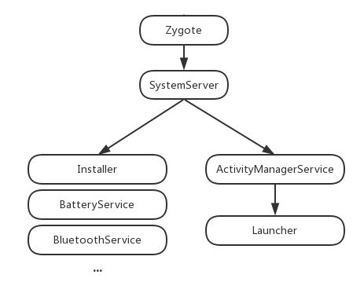

# Lachuner3

Launcher 启动

我们知道SystemServer进程主要用于启动系统的各种服务，其中就包含了Launcher服务，LauncherAppService。


当zygote 启动斯通各个服务时，会启动launcher服务


```
 private void startOtherServices() {
  ...
  //1
  mActivityManagerService.systemReady(new Runnable() {
            @Override
            public void run() {
                /**
                 * 执行各种SystemService的启动方法，各种SystemService的systemReady方法...
                 */
                Slog.i(TAG, "Making services ready");
                mSystemServiceManager.startBootPhase(SystemService.PHASE_ACTIVITY_MANAGER_READY);
  ...
  }
...
}
```


```
public void systemReady(final Runnable goingCallback) {
        ...
            // Start up initial activity.
            mBooting = true;
            // Enable home activity for system user, so that the system can always boot
            if (UserManager.isSplitSystemUser()) {
                ComponentName cName = new ComponentName(mContext, SystemUserHomeActivity.class);
                try {
                    AppGlobals.getPackageManager().setComponentEnabledSetting(cName, PackageManager.COMPONENT_ENABLED_STATE_ENABLED, 0, UserHandle.USER_SYSTEM);
                } catch (RemoteException e) {
                    throw e.rethrowAsRuntimeException();
                }
            }
            startHomeActivityLocked(currentUserId, "systemReady");  //1
        ...
    }
```

```
    boolean startHomeActivityLocked(int userId, String reason) {
        if (mFactoryTest == FactoryTest.FACTORY_TEST_LOW_LEVEL && mTopAction == null) {  //1
            // We are running in factory test mode, but unable to find
            // the factory test app, so just sit around displaying the
            // error message and don't try to start anything.
            return false;
        }
        Intent intent = getHomeIntent();  //2
        ActivityInfo aInfo = resolveActivityInfo(intent, STOCK_PM_FLAGS, userId);
        if (aInfo != null) {
            intent.setComponent(new ComponentName(aInfo.applicationInfo.packageName, aInfo.name));
            // Don't do this if the home app is currently being
            // instrumented.
            aInfo = new ActivityInfo(aInfo);
            aInfo.applicationInfo = getAppInfoForUser(aInfo.applicationInfo, userId);
            ProcessRecord app = getProcessRecordLocked(aInfo.processName, aInfo.applicationInfo.uid, true);
            if (app == null || app.instrumentationClass == null) {
                intent.setFlags(intent.getFlags() | Intent.FLAG_ACTIVITY_NEW_TASK);
                mActivityStarter.startHomeActivityLocked(intent, aInfo, reason); //3
            }
        } else {
            Slog.wtf(TAG, "No home screen found for " + intent, new Throwable());
        }

        return true;
    }
```


```
    Intent getHomeIntent() {
        Intent intent = new Intent(mTopAction, mTopData != null ? Uri.parse(mTopData) : null); //1
        intent.setComponent(mTopComponent);
        intent.addFlags(Intent.FLAG_DEBUG_TRIAGED_MISSING);
        if (mFactoryTest != FactoryTest.FACTORY_TEST_LOW_LEVEL) {
            intent.addCategory(Intent.CATEGORY_HOME); //2
        }
        return intent;
    }
```


```
    void startHomeActivityLocked(Intent intent, ActivityInfo aInfo, String reason) {
        mSupervisor.moveHomeStackTaskToTop(HOME_ACTIVITY_TYPE, reason);
        startActivityLocked(null /*caller*/, intent, null /*ephemeralIntent*/,
                null /*resolvedType*/, aInfo, null /*rInfo*/, null /*voiceSession*/,
                null /*voiceInteractor*/, null /*resultTo*/, null /*resultWho*/,
                0 /*requestCode*/, 0 /*callingPid*/, 0 /*callingUid*/, null /*callingPackage*/,
                0 /*realCallingPid*/, 0 /*realCallingUid*/, 0 /*startFlags*/, null /*options*/,
                false /*ignoreTargetSecurity*/, false /*componentSpecified*/, null /*outActivity*/,
                null /*container*/, null /*inTask*/);
        if (mSupervisor.inResumeTopActivity) {
            // If we are in resume section already, home activity will be initialized, but not
            // resumed (to avoid recursive resume) and will stay that way until something pokes it
            // again. We need to schedule another resume.
            mSupervisor.scheduleResumeTopActivities();  //1
        }
    }
```





### 详解


LauncherModel：从名字我们可以看出他跟数据有关系的，保存了桌面运行时的状态信息，也提供了读写数据库的API，他有一个内部类LoaderTask，桌面启动从数据库中读取数据并把图标和小工具添加上去的时候用的就是他。

BubblTextView：图标都是基于他，不过奇怪的是，他是继承自TextView，我之前一直以为是一个线性布局，上面放图片，下面放文字。

DragController：DragLayer只是一个ViewGroup，具体的拖拽的处理都放到了DragController中。

LauncherAppState：单例模式，主要在启动的时候用，他初始化了一些对象，并且注册了广播监听器和ContentObserver。

DragView：在拖动图标的时候跟随手指移动的View就是他。

DragSource，DropTarget：跟拖拽相关的接口，DragSource表示图标从哪里被拖出来，DropTarget表示图标可以被拖到哪里去。

Folder：文件夹打开时候那个view。

FolderIcon： 文件夹图标。

LauncherProvider：数据库类，Launcher3使用了SQLite，数据库文件保存在/data/data/包名/databases/launcher.db 下，有兴趣的同学可以把这个东西拷贝出来，用SQLite的工具看看里面都是怎么保存的。

ItemInfo：运行时保存了桌面上每个项目的信息，包括图标在第几屏，第几行第几列，高度宽度等信息，每一个ItemInfo对象都对应着数据库中的一条记录。在Launcher3源码路径下，会有很多以Info结尾的类，这些类都是ItemInfo的子类，具体代表了桌面上的某个项目。比如说FolderIcon和FolderInfo是对应的，BubbleTextView和ShortcutInfo是对应的，AppWidgetHostView和LauncherAppWidgetInfo是对应的。有了对应关系，可以这样通过view获取ItemInfo对象：

```
ItemInfo info = (ItemInfo)bubbletextview.getTag();
```


这样这里的info其实就是ShortcutInfo对象了。


### 初始化


