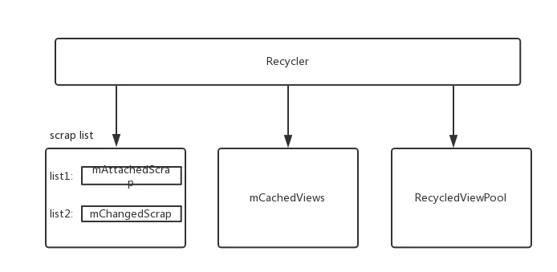

# LayoutManager

我们知道，在使用RecyclerView的时候，必须要set一个LayoutManager才能正常显示数据，因为RecyclerView把Item都交给它来layout了，没有layout，肯定是看不到了。

既然自定义LayoutManager也需要layout，那它跟我们平时熟悉的自定义ViewGroup又有什么不同之处呢？

###### 测量
首先，我们平时在自定义ViewGroup的时候，测量子View是在onMeasure方法中统一测量的；
而在自定义LayoutManager中，子View是当需要layout的时候才测量，LayoutManager已经提供了两个方法给我们直接调用了：

    measureChild(View child, int widthUsed, int heightUsed)
    measureChildWithMargins(View child, int widthUsed, int heightUsed)

这两个方法都可以测量子View，不同的是第二个方法会把Item设置的Margin也考虑进去，所以如果我们的LayoutManager需要支持Margin属性的话，就用第二个了。

在Item测量完之后，我们就可以获取到Item的尺寸了，但这里并不推荐直接用getMeasuredWidth或getMeasuredHeight方法来获取，而是建议使用这两个：

    getDecoratedMeasuredWidth(View child)
    getDecoratedMeasuredHeight(View child)

这两个方法是LayoutManager提供的，其实它们内部也是会调用child的getMeasuredWidth或getMeasuredHeight的，只是在返回的时候，会考虑到Decorations的大小，并根据Decorations的尺寸对应的放大一点，所以如果我们有设置ItemDecorations的话，用这两个方法得到的尺寸往往会比直接调用getMeasuredWidth或getMeasuredHeight方法大就是这个原因了。看下源码：

    public int getDecoratedMeasuredWidth(View child) {
        final Rect insets = ((RecyclerView.LayoutParams) child.getLayoutParams()).mDecorInsets;
        return child.getMeasuredWidth() + insets.left + insets.right;
    }
    public int getDecoratedMeasuredHeight(View child) {
        final Rect insets = ((RecyclerView.LayoutParams) child.getLayoutParams()).mDecorInsets;
        return child.getMeasuredHeight() + insets.top + insets.bottom;
    }

可以看到，它们在返回的时候，还加上了Decoration对应方向的值

###### 布局

###### 在自定义ViewGroup的时候，我们会重写onLayout方法，并在里面去遍历子View，然后调用子View的layout方法来进行布局，
但在LayoutManager里对Item进行布局时，也是不推荐直接使用layout方法，建议使用：

    layoutDecorated(View child, int left, int top, int right, int bottom)
    layoutDecoratedWithMargins(View child, int left, int top, int right, int bottom)

这两个方法也是LayoutManager提供的，我们使用layoutDecorated方法的话，它会给ItemDecorations腾出位置，来看下源码就明白了：

    public void layoutDecorated(View child, int left, int top, int right, int bottom) {
        final Rect insets = ((LayoutParams) child.getLayoutParams()).mDecorInsets;
        child.layout(left + insets.left, top + insets.top, right - insets.right,
                bottom - insets.bottom);
    }

emmm，在layout的时候，的确是考虑到Decoration的大小，并把child的尺寸对应地缩小了一下。

而下面layoutDecoratedWithMargins方法，相信同学们看方法名就已经知道了，没错，这个方法就是在layoutDecorated的基础上，把Item设置的Margin也应用进去:

    public void layoutDecoratedWithMargins(View child, int left, int top, int right, int bottom) {
        final RecyclerView.LayoutParams lp = (RecyclerView.LayoutParams) child.getLayoutParams();
        final Rect insets = lp.mDecorInsets;
        child.layout(left + insets.left + lp.leftMargin, top + insets.top + lp.topMargin,
                right - insets.right - lp.rightMargin,
                bottom - insets.bottom - lp.bottomMargin);
    }
哈哈，太方便了，不用我们自己去计算加加减减。
不止这些，LayoutManager还提供了getDecoratedXXX等一系列方法，有了这些方法，我们就可以跟ItemDecorations无缝配合，打造出我们想要的任何效果。

#### 自定义LayoutManager基本流程

在自定义ViewGroup中，想要显示子View，无非就三件事：

**添加** 通过addView方法把子View添加进ViewGroup或直接在xml中直接添加；
**测量** 重写onMeasure方法并在这里决定自身尺寸以及每一个子View大小；
**布局** 重写onLayout方法，在里面调用子View的layout方法来确定它的位置和尺寸；

其实在自定义LayoutManager中，在流程上也是差不多的，我们需要重写onLayoutChildren方法，这个方法会在初始化或者Adapter数据集更新时回调，在这方法里面，需要做以下事情：

1. 进行布局之前，我们需要调用detachAndScrapAttachedViews方法把屏幕中的Items都分离出来，内部调整好位置和数据后，再把它添加回去(如果需要的话)；

2. 分离了之后，我们就要想办法把它们再添加回去了，所以需要通过addView方法来添加，那这些View在哪里得到呢？ 我们需要调用 Recycler的getViewForPosition(int position) 方法来获取；

3. 获取到Item并重新添加了之后，我们还需要对它进行测量，这时候可以调用measureChild或measureChildWithMargins方法，两者的区别我们已经了解过了，相信同学们都能根据需求选择更合适的方法；

4. 在测量完还需要做什么呢？ 没错，就是布局了，我们也是根据需求来决定使用layoutDecorated还是layoutDecoratedWithMargins方法；

5. 在自定义ViewGroup中，layout完就可以运行看效果了，但在LayoutManager还有一件非常重要的事情，就是回收了，我们在layout之后，还要把一些不再需要的Items回收，以保证滑动的流畅度；

   

**回收**

Recycleview的回收任务是交给一个内部类：Recycler来负责的。一般情况下，他有4个存放回收Holder的集合。

可直接重用的临时缓存： mAttachedScrap，mChangedScrap

可直接重用的缓存： mCachedViews

需要重新绑定数据的缓存： mRecyclerPool.mScrap

###########################

*为什么说前面两个是临时缓存呢？*
*因为每当RecyclerView的dispatchLayout方法结束之前（当调用RecyclerView的reuqestLayout方法或者调用Adapter的一系列notify方法会回调这个dispatchLayout），它们里面的Holder都会移动到mCachedViews或mRecyclerPool.mScrap中。*

*那为什么有两个呢？它们之间有什么区别吗？*
*它们之间的区别就是：mChangedScrap只能在预布局状态下重用，因为它里面装的都是即将要放到mRecyclerPool中的Holder，而mAttachedScrap则可以在非预布局状态下重用。*

*什么是预布局(PreLayout)？*
*顾名思义，就是在真正布局之前，事先布局一次。但在预布局状态下，应该把已经remove掉的Item也layout出来，我们可以通过ViewHolder的LayoutParams.isViewRemoved()方法来判断这个ViewHolder是否已经被remove掉。*
*只有在Adapter的数据集更新时，并且调用的是除notifyDataSetChanged以外的一系列notify方法，预布局才会生效。这也是为什么调用notifyDataSetChanged方法不会播放Item动画的原因了。*
*这个其实有点像我们加载Bitmap的操作：先设置只读边，等获取到图片尺寸后设置好缩放比例再真正把图片加载进来。*
*要开启预布局的话，需要重写LayoutManager中的supportsPredictiveItemAnimations方法并return true; 这样就能生效了(当然，自带的那三个LayoutManager已经是开启了这个效果的)，当Adapter的数据集更新时，onLayoutChildren方法就会回调两次，第一次是预布局，第二次是真实的布局，我们也可以通过state.isPreLayout() 来判断当前是否为预布局状态，并根据这个状态来决定要layout的Item。*

