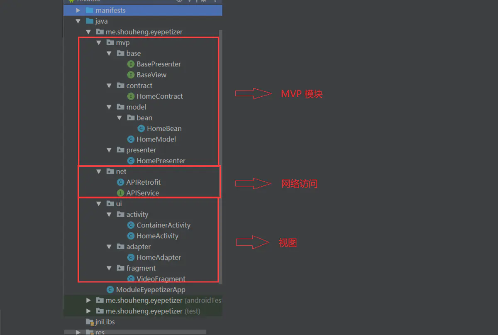

系统架构

mvc,mvp,mvvm

是三种常用的架构设计模式，当前mvp,mvvm 的使用比较广泛。当然mvc 也不是过时之说。

而所谓的组件化是指将应用根据业务需求划分成各个模块来进行开发。每个模块又可以编译成独立的app进行开发，理论上讲，组件化和前面的三种架构设计不是一个层次的，他们之间的关系是：组件化的各个组件可以使用上面三种架构设计模式。

我们只有了解这些架构设计的特点之后，才能在进行开发的时候选择适合自己项目的架构模式。


### mvc

model -view - controller  (模型 视图 控制器) 

标准的mvc是这个样子

模型层 (Model)：业务逻辑对应的数据模型，无View无关，而与业务相关；

视图层 (View)：一般使用XML或者Java对界面进行描述；

控制层 (Controllor)：在Android中通常指Activity和Fragment，或者由其控制的业务类。

activity并非标准的controller, 它一方面控制了布局，另一方面还要在activity中写业务代码，造成了activity既像view 又像controller


### mvp

MVP (Model-View-Presenter) 是MVC的演化版本，几个主要部分如下：

- 模型层 (Model)：主要提供数据存取功能。
- 视图层 (View)：处理用户事件和视图。在Android中，可能是指Activity、Fragment或者View。
- 展示层 (Presenter)：负责通过Model存取书数据，连接View和Model，从Model中取出数据交给View。



这里核心的代码是MVP部分。

这里我们首先定义了MVP模式中的最顶层的View和Presenter，在这里分别是`BaseView`和`BasePresenter`，它们在该项目中是两个空的接口，在一些项目中，我们可以根据自己的需求在这两个接口中添加自己需要的方法。

然后，我们定义了`HomeContract`。它是一个抽象的接口，相当于一层协议，用来规定指定的功能的View和Presenter分别应该具有哪些方法。通常，对于不同的功能，我们需要分别实现一个MVP，每个MVP都会又一个对应的Contract。笔者认为它的好处在于，将指定的View和Presenter的接口定义在一个接口中，更加集中。它们各自需要实现的方法也一目了然地展现在了我们面前。


从上面我们可以看出，在Presenter需要将View和Model建立联系。我们需要在初始化的时候传入View，并实例化一个Model。Presenter通过Model获取数据，并在拿到数据的时候，通过View的方法通知给View层。


```
2.3 MVC 和 MVP 的区别
MVC 中是允许 Model 和 View 进行交互的，而MVP中，Model 与 View 之间的交互由Presenter完成；
MVP 模式就是将 P 定义成一个接口，然后在每个触发的事件中调用接口的方法来处理，也就是将逻辑放进了 P 中，需要执行某些操作的时候调用 P 的方法就行了。
2.4 MVP的优缺点
优点：

降低耦合度，实现了 Model 和 View 真正的完全分离，可以修改 View 而不影响 Modle；
模块职责划分明显，层次清晰；
隐藏数据；
Presenter 可以复用，一个 Presenter 可以用于多个 View，而不需要更改 Presenter 的逻辑；
利于测试驱动开发，以前的Android开发是难以进行单元测试的；
View 可以进行组件化，在MVP当中，View 不依赖 Model。
缺点：

Presenter 中除了应用逻辑以外，还有大量的 View->Model，Model->View 的手动同步逻辑，造成 Presenter 比较笨重，维护起来会比较困难；
由于对视图的渲染放在了 Presenter 中，所以视图和 Presenter 的交互会过于频繁；
如果 Presenter 过多地渲染了视图，往往会使得它与特定的视图的联系过于紧密，一旦视图需要变更，那么Presenter也需要变更了。
```


### mvvm

MVVM 是 Model-View-ViewModel 的简写。它本质上就是 MVC 的改进版。MVVM 就是将其中的 View 的状态和行为抽象化，让我们将视图 UI 和业务逻辑分开。

- 模型层 (Model)：负责从各种数据源中获取数据；
- 视图层 (View)：在 Android 中对应于 Activity 和 Fragment，用于展示给用户和处理用户交互，会驱动 ViewModel 从 Model 中获取数据；
- ViewModel 层：用于将 Model 和 View 进行关联，我们可以在 View 中通过 ViewModel 从 Model 中获取数据；当获取到了数据之后，会通过自动绑定，比如 DataBinding，来将结果自动刷新到界面上。

使用 Google 官方的 Android Architecture Components ，我们可以很容易地将 MVVM 应用到我们的应用中。下面，我们就使用它来展示一下 MVVM 的实际的应用。你可以在[Github](https://links.jianshu.com/go?to=https%3A%2F%2Fgithub.com%2FShouheng88%2FAndroid-references)中获取到它的源代码。

```
我认为是在model里面处理数据比如获取接口返回的数据，在ViewModel里面处理业务逻辑。我认为MVVM的viewmodel就像MVP的presenter，model和MVP的model一样，变的只是没了MVP的view接口定义。而是以databinding的方式将presenter里面调用view接口的部分给取代了，presenter就不需要管view了，只需要管model了，接口变少了，也不要关注view变动和数据变动之间的影响了。view和数据的交互由databinding给做了。
```

