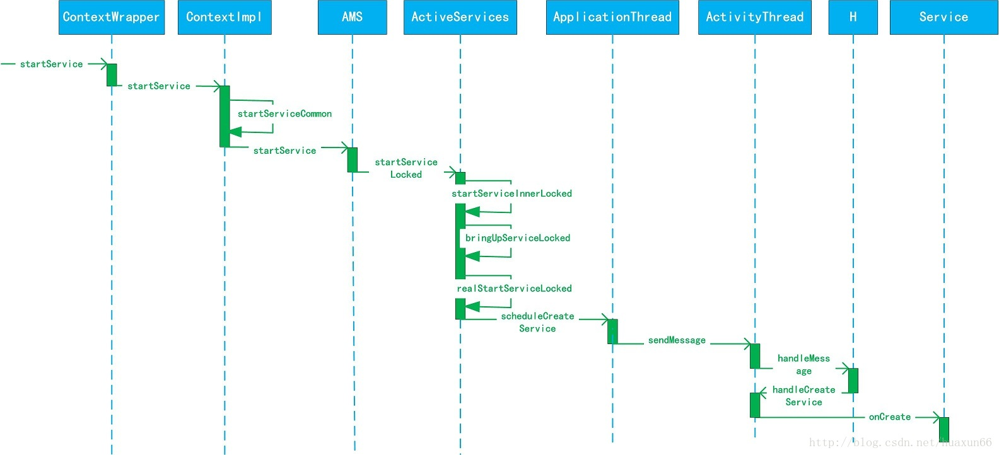

四大组件启动

#### Service启动过程

要启动Service,我们就会启动startService 方法，它实现在ContextWrapper中。

**ContextWrapper#startService()**

```
    Context mBase;

    @Override
    public ComponentName startService(Intent service) {
        return mBase.startService(service); //1
    }
```

> mBase具体指向就是ContextImpl


> 因为在这之前的performLauncherActivity() 中有一句代码
>
> ```
>  ActivityThread#performLaunchActivity()
>  ······
>  if (activity != null) {
>                 Context appContext = createBaseContextForActivity(r, activity); //
>    ······
>    
>  ActivityThread#createBaseContextForActivity()   
>  ······
>  
>  ContextImpl appContext = ContextImpl.createActivityContext(
>             this, r.packageInfo, r.token, displayId, r.overrideConfig); //1            ······
> ```


返回刚才启动服务函数，继mBase.startService方法之后，就是ContextImpl的startService 方法。

```
    @Override
    public ComponentName startService(Intent service) {
        warnIfCallingFromSystemProcess();
        return startServiceCommon(service, mUser);
    }
```

```
    private ComponentName startServiceCommon(Intent service, UserHandle user) {
        try {
            validateServiceIntent(service);
            service.prepareToLeaveProcess(this);
            //1
            ComponentName cn = ActivityManagerNative.getDefault().startService(
                mMainThread.getApplicationThread(), service, service.resolveTypeIfNeeded(
                            getContentResolver()), getOpPackageName(), user.getIdentifier());
            ...
            return cn;
        } catch (RemoteException e) {
            throw e.rethrowFromSystemServer();
        }
    }
```

同样的使用到了Binder机制。 最后其实调用了Ams的startService方法。

```
    @Override
    public ComponentName startService(IApplicationThread caller, Intent service,
            String resolvedType, String callingPackage, int userId)
            throws TransactionTooLargeException {
        ...
        synchronized(this) {
            final int callingPid = Binder.getCallingPid();
            final int callingUid = Binder.getCallingUid();
            final long origId = Binder.clearCallingIdentity();
            ComponentName res = mServices.startServiceLocked(caller, service,
                    resolvedType, callingPid, callingUid, callingPackage, userId); //1
            Binder.restoreCallingIdentity(origId);
            return res;
        }
    }
```

**ActivityManagerService#startService()** ---> **ActiveServices#startServiceLocked()** --->**ActiveServices#startServiceInnerLocked()** --->**ActiveServices#bringUpServiceLocked()**

```
  private String bringUpServiceLocked(ServiceRecord r, int intentFlags, boolean execInFg,
            boolean whileRestarting, boolean permissionsReviewRequired)
            throws TransactionTooLargeException {
...
  final String procName = r.processName;//1
  ProcessRecord app;
  if (!isolated) {
            app = mAm.getProcessRecordLocked(procName, r.appInfo.uid, false);//2
            if (DEBUG_MU) Slog.v(TAG_MU, "bringUpServiceLocked: appInfo.uid=" + r.appInfo.uid
                        + " app=" + app);
            if (app != null && app.thread != null) {//3
                try {
                    app.addPackage(r.appInfo.packageName, r.appInfo.versionCode,
                    mAm.mProcessStats);
                    realStartServiceLocked(r, app, execInFg);//4
                    return null;
                } catch (TransactionTooLargeException e) {
                    throw e;
                } catch (RemoteException e) {
                    Slog.w(TAG, "Exception when starting service " + r.shortName, e);
                }
            }
        } else {
            app = r.isolatedProc;
        }
 if (app == null && !permissionsReviewRequired) {//5
            if ((app=mAm.startProcessLocked(procName, r.appInfo, true, intentFlags,
                    "service", r.name, false, isolated, false)) == null) {//6
              ...
            }
            if (isolated) {
                r.isolatedProc = app;
            }
        }
 ...     
}
```

> 注释1处得到ServiceRecord的processName的值赋值给procName ，其中ServiceRecord用来描述Service的android:process属性。
>
> 注释2处将procName和Service的uid传入到AMS的getProcessRecordLocked方法中，来查询是否存在一个与Service对应的ProcessRecord类型的对象app，ProcessRecord主要用来记录运行的应用程序进程的信息。
>
> 注释5处判断Service对应的app为null则说明用来运行Service的应用程序进程不存在，则调用注释6处的AMS的startProcessLocked方法来创建对应的应用程序进程
>
> 注释3处表示Service的应用程序进程已经存在，则执行注释4的realStartServiceLocked方法。

**ActiveServices#realStartServiceLocked()**

```
private final void realStartServiceLocked(ServiceRecord r,
        ProcessRecord app, boolean execInFg) throws RemoteException {
   ...
    try {
       ...
        //1
        app.thread.scheduleCreateService(r, r.serviceInfo,
                mAm.compatibilityInfoForPackageLocked(r.serviceInfo.applicationInfo),
                app.repProcState);
        r.postNotification();
        created = true;
    } catch (DeadObjectException e) {
      ...
    } 
    ...
}
```

> 注释1调用了app.thread的scheduleCreateService方法。其中app.thread是IApplicationThread类型的，它的实现是ActivityThread的内部类ApplicationThread，其中ApplicationThread继承了ApplicationThreadNative，而ApplicationThreadNative继承了Binder并实现了IApplicationThread接口。

ActivityThread启动service

**ApplicationThread#scheduleCreateService()**

```
        public final void scheduleCreateService(IBinder token,
                ServiceInfo info, CompatibilityInfo compatInfo, int processState) {
            updateProcessState(processState, false);
            CreateServiceData s = new CreateServiceData(); //1
            s.token = token;
            s.info = info;
            s.compatInfo = compatInfo;

            sendMessage(H.CREATE_SERVICE, s); //2
        }
```

**ApplicationThread#sendMessage()**  --- >**ActivityThread.H.handleMessage()**

```
 private class H extends Handler {
        public static final int CREATE_SERVICE          = 114;
  ...

  public void handleMessage(Message msg) {
            if (DEBUG_MESSAGES) Slog.v(TAG, ">>> handling: " + codeToString(msg.what));
            switch (msg.what) {
                case CREATE_SERVICE:
                    Trace.traceBegin(Trace.TRACE_TAG_ACTIVITY_MANAGER, ("serviceCreate: " + String.valueOf(msg.obj)));
                    handleCreateService((CreateServiceData)msg.obj);
                    Trace.traceEnd(Trace.TRACE_TAG_ACTIVITY_MANAGER);
                    break;
                 ...
  } 
```

**ActivityThread#handleCreateService()**

```
    private void handleCreateService(CreateServiceData data) {

        LoadedApk packageInfo = getPackageInfoNoCheck(
                data.info.applicationInfo, data.compatInfo);  //1
        Service service = null;
        try {
            java.lang.ClassLoader cl = packageInfo.getClassLoader();  //2
            service = (Service) cl.loadClass(data.info.name).newInstance();  //3
        } catch (Exception e) {
            ...
        }

        try {
            ContextImpl context = ContextImpl.createAppContext(this, packageInfo);  //4
            context.setOuterContext(service);

            Application app = packageInfo.makeApplication(false, mInstrumentation);  //5
            service.attach(context, this, data.info.name, data.token, app,
                    ActivityManagerNative.getDefault());  //6
            service.onCreate();  //7
            mServices.put(data.token, service);  //8
            ...
        }
    }
```

注释1处获取要启动Service的应用程序的LoadedApk，LoadedApk是一个APK文件的描述类。
注释2处通过调用LoadedApk的getClassLoader方法来获取类加载器。
注释3处根据CreateServiceData对象中存储的Service信息，通过反射创建service实例。
注释4处创建Service的上下文环境ContextImpl对象。
注释5处获取当前应用的Application对象，该对象的唯一作用就是作为参数传递到Service里，然后在Service类中可以获得调用getApplication方法来获取Application对象。
注释6处调用Service的attach方法初始化Service，将ContextImpl对象注册到对应的Service中，之后在Service类中就可以使用Context的所有功能了。
注释7处调用Service的onCreate方法，这样Service就启动了。
注释8处将启动的Service加入到ActivityThread的成员变量mServices中，其中mServices是ArrayMap类型。

最后看看Service的启动时序图：




------


####  Broadcast的注册、发送和接收过程


    @Override
    public Intent registerReceiver(
        BroadcastReceiver receiver, IntentFilter filter) {
        return mBase.registerReceiver(receiver, filter);
    }


