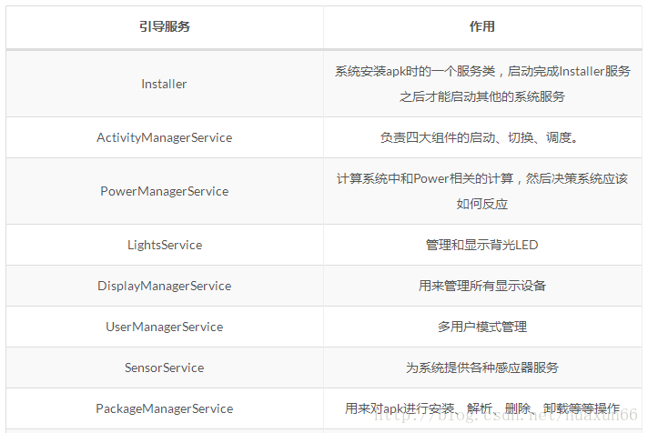
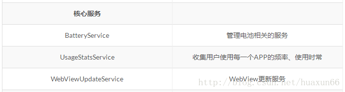
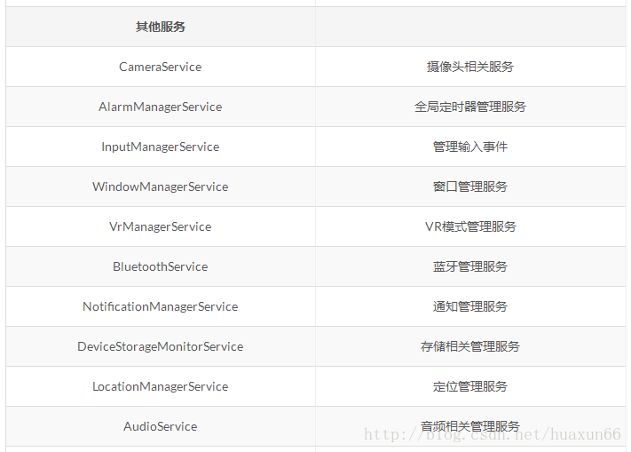
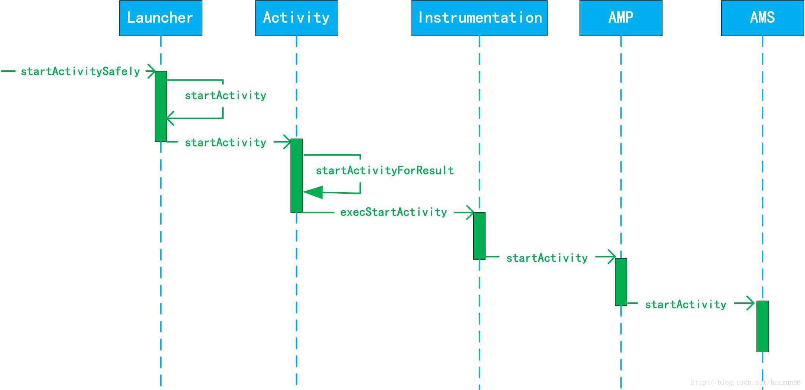
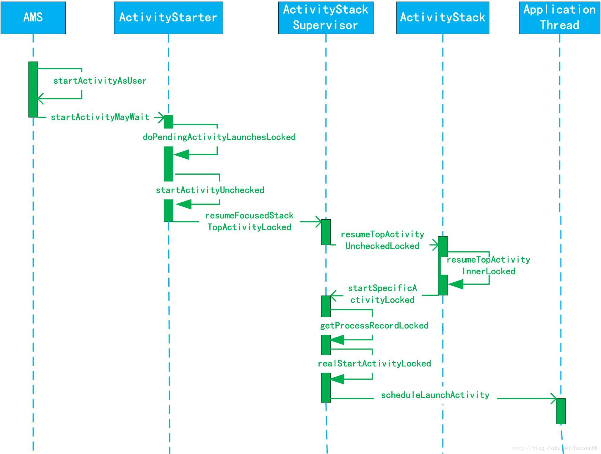
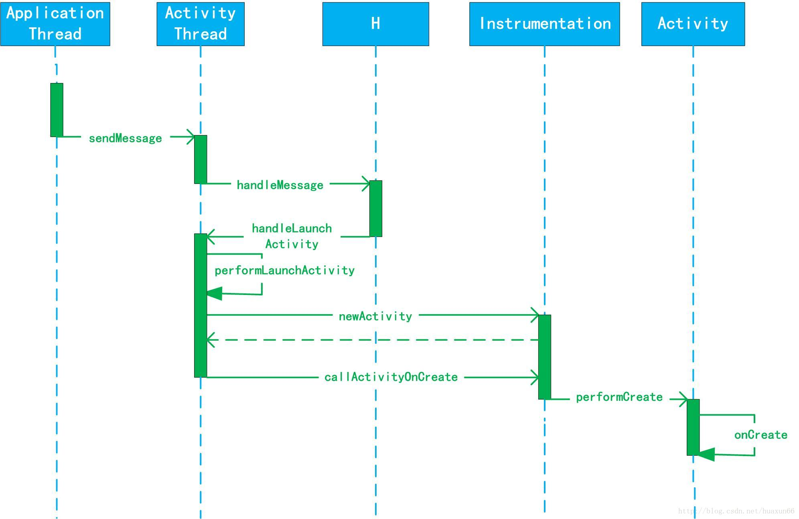
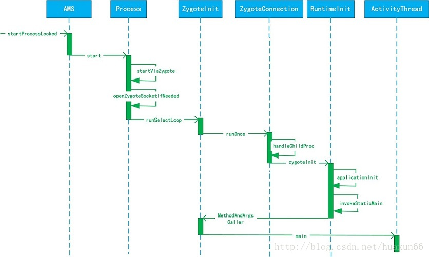

[TOC]

### Init

`system/core/init/init.cpp`

```
//对属性服务进行初始化
property_ ini t () ; / / l

//用于设置子进程信号处理函数，如果子进程（ Zygote 进程）异常退出， in it 进程会调用该函数中定
//的信号处理函数来进行处理
si ial_handler_ ini t () ; / /2

//启动 属性服务
start_property_service(); // 3

／／解析 init rc 配置文件
parser.ParseConfig (”/init.rc") ;//4

／／重启死去的进程
restart_yrocesses (); //5
```

>init 的main 函数做了很多事情，比较复杂。我们只需要关注主要的几点就行。在开始的时候 创建和挂在启动所需的文件目录，其中挂在了tmpfs,devpts,proc,sysfs和selinuxfs 共5种文件系统。
>
>property_init函数对属性进行初始化。并在注释三处进行启动属性服务。在煮熟2 处掉哦用signal_handler_init函数用于设置子进程信号处理函数（system/core/init/signal_handler.cpp），主要防止init 进程的子进程成为僵尸进程。为了防止僵尸进程的出现，系统在子进程暂停和终止的时候发出SIGCHILD信号，而signal_handler_init函数就是用来接受该信号的，其内部只处理进程终止的SIGCHLD信号。
>
>假设init 进程的子进程Zygote终止了，signal_handler_init函数回调用handle_signal函数。经过层层的函数调用和处理。最终回找到Zygote进程并移除所有的Zygote进程的信息。再重启Zygote服务的启动脚本中带有onrestart选项的服务。至于Zygote进程本身会再注释的5处被重启。这里只是拿Zygote进程举个例子。其他init进程子进程的远离也是类似。

### Service


`system/core/init!service.cpp `

> init.rc中的Action类型语句和service类型语句都有相应的类来判断进行解析。Action类型语句都有相应的类来解析。Service类型语句采用ServiceParser来解析，ServiceParser 会用到两个函数：一个是`ParseSection`,它会解析Servie.rc文件，搭建Service的架子，另一个是`ParseLineSection`用于解析子项

```
bool ServiceParser: :ParseSection(const std :: vector<std: :string>& args,
                std :: string* err) {
            if (args.size() < 3) ｛／／判断 Service 是否有 name 与可执行程序
                    *err =”services must have a name and a program” J
            return false ;
            canst std : str ng& name= args[l) ;
            if (!I sVal dName (name)) ｛／／检查 Service name 是否有效
            err= StringPrintf (” invalid service name ’”， name. c str () ) ;
            return false ;
            std :: vector<std ::string> str_args (args .begin() + 2 , args . end()) ;
            // 核心
            service_ = std: :make_unique<Service> (name, str args); //1 
            return true ;
        }
```

```
bool ServiceParser::ParseLineSection(con st std : :vector<std : :string > & args, 
		const std: :string & filename nt line,
        std: :string * err) const{
            retur service ?service - > ParseLine(args, err) :false;
        }
```

> 注释1处会狗仔一个Service对象。它的classname为default,在解析完所有数据后，会调用EndSection函数。

```
void ServiceParser::EndSection() { 
	if (service ) { 
		ServiceManager: :Getinstance () .AddService (std: :move (serv ce ) );
	}
}
```

```
void ServiceManager : :AddService(std : :unique ptr<Service> service) { 
Service* ol d service= FindServiceByName(service- >name ()) ; 
    if (old service) { 
    LOG (ERROR) < ” ignored duplicate def nit on of service ”’ service name()
    < ””’;
    return; 
    }
    services . emplace back(std : :move(service)) ; //1 
}
```

> AddService中注释1的代码将service对象加入service链表中。上面service解析过程总体来讲就是根据参数创建处Service对象，然后根据所选项域内容填充Service对象，最后将service对象加入vector类型service链表中。

### Init 启动Zygote

在zygote的启动脚本中，我可以知道Zygote的classname 为main

`system/core/init/service.cpp `

```
bool Service : : Start () {
		／／如果子进程没有启动，则调用 fork 函数创建子进程
		pid_t pid =fork() ;//l 
		／／当前代码逻辑在子进程中运行
		if (pid = 0) {//2
			umask(077);
			／／调用 execve 函数 Service 子进程就会被启动
            if (execve(args_[O] .c_str(), (char**) &strs[O], (char**) ENV) < 0) {//3 
           		ERROR cannotexecve %s s\n ”， args [ 0] . c str () , strerror ( errno) ) ; } 
            	exit (127) ;
            }
		}
		
		···
		
		return true;

}
```

> 首先判断 Service 是否已经运行，如果运行则不再启动，直接返回 fa lse 。如果程序走到注释 1处，说明子进程还没有被启动，就 周用 fork 函数创建子进程，并返 pid 值，注释处如果 pid 值为0 ，则说明 前代码逻辑在 进程中运行。注释 处在3子进程中 周用 execve函数， Service 子进程就会被启动，并进入该 Service main 函数中，如果该 ServiceZygote,2.1.3 节末段的标注 处我们可知 Zygote 执行程序的路径为 system/bin/app_process64, 对应的文件为 app main.cpp ，这样就会进入 app main.cpp main 函数中，也就是Zygotemain 函数中，

`frameworks/base/cmds/app_process/app _main. cpp `

```
int main(){
	···
    if (zygote) { 
        runtime.start （吧。 android internal.os.Zygoteinit”， args, zygote) ; //l
    }
    ···
 }
```

> runtime的start启动Zygote


init 启动总结：

1. 创建和挂在启动所需的文件目录
2. 初始化和启动属性服务
3. 解析init.rc配置文件并启动Zygote进程 


### Zygote进程启动过程

> 系统中，dvm,art ,应用程序进程以及运行系统的关键服务的SystemServer进程都是由Zygote进程创建的，我们也称之为孵化器。它通过fock -复制进程的形式来创建应用程序进程和SystemServer进程。由于Zygote在启动时会创建dvm/art,因此通过fock的应用程序进程和SystemServer进程可以在内部获取一个dvm/art的实例副本。
>
> Zygote 进程是 in it 进程启动时创 的，起初 Zygote 进程的名称并不是叫＂zygote ”，而是叫飞pp_process ”，这个名称是在 Android mk 中定义的， Zygote 进程启动后， Linux 系统下的 petri 系统会调用 app_process ，将其名称换成了“zygote ”。

`frameworks/base/cmds/app_process/app _main. cpp `

```
int main (){
	···
	
	while(i<argc){
		if trcmp(arg ，” zygote ”） = 0) {//l 
            ／／如果当前运行在 Zygote 进程中，则将 zygote 设置为 true
            zygote= true;//2 
            ceName = ZYGOTE NICE NAME ; 
            } else if (strαnp(a呵，”－－ start-syst四－ se ·er ”） = 0) (//3 
            ／／如果当前运行在 SystemServer 进程中，则将 startSystemServer 设置为 true
            startSystemSe er= true;//4
         }
	}
	
	if	(zygote){
		runtime . start (” com.android.internal.os.Zygoteinit”, args, zygote) ;//6
	}
	
	···
}
```

调用 runtime start 函数启动 Zygote 

```
void AndroidRuntime::start(){
	···
	if (startVrn （缸nJavaVM, &env, zygote) != 0) {//l 
        return ; 
        }
     onVmCreated (env); 
     //为 Java 虚拟机注册 JNI 方法
     if (startReg (env) < 0) {//2 
        	ALOGE (” Unable to register all android natives\n " ); 
        	return;
      }
      //从 app ma ma 工口函数得知 className com.android. nternal.os Zygoteinit
      classNameStr = env->NewStringUTF(className);
	
	  // classNarne “． ”替换为“
      char* slashClassNarne = toSlashClassNarne(classN e) //4
      // 找到 Zygoteinit
      jclass startClass = env- >FindClass(slashClassNarne) ; //5
		
	  ···
	    //找到 Zygote it main 方法
        jrnethodID startMeth = env->GetStaticMethodID(startClass,”main”, ”( [Ljava/lang/String; )V") ; //6
	   //通过 JNI 调用 Zygoteinit main 方法
	    env->CallStaticVoidMethod(startClass, starMeth, strArray) ;//7
	  ···
	  
	···


}
```


### Zygote启动执行过程


`frameworks/base/core/java/com/android/internal/os/Zygotelnit.java `

```
void main (){
	try{
		//初始化准备jvm
        RuntimeInit.preForkInit();
		
		RuntimeInit.enableDdms(); // 启动ddms
		boolean startSystemServer = false;
        String socketName = "zygote";
        String abiList = null;
        //2
            for (int i = 1; i < argv.length; i++) {
                if ("start-system-server".equals(argv[i])) {
                    startSystemServer = true;
                } else if (argv[i].startsWith(ABI_LIST_ARG)) {
                    abiList = argv[i].substring(ABI_LIST_ARG.length());
                } else if (argv[i].startsWith(SOCKET_NAME_ARG)) {
                    socketName = argv[i].substring(SOCKET_NAME_ARG.length());
                } else {
                    throw new RuntimeException("Unknown command line argument: " + argv[i]);
                }
            }
        
		／／创建一个 Server 端的 Socket so cketName 的值为“zygote
		zygoteServer.registerSeverSocket(socketName);//l
		if	(!enableLazyPreLoad){
			···
			// 预加载相关类和资源
			preload(bootTimingsTrancsLod);
			···
		}
		
		if	(startSystemServer){
			／／启动 SystemServer 进程
			startSysternServer(abiList, socketNarne, zygoteServer);//3
		}
		
		// 等待ams请求
		zygoteServer.runSelectLoop(abiList);
		
		···
	}

}

```

> Zygotelnit 的main 方法:
>
> 1. 设置ddms
> 2. 注释2解析参数是否需要启动SystemService进程，获取abi列表，获取socket链接名称。
> 3.  registerZygoteSocket函数创建一个 Server 端的 Socket，name='zygote' .用来等待ActivityManagerService来请求Zygote来创建新的应用程序进程
> 4. preload预加载类和资源
> 5. 启动 SystemServer 进程。
> 6. runSelectLoop函数监听socket来等待客户端请求


**android系统中进程之间通讯的方式是Binder，但是有一个例外是SystemService进程与Zygote进程之间是通过Socket的方式进行通讯的**

**ZygoteInit#registerZygoteSocket()**

```
    private static void registerZygoteSocket(String socketName) {
        if (sServerSocket == null) {
            int fileDesc;
            final String fullSocketName = ANDROID_SOCKET_PREFIX + socketName;
            try {
                String env = System.getenv(fullSocketName);
                fileDesc = Integer.parseInt(env);
            } catch (RuntimeException ex) {
                throw new RuntimeException(fullSocketName + " unset or invalid", ex);
            }

            try {
                FileDescriptor fd = new FileDescriptor();
                fd.setInt$(fileDesc);
                //不是使用IP和端口、而是使用fd创建socket
                sServerSocket = new LocalServerSocket(fd); //1
            } catch (IOException ex) {
                throw new RuntimeException(
                        "Error binding to local socket '" + fileDesc + "'", ex);
            }
        }
    }
    
```


**ZygoteInit#preload()**

```
    static void preload() {
        beginIcuCachePinning();
        preloadClasses(); //加载所需的各种class文件
        preloadResources(); //加载资源文件
        preloadOpenGL(); //初始化OpenGL
        preloadSharedLibraries(); //加载系统Libraries
        preloadTextResources(); //加载文字资源
        // Ask the WebViewFactory to do any initialization that must run in the zygote process,
        // for memory sharing purposes.
        WebViewFactory.prepareWebViewInZygote(); //初始化WebView
        endIcuCachePinning();
        warmUpJcaProviders();
        Log.d(TAG, "end preload");
    }
```


**ZygoteInit#startSystemServer()**

```
private static boolean startSystemServer(String abiList, String socketName)
            throws MethodAndArgsCaller, RuntimeException {
        long capabilities = posixCapabilitiesAsBits(
            OsConstants.CAP_IPC_LOCK,
            OsConstants.CAP_KILL,
            OsConstants.CAP_NET_ADMIN,
            OsConstants.CAP_NET_BIND_SERVICE,
            OsConstants.CAP_NET_BROADCAST,
            OsConstants.CAP_NET_RAW,
            OsConstants.CAP_SYS_MODULE,
            OsConstants.CAP_SYS_NICE,
            OsConstants.CAP_SYS_RESOURCE,
            OsConstants.CAP_SYS_TIME,
            OsConstants.CAP_SYS_TTY_CONFIG
        );
        /* Containers run without this capability, so avoid setting it in that case */
        if (!SystemProperties.getBoolean(PROPERTY_RUNNING_IN_CONTAINER, false)) {
            capabilities |= posixCapabilitiesAsBits(OsConstants.CAP_BLOCK_SUSPEND);
        }
        /* Hardcoded command line to start the system server */
        /* 1 */
        String args[] = {
            "--setuid=1000",
            "--setgid=1000",
            "--setgroups=1001,1002,1003,1004,1005,1006,1007,1008,1009,1010,1018,1021,1032,3001,3002,3003,3006,3007,3009,3010",
            "--capabilities=" + capabilities + "," + capabilities,
            "--nice-name=system_server",
            "--runtime-args",
            "com.android.server.SystemServer",
        };
        ZygoteConnection.Arguments parsedArgs = null;

        int pid;

        try {
            /* 2 */
            parsedArgs = new ZygoteConnection.Arguments(args); 
            /** 打开系统调试属性*/
            ZygoteConnection.applyDebuggerSystemProperty(parsedArgs);
            ZygoteConnection.applyInvokeWithSystemProperty(parsedArgs);

            /* 3 重点 */  
            // 请求fork SystemServer进程
            pid = Zygote.forkSystemServer(
                    parsedArgs.uid, parsedArgs.gid,
                    parsedArgs.gids,
                    parsedArgs.debugFlags,
                    null,
                    parsedArgs.permittedCapabilities,
                    parsedArgs.effectiveCapabilities);
        } catch (IllegalArgumentException ex) {
            throw new RuntimeException(ex);
        }

        // pid为0表示子进程，即SystemServer进程，从此SystemServer进程与Zygote进程分道扬镳
        if (pid == 0) {
            if (hasSecondZygote(abiList)) {
                waitForSecondaryZygote(socketName);
            }
            handleSystemServerProcess(parsedArgs); //4
        }

        return true;
    }
```

**ZygoteInit#runSelectLoop()**

```
    private static void runSelectLoop(String abiList) throws MethodAndArgsCaller {
        ArrayList<FileDescriptor> fds = new ArrayList<FileDescriptor>();
        ArrayList<ZygoteConnection> peers = new ArrayList<ZygoteConnection>();

        fds.add(sServerSocket.getFileDescriptor()); //1
        peers.add(null);

        while (true) {
            StructPollfd[] pollFds = new StructPollfd[fds.size()];
            for (int i = 0; i < pollFds.length; ++i) {  //2
                pollFds[i] = new StructPollfd();
                pollFds[i].fd = fds.get(i);
                pollFds[i].events = (short) POLLIN;
            }
            try {
                Os.poll(pollFds, -1);
            } catch (ErrnoException ex) {
                throw new RuntimeException("poll failed", ex);
            }
            for (int i = pollFds.length - 1; i >= 0; --i) {  //3
                if ((pollFds[i].revents & POLLIN) == 0) {
                    continue;
                }
                if (i == 0) {
                    ZygoteConnection newPeer = acceptCommandPeer(abiList);  //4
                    peers.add(newPeer);
                    fds.add(newPeer.getFileDesciptor());
                } else {
                    boolean done = peers.get(i).runOnce();  //5
                    if (done) {
                        peers.remove(i);
                        fds.remove(i);
                    }
                }
            }
        }
    }
```

> 注释1处中的sServerSocket就是我们在registerZygoteSocket函数中创建的服务端Socket，调用sServerSocket.getFileDescriptor()用来获得该Socket的fd字段的值并添加到fd列表fds中。接下来无限循环用来等待ActivityManagerService请求Zygote进程创建新的应用程序进程。
> 注释2处通过遍历将fds存储的信息转移到pollFds数组中。
> 注释3处对pollFds进行遍历。
> 注释4如果i==0则说明服务端Socket与客户端连接上，也就是当前Zygote进程与ActivityManagerService建立了连接，则通过acceptCommandPeer函数得到ZygoteConnection类并添加到Socket连接列表peers中，接着将该ZygoteConnection的fd添加到fd列表fds中，以便可以接收到ActivityManagerService发送过来的请求。
> 注释5如果i的值大于0，则说明ActivityManagerService向Zygote进程发送了一个创建应用进程的请求，则调用ZygoteConnection的runOnce函数来创建一个新的应用程序进程。并在成功创建后将这个连接从Socket连接列表peers和fd列表fds中清除。

### Zygote进程总结

1. 初始化DDMS
2.  通过registerZygoteSocket函数创建服务端Socket
3. 加载class、resource、OpenGL、WebView等各种资源
4. fork并启动SystemServer进程
5. 调用runSelectLoop()一直监听Socket信息
6. fork并启动应用进程


### SystemServer启动

**ZygoteInit#startSystemServer()**

```
private static boolean startSystemServer(String abiList, String socketName) throws MethodAndArgsCaller, RuntimeException {
       ...

        int pid;
        try {
            parsedArgs = new ZygoteConnection.Arguments(args); 
            ZygoteConnection.applyDebuggerSystemProperty(parsedArgs);
            ZygoteConnection.applyInvokeWithSystemProperty(parsedArgs);

            /* 1 */
            // 请求fork SystemServer进程
            pid = Zygote.forkSystemServer(
                    parsedArgs.uid, parsedArgs.gid,
                    parsedArgs.gids,
                    parsedArgs.debugFlags,
                    null,
                    parsedArgs.permittedCapabilities,
                    parsedArgs.effectiveCapabilities);
        } catch (IllegalArgumentException ex) {
            throw new RuntimeException(ex);
        }

        // pid为0表示子进程，即SystemServer进程，从此SystemServer进程与Zygote进程分道扬镳
        if (pid == 0) {
            if (hasSecondZygote(abiList)) {
                waitForSecondaryZygote(socketName);
            }
            handleSystemServerProcess(parsedArgs); //2
        }

        return true;
   }
```

> 注释1处调用Zygote的forkSystemServer，主要通过fork函数在当前进程创建一个子进程(也就是SystemServer进程)，如果返回的pid 为0，也就是表示在新创建的子进程中执行的，则执行注释2处的handleSystemServerProcess，来看看handleSystemServerProcess是如何启动SystemServer进程的。

**ZygoteInit#handleSystemServerProcess()**

```
private static void handleSystemServerProcess(
            ZygoteConnection.Arguments parsedArgs)
            throws ZygoteInit.MethodAndArgsCaller {

        closeServerSocket();  //1

        if (parsedArgs.niceName != null) {
            Process.setArgV0(parsedArgs.niceName);  //2
        }

        ...

        if (parsedArgs.invokeWith != null) {
            String[] args = parsedArgs.remainingArgs;
            // If we have a non-null system server class path, we'll have to duplicate the
            // existing arguments and append the classpath to it. ART will handle the classpath
            // correctly when we exec a new process.
            if (systemServerClasspath != null) {
                String[] amendedArgs = new String[args.length + 2];
                amendedArgs[0] = "-cp";
                amendedArgs[1] = systemServerClasspath;
                System.arraycopy(parsedArgs.remainingArgs, 0, amendedArgs, 2, parsedArgs.remainingArgs.length);
            }

            WrapperInit.execApplication(parsedArgs.invokeWith,
                    parsedArgs.niceName, parsedArgs.targetSdkVersion,
                    VMRuntime.getCurrentInstructionSet(), null, args);
        } else {
            ClassLoader cl = null;
            if (systemServerClasspath != null) {
                cl = createSystemServerClassLoader(systemServerClasspath,
                                                   parsedArgs.targetSdkVersion);

                Thread.currentThread().setContextClassLoader(cl);
            }

            /*
             * Pass the remaining arguments to SystemServer.
             */
             
             // 启动systemServer
            RuntimeInit.zygoteInit(parsedArgs.targetSdkVersion, parsedArgs.remainingArgs, cl); //3
        }

        /* should never reach here */
    }
```

> 注释1处SyetemServer进程是复制了Zygote进程的地址空间，因此也会得到Zygote进程创建的Socket，这个Socket对于SyetemServer进程没有用处，所以调用closeServerSocket()关闭它。
> 注释2如果你看Arguments封装函数，会发现parsedArgs.niceName=system_server，在这里调用Process.setArgV0()设置进程名为：system_server。
> 注释3由于parsedArgs.invokeWith属性默认为null，最后调用RuntimeInit.zygoteInit来进一步启动SystemServer。


frameworks/base/core/java/com/android/internal/os/RuntimeInit.java

**RuntimeInit#zygoteInit()**

```
 public static final void zygoteInit(int targetSdkVersion, String[] argv, ClassLoader classLoader)
            throws ZygoteInit.MethodAndArgsCaller {
        if (DEBUG) Slog.d(TAG, "RuntimeInit: Starting application from zygote");

        Trace.traceBegin(Trace.TRACE_TAG_ACTIVITY_MANAGER, "RuntimeInit");
        // 重定向Log输出
        redirectLogStreams();
        //初始化运行环境
        commonInit();
        //启动Binder线程池
        nativeZygoteInit(); //1
        //调用程序入口函数
        applicationInit(targetSdkVersion, argv, classLoader); //2
    }
```

#### Binder线程池启动过程

> nativeZygoteInit --->AndroidRuntime.JNINativeMethod  
>
> ```
> static const JNINativeMethod gMethods[] = {
>     { "nativeFinishInit", "()V",
>         (void*) com_android_internal_os_RuntimeInit_nativeFinishInit },
>     { "nativeZygoteInit", "()V",
>         (void*) com_android_internal_os_RuntimeInit_nativeZygoteInit },
>     { "nativeSetExitWithoutCleanup", "(Z)V",
>         (void*) com_android_internal_os_RuntimeInit_nativeSetExitWithoutCleanup },
> };
> ```
>
> -->AndroidRuntime.com_android_internal_os_RuntimeInit_nativeZygoteInit()
>
> ```
> ...
> static AndroidRuntime* gCurRuntime = NULL;
> 
> AndroidRuntime::AndroidRuntime(char* argBlockStart, const size_t argBlockLength) :
>         mExitWithoutCleanup(false),
>         mArgBlockStart(argBlockStart),
>         mArgBlockLength(argBlockLength)
> {
>    ...
>     gCurRuntime = this;
> }
> 
> ...
> 
> static void com_android_internal_os_RuntimeInit_nativeZygoteInit(JNIEnv* env, jobject clazz)
> {
>     gCurRuntime->onZygoteInit();
> }
> ```
>
> 这里gCurRuntime是AndroidRuntime类型的指针，AndroidRuntime的子类AppRuntime在app_main.cpp中定义，我们来查看AppRuntime的onZygoteInit函数
>
> -->onZygoteInit()
>
> ```
> virtual void onZygoteInit()
>    {
>        sp<ProcessState> proc = ProcessState::self();
>        ALOGV("App process: starting thread pool.\n");
>        proc->startThreadPool();//1
>    }
> ```
>
> -->ProcessState.startThreadPool
>
> ```
> void ProcessState::startThreadPool()
> {
>     AutoMutex _l(mLock);
>     //1
>     if (!mThreadPoolStarted) {  
>         mThreadPoolStarted = true;
>         spawnPooledThread(true);
>     }
> }
> ```
>
> 支持Binder通信的进程中都有一个ProcessState类，它里面有一个mThreadPoolStarted 变量，来表示Binder线程池是否已经被启动过，默认值为false。在每次调用这个函数时都会先去检查这个标记，从而确保Binder线程池只会被启动一次。
> 注释1如果Binder线程池未被启动则设置mThreadPoolStarted为true，最后调用spawnPooledThread函数来创建线程池中的第一个线程，也就是线程池的main线程。
>
> -->ProcessState.spawnPooledThread()
>
> ```
> void ProcessState::spawnPooledThread(bool isMain)
> {
>     if (mThreadPoolStarted) {
>         String8 name = makeBinderThreadName();
>         ALOGV("Spawning new pooled thread, name=%s\n", name.string());
>         sp<Thread> t = new PoolThread(isMain);
>         t->run(name.string());//1
>     }
> }
> ```
>
> 可以看到Binder线程为一个PoolThread。注释1调用PoolThread的run函数来启动一个新的线程
>
> PoolThread
>
> ```
> class PoolThread : public Thread
> {
> ..
> protected:
>     virtual bool threadLoop()
>     {
>         IPCThreadState::self()->joinThreadPool(mIsMain);//1
>         return false;
>     }
>     const bool mIsMain;
> };
> ```
>
> PoolThread类继承了Thread类。注释1处会将调用IPCThreadState的joinThreadPool函数，将当前线程注册到Binder驱动程序中，这样我们创建的线程就加入了Binder线程池中，这样新创建的SyetemServer进程就支持Binder进程间通信了。


**RuntimeInit#applicationInit()**

```
 private static void applicationInit(int targetSdkVersion, String[] argv, ClassLoader classLoader)
            throws ZygoteInit.MethodAndArgsCaller {
        ...

        // 初始化虚拟机环境
        VMRuntime.getRuntime().setTargetHeapUtilization(0.75f);
        VMRuntime.getRuntime().setTargetSdkVersion(targetSdkVersion);

        final Arguments args;
        try {
            args = new Arguments(argv);
        } catch (IllegalArgumentException ex) {
            Slog.e(TAG, ex.getMessage());
            // let the process exit
            return;
        }

        // Remaining arguments are passed to the start class's static main
        invokeStaticMain(args.startClass, args.startArgs, classLoader); //1
    }
```


**RuntimeInit#invokeStaticMain()**

```
private static void invokeStaticMain(String className, String[] argv, ClassLoader classLoader) throws ZygoteInit.MethodAndArgsCaller {
        Class<?> cl;

        try {
            cl = Class.forName(className, true, classLoader); //1
        } catch (ClassNotFoundException ex) {
            throw new RuntimeException("Missing class when invoking static main " + className, ex);
        }

        Method m;
        try {
            // 获取main方法
            m = cl.getMethod("main", new Class[] { String[].class }); //2
        } catch (NoSuchMethodException ex) {
            throw new RuntimeException("Missing static main on " + className, ex);
        } catch (SecurityException ex) {
            throw new RuntimeException("Problem getting static main on " + className, ex);
        }
        // 判断修饰符
        int modifiers = m.getModifiers(); //3
        if (! (Modifier.isStatic(modifiers) && Modifier.isPublic(modifiers))) {
            throw new RuntimeException("Main method is not public and static on " + className);
        }

        /*
         * This throw gets caught in ZygoteInit.main(), which responds
         * by invoking the exception's run() method. This arrangement
         * clears up all the stack frames that were required in setting
         * up the process.
         */
        throw new ZygoteInit.MethodAndArgsCaller(m, argv); //4
    }
```

> 注释1处传入的className就是com.android.server.SystemServer ，因此通过反射返回的cl为SystemServer类。
>
> 注释2获取main方法 。
>
> 注释3判断修饰符，必须是static而且必须是public类型。
>
> 注释4有点意思，做完这一切之后，将找到的main函数传入到MethodAndArgsCaller异常中并抛出该异常。辛苦辛苦各种初始化，各种变着法的调用，最后你居然给我抛个异常！先别急，这个异常在ZygoteInit#main()方法中捕获。这么做的作用是清除应用程序进程创建过程的调用栈。


```
public static void main(String argv[]) {
    try {
        ...
        startSystemServer(abiList, socketName);
        ...
    } catch (MethodAndArgsCaller caller) {
        caller.run(); //1
    }
}
```

在zygoteinit的main 函数中，如果出现异常，就会调 MethodAndArgsCaller的run 方法

**MethodAndArgsCaller**

```
public static class MethodAndArgsCaller extends Exception
            implements Runnable {
        /** method to call */
        private final Method mMethod;

        /** argument array */
        private final String[] mArgs;

        public MethodAndArgsCaller(Method method, String[] args) {
            mMethod = method;
            mArgs = args;
        }

        public void run() {
            try {
                mMethod.invoke(null, new Object[] { mArgs }); //1
            } catch (IllegalAccessException ex) {
                throw new RuntimeException(ex);
            } catch (InvocationTargetException ex) {
                Throwable cause = ex.getCause();
                if (cause instanceof RuntimeException) {
                    throw (RuntimeException) cause;
                } else if (cause instanceof Error) {
                    throw (Error) cause;
                }
                throw new RuntimeException(ex);
            }
        }
    }
```

> 注释1处通过反射调用了com.android.server.SystemServer#main(String[] args)。至此，Zygote进程fork出SystemServer进程，并成功调用SystemServer#main()。

#### 解析SysemServer进程

frameworks/base/services/java/com/android/server/SystemServer.java

**SystemServer#main()**

```
    public static void main(String[] args) {
        new SystemServer().run(); //1
    }
```


```
private void run() {
       ...
           System.loadLibrary("android_servers");//1
       ...
           mSystemServiceManager = new SystemServiceManager(mSystemContext);//2
           LocalServices.addService(SystemServiceManager.class, mSystemServiceManager);
       ...    
        try {
           Trace.traceBegin(Trace.TRACE_TAG_SYSTEM_SERVER, "StartServices");
           startBootstrapServices();//3
           startCoreServices();//4
           startOtherServices();//5
       } catch (Throwable ex) {
           Slog.e("System", "******************************************");
           Slog.e("System", "************ Failure starting system services", ex);
           throw ex;
       } finally {
           Trace.traceEnd(Trace.TRACE_TAG_SYSTEM_SERVER);
       }
       ...
   }
```

> 注释1处加载了libandroid_servers.so。
>
> 注释2处创建SystemServiceManager，它会对系统的服务进行创建、启动和生命周期管理。启动系统的各种服务。
>
> 注释3中的startBootstrapServices函数中用SystemServiceManager启动了ActivityManagerService、PowerManagerService、PackageManagerService等服务。
>
> 注释4处的函数中则启动了BatteryService、UsageStatsService和WebViewUpdateService。
>
> 注释5处的startOtherServices函数中则启动了CameraService、AlarmManagerService、VrManagerService等服务，这些服务的父类为SystemService。

从注释3、4、5的函数可以看出，官方把系统服务分为了三种类型，分别是引导服务、核心服务和其他服务，其中其他服务为一些非紧要和一些不需要立即启动的服务。系统服务大约有80多个，这里列出部分系统服务以及它们的作用：







#### 引导服务

**SystemServer#startBootstrapServices()**

```
private void startBootstrapServices() {
        ...
        mPowerManagerService = mSystemServiceManager.startService(PowerManagerService.class); 
        ...   

       mPackageManagerService = PackageManagerService.main(mSystemContext, installer, mFactoryTestMode != FactoryTest.FACTORY_TEST_OFF, mOnlyCore); 
       ...
}
```


frameworks/base/services/core/java/com/android/server/SystemServiceManager.java

**SystemServiceManager#startService()**

```
    public <T extends SystemService> T startService(Class<T> serviceClass) {
        try {
            final String name = serviceClass.getName();
            ...

            final T service;
            try {
                Constructor<T> constructor = serviceClass.getConstructor(Context.class);
                service = constructor.newInstance(mContext);  //1
            } catch (InstantiationException ex) {
                throw new RuntimeException("Failed to create service " + name + ": service could not be instantiated", ex);
            } catch (IllegalAccessException ex) {
                throw new RuntimeException("Failed to create service " + name + ": service must have a public constructor with a Context argument", ex);
            } catch (NoSuchMethodException ex) {
                throw new RuntimeException("Failed to create service " + name + ": service must have a public constructor with a Context argument", ex);
            } catch (InvocationTargetException ex) {
                throw new RuntimeException("Failed to create service " + name + ": service constructor threw an exception", ex);
            }

            // Register it.
            mServices.add(service); //2

            // Start it.
            try {
                service.onStart();  //3
            } catch (RuntimeException ex) {
                throw new RuntimeException("Failed to start service " + name  + ": onStart threw an exception", ex);
            }
            return service;
        } finally {
            Trace.traceEnd(Trace.TRACE_TAG_SYSTEM_SERVER);
        }
    }
```

> 注释1处通过构造器创建SystemService，这里的SystemService就是PowerManagerService。
>
> 注释2处将PowerManagerService添加到mServices中，这里mServices是一个存储SystemService类型的ArrayList。
>
> 注释3处接着调用PowerManagerService的onStart函数启动PowerManagerService并返回，这样就完成了PowerManagerService启动的过程。

接下来再来看看PackageManagerService，它是通过另外一种方式启动的，直接调用了PackageManagerService的main函数：


frameworks/base/services/core/java/com/android/server/pm/PackageManagerService.java

**PackageManagerService#main()**

```
    public static PackageManagerService main(Context context, Installer installer, boolean factoryTest, boolean onlyCore) {
        // Self-check for initial settings.
        PackageManagerServiceCompilerMapping.checkProperties();

        PackageManagerService m = new PackageManagerService(context, installer, factoryTest, onlyCore);  //1
        m.enableSystemUserPackages();
        // Disable any carrier apps. We do this very early in boot to prevent the apps from being
        // disabled after already being started.
        CarrierAppUtils.disableCarrierAppsUntilPrivileged(context.getOpPackageName(), m, UserHandle.USER_SYSTEM);
        ServiceManager.addService("package", m); //2
        return m;
    }
```

> 注释1创建PackageManagerService实例。
>
> 注释2将PackageManagerService实例注册到ServiceManager中。ServiceManager用来管理系统中的各种Service，用系统C/S架构中的Binder机制通信，Client端要使用某个Service，则需要先到ServiceManager查询Service的相关信息，然后根据Service的相关信息与Service所在的Server进程建立通讯通路，这样Client端就可以使用Service了。

总结SyetemServer进程
SyetemServer在启动时做了如下工作：

1.启动Binder线程池，这样就可以与其他进程进行通信。
2.创建SystemServiceManager用于对系统的服务进行创建、启动和生命周期管理。
3.启动各种系统服务。


### Launcher

`SystemServer进程主要用于启动系统的各种服务，其中就包含了launcher服务---LauncherAppService。`

Android系统默认第一个启动的应用时Home应用程序，这个应用程序时用来显示系统中已经安装的应用程序，这个程序就叫Launcher。应用程序Launcher在启动过程中回请求PackageanagerService返回系统中已经安装的应用程序信息，并将这些信息封装成一个快捷图标列表显示在屏幕上。

在启动服务的时候，**startOtherService** 将会启动Launcher

`**SystemServer会分别启动bootstrap service、core service和other service**`

frameworks/base/services/java/com/android/server/SystemServer.java

**SystemServer#startOtherService()**

```
 private void startOtherServices() {
  ...
  //1
  mActivityManagerService.systemReady(new Runnable() {
            @Override
            public void run() {
                /**
                 * 执行各种SystemService的启动方法，各种SystemService的systemReady方法...
                 */
                Slog.i(TAG, "Making services ready");
                mSystemServiceManager.startBootPhase(SystemService.PHASE_ACTIVITY_MANAGER_READY);
  ...
  }
...
}
```


frameworks/base/services/core/java/com/android/server/am/ActivityManagerService.java

**ActivityManagerService#systemReady()**

```
public void systemReady(final Runnable goingCallback) {
        ...
            // Start up initial activity.
            mBooting = true;
            // Enable home activity for system user, so that the system can always boot
            if (UserManager.isSplitSystemUser()) {
                ComponentName cName = new ComponentName(mContext, SystemUserHomeActivity.class);
                try {
                    AppGlobals.getPackageManager().setComponentEnabledSetting(cName, PackageManager.COMPONENT_ENABLED_STATE_ENABLED, 0, UserHandle.USER_SYSTEM);
                } catch (RemoteException e) {
                    throw e.rethrowAsRuntimeException();
                }
            }
            startHomeActivityLocked(currentUserId, "systemReady");  //1
        ...
    }
```

**ActivityManagerService#startHomeActivityLocked()**

```
    boolean startHomeActivityLocked(int userId, String reason) {
        if (mFactoryTest == FactoryTest.FACTORY_TEST_LOW_LEVEL && mTopAction == null) {  //1
            // We are running in factory test mode, but unable to find
            // the factory test app, so just sit around displaying the
            // error message and don't try to start anything.
            return false;
        }
        Intent intent = getHomeIntent();  //2
        ActivityInfo aInfo = resolveActivityInfo(intent, STOCK_PM_FLAGS, userId);
        if (aInfo != null) {
            intent.setComponent(new ComponentName(aInfo.applicationInfo.packageName, aInfo.name));
            // Don't do this if the home app is currently being
            // instrumented.
            aInfo = new ActivityInfo(aInfo);
            aInfo.applicationInfo = getAppInfoForUser(aInfo.applicationInfo, userId);
            ProcessRecord app = getProcessRecordLocked(aInfo.processName, aInfo.applicationInfo.uid, true);
            if (app == null || app.instrumentationClass == null) {
                intent.setFlags(intent.getFlags() | Intent.FLAG_ACTIVITY_NEW_TASK);
                mActivityStarter.startHomeActivityLocked(intent, aInfo, reason); //3
            }
        } else {
            Slog.wtf(TAG, "No home screen found for " + intent, new Throwable());
        }

        return true;
    }
```

> 注释1处的mFactoryTest代表系统的运行模式，系统的运行模式分为三种，分别是非工厂模式、低级工厂模式和高级工厂模式，mTopAction则用来描述第一个被启动Activity组件的Action，它的值为Intent.ACTION_MAIN。因此注释1的代码意思就是mFactoryTest为FactoryTest.FACTORY_TEST_LOW_LEVEL（低级工厂模式）并且mTopAction=null时，直接返回false。
> 注释2处的getHomeIntent函数如下所示。

**ActivityManagerService#getHomeIntent()**

```
    Intent getHomeIntent() {
        Intent intent = new Intent(mTopAction, mTopData != null ? Uri.parse(mTopData) : null); //1
        intent.setComponent(mTopComponent);
        intent.addFlags(Intent.FLAG_DEBUG_TRIAGED_MISSING);
        if (mFactoryTest != FactoryTest.FACTORY_TEST_LOW_LEVEL) {
            intent.addCategory(Intent.CATEGORY_HOME); //2
        }
        return intent;
    }
```

> 注释1中创建了Intent，并将mTopAction和mTopData传入。mTopAction的值为Intent.ACTION_MAIN。
>
> 注释2如果系统运行模式不是低级工厂模式则将intent的Category设置为Intent.CATEGORY_HOME。之后被启动的应用程序就是Launcher，因为Launcher的Manifest文件中的intent-filter标签匹配了Action为Intent.ACTION_MAIN，Category为Intent.CATEGORY_HOME。Launcher的Manifest文件如下所示。

packages/apps/Launcher3/AndroidManifest.xml

```
<manifest
    xmlns:android="http://schemas.android.com/apk/res/android"
    package="com.android.launcher3">
    <uses-sdk android:targetSdkVersion="23" android:minSdkVersion="16"/>
 ...
 <application
        ...
        <activity
            android:name="com.android.launcher3.Launcher"
            android:launchMode="singleTask"
            android:clearTaskOnLaunch="true"
            android:stateNotNeeded="true"
            android:theme="@style/Theme"
            android:windowSoftInputMode="adjustPan"
            android:screenOrientation="nosensor"
            android:configChanges="keyboard|keyboardHidden|navigation"
            android:resumeWhilePausing="true"
            android:taskAffinity=""
            android:enabled="true">
            <intent-filter>
                <action android:name="android.intent.action.MAIN" />
                <category android:name="android.intent.category.HOME" />
                <category android:name="android.intent.category.DEFAULT" />
                <category android:name="android.intent.category.MONKEY"/>
            </intent-filter>
        </activity>
...
  </application> 
</manifest>
```

> ActivityManagerService的startHomeActivityLocked()的注释3就是启动符合条件的应用程序，即Launcher。

**ActivityStarter#startHomeActivityLocked()**

    void startHomeActivityLocked(Intent intent, ActivityInfo aInfo, String reason) {
        mSupervisor.moveHomeStackTaskToTop(HOME_ACTIVITY_TYPE, reason);
        startActivityLocked(null /*caller*/, intent, null /*ephemeralIntent*/,
                null /*resolvedType*/, aInfo, null /*rInfo*/, null /*voiceSession*/,
                null /*voiceInteractor*/, null /*resultTo*/, null /*resultWho*/,
                0 /*requestCode*/, 0 /*callingPid*/, 0 /*callingUid*/, null /*callingPackage*/,
                0 /*realCallingPid*/, 0 /*realCallingUid*/, 0 /*startFlags*/, null /*options*/,
                false /*ignoreTargetSecurity*/, false /*componentSpecified*/, null /*outActivity*/,
                null /*container*/, null /*inTask*/);
        if (mSupervisor.inResumeTopActivity) {
            // If we are in resume section already, home activity will be initialized, but not
            // resumed (to avoid recursive resume) and will stay that way until something pokes it
            // again. We need to schedule another resume.
            mSupervisor.scheduleResumeTopActivities();  //1
        }
    }

> 注释1调用的是scheduleResumeTopActivities()方法，这个方法其实是关于Activity的启动流程的逻辑

这样Launcher就会被启动起来，并执行oncreate函数。

#### android 安装程序

> Android系统在启动的过程中，Zygote进程启动SystemServer进程，SystemServer启动PackageManagerService服务，这个服务负责扫描系统中特定的目录，找到里面的应用程序文件，即以Apk为后缀的文件，然后对这些文件进解析（其实就是解析应用程序配置文件AndroidManifest.xml的过程），并从里面得到得到应用程序的相关信息，例如得到应用程序的组件Package、Activity、Service、Broadcast Receiver和Content Provider等信息，保存到PackageManagerService的mPackages、mActivities、mServices、mReceivers等成员变量(HashMap类型)中，得到应用程序的相关信息之后，完成应用程序的安装过程。
>
> 这些应用程序只是相当于在PackageManagerService服务注册好了，如果我们想要在Android桌面上看到这些应用程序，还需要有一个Home应用程序（Android系统默认的Home应用程序就是Launcher），负责从PackageManagerService服务中把这些安装好的应用程序取出来，并以友好的方式在桌面上展现出来，例如以快捷图标的形式


#### Launcher图标显示流程

packages/apps/Launcher3/src/com/android/launcher3/Launcher.java

**Launcher#onCreate()**

```
    @Override
    protected void onCreate(Bundle savedInstanceState) {
       ...
        LauncherAppState app = LauncherAppState.getInstance();//1
        mDeviceProfile = getResources().getConfiguration().orientation == Configuration.ORIENTATION_LANDSCAPE ?
 app.getInvariantDeviceProfile().landscapeProfile
                : app.getInvariantDeviceProfile().portraitProfile;
        mSharedPrefs = Utilities.getPrefs(this);
        mIsSafeModeEnabled = getPackageManager().isSafeMode();
        mModel = app.setLauncher(this);//2
        ....
        if (!mRestoring) {
            if (DISABLE_SYNCHRONOUS_BINDING_CURRENT_PAGE) {
                mModel.startLoader(PagedView.INVALID_RESTORE_PAGE);//3
            } else {
                mModel.startLoader(mWorkspace.getRestorePage());
            }
        }
...
    }
```

> 1 处获取的LauncherAppState实例
>
> 2 处嗲用它的setLauncher函数并将Launcher对象传入

packages/apps/Launcher3/src/com/android/launcher3/LauncherAppState.java

**LauncherAppState#setLauncher()**

```
LauncherModel setLauncher(Launcher launcher) {
     getLauncherProvider().setLauncherProviderChangeListener(launcher);
     mModel.initialize(launcher);//1
     mAccessibilityDelegate = ((launcher != null) && Utilities.ATLEAST_LOLLIPOP) ? new LauncherAccessibilityDelegate(launcher) : null;
     return mModel;
 }
```

**LauncherModel#initialize()**

```
public void initialize(Callbacks callbacks) {
    synchronized (mLock) {
        unbindItemInfosAndClearQueuedBindRunnables();
        mCallbacks = new WeakReference<Callbacks>(callbacks);
    }
}
```

`在initialize函数中会将Callbacks，也就是传入的Launcher封装成一个弱引用对象。因此我们得知mCallbacks变量指的就是封装成弱引用对象的Launcher，这个mCallbacks后文会用到它。`

**LauncherModel#startLoader()**

```
...
 @Thunk static final HandlerThread sWorkerThread = new HandlerThread("launcher-loader");//1
    static {
        sWorkerThread.start();
    }
    @Thunk static final Handler sWorker = new Handler(sWorkerThread.getLooper());//2
...
   public void startLoader(int synchronousBindPage, int loadFlags) {
        InstallShortcutReceiver.enableInstallQueue();
        synchronized (mLock) {
            synchronized (mDeferredBindRunnables) {
                mDeferredBindRunnables.clear();
            }
            if (mCallbacks != null && mCallbacks.get() != null) {
                stopLoaderLocked();
                mLoaderTask = new LoaderTask(mApp.getContext(), loadFlags); //3
                if (synchronousBindPage != PagedView.INVALID_RESTORE_PAGE && mAllAppsLoaded && mWorkspaceLoaded && !mIsLoaderTaskRunning) {
                    mLoaderTask.runBindSynchronousPage(synchronousBindPage);
                } else {
                    sWorkerThread.setPriority(Thread.NORM_PRIORITY);
                    sWorker.post(mLoaderTask);//4
                }
            }
        }
    }
```

> 注释1处创建了具有消息循环的线程HandlerThread对象。
> 注释2处创建了Handler，并且传入HandlerThread的Looper。Hander的作用就是向HandlerThread发送消息。
> 注释3处创建LoaderTask。
> 注释4处将LoaderTask作为消息发送给HandlerThread 。LoaderTask类实现了Runnable接口。

**LoaderTask**

```
private class LoaderTask implements Runnable {
...
       public void run() {
           synchronized (mLock) {
               if (mStopped) {
                   return;
               }
               mIsLoaderTaskRunning = true;
           }
           keep_running: {
               if (DEBUG_LOADERS) Log.d(TAG, "step 1: loading workspace");
               loadAndBindWorkspace();//1
               if (mStopped) {
                   break keep_running;
               }
               waitForIdle();
               if (DEBUG_LOADERS) Log.d(TAG, "step 2: loading all apps");
               loadAndBindAllApps();//2
           }
           mContext = null;
           synchronized (mLock) {
               if (mLoaderTask == this) {
                   mLoaderTask = null;
               }
               mIsLoaderTaskRunning = false;
               mHasLoaderCompletedOnce = true;
           }
       }
  ...     
 }
```

> Launcher是用工作区的形式来显示系统安装的应用程序的快捷图标，每一个工作区都是来描述一个抽象桌面的，它由n个屏幕组成，每个屏幕又分n个单元格，每个单元格用来显示一个应用程序的快捷图标。
> 注释1处调用loadAndBindWorkspace函数用来加载工作区信息。
> 注释2处的loadAndBindAllApps函数是用来加载系统已经安装的应用程序信息。

**LauncherModel#loadAndBindAllApps()**

```
private void loadAndBindAllApps() {
    if (DEBUG_LOADERS) {
        Log.d(TAG, "loadAndBindAllApps mAllAppsLoaded=" + mAllAppsLoaded);
    }
    if (!mAllAppsLoaded) {
        loadAllApps();//1
        synchronized (LoaderTask.this) {
            if (mStopped) {
                return;
            }
        }
        updateIconCache();
        synchronized (LoaderTask.this) {
            if (mStopped) {
                return;
            }
            mAllAppsLoaded = true;
        }
    } else {
        onlyBindAllApps();
    }
}
```

**LauncherModel#loadAllApps()**

```
private void loadAllApps() {
...
        final List<LauncherActivityInfoCompat> apps = mLauncherApps.getActivityList(null, user);  //1
        // Fail if we don't have any apps
        // TODO: Fix this. Only fail for the current user.
        if (apps == null || apps.isEmpty()) {
            return;
        }
        // Create the ApplicationInfos
        for (int i = 0; i < apps.size(); i++) {
           LauncherActivityInfoCompat app = apps.get(i);
           // This builds the icon bitmaps.
           mBgAllAppsList.add(new AppInfo(mContext, app, user, mIconCache, quietMode));  //2
        }
...
        // Huh? Shouldn't this be inside the Runnable below?
        final ArrayList<AppInfo> added = mBgAllAppsList.added;
        mBgAllAppsList.added = new ArrayList<AppInfo>();

        mHandler.post(new Runnable() {
            public void run() {
                final long bindTime = SystemClock.uptimeMillis();
                final Callbacks callbacks = tryGetCallbacks(oldCallbacks);
                if (callbacks != null) {
                    callbacks.bindAllApplications(added);  //3
                    if (DEBUG_LOADERS) {
                        Log.d(TAG, "bound " + added.size() + " apps in " + (SystemClock.uptimeMillis() - bindTime) + "ms");
                    }
                } else {
                    Log.i(TAG, "not binding apps: no Launcher activity");
                }
            }
        });
       ...
    }
```

> 注释1处获取所有已经安装的符合要求的Application信息。
> 注释2中将Application信息封装成AppInfo并添加到mBgAllAppsList列表中。
> 注释3处会调用callbacks的bindAllApplications函数并传入AppInfo列表，在前面我们得知这个callbacks实际是指向Launcher的，因此这里调用的是Launcher的bindAllApplications函数。

**LauncherAppsCompatV16#getActivityList()**

```
    public List<LauncherActivityInfoCompat> getActivityList(String packageName, UserHandleCompat user) {
        //1
        final Intent mainIntent = new Intent(Intent.ACTION_MAIN, null);
        mainIntent.addCategory(Intent.CATEGORY_LAUNCHER);
        mainIntent.setPackage(packageName);
        List<ResolveInfo> infos = mPm.queryIntentActivities(mainIntent, 0); //2
        List<LauncherActivityInfoCompat> list =
                new ArrayList<LauncherActivityInfoCompat>(infos.size());
        for (ResolveInfo info : infos) {
            list.add(new LauncherActivityInfoCompatV16(mContext, info));
        }
        return list;
    }
```

> 注释1处构造带有ACTION_MAIN和CATEGORY_LAUNCHER的intent。
> 注释2处通过PackageManagerService.queryIntentActivities接口来取回系统中所有符合intent条件的Activity，即需要显示到桌面上的应用。（前面启动PackageManagerService时，会把系统中的应用程序都解析一遍，然后把解析得到的Activity都保存在mActivities成员变量中，这里通过这个mActivities变量的queryIntent函数返回符合intent条件的Activity，即Action类型为Intent.ACTION_MAIN，并且Category类型为Intent.CATEGORY_LAUNCHER的Activity）

**Launcher#bindAllApplications()**

```
public void bindAllApplications(final ArrayList<AppInfo> apps) {
    if (waitUntilResume(mBindAllApplicationsRunnable, true)) {
        mTmpAppsList = apps;
        return;
    }
    if (mAppsView != null) {
        mAppsView.setApps(apps); //1
    }
    if (mLauncherCallbacks != null) {
        mLauncherCallbacks.bindAllApplications(apps);
    }
}
```

**AllAppsContainerView#setApps()**

```
public void setApps(List<AppInfo> apps) {
      mApps.setApps(apps);
  }
```

**AllAppsContainerView#onFinishInflate()**

```
@Override
    protected void onFinishInflate() {
        super.onFinishInflate();
...
        // Load the all apps recycler view
        mAppsRecyclerView = (AllAppsRecyclerView) findViewById(R.id.apps_list_view);//1
        mAppsRecyclerView.setApps(mApps);//2
        mAppsRecyclerView.setLayoutManager(mLayoutManager);
        mAppsRecyclerView.setAdapter(mAdapter);//3
        mAppsRecyclerView.setHasFixedSize(true);
        mAppsRecyclerView.addOnScrollListener(mElevationController);
        mAppsRecyclerView.setElevationController(mElevationController);
...
    }
```

> onFinishInflate函数在加载完xml文件时就会调用，注释1处得到AllAppsRecyclerView用来显示App列表。
> 注释2处将apps的信息列表传进去。
> 注释3处为AllAppsRecyclerView设置Adapter。到这里，应用程序快捷图标的列表就会显示在屏幕上了。


### 应用程序启动

一切的开始 从点击图标说起

packages/apps/Launcher3/src/com/android/launcher3/Launcher.java

**Launcher#startActivitySafely()**

```
    public boolean startActivitySafely(View v, Intent intent, Object tag) {
        boolean success = false;
        if (mIsSafeModeEnabled && !Utilities.isSystemApp(this, intent)) {
            Toast.makeText(this, R.string.safemode_shortcut_error, Toast.LENGTH_SHORT).show();
            return false;
        }
        try {
            success = startActivity(v, intent, tag); //1
        } catch (ActivityNotFoundException e) {
            Toast.makeText(this, R.string.activity_not_found, Toast.LENGTH_SHORT).show();
            Log.e(TAG, "Unable to launch. tag=" + tag + " intent=" + intent, e);
        }
        return success;
    }
```


**Launcher#startActivity()**

```
private boolean startActivity(View v, Intent intent, Object tag) {
        intent.addFlags(Intent.FLAG_ACTIVITY_NEW_TASK);//1
        try {
          ...
            if (user == null || user.equals(UserHandleCompat.myUserHandle())) {
                StrictMode.VmPolicy oldPolicy = StrictMode.getVmPolicy();
                try {            
                    StrictMode.setVmPolicy(new StrictMode.VmPolicy.Builder().detectAll() .penaltyLog().build());
                    startActivity(intent, optsBundle);//2
                } finally {
                    StrictMode.setVmPolicy(oldPolicy);
                }
            } else {
                launcherApps.startActivityForProfile(intent.getComponent(), user, intent.getSourceBounds(), optsBundle);
            }
            return true;
        } catch (SecurityException e) {      
          ...
        }
        return false;
    }
```

> 注释1处设置Flag为Intent.FLAG_ACTIVITY_NEW_TASK，这样根Activity会在新的任务栈中启动。
> 注释2处调用了Activity的startActivity函数。


frameworks/base/core/java/android/app/Activity.java

**Activity#startActivity()**

```
    @Override
    public void startActivity(Intent intent, @Nullable Bundle options) {
        if (options != null) {
            startActivityForResult(intent, -1, options); //1
        } else {
            // Note we want to go through this call for compatibility with
            // applications that may have overridden the method.
            startActivityForResult(intent, -1); //2
        }
    }
```


**Activity#startActivityForResult**

```
    public void startActivityForResult(@RequiresPermission Intent intent, int requestCode, @Nullable Bundle options) {
        if (mParent == null) {
            Instrumentation.ActivityResult ar =
                mInstrumentation.execStartActivity(this, mMainThread.getApplicationThread(), mToken, this, intent, requestCode, options);  //1
            if (ar != null) {
                mMainThread.sendActivityResult(mToken, mEmbeddedID, requestCode, ar.getResultCode(), ar.getResultData());
            }
...
        } else {
            ...
        }
    }
```

> mParent是Activity类型的，表示当前Activity的父类。因为目前根Activity还没有创建出来，因此，mParent == null成立。
> 注释1调用Instrumentation的execStartActivity方法，Instrumentation主要用来监控应用程序和系统的交互。


`frameworks/base/core/java/android/app/Instrumentation.java`

```
    public ActivityResult execStartActivity(Context who, IBinder contextThread, IBinder token, Activity target, Intent intent, int requestCode, Bundle options) {
        ...
        try {
            intent.migrateExtraStreamToClipData();
            intent.prepareToLeaveProcess(who);
            //1
            int result = ActivityManagerNative.getDefault().startActivity(whoThread, who.getBasePackageName(), intent, intent.resolveTypeIfNeeded(who.getContentResolver()), token, target != null ? target.mEmbeddedID : null, requestCode, 0, null, options);
            checkStartActivityResult(result, intent);
        } catch (RemoteException e) {
            throw new RuntimeException("Failure from system", e);
        }
        return null;
    }
```

> 注释1 首先调用ActivityManagerNative的getDefault来获取ActivityManageService,接着调用ams
>
> 这里ActivityManagerNative.getDefault涉及到Binder进程通信机制。该函数返回的时AMsS,实际调用Ams.startActivity()

#### AMS中Binder机制简析

frameworks/base/core/java/android/app/ActivityManagerNative.java

**ActivityManagerNative.getDefault()**

```
    static public IActivityManager getDefault() {
        return gDefault.get();
    }

    private static final Singleton<IActivityManager> gDefault = new Singleton<IActivityManager>() {
        protected IActivityManager create() {
            IBinder b = ServiceManager.getService("activity"); //1
            IActivityManager am = asInterface(b); //2
            return am;
        }
    };

    static public IActivityManager asInterface(IBinder obj) {
        if (obj == null) {
            return null;
        }
        IActivityManager in =
            (IActivityManager)obj.queryLocalInterface(descriptor);
        if (in != null) {
            return in;
        }

        return new ActivityManagerProxy(obj);
    }
```

> getDefault方法调用了gDefault的get方法，gDefault 是一个Singleton类。注释1处得到名为”activity”的Service代理对象，也就是AMS的代理对象。
>
> 注释2处将它封装成ActivityManagerProxy（以后简称为AMP）类型对象，并将它保存到gDefault中，此后调用ActivityManagerNative（以后简称为AMN）的getDefault方法就会直接获得AMS的代理AMP对象。
>
> 回到Instrumentation类的execStartActivity方法中，从上面得知就是调用AMP的startActivity，其中AMP是AMN的内部类，

frameworks/base/core/java/android/app/ActivityManagerNative.java

**ActivityManagerProxy#startActivity()**

```
public int startActivity(IApplicationThread caller, String callingPackage, Intent intent, String resolvedType, IBinder resultTo, String resultWho, int requestCode, int startFlags, ProfilerInfo profilerInfo, Bundle options) throws RemoteException {
        Parcel data = Parcel.obtain();
        Parcel reply = Parcel.obtain();
        data.writeInterfaceToken(IActivityManager.descriptor);
        data.writeStrongBinder(caller != null ? caller.asBinder() : null);
        data.writeString(callingPackage);
        intent.writeToParcel(data, 0);
        data.writeString(resolvedType);
        data.writeStrongBinder(resultTo);
        data.writeString(resultWho);
        data.writeInt(requestCode);
        data.writeInt(startFlags);
        if (profilerInfo != null) {
            data.writeInt(1);
            profilerInfo.writeToParcel(data, Parcelable.PARCELABLE_WRITE_RETURN_VALUE);
        } else {
            data.writeInt(0);
        }
        if (options != null) {
            data.writeInt(1);
            options.writeToParcel(data, 0);
        } else {
            data.writeInt(0);
        }
        mRemote.transact(START_ACTIVITY_TRANSACTION, data, reply, 0); //1
        reply.readException();
        int result = reply.readInt();
        reply.recycle();
        data.recycle();
        return result;
    }
```

> 首先会传入的参数写入到Parcel类型的data 中。在注释1 处通过IBinder对象mRemote向AMN发送一个`START_ACTIVITY_TRANSACTION`类型的进程间通信请求。那么服务端AMN就会从Binder线程池中读取我么你客户端发来的数据。最终会调用AMN的onTransact方法中执行。


```
@Override
    public boolean onTransact(int code, Parcel data, Parcel reply, int flags) throws RemoteException {
        switch (code) {
        case START_ACTIVITY_TRANSACTION:
        {
    ...
            int result = startActivity(app, callingPackage, intent, resolvedType, resultTo, resultWho, requestCode, startFlags, profilerInfo, options);  //1
            reply.writeNoException();
            reply.writeInt(result);
            return true;
        }
    } 
```

因为AMS继承了AMN,服务端真正的实现是在AMS中。注释1 最终会调用AMS的startActivity方法，

```
    @Override
    public final int startActivity(IApplicationThread caller, String callingPackage, Intent intent, String resolvedType, IBinder resultTo, String resultWho, int requestCode, int startFlags, ProfilerInfo profilerInfo, Bundle bOptions) {
        return startActivityAsUser(caller, callingPackage, intent, resolvedType, resultTo, resultWho, requestCode, startFlags, profilerInfo, bOptions, UserHandle.getCallingUserId()); //1
    }
```

> `startActivityAsUser`




#### AMS到ActivityThread的调用

**ActivityManagerService#startActivityAsUser()**

```
    @Override
    public final int startActivityAsUser(IApplicationThread caller, String callingPackage, Intent intent, String resolvedType, IBinder resultTo, String resultWho, int requestCode, int startFlags, ProfilerInfo profilerInfo, Bundle bOptions, int userId) {
        enforceNotIsolatedCaller("startActivity");
        userId = mUserController.handleIncomingUser(Binder.getCallingPid(), Binder.getCallingUid(), userId, false, ALLOW_FULL_ONLY, "startActivity", null);
        // TODO: Switch to user app stacks here.
        //1
        return mActivityStarter.startActivityMayWait(caller, -1, callingPackage, intent, resolvedType, null, null, resultTo, resultWho, requestCode, startFlags, profilerInfo, null, null, bOptions, false, userId, null, null);
    }
    
```

frameworks/base/services/core/java/com/android/server/am/ActivityStarter.java

**ActivityStarter#startActivityMayWait()**

```
final int startActivityMayWait(IApplicationThread caller, int callingUid,String callingPackage, Intent intent, String resolvedType,IVoiceInteractionSession voiceSession, IVoiceInteractor voiceInteractor,IBinder resultTo, String resultWho, int requestCode, int startFlags,ProfilerInfo profilerInfo, IActivityManager.WaitResult outResult, Configuration config,Bundle bOptions, boolean ignoreTargetSecurity, int userId,IActivityContainer iContainer, TaskRecord inTask) {
       ...

        doPendingActivityLaunchesLocked(false); //1

       ...
        return err;
    }
```

**doPendingActivityLaunchesLocked**

```
    final void doPendingActivityLaunchesLocked(boolean doResume) {
        while (!mPendingActivityLaunches.isEmpty()) {
            final PendingActivityLaunch pal = mPendingActivityLaunches.remove(0);
            final boolean resume = doResume && mPendingActivityLaunches.isEmpty();
            try {
                //1
                final int result = startActivityUnchecked(pal.r, pal.sourceRecord, null, null, pal.startFlags, resume, null, null);
                postStartActivityUncheckedProcessing(pal.r, result, mSupervisor.mFocusedStack.mStackId, mSourceRecord, mTargetStack);
            } catch (Exception e) {
                Slog.e(TAG, "Exception during pending activity launch pal=" + pal, e);
                pal.sendErrorResult(e.getMessage());
            }
        }
    }
```

frameworks/base/services/core/java/com/android/server/am/ActivityStackSupervisor.java

**ActivityStackSupervisor#resumeFocusedStackTopActivityLocked()**

```
    boolean resumeFocusedStackTopActivityLocked( ActivityStack targetStack, ActivityRecord target, ActivityOptions targetOptions) {
        if (targetStack != null && isFocusedStack(targetStack)) {
            return targetStack.resumeTopActivityUncheckedLocked(target, targetOptions); //1
        }
        final ActivityRecord r = mFocusedStack.topRunningActivityLocked();
        if (r == null || r.state != RESUMED) {
            mFocusedStack.resumeTopActivityUncheckedLocked(null, null);
        }
        return false;
    }
```

rameworks/base/services/core/java/com/android/server/am/ActivityStack.java

**ActivityStack#resumeTopActivityUncheckedLocked()**

```
    boolean resumeTopActivityUncheckedLocked(ActivityRecord prev, ActivityOptions options) {
        ...
        boolean result = false;
        try {
            // Protect against recursion.
            mStackSupervisor.inResumeTopActivity = true;
            if (mService.mLockScreenShown == ActivityManagerService.LOCK_SCREEN_LEAVING) {
                mService.mLockScreenShown = ActivityManagerService.LOCK_SCREEN_HIDDEN;
                mService.updateSleepIfNeededLocked();
            }
            result = resumeTopActivityInnerLocked(prev, options);  //1
        } finally {
            mStackSupervisor.inResumeTopActivity = false;
        }
        return result;
    }
    
```

**ActivityStack#resumeTopActivityInnerLocked()**

```
 private boolean resumeTopActivityInnerLocked(ActivityRecord prev, ActivityOptions options) {
        ...
        // If the top activity is the resumed one, nothing to do.
        if (mResumedActivity == next && next.state == ActivityState.RESUMED &&
                    mStackSupervisor.allResumedActivitiesComplete()) {
            ...
            return false;
        }
        if (mResumedActivity != null) {
            if (DEBUG_STATES) Slog.d(TAG_STATES,
                    "resumeTopActivityLocked: Pausing " + mResumedActivity);
            pausing |= startPausingLocked(userLeaving, false, true, dontWaitForPause); //1
        }
        ...
            mStackSupervisor.startSpecificActivityLocked(next, true, false); //2
            if (DEBUG_STACK) mStackSupervisor.validateTopActivitiesLocked();
       ...
```

> 注释1 主要作用时将mResumedActivity暂停（Launcher任务栈的TopActivity）,即进入onPause状态
>
> 注释2调用了ActivityStackSupervisor的startSpecificActivityLocked函数指定的ActivityRecored

**ActivityStackSupervisor#startSpecificActivityLocked()**

```
void startSpecificActivityLocked(ActivityRecord r, boolean andResume, boolean checkConfig) {
        //1
        ProcessRecord app = mService.getProcessRecordLocked(r.processName, r.info.applicationInfo.uid, true);
        r.task.stack.setLaunchTime(r);
        if (app != null && app.thread != null) { 
            try {
                if ((r.info.flags&ActivityInfo.FLAG_MULTIPROCESS) == 0 || !"android".equals(r.info.packageName)) {
                    app.addPackage(r.info.packageName, r.info.applicationInfo.versionCode, mService.mProcessStats);
                }
                realStartActivityLocked(r, app, andResume, checkConfig);  //2
                return;
            } catch (RemoteException e) {
                Slog.w(TAG, "Exception when starting activity "  + r.intent.getComponent().flattenToShortString(), e);
            }
        } 
        //3
        mService.startProcessLocked(r.processName, r.info.applicationInfo, true, 0, "activity", r.intent.getComponent(), false, false, true);
    }
```

**ActivityStackSupervisor#getProcessRecordLocked()**

```
    final ProcessRecord getProcessRecordLocked(String processName, int uid, boolean keepIfLarge) {
        if (uid == Process.SYSTEM_UID) {
            // The system gets to run in any process.  If there are multiple
            // processes with the same uid, just pick the first (this
            // should never happen).
            SparseArray<ProcessRecord> procs = mProcessNames.getMap().get(processName);
            if (procs == null) return null;
            ...
        }
        ...
    }
```

> 注释1处获取当前Activity所在的进程的ProcessRecord，如果进程已经启动了，会执行注释2处的代码。否则执行注释3的代码。
>
> 注释2处调用realStartActivityLocked来启动应用程序。
>
> 注释3处调用AMS的startProcessLocked来启动应用程序进程，注意这里是应用程序进程，只有应用程序进程起来了，才能起应用程序。

**ActivityStackSupervisor#realStartActivityLocked()**

```
final boolean realStartActivityLocked(ActivityRecord r, ProcessRecord app, boolean andResume, boolean checkConfig) throws RemoteException {
     ...
            //1    
            app.thread.scheduleLaunchActivity(new Intent(r.intent), r.appToken, System.identityHashCode(r), r.info, new Configuration(mService.mConfiguration), new Configuration(task.mOverrideConfig), r.compat, r.launchedFromPackage, task.voiceInteractor, app.repProcState, r.icicle, r.persistentState, results, newIntents, !andResume,mService.isNextTransitionForward(), profilerInfo);

    ...      

        return true;
    }
```

> 这里的app.thread指的是IApplicationThread，它的实现是ActivityThread的内部类ApplicationThread，其中ApplicationThread继承了ApplicationThreadNative，而ApplicationThreadNative继承了Binder并实现了IApplicationThread接口。



#### ActivityThread启动Application和Activity

在应用程序进程启动时会创建ActivityThread实例。ActivityThread作为应用程序进程的核心类

查看ApplicationThread的scheduleLaunchActivity方法

**ApplicationThread#scheduleLaunchActivity()**

```
        @Override
        public final void scheduleLaunchActivity(Intent intent, IBinder token, int ident,ActivityInfo info, Configuration curConfig, Configuration overrideConfig,
CompatibilityInfo compatInfo, String referrer, IVoiceInteractor voiceInteractor,
int procState, Bundle state, PersistableBundle persistentState,List<ResultInfo> pendingResults, List<ReferrerIntent> pendingNewIntents, boolean notResumed, boolean isForward, ProfilerInfo profilerInfo) {

            updateProcessState(procState, false);

            ActivityClientRecord r = new ActivityClientRecord();

            r.token = token;
            r.ident = ident;
            r.intent = intent;
            r.referrer = referrer;
            r.voiceInteractor = voiceInteractor;
            r.activityInfo = info;
            r.compatInfo = compatInfo;
            r.state = state;
            r.persistentState = persistentState;

            r.pendingResults = pendingResults;
            r.pendingIntents = pendingNewIntents;

            r.startsNotResumed = notResumed;
            r.isForward = isForward;

            r.profilerInfo = profilerInfo;

            r.overrideConfig = overrideConfig;
            updatePendingConfiguration(curConfig);

            sendMessage(H.LAUNCH_ACTIVITY, r); //1
        }
```


**ApplicationThread#sendMessage()**

```
    private void sendMessage(int what, Object obj) {
        sendMessage(what, obj, 0, 0, false);
    }

    private void sendMessage(int what, Object obj, int arg1, int arg2, boolean async) {
        if (DEBUG_MESSAGES) Slog.v(
            TAG, "SCHEDULE " + what + " " + mH.codeToString(what)
            + ": " + arg1 + " / " + obj);
        Message msg = Message.obtain();
        msg.what = what;
        msg.obj = obj;
        msg.arg1 = arg1;
        msg.arg2 = arg2;
        if (async) {
            msg.setAsynchronous(true);
        }
        mH.sendMessage(msg);
    }
```

这里mH指的是H，它是ActivityThread的内部类并继承Handler

**ActivityThread.H**

```
 private class H extends Handler {
        public static final int LAUNCH_ACTIVITY         = 100;
        public static final int PAUSE_ACTIVITY          = 101;
  ...

  public void handleMessage(Message msg) {
            if (DEBUG_MESSAGES) Slog.v(TAG, ">>> handling: " + codeToString(msg.what));
            switch (msg.what) {
                case LAUNCH_ACTIVITY: {
                    Trace.traceBegin(Trace.TRACE_TAG_ACTIVITY_MANAGER, "activityStart");
                    final ActivityClientRecord r = (ActivityClientRecord) msg.obj;//1
                    r.packageInfo = getPackageInfoNoCheck(
                            r.activityInfo.applicationInfo, r.compatInfo);//2
                    handleLaunchActivity(r, null, "LAUNCH_ACTIVITY");//3
                    Trace.traceEnd(Trace.TRACE_TAG_ACTIVITY_MANAGER);
                } break;
              ...
  }     
```

> 查看H的handleMessage方法中对LAUNCH_ACTIVITY的处理。
>
> 注释1处将传过来的msg的成员变量obj转换为ActivityClientRecord。
>
> 在注释2处通过getPackageInfoNoCheck方法获得LoadedApk类型的对象并赋值给ActivityClientRecord的成员变量packageInfo 。应用程序进程要启动Activity时需要将该Activity所属的APK加载进来，而LoadedApk就是用来描述已加载的APK文件。
>
> 在注释3处调用handleLaunchActivity方法。

**ActivityThread#handleLaunchActivity()**

```
  private void handleLaunchActivity(ActivityClientRecord r, Intent customIntent, String reason) {
      ...
        Activity a = performLaunchActivity(r, customIntent); //1
        if (a != null) {
            r.createdConfig = new Configuration(mConfiguration);
            reportSizeConfigurations(r);
            Bundle oldState = r.state;
            //2
            handleResumeActivity(r.token, false, r.isForward, !r.activity.mFinished && !r.startsNotResumed, r.lastProcessedSeq, reason); 

            if (!r.activity.mFinished && r.startsNotResumed) {      
                performPauseActivityIfNeeded(r, reason);
                if (r.isPreHoneycomb()) {
                    r.state = oldState;
                }
            }
        } else {
            try {
                //3
                ActivityManagerNative.getDefault() .finishActivity(r.token, Activity.RESULT_CANCELED, null,
 Activity.DONT_FINISH_TASK_WITH_ACTIVITY);
            } catch (RemoteException ex) {
                throw ex.rethrowFromSystemServer();
            }
        }
    }
```

> 注释1处的performLaunchActivity方法用来启动Activity。
>
> 注释2处的代码用来执行Activity的onResume方法，将Activity的状态置为Resume。
>
> 注释3如果该Activity为null则会通知ActivityManager停止启动Activity。

**ActivityThread#performLaunchActivity()**

```
private Activity performLaunchActivity(ActivityClientRecord r, Intent customIntent) {
  ...
        ActivityInfo aInfo = r.activityInfo; //1
        if (r.packageInfo == null) {
            r.packageInfo = getPackageInfo(aInfo.applicationInfo, r.compatInfo,Context.CONTEXT_INCLUDE_CODE); //2
        }
        ComponentName component = r.intent.getComponent(); //3
      ...
        Activity activity = null;
        try {
            java.lang.ClassLoader cl = r.packageInfo.getClassLoader();
            activity = mInstrumentation.newActivity(cl, component.getClassName(), r.intent); //4
           ...
            }
        } catch (Exception e) {
         ...
        }
        try {
            Application app = r.packageInfo.makeApplication(false, mInstrumentation); //5
        ...
            if (activity != null) {
                Context appContext = createBaseContextForActivity(r, activity); //6
         ...
                }
                //7
                activity.attach(appContext, this, getInstrumentation(), r.token, r.ident, app, r.intent, r.activityInfo, title, r.parent, r.embeddedID, r.lastNonConfigurationInstances, config, r.referrer, r.voiceInteractor, window);

              ...
                if (r.isPersistable()) {
                    mInstrumentation.callActivityOnCreate(activity, r.state, r.persistentState); //8
                } else {
                    mInstrumentation.callActivityOnCreate(activity, r.state);
                }
                ...
                if (!r.activity.mFinished) {
                    activity.performStart(); //9
                    r.stopped = false;
                }
                ...
                mActivities.put(r.token, r); //10
        }
        return activity;
}        
```

> 注释1处用来获取ActivityInfo。
>
> 注释2处获取APK文件的描述类LoadedApk。
>
> 注释3处获取要启动的Activity的ComponentName类，ComponentName类中保存了该Activity的包名和类名。
>
> 注释4处根据ComponentName中存储的Activity类名，用类加载器通过反射来创建该Activity的实例。
>
> 注释5处用来创建Application对象，makeApplication方法内部会调用Application的onCreate方法。该Application对象的唯一作用就是作为参数传递到Activity里，然后在Activity类中可以获得调用getApplication方法来获取Application对象。
>
> 注释6处用来创建要启动Activity的上下文环境ContextImpl。
>
> 注释7处调用Activity的attach方法初始化Activity，将ContextImpl对象注册到对应的Activity中，之后在Activity类中就可以使用Context的所有功能了。
>
> 注释8处会调用Instrumentation的callActivityOnCreate方法来启动Activity。
>
> 注释9处用来执行Activity的onStart方法。
>
> 注释10处将启动的Activity加入到ActivityThread的成员变量mActivities中，其中mServices是ArrayMap类型。

**LoadedApk#makeApplication()**

```
public Application makeApplication(boolean forceDefaultAppClass,
            Instrumentation instrumentation) {
        if (mApplication != null) {  //1
            return mApplication;  
        }

        Application app = null;
        ...
        try {
            ContextImpl appContext = ContextImpl.createAppContext(mActivityThread, this);
            app = mActivityThread.mInstrumentation.newApplication(
                    cl, appClass, appContext); //2
        } catch (Exception e) {
            ...
        }
        ...
        if (instrumentation != null) {
            try {
                instrumentation.callApplicationOnCreate(app); //3
            } catch (Exception e) {
                ...
                }
            }
        }
        return app;
    }
```

> 注释1判断当前应用是否是第一次创建Application对象，如果不是则直接返回Application对象，否则执行注释2创建第一个Application对象。目的是确保当前应用之创建了一个全局的Application对象。
>
> 注释2调用Instrumentation的newApplication()方法创建Application。
>
> 注释3调用Instrumentation的callApplicationOnCreate()。


**Instrumentation#newApplication()**

```
public Application newApplication(ClassLoader cl, String className, Context context)
            throws InstantiationException, IllegalAccessException, 
            ClassNotFoundException {
        return newApplication(cl.loadClass(className), context);
    }

    static public Application newApplication(Class<?> clazz, Context context)
            throws InstantiationException, IllegalAccessException, 
            ClassNotFoundException {
        Application app = (Application)clazz.newInstance();  //1
        app.attach(context);  //2
        return app;
    }
```

> 注释1简单粗暴，通过反射创建一个Application实例。
> 注释2处调用Application的attach方法初始化Application，将ContextImpl对象注册到对应的Application中，之后在Application类中就可以使用Context的所有功能了。

**Instrumentation#callApplicationOnCreate()**

```
    public void callApplicationOnCreate(Application app) {
        app.onCreate();
    }
```


这样Application的onCreate()方法也得到执行。

现在已经有了Application且它的onCreate()方法也得到执行。但Activity只是被ClassLoader装载了，onCreate()还没有调起来。回到ActivityThread的performLaunchActivity()方法，看看注释8的方法：

**Instrumentation#callActivityOnCreate()**

```
   public void callActivityOnCreate(Activity activity, Bundle icicle) {
        prePerformCreate(activity);
        activity.performCreate(icicle); //1
        postPerformCreate(activity);
    }
```


**Activity#performCreate()**

```
  final void performCreate(Bundle icicle) {
        restoreHasCurrentPermissionRequest(icicle);
        onCreate(icicle); //1
        mActivityTransitionState.readState(icicle);
        performCreateCommon();
    }
```




##### 总体流程

> 1.Launcher通过Binder机制通知AMS启动一个Activity.
>
> 2.AMS使Launcher栈最顶端Activity进入onPause状态.
>
> 3.AMS通知Process使用Socket和Zygote进程通信，请求创建一个新进程.
>
> 4.Zygote收到Socket请求，fork出一个进程，并调用ActivityThread#main().
>
> 5.ActivityThread通过Binder通知AMS启动应用程序.
>
> 6.AMS通知ActivityStackSupervisor真正的启动Activity.
>
> 7.ActivityStackSupervisor通知ApplicationThread启动Activity.
>
> 8.ApplicationThread发消息给ActivityThread，需要启动一个Activity.
>
> 9.ActivityThread收到消息之后，通知LoadedApk创建Applicaition，并且调用其onCteate()方法.
>
> 10.ActivityThread装载目标Activity类，并调用Activity#attach().
>
> 11.ActivityThread通知Instrumentation调用Activity#onCreate().
>
> 12.Instrumentation调用Activity#performCreate()，在Activity#performCreate()中调用自身onCreate()方法.
>
> 注：其中3、4、5属于应用程序进程启动流程，参考Framework学习（六）应用程序进程启动过程。

##### Application和Activity#onCreate()方法调用顺序

> 1.装载Activity
>
> 2.装载Application
>
> 3.Application#attach()
>
> 4.Application#onCreate()
>
> 5.Activity#attach()
>
> 6.Activity#onCreate()


### 应用程序进程启动过程

应用程序进程的启动

> AMS在启动应用程序时会检查这个应用程序需要的应用程序进程是否存在，不存在就会请求Zygote进程将需要的应用程序进程启动。在Framework学习（二）Zygote进程启动过程这篇文章中，我分析了Zygote会创建一个Server端的Socket，这个Socket用来等待AMS来请求Zygote来创建新的应用程序进程的。我们知道Zygote进程通过fock自身创建应用程序进程，这样应用程序进程就会获得Zygote进程在启动时创建的虚拟机实例。当然，在应用程序创建过程中除了获取虚拟机实例外，还可以获得Binder线程池和消息循环，这样运行在应用进程中的应用程序就可以方便的使用Binder进行进程间通信以及消息处理机制了。


AMS启动应用时，会检查这个应用程序需要的应用程序进程是否存在，不存在就会请求Zygote进程将需要的应用进程启动。之前我们学习到Zygote会创建一个Server端的Socket，这个Socket用来等待AMS来请求Zygote来创建新的应用程序进程的。我们知道Zygote进程通过fock自身创建应用程序进程，这样应用程序进程就会获得Zygote进程在启动时创建的虚拟机实例。当然，在应用程序创建过程中除了获取虚拟机实例外，还可以获得Binder线程池和消息循环，这样运行在应用进程中的应用程序就可以方便的使用Binder进行进程间通信以及消息处理机制了。

发送请求创建应用程序进程
先从上篇文章中ActivityStackSupervisor的startSpecificActivityLocked函数说起：

`frameworks/base/services/core/java/com/android/server/am/ActivityStackSupervisor.java`

**ActivityStackSupervisor#startSpecificActivityLocked()**

```
void startSpecificActivityLocked(ActivityRecord r, boolean andResume, boolean checkConfig) {
        //1
        ProcessRecord app = mService.getProcessRecordLocked(r.processName, r.info.applicationInfo.uid, true);
        r.task.stack.setLaunchTime(r);
        if (app != null && app.thread != null) {
            try {
                if ((r.info.flags&ActivityInfo.FLAG_MULTIPROCESS) == 0 || !"android".equals(r.info.packageName)) {
                    app.addPackage(r.info.packageName, r.info.applicationInfo.versionCode, mService.mProcessStats);
                }
                realStartActivityLocked(r, app, andResume, checkConfig);  //2
                return;
            } catch (RemoteException e) {
                Slog.w(TAG, "Exception when starting activity "  + r.intent.getComponent().flattenToShortString(), e);
            }
        } 
        //3
        mService.startProcessLocked(r.processName, r.info.applicationInfo, true, 0, "activity", r.intent.getComponent(), false, false, true);
    }


    final ProcessRecord getProcessRecordLocked(String processName, int uid, boolean keepIfLarge) {
        if (uid == Process.SYSTEM_UID) {
            // The system gets to run in any process.  If there are multiple
            // processes with the same uid, just pick the first (this
            // should never happen).
            SparseArray<ProcessRecord> procs = mProcessNames.getMap().get(processName);
            if (procs == null) return null;
            ...
        }
        ...
    }
```

> AMS启动应用程序时，会检查这个应用程序需要的应用程序进程是否存在。
> 注释1处获取当前Activity所在的进程的ProcessRecord，如果进程已经启动了，会执行注释2处的代码。否则执行注释3的代码，通过调用startProcessLocked函数来向Zygote进程发送请求

frameworks/base/services/core/java/com/android/server/am/ActivityManagerService.java

**ActivityManagerService#startProcessLocked()**

```
private final void startProcessLocked(ProcessRecord app, String hostingType, String hostingNameStr, String abiOverride, String entryPoint, String[] entryPointArgs) {
      ...
      try {
          try {
              final int userId = UserHandle.getUserId(app.uid);
              AppGlobals.getPackageManager().checkPackageStartable(app.info.packageName, userId);
          } catch (RemoteException e) {
              throw e.rethrowAsRuntimeException();
          }
          int uid = app.uid; //1
          int[] gids = null;
          int mountExternal = Zygote.MOUNT_EXTERNAL_NONE;
          if (!app.isolated) {
            ...
              //2
              if (ArrayUtils.isEmpty(permGids)) {
                  gids = new int[2];
              } else {
                  gids = new int[permGids.length + 2];
                  System.arraycopy(permGids, 0, gids, 2, permGids.length);
              }
              gids[0] = UserHandle.getSharedAppGid(UserHandle.getAppId(uid));
              gids[1] = UserHandle.getUserGid(UserHandle.getUserId(uid));
          }

         ...
          if (entryPoint == null) entryPoint = "android.app.ActivityThread"; //3
          Trace.traceBegin(Trace.TRACE_TAG_ACTIVITY_MANAGER, "Start proc: " + app.processName);
          checkTime(startTime, "startProcess: asking zygote to start proc");
          //4
          Process.ProcessStartResult startResult = Process.start(entryPoint, app.processName, uid, uid, gids, debugFlags, mountExternal, app.info.targetSdkVersion, app.info.seinfo, requiredAbi, instructionSet, app.info.dataDir, entryPointArgs);
         ...
      } catch (RuntimeException e) {
        ...
      }
  }
 ...
  }
```

> 注释1处的代码创建应用程序进程的用户ID。
>
> 注释2处对用户组ID：gids进行创建和赋值。
>
> 注释3处如果entryPoint 为null则赋为”android.app.ActivityThread”。
>
> 注释4处调用Process的start函数，将此前得到的应用程序进程用户ID、用户组ID和entryPoint 传进去。

frameworks/base/core/java/android/os/Process.java

**Process#start()**

```
    public static final ProcessStartResult start(final String processClass,
                                  final String niceName,
                                  int uid, int gid, int[] gids,
                                  int debugFlags, int mountExternal,
                                  int targetSdkVersion,
                                  String seInfo,
                                  String abi,
                                  String instructionSet,
                                  String appDataDir,
                                  String[] zygoteArgs) {
        try {
            //1
            return startViaZygote(processClass, niceName, uid, gid, gids, debugFlags, mountExternal, targetSdkVersion, seInfo, abi, instructionSet, appDataDir, zygoteArgs);
        } catch (ZygoteStartFailedEx ex) {
            Log.e(LOG_TAG, "Starting VM process through Zygote failed");
            throw new RuntimeException("Starting VM process through Zygote failed", ex);
        }
    }
```

**Process#startViaZygote()**

```
private static ProcessStartResult startViaZygote(final String processClass,
                               final String niceName,
                               final int uid, final int gid,
                               final int[] gids,
                               int debugFlags, int mountExternal,
                               int targetSdkVersion,
                               String seInfo,
                               String abi,
                               String instructionSet,
                               String appDataDir,
                               String[] extraArgs)
                               throws ZygoteStartFailedEx {
     synchronized(Process.class) {
         //1
         ArrayList<String> argsForZygote = new ArrayList<String>();
         argsForZygote.add("--runtime-args");
         argsForZygote.add("--setuid=" + uid);
         argsForZygote.add("--setgid=" + gid);
       ...
         if (gids != null && gids.length > 0) {
             StringBuilder sb = new StringBuilder();
             sb.append("--setgroups=");
             int sz = gids.length;
             for (int i = 0; i < sz; i++) {
                 if (i != 0) {
                     sb.append(',');
                 }
                 sb.append(gids[i]);
             }
             argsForZygote.add(sb.toString());
         }
      ...
         argsForZygote.add(processClass);
         if (extraArgs != null) {
             for (String arg : extraArgs) {
                 argsForZygote.add(arg);
             }
         }
         return zygoteSendArgsAndGetResult(openZygoteSocketIfNeeded(abi), argsForZygote);
     }
 }
```

> 注释1处创建了字符串列表argsForZygote ，并将启动应用进程的启动参数保存在argsForZygote中，例如uid、gid等，这里需要注意processClass = android.app.ActivityThread，后文会用到。
>
> 注释2会调用zygoteSendArgsAndGetResult函数，需要注意的是，zygoteSendArgsAndGetResult函数中第一个参数中调用了openZygoteSocketIfNeeded函数，而第二个参数是保存应用进程的启动参数的argsForZygote。

**Process#zygoteSendArgsAndGetResult()**

```
    private static ProcessStartResult zygoteSendArgsAndGetResult(ZygoteState zygoteState, ArrayList<String> args) throws ZygoteStartFailedEx {
        try {
            // Throw early if any of the arguments are malformed. This means we can
            // avoid writing a partial response to the zygote.
            int sz = args.size();
            for (int i = 0; i < sz; i++) {
                if (args.get(i).indexOf('\n') >= 0) {
                    throw new ZygoteStartFailedEx("embedded newlines not allowed");
                }
            }
            final BufferedWriter writer = zygoteState.writer;
            final DataInputStream inputStream = zygoteState.inputStream;

            writer.write(Integer.toString(args.size()));
            writer.newLine();

            for (int i = 0; i < sz; i++) {
                String arg = args.get(i);
                writer.write(arg);
                writer.newLine();
            }

            writer.flush();

            // Should there be a timeout on this?
            ProcessStartResult result = new ProcessStartResult();
            result.pid = inputStream.readInt();
            result.usingWrapper = inputStream.readBoolean();

            if (result.pid < 0) {
                throw new ZygoteStartFailedEx("fork() failed");
            }
            return result;
        } catch (IOException ex) {
            zygoteState.close();
            throw new ZygoteStartFailedEx(ex);
        }
    }
```

> zygoteSendArgsAndGetResult函数主要做的就是将传入的应用进程的启动参数argsForZygote写入到ZygoteState中，结合上文我们知道ZygoteState其实是由openZygoteSocketIfNeeded函数返回的，那么我们接着来看openZygoteSocketIfNeeded函数。

**Process#openZygoteSocketIfNeeded()**

```
private static ZygoteState openZygoteSocketIfNeeded(String abi) throws ZygoteStartFailedEx {
        if (primaryZygoteState == null || primaryZygoteState.isClosed()) {
            try {
                primaryZygoteState = ZygoteState.connect(ZYGOTE_SOCKET); //1
            } catch (IOException ioe) {
                throw new ZygoteStartFailedEx("Error connecting to primary zygote", ioe);
            }
        }

        if (primaryZygoteState.matches(abi)) { 
            return primaryZygoteState;
        }

        // The primary zygote didn't match. Try the secondary.
        if (secondaryZygoteState == null || secondaryZygoteState.isClosed()) {
            try {
            secondaryZygoteState = ZygoteState.connect(SECONDARY_ZYGOTE_SOCKET);  //2
            } catch (IOException ioe) {
                throw new ZygoteStartFailedEx("Error connecting to secondary zygote", ioe);
            }
        }

        if (secondaryZygoteState.matches(abi)) {
            return secondaryZygoteState;
        }

        throw new ZygoteStartFailedEx("Unsupported zygote ABI: " + abi);
    }
```

> 在之前讲Zygote进程启动过程时我们得知，在Zygote的main函数中会创建name为“zygote”的Server端Socket。
> 注释1处会调用ZygoteState的connect函数与名称为ZYGOTE_SOCKET的Socket建立连接，这里ZYGOTE_SOCKET的值为“zygote”。
>
> 注释2处如果连接name为“zygote”的Socket返回的primaryZygoteState与当前的abi不匹配，则会连接name为“zygote_secondary”的Socket。这两个Socket区别就是：name为”zygote”的Socket是运行在64位Zygote进程中的，而name为“zygote_secondary”的Socket则运行在32位Zygote进程中。既然应用程序进程是通过Zygote进程fock产生的，当要连接Zygote中的Socket时，也需要保证位数的一致。

##### 接收请求并创建应用程序进程

Socket进行连接成功并匹配abi后会返回ZygoteState类型对象，我们在分析zygoteSendArgsAndGetResult函数中讲过，会将应用进程的启动参数argsForZygote写入到ZygoteState中，这样Zygote进程就会收到一个创建新的应用程序进程的请求，我们回到ZygoteInit的main函数。

frameworks/base/core/java/com/android/internal/os/ZygoteInit.java

**ZygoteInit#main()**

```
    public static void main(String argv[]) {
        ...
        try {
            String socketName = "zygote";
            /**注册Zygote用的Socket*/
            registerZygoteSocket(socketName); //1
            //预加载类和资源
            preload(); //2
            ...
            //启动SystemServer进程
            if (startSystemServer) {
                startSystemServer(abiList, socketName); //3
            }

            //监听socket,启动新的应用进程  
            runSelectLoop(abiList); //4
            closeServerSocket();
        } catch (MethodAndArgsCaller caller) {
            //通过反射调用SystemServer#main()
            caller.run();
        } catch (RuntimeException ex) {
            Log.e(TAG, "Zygote died with exception", ex);
            closeServerSocket();
            throw ex;
        }
    }
```

> 注释1处通过registerZygoteSocket函数来创建一个Server端的Socket，这个name为”zygote”的Socket用来等待AMS来请求Zygote来创建新的应用程序进程。
>
> 注释2处用来预加载类和资源。
>
> 注释3处用来启动SystemServer进程，这样系统的关键服务也会由SystemServer进程启动起来。
>
> 注释4处调用runSelectLoop函数来等待AMS的请求。

**ZygoteInit#runSelectLoop()**

```
private static void runSelectLoop(String abiList) throws MethodAndArgsCaller {
        ArrayList<FileDescriptor> fds = new ArrayList<FileDescriptor>();
        ArrayList<ZygoteConnection> peers = new ArrayList<ZygoteConnection>();

        fds.add(sServerSocket.getFileDescriptor()); //1
        peers.add(null);

        while (true) {
            StructPollfd[] pollFds = new StructPollfd[fds.size()];
            for (int i = 0; i < pollFds.length; ++i) {  //2
                pollFds[i] = new StructPollfd();
                pollFds[i].fd = fds.get(i);
                pollFds[i].events = (short) POLLIN;
            }
            try {
                Os.poll(pollFds, -1);
            } catch (ErrnoException ex) {
                throw new RuntimeException("poll failed", ex);
            }
            for (int i = pollFds.length - 1; i >= 0; --i) {  //3
                if ((pollFds[i].revents & POLLIN) == 0) {
                    continue;
                }
                if (i == 0) {
                    ZygoteConnection newPeer = acceptCommandPeer(abiList);  //4
                    peers.add(newPeer);
                    fds.add(newPeer.getFileDesciptor());
                } else {
                    boolean done = peers.get(i).runOnce();  //5
                    if (done) {
                        peers.remove(i);
                        fds.remove(i);
                    }
                }
            }
        }
    }


    private static ZygoteConnection acceptCommandPeer(String abiList) {
        try {
            return new ZygoteConnection(sServerSocket.accept(), abiList);
        } catch (IOException ex) {
            ...
        }
    }
```

> 注释1处中的sServerSocket就是我们在registerZygoteSocket函数中创建的服务端Socket，调用sServerSocket.getFileDescriptor()用来获得该Socket的fd字段的值并添加到fd列表fds中。接下来无限循环用来等待AMS请求Zygote进程创建新的应用程序进程。
>
> 注释2处通过遍历将fds存储的信息转移到pollFds数组中。
>
> 注释3处对pollFds进行遍历。
>
> 注释4如果i==0则说明服务端Socket与客户端连接上，也就是当前Zygote进程与AMS建立了连接，则通过acceptCommandPeer函数得到ZygoteConnection类并添加到Socket连接列表peers中，接着将该ZygoteConnection的fd添加到fd列表fds中，以便可以接收到AMS发送过来的请求。
>
> 注释5如果i的值大于0，则说明AMS向Zygote进程发送了一个创建应用进程的请求，则调用ZygoteConnection的runOnce函数来创建一个新的应用程序进程。并在成功创建后将这个连接从Socket连接列表peers和fd列表fds中清除。

frameworks/base/core/java/com/android/internal/os/ZygoteConnection.java

**ZygoteConnection#runOnce()**

```
boolean runOnce() throws ZygoteInit.MethodAndArgsCaller {
        String args[];
        Arguments parsedArgs = null;
        FileDescriptor[] descriptors;
        try {
            args = readArgumentList(); //1
            descriptors = mSocket.getAncillaryFileDescriptors();
        } catch (IOException ex) {
            Log.w(TAG, "IOException on command socket " + ex.getMessage());
            closeSocket();
            return true;
        }
...
        try {
            parsedArgs = new Arguments(args);//2
        ...
            //3
            pid = Zygote.forkAndSpecialize(parsedArgs.uid, parsedArgs.gid, parsedArgs.gids,
                    parsedArgs.debugFlags, rlimits, parsedArgs.mountExternal, parsedArgs.seInfo,
                    parsedArgs.niceName, fdsToClose, parsedArgs.instructionSet,
                    parsedArgs.appDataDir);
        } catch (ErrnoException ex) {
          ....
        }
       try { 
            //4
            if (pid == 0) {
                // in child
                IoUtils.closeQuietly(serverPipeFd);
                serverPipeFd = null;
                handleChildProc(parsedArgs, descriptors, childPipeFd, newStderr);
                return true;
            } else {
                // in parent...pid of < 0 means failure
                IoUtils.closeQuietly(childPipeFd);
                childPipeFd = null;
                return handleParentProc(pid, descriptors, serverPipeFd, parsedArgs);
            }
        } finally {
            IoUtils.closeQuietly(childPipeFd);
            IoUtils.closeQuietly(serverPipeFd);
        }
    }
```

> 注释1处调用readArgumentList函数来获取应用程序进程的启动参数。
>
> 注释2处将readArgumentList函数返回的字符串封装到Arguments对象parsedArgs中。
>
> 注释3处调用Zygote的forkAndSpecialize函数来创建应用程序进程，参数为parsedArgs中存储的应用进程启动参数，返回值为pid。
>
> 注释4处forkAndSpecialize函数主要是通过fork当前进程来创建一个子进程的，如果pid等于0，则说明是在新创建的子进程中执行的，就会调用handleChildProc函数来启动这个子进程也就是应用程序进程。

**ZygoteConnection#handleChildProc()**

```
private void handleChildProc(Arguments parsedArgs, FileDescriptor[] descriptors, FileDescriptor pipeFd, PrintStream newStderr)
           throws ZygoteInit.MethodAndArgsCaller {
     ...
                   //1
                   if (parsedArgs.invokeWith != null) {
            WrapperInit.execApplication(parsedArgs.invokeWith,
                    parsedArgs.niceName, parsedArgs.targetSdkVersion,
                    VMRuntime.getCurrentInstructionSet(),
                    pipeFd, parsedArgs.remainingArgs);
        } else {
            RuntimeInit.zygoteInit(parsedArgs.targetSdkVersion,
                    parsedArgs.remainingArgs, null /* classLoader */);
        }
       }
   }
```

> 注释1处由于parsedArgs.invokeWith属性默认为null，最后调用RuntimeInit.zygoteInit函数。

frameworks/base/core/java/com/android/internal/os/RuntimeInit.java

**RuntimeInit#zygoteInit()**

```
    public static final void zygoteInit(int targetSdkVersion, String[] argv, ClassLoader classLoader)
            throws ZygoteInit.MethodAndArgsCaller {
        if (DEBUG) Slog.d(TAG, "RuntimeInit: Starting application from zygote");

        Trace.traceBegin(Trace.TRACE_TAG_ACTIVITY_MANAGER, "RuntimeInit");
        redirectLogStreams();

        commonInit();
        nativeZygoteInit(); //1
        applicationInit(targetSdkVersion, argv, classLoader); //2
    }
```

> 注释1处会在新创建的应用程序进程中创建Binder线程池。
> 注释2处调用了applicationInit函数。

```
private static void applicationInit(int targetSdkVersion, String[] argv, ClassLoader classLoader)
            throws ZygoteInit.MethodAndArgsCaller {
        ...

        // 初始化虚拟机环境
        VMRuntime.getRuntime().setTargetHeapUtilization(0.75f);
        VMRuntime.getRuntime().setTargetSdkVersion(targetSdkVersion);

        final Arguments args;
        try {
            args = new Arguments(argv);
        } catch (IllegalArgumentException ex) {
            Slog.e(TAG, ex.getMessage());
            // let the process exit
            return;
        }

        // Remaining arguments are passed to the start class's static main
        invokeStaticMain(args.startClass, args.startArgs, classLoader); //1
    }
```

> 注释1处applicationInit函数中主要调用了invokeStaticMain函数，需要注意的是第一个参数args.startClass，这里指的就是前面赋值的android.app.ActivityThread。

**RuntimeInit#invokeStaticMain()**

```
private static void invokeStaticMain(String className, String[] argv, ClassLoader classLoader) throws ZygoteInit.MethodAndArgsCaller {
        Class<?> cl;

        try {
            cl = Class.forName(className, true, classLoader); //1
        } catch (ClassNotFoundException ex) {
            throw new RuntimeException("Missing class when invoking static main " + className, ex);
        }

        Method m;
        try {
            // 获取main方法
            m = cl.getMethod("main", new Class[] { String[].class }); //2
        } catch (NoSuchMethodException ex) {
            throw new RuntimeException("Missing static main on " + className, ex);
        } catch (SecurityException ex) {
            throw new RuntimeException("Problem getting static main on " + className, ex);
        }
        // 判断修饰符
        int modifiers = m.getModifiers(); //3
        if (! (Modifier.isStatic(modifiers) && Modifier.isPublic(modifiers))) {
            throw new RuntimeException("Main method is not public and static on " + className);
        }

        /*
         * This throw gets caught in ZygoteInit.main(), which responds
         * by invoking the exception's run() method. This arrangement
         * clears up all the stack frames that were required in setting
         * up the process.
         */
        throw new ZygoteInit.MethodAndArgsCaller(m, argv); //4
    }
```

> 注释1处通过反射来获得android.app.ActivityThread类。
> 注释2处来获得ActivityThread的main函数。
> 注释3判断修饰符，必须是static而且必须是public类型。
> 注释4将找到的main函数传入到MethodAndArgsCaller异常中并抛出该异常。这个异常在ZygoteInit#main()方法中捕获。这么做的作用是清除应用程序进程创建过程的调用栈。

**ZygoteInit#main()**

```
public static void main(String argv[]) {
    try {
        ...
        startSystemServer(abiList, socketName);
        ...
    } catch (MethodAndArgsCaller caller) {
        caller.run(); //1
    }
}
```

**MethodAndArgsCaller**

```
public static class MethodAndArgsCaller extends Exception
            implements Runnable {
        /** method to call */
        private final Method mMethod;

        /** argument array */
        private final String[] mArgs;

        public MethodAndArgsCaller(Method method, String[] args) {
            mMethod = method;
            mArgs = args;
        }

        public void run() {
            try {
                mMethod.invoke(null, new Object[] { mArgs }); //1
            } catch (IllegalAccessException ex) {
                throw new RuntimeException(ex);
            } catch (InvocationTargetException ex) {
                Throwable cause = ex.getCause();
                if (cause instanceof RuntimeException) {
                    throw (RuntimeException) cause;
                } else if (cause instanceof Error) {
                    throw (Error) cause;
                }
                throw new RuntimeException(ex);
            }
        }
    }
```

> 注释1处通过反射调用了android.app.ActivityThread#main(String[] args)。至此，Zygote进程fork出ActivityThread进程，并成功调用ActivityThread#main()。

frameworks/base/core/java/android/app/ActivityThread.java

**ActivityThread#main()**

```
public static void main(String[] args) {
        Trace.traceBegin(Trace.TRACE_TAG_ACTIVITY_MANAGER, "ActivityThreadMain");
        SamplingProfilerIntegration.start();
...
        Looper.prepareMainLooper();//1
        ActivityThread thread = new ActivityThread();//2
        thread.attach(false); //3
        if (sMainThreadHandler == null) {
            sMainThreadHandler = thread.getHandler(); //4
        }
        if (false) {
            Looper.myLooper().setMessageLogging(new
                    LogPrinter(Log.DEBUG, "ActivityThread"));
        }
        Trace.traceEnd(Trace.TRACE_TAG_ACTIVITY_MANAGER);
        Looper.loop();//5
        throw new RuntimeException("Main thread loop unexpectedly exited");
    }
```

> 注释1处在当前应用程序进程中创建消息循环。
> 注释2处创建ActivityThread实例。
> 注释4处从ActivityThread获取handler，这样就将ActivityThread关联到Looper和MessageQueue了。
> 注释5处调用Looper的loop，使得Looper开始工作，开始处理消息。可以看出，系统在应用程序进程启动完成后，就会创建一个消息循环，用来方便的使用Android的异步消息处理机制。
> 关于Android的异步消息处理机制大家可以参考我这篇文章：Android 异步消息处理机制：Looper、Handler、Message。这里就不多说了。

> 如果你看过Framework学习（三）SyetemServer进程启动过程这篇文章，你肯定会发现创建应用程序进程和创建SyetemServer进程的步骤如此类似，其实他们都是通过Zygote进程fork自身来实现的，当然步骤差不多了。唯一区别是一个最终调用到SyetemServer的main函数，另一个最终调用到ActivityThread的main函数。

> 之前说过：在Android系统中，启动四大组件中的任何一个都可以启动应用程序。但实际上应用程序入口方法只有ActivityThread#main()一个。接着看ActivityThread#main()方法。
> 注释3处调用了ActivityThread#attach(false)。

**ActivityThread#attach()**

```
    final ApplicationThread mAppThread = new ApplicationThread();

    private void attach(boolean system) {
        sCurrentActivityThread = this;
        mSystemThread = system;
        if (!system) {
            ...
            final IActivityManager mgr = ActivityManagerNative.getDefault();
            try {
                mgr.attachApplication(mAppThread); //1
            } catch (RemoteException ex) {
                // Ignore
            }
            ...
        }
        ...
    }
```


前面文章分析过AMS中的Binder机制：ActivityManagerNative.getDefault()，返回的其实是AMS。注释1其实调用的是AMS的attachApplication方法。


**ActivityManagerService#attachApplication()**

```
public final void attachApplication(IApplicationThread thread) {
        synchronized (this) {
            int callingPid = Binder.getCallingPid();
            final long origId = Binder.clearCallingIdentity();
            attachApplicationLocked(thread, callingPid); //1
            Binder.restoreCallingIdentity(origId);
        }
    }
```

**ActivityManagerService#attachApplicationLocked()**

```
    private final boolean attachApplicationLocked(IApplicationThread thread,int pid) {
        ...
        if (normalMode) {
            try {
                if (mStackSupervisor.attachApplicationLocked(app)) { //1
                    didSomething = true;
                }
            } catch (Exception e) {
                Slog.wtf(TAG, "Exception thrown launching activities in " + app, e);
                badApp = true;
            }
        }
        ...
    }
```

**ActivityStackSupervisor#attachApplicationLocked()**

```
boolean attachApplicationLocked(ProcessRecord app) throws RemoteException {
        final String processName = app.processName;
        boolean didSomething = false;
        for (int displayNdx = mActivityDisplays.size() - 1; displayNdx >= 0; --displayNdx) {
            ArrayList<ActivityStack> stacks = mActivityDisplays.valueAt(displayNdx).mStacks;
            for (int stackNdx = stacks.size() - 1; stackNdx >= 0; --stackNdx) {
                final ActivityStack stack = stacks.get(stackNdx);
                if (!isFrontStack(stack)) {
                    continue;
                }
                ActivityRecord hr = stack.topRunningActivityLocked(null);
                if (hr != null) {
                    if (hr.app == null && app.uid == hr.info.applicationInfo.uid
                            && processName.equals(hr.processName)) {
                        try {
                            if (realStartActivityLocked(hr, app, true, true)) {
                                didSomething = true;
                            }
                        } catch (RemoteException e) {
                            ...
                        }
                    }
                }
            }
        }
        ...
        return didSomething;
    }
```

首先遍历所有stack，之后找到目前被置于前台的stack。之后通过topRunningActivityLocked()获取最上面的Activity。最后调用realStartActivityLocked()方法来真正的启动目标Activity。
之后就是应用程序启动过程了



总体流程

> 1.AMS通知Process使用Socket和Zygote进程通信，请求创建一个新进程.
> 2.Zygote收到Socket请求，fork出一个进程，会在新的进程中创建Binder线程池并反射调用ActivityThread#main().
> 3.ActivityThread通过Binder通知AMS启动应用程序.