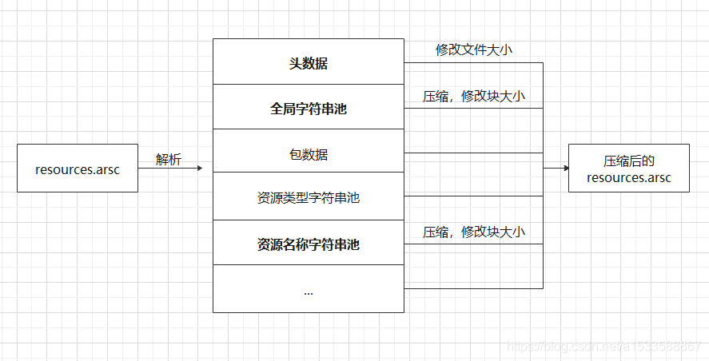

# apk 体积优化

#### 合理选择图片类型

> jpg是有损压缩格式，使用的一种失真压缩标准方法，24 bit真彩色，内容比GIF丰富，不支持动画、不支持透明色。
>
> png是无损压缩格式,PNG格式有8位、24位、32位三种形式,其中8位PNG支持两种不同的透明形式（索引透明和alpha透明）,24位PNG不支持透明,32位PNG在24位基础上增加了8位透明通道（32-24=8）,因此可展现256级透明程度。
>
> webp的优势体现在它具有更优的图像数据压缩算法，能带来更小的图片体积，而且拥有肉眼识别无差异的图像质量；同时具备了无损和有损的压缩模式、Alpha 透明以及动画的特性。
>
> svg是可缩放矢量图，SVG不会像位图一样因为缩放而让图片质量下降。优点在于可以减小APK的大小，在使用过程中可以使用tink属性变化颜色，建议用于图标大小在200dp*200dp的简单小图标以内。

在使用svg的时候：

> 1.svg是由xml定义的，标准svg根节点为`<svg>`。Android中只支持`<vector>`，我们需要通过 vector 将svg的根节点 `<svg>`转换为 `<vector>`。
> 2.Android 5.0之前的版本不支持矢量图，需要向后兼容。
>
> 3.
>
> ```
> android{
>     // Gradle Plugin 2.0+
>     defaultConfig{
>         // 利用支持库中的 VectorDrawableCompat 类,可实现 2.1 版本及更高版本中支持 VectorDrawable
>         vectorDrawables.useSupportLibrary = true
>     }
> }
> dependencies {
>   // 支持库版本需要是 23.2 或更高版本
>   compile 'com.android.support:appcompat-v7:23.2.0'
> }
> ```
>
> 4. 使用app:srcCompat 属性替代 android:src


#### 移除无用资源

###### 1.通过Android Studio提供的Remove Unused Resources可以帮助我们查找出无用资源。

###### 2.通过Lint工具查找无用资源


#### 压缩代码

> ```
>  buildTypes {
>         release {
>             minifyEnabled true //打开代码压缩
>             proguardFiles getDefaultProguardFile('proguard-android-optimize.txt'), 'proguard-rules.pro'
>         }
>         debug {
>             minifyEnabled true//打开代码压缩
>             proguardFiles getDefaultProguardFile('proguard-android-optimize.txt'), 'proguard-rules.pro'
>         }
>     }
> ```
>
> 


#### 压缩资源

> ```
> buildTypes {
>         release {
>             shrinkResources true//打开资源压缩
>             minifyEnabled true//打开代码压缩
>             proguardFiles getDefaultProguardFile('proguard-android-optimize.txt'), 'proguard-rules.pro'
>         }
>         debug {
>             shrinkResources true//打开资源压缩
>             minifyEnabled true//打开代码压缩
>             proguardFiles getDefaultProguardFile('proguard-android-optimize.txt'), 'proguard-rules.pro'
>         }
>     }
> ```
>
> 


>压缩资源可以自定义要保留的资源，具体步骤为创建keep.xml文件，存放位置为res/raw/keep.xml（构建系统不会将此文件打包到 APK 中）。在 tools:keep 属性中指定每个要保留的资源，在 tools:discard 属性中指定每个要舍弃的资源。这两个属性都接受以逗号分隔的资源名称列表。您可以将星号字符用作通配符。如下：
>
>   <?xml version="1.0" encoding="utf-8"?>
>    <resources xmlns:tools="http://schemas.android.com/tools"
>        tools:keep="@layout/l_used*_c,@layout/l_used_a,@layout/l_used_b*"
>        tools:discard="@layout/unused2" />


#### 资源混淆压缩

> 资源混淆的原理是通过修改APK包里的resource.arsc文件，修改文件中的字符串池中的字符串，将其修改为简单短小的字符串，以此来减少文件大小，
>
> 



###### 可以使用微信的AndResGuard进行压缩

###### 打so包


### 混淆


proguard-android.txt文件中的常用的混淆配置信息如下：

```text
# This is a configuration file for ProGuard.
# http://proguard.sourceforge.net/index.html#manual/usage.html
-dontusemixedcaseclassnames
-dontskipnonpubliclibraryclasses
-verbose
# Optimization is turned off by default. Dex does not like code run
# through the ProGuard optimize and preverify steps (and performs some
# of these optimizations on its own).
-dontoptimize
-dontpreverify
# Note that if you want to enable optimization, you cannot just
# include optimization flags in your own project configuration file;
# instead you will need to point to the
# "proguard-android-optimize.txt" file instead of this one from your
# project.properties file.
-keepattributes *Annotation*
-keep public class com.google.vending.licensing.ILicensingService
-keep public class com.android.vending.licensing.ILicensingService
# For native methods, see http://proguard.sourceforge.net/manual/examples.html#native
-keepclasseswithmembernames class * {
 native <methods>;
}
# keep setters in Views so that animations can still work.
# see http://proguard.sourceforge.net/manual/examples.html#beans
-keepclassmembers public class * extends android.view.View {
 void set*(***);
 *** get*();
}
# We want to keep methods in Activity that could be used in the XML attribute onClick
-keepclassmembers class * extends android.app.Activity {
 public void *(android.view.View);
}
# For enumeration classes, see http://proguard.sourceforge.net/manual/examples.html#enumerations
-keepclassmembers enum * {
 public static **[] values();
 public static ** valueOf(java.lang.String);
}
-keepclassmembers class * implements android.os.Parcelable {
 public static final android.os.Parcelable$Creator CREATOR;
}
-keepclassmembers class **.R$* {
 public static <fields>;
}
# The support library contains references to newer platform versions.
# Dont warn about those in case this app is linking against an older
# platform version. We know about them, and they are safe.
-dontwarn android.support.**
```


-dontusemixedcaseclassnames 表示混淆时不使用大小写混合类名。

-dontskipnonpubliclibraryclasses 表示不跳过library中的非public的类。

-verbose 表示打印混淆的详细信息。

-dontoptimize 表示不进行优化，建议使用此选项，因为根据proguard-android-optimize.txt中的描述，

优化可能会造成一些潜在风险，不能保证在所有版本的Dalvik上都正常运行

-dontpreverify 表示不进行预校验。这个预校验是作用在Java平台上的，Android平台上不需要这项功能，

去掉之后还可以加快混淆速度。

-keepattributes Annotation 表示对注解中的参数进行保留。

更多关于proguard混淆规则的介绍，请参考Android安全攻防战，反编译与混淆技术完全解析（下）

大部分应用其实并不需要支持几十种语言的国际化支持，比如国内应用只支持中文，配置如下：

```text
defaultConfig { 
 ...
 //只保留指定和默认的资源 
 //resConfigs('zh-rCN','ko') 
 resConfigs "zh"
}
```

