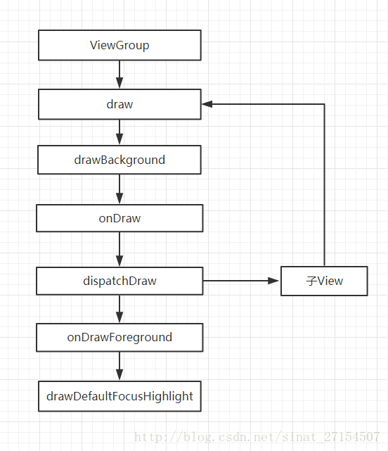
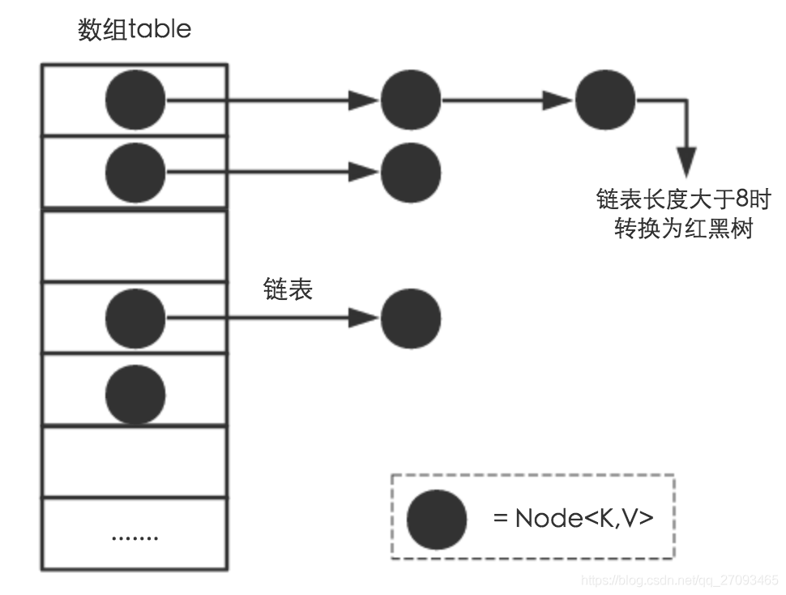

## DayDayUp


#### 事件传递的三个阶段

分发 ：dispatch  事件分发对应着dispatchTouchEvent 方法，在Android系统中，所有的触摸事件都是通过这个方法来分发的。在这个方法中，根据当前视图的具体实现逻辑，来决定是直接消费这个事件还是将事件继续分发给子视图处理。方法返回true表示事件被当前视图消费掉，不在分发事件。方法返回super.dispatchTouchEvent 表示继续分发该事件。如果当前视图是ViewGroup及其子类，则会调用onInterceptTouchEvent方法判定是否拦截事件。

```
public boolean dispatchTouchEvent(MotionEvent et){

}
```

拦截: Intercept   ***事件拦截对应着oninterceptTouchEvent 方法。这个方法只是在ViewGroup及其子类才存在。***在View和Activity中还不存在。

消费： Consume 事件消费对应着onTouchEvent 该方法返回true表示当前视图可以处理对应事件，事件将不会向上传递给父视图。


在 Android 系统中，拥有事件传递能力的类有三种：

```
Activity  ----  dispatchTouchEvent  onTouchEvent

ViewGroup  ---- dispatchTouchEvent  onTouchevent onInterceptTouchEvent

View  ----  dispatchTouchEvent onTouchEvent 
```


#### View绘制

整体绘制流程

当一个应用启动时，回启动一个主Activity ,Android系统会根据Activity的布局对它进行绘制。绘制会从根视图ViewRoot的performTraversals() 开始从上到下遍历整个视图树，每个View控件负责绘制自己。而ViewGroup还需负责通知自己的子View进行绘制操作。视图绘制的过程可以分为三步;  measure  layout  draw

```
private void performTraversals(){
	...
	int childWidthMeasureSpec = getRootMeasureSpec(mWidth,lp.width);
	int childHeightMeasureSpec = getRootMeasureSpec(mHeight,lp.height);
	
	performMeasure(childWidthMeasureSpec,childHeightMeasureSpec);
	
	performLayout(lp,desiredWindowWidth,desiredWindowHeight);
	
	performDraw();
	...
	

}
```


##### MeasureSpec

>  一个32位的整型值。 它的高2位表示测量模式SpecMode,低30位表示某种测量模式下的规格大小SpecSize, MeasureSpec事View的一个静态内部类。用来说明应该如何测量这个view

```
public static class MeasureSpec{
	
	private static final int MODE_SHIFT = 30;
	private static final int MODE_MASK = 0x3 << MODE_SHIFT;
	
	//不指定测量模式
	public static final int unspecified = 0 << MODE_SHIFT;
	
	// 精确测量模式
	public static final int exactly = 1 <<MODE_SHIFT;
	
	// 最大值测量模式
	public static final int at_most = 2 << MODE_SHIFT;
	
	// 根据指定大小和模式创建一个 MeasureSpec
	public static int makeMeasureSpec(int size,int mode){
		if(sUseBrokenMakeMeasureSpec){
			return size + mode ;
		}else {
			return (size & ~MODE_SHIFT) | (mode & MODE_SHIFT)
		}
	}
	
	// 微调某个MeasureSpec 大小
	static ubt adjust(int measureSpec , int delta){
		final int mode = getMode(measureSpec);
		if	(mode == unspecified){
		// no need ti adjust size for unspecified mode
			return makeMeasureSpec(0,unspedified);
		}
		int size =getSize(MeasureSpec) + delta;
		if	(size < 0){
			size =0;
		}
		return makeMeasureSpec(size , mode );
	}

}


```

unspecified : 不指定测量模式，父视图没有限制子视图的大小，子视图可以是想要的任何尺寸。通常用于系统内部，应用开发中很少使用到。

exactivity:  精确测量模式，当视图的layout_width 或者layout_height指定为具体数值或者match_parent时生效，表示父视图已经决定了子视图的精确大小。这种模式下view 的测量值就是SpecSize  的值

at_most : 最大值模式： 当该视图的layout_width或者layout_height指定为wrap_content时生效。此时子视图的尺寸可以是不超过父视图允许的最大尺寸的任何尺寸。


对于DecorView而言，它的MeasureSpec由窗口尺寸和其自身的LayoutParams共同决定；对于普通的View,它的MeasureSpec由父视图的MeasureSpec 和自身LayoutParams共同决定。


#### measure

```
//遍历测量ViewGroup中所有的view
protected void measureChildren(int widthMeasureSpec ,int heightMeasureSpec){

	final int size =mChildrenCount ;
	final View[] children = mChildren ;
	for(int i =0 ;i<size ;i++){
		final View child = children[i];
		if	((child.mViewFlag & VISIBILITY_MASK)!=GONE){
			measureChild(child,widthMeasureSpec，heightMeasureSpec);
		}
	}
}

protected void onMeasure(int widthMeasureSpec,int heightMeasureSpec){
			 setMeasuredDimension(
			 getDefaultSize(getSuggestedMiniWidth(),widthMeasureSpec),
			 getDefaultSize(getSuggestedMiniHeight(),HeightMeasureSpec)	);

}

public static int getDefaultSize(int size, int measurespec){

	int result =size ;
	
	int  specmode = MeasureSpec.getMode(measureSpec);
	int specSize = MeasureSpec.getSize(mesaureSpec);
	
	switch(specmode){
		case MeasureSpec.unspecified:
			result = size ;
			break;
		case MeasureSpec.at_most:
		case MeasureSpec.exactly:
			result =specSize ;
			break;	
	}
	retuen result ;

}


```


##### layout

layout 过程用来确定view 在父容器的布局位置，它是由父容器获取子view 的位置参数后，调用子view 的layout 方法并将位置参数传入实现的，viewrootimpl 的performlayout 

```

```


##### draw




draw 过程中一共分成7步，其中两步我们直接直接跳过不分析了。

第一步：drawBackground(canvas)： 作用就是绘制 View 的背景。

第三步：onDraw(canvas) ：绘制 View 的内容。View 的内容是根据自己需求自己绘制的，所以方法是一个空方法，View的继承类自己复写实现绘制内容。

第三步：dispatchDraw（canvas）：遍历子View进行绘制内容。在 View 里面是一个空实现，ViewGroup 里面才会有实现。在自定义 ViewGroup 一般不用复写这个方法，因为它在里面的实现帮我们实现了子 View 的绘制过程，基本满足需求。

第四步：onDrawForeground(canvas)：对前景色跟滚动条进行绘制。

第五步：drawDefaultFocusHighlight(canvas)：绘制默认焦点高亮


### ANR产生原因及分析


一般指应用响应超过5秒 就会弹出ANR 对话框。

产生原因：

1 。 当前事件没有机会得到处理 

2 。 当前的事件正在处理，但是由于耗时太长没及时完成。


从本质上讲：产生anr 原因有三种：大致可以对应到Android中四大组件的三个

1 最常见的事view的按键事件或者触摸事件在特定的时间内无法得到响应(5s)

2 广播onreceiver函数运行在主线程中，在特定时间内无法完成处理（10s）

3  服务在特定时间内无法完成处理（20s）


### 异步


耗时操作应该放到子线程中，避免阻塞进程，导致anr.

异步处理技术是提高应用性能，解决主线程和子线程之间的通信问题的关键。

Thread,AsyncTask,Handler&Looper,Executors


###### 线程池

> 具体过程：
>
> 1.execute一个线程之后，如果线程池中的线程数未达到核心线程数，则会立马启用一个核心线程去执行。
>
> 2.execute一个线程之后，如果线程池中的线程数已经达到核心线程数，且workQueue未满，则将新任务放入workQueue中等待执行。
>
> 3.execute一个线程之后，如果线程池中的线程数已经达到核心线程数但未超过非核心线程数，且workQueue已满，则开启一个非核心线程来执行任务。
>
> 4.execute一个线程之后，如果线程池中的线程数已经超过非核心线程数，则拒绝执行该任务，采取饱和策略，并抛出RejectedExecutionException异常。

```
ArrayBlockingQueue ：一个由数组结构组成的有界阻塞队列。
LinkedBlockingQueue ：一个由链表结构组成的有界阻塞队列。
PriorityBlockingQueue ：一个支持优先级排序的无界阻塞队列。
DelayQueue：一个使用优先级队列实现的无界阻塞队列。
SynchronousQueue：一个不存储元素的阻塞队列。
LinkedTransferQueue：一个由链表结构组成的无界阻塞队列。
LinkedBlockingDeque：一个由链表结构组成的双向阻塞队列。
```


**newCachedThreadPool：**

底层：返回ThreadPoolExecutor实例，corePoolSize为0；maximumPoolSize为Integer.MAX_VALUE；keepAliveTime为60L；unit为TimeUnit.SECONDS；workQueue为SynchronousQueue(同步队列)
 通俗：当有新任务到来，则插入到SynchronousQueue中，由于SynchronousQueue是同步队列，因此会在池中寻找可用线程来执行，若有可以线程则执行，若没有可用线程则创建一个线程来执行该任务；若池中线程空闲时间超过指定大小，则该线程会被销毁。
 **适用：执行很多短期异步的小程序或者负载较轻的服务器**

**newFixedThreadPool：**

底层：返回ThreadPoolExecutor实例，接收参数为所设定线程数量nThread，corePoolSize为nThread，maximumPoolSize为nThread；keepAliveTime为0L(不限时)；unit为：TimeUnit.MILLISECONDS；WorkQueue为：new LinkedBlockingQueue<Runnable>() 无解阻塞队列
 通俗：创建可容纳固定数量线程的池子，每隔线程的存活时间是无限的，当池子满了就不再添加线程了；如果池中的所有线程均在繁忙状态，对于新任务会进入阻塞队列中(无界的阻塞队列)
 **适用：执行长期的任务，性能好很多**

**newSingleThreadExecutor:**

底层：FinalizableDelegatedExecutorService包装的ThreadPoolExecutor实例，corePoolSize为1；maximumPoolSize为1；keepAliveTime为0L；unit为：TimeUnit.MILLISECONDS；workQueue为：new LinkedBlockingQueue<Runnable>() 无解阻塞队列
 通俗：创建只有一个线程的线程池，且线程的存活时间是无限的；当该线程正繁忙时，对于新任务会进入阻塞队列中(无界的阻塞队列)
 **适用：一个任务一个任务执行的场景**

**newScheduledThreadPool:**

底层：创建ScheduledThreadPoolExecutor实例，corePoolSize为传递来的参数，maximumPoolSize为Integer.MAX_VALUE；keepAliveTime为0；unit为：TimeUnit.NANOSECONDS；workQueue为：new DelayedWorkQueue() 一个按超时时间升序排序的队列
 通俗：创建一个固定大小的线程池，线程池内线程存活时间无限制，线程池可以支持定时及周期性任务执行，如果所有线程均处于繁忙状态，对于新任务会进入DelayedWorkQueue队列中，这是一种按照超时时间排序的队列结构
 **适用：周期性执行任务的场景**


## 

**一、ArrayList和HashMap实现原理，他们的特性是什么。**

ArrayList：底层数据结构是Object数组，查询快，增删慢，查询是根据数组下标直接查询速度快，增删需要移动后边的元素和扩容，速度慢。线程不安全，元素单个，效率高。(如果要线程安全的List集合可以用Vector)

HashMap：jdk1.8之前的数据结构是数组+链表，1.8之后是数组+链表+红黑树，当链表长度小于8的时候使用的还是数组+链表，当链表长度超过8时转换为红黑树，HashMap元素成对，元素可为空，线程不安全，new HashMap的时候初始化默认大小为16。(如果要线程安全的Map集合可以用HashTable或ConcurrentHashMap)


- ArrayList 和HashMap 是一步的, Vector 和 HashTable 是同步的，所以Vector 和 hashtable 是线程安全的。而ArrayList 和 HashMap并不是线程安全的，因为同步需要花费机器时间。所以Vector和HashTable 执行效率要低于ArrayList.和 Hashmap。
- vector分配地址是在一起的，很容易出问题。如果vector一开始申请的空间不足，比如你经常push_back(),vector会重新申请过一整块空间，导致其所有的地址都发生了改变。
- List是有序的Collection,使用此接口能够精准的控制每个元素插入的位置，用户通过索引id 来访问list元素。
- Map没有继承collection接口，map提供kay 到value 的 映射。一个map中不能包含相同的key , 每个key只能映射一个value
- hashmap 允许使用null值 和null 键 hashtable 不允许使用。
- hashset为快速查找设计的set 存入hashset 的对象必须定义hashCode();
- hashmap查找效率高于ArrayList ,hashmap是散列存储的,ArrayLsit是顺序存储的。
- Map：主要用于存储键值对，允许值重复，但不允许键重复（重复就覆盖了）
- HashMap：HashMap 是根据键的 HashCode 值储存数据，根据键可以直接获取它的值，所以具有很快的访问速度。但是遍历时所获取的键值是随机的。
- HashMap 键不可重复但值可以重复，只允许一个键为 null，同时允许多个值为 null。
- HashMap 不是线程同步的，如果需要同步可以使用 Collections 的 synchronizedMap 方法或使用 ConcurrentHashMap。
- LinkedHashMap：是 HashMap 的子类，拥有 HashMap 的大部分特性，不同的是它保存了记录插入顺序。在使用 Iterator 遍历时得到的数据是按顺序获取的。
- Hashtable：与 HashMap 类似，主要特点是不允许键或值为 null，同时支持线程同步（主要 public 方法和有些代码块使用 synchronized 关键字修饰）。所以在写入时会比较慢。
- TreeMap：实现 SortMap 接口，能够把它保存的记录根据键排序，默认是按键值的升序排序。
- LinkedHashMap 是有序的，HashMap 遍历时无序。


##### HashMap 源码


HashMap是数组+链表+红黑树（1.8）



1 Node[] table 

```
static class Node<K,V> implements Map.Entry<K,V> {
        final int hash;    //用来定位数组索引位置
        final K key;
        V value;
        Node<K,V> next;   //链表的下一个node
 
        Node(int hash, K key, V value, Node<K,V> next) { ... }
        public final K getKey(){ ... }
        public final V getValue() { ... }
        public final String toString() { ... }
        public final int hashCode() { ... }
        public final V setValue(V newValue) { ... }
        public final boolean equals(Object o) { ... }
}
```

哈希桶数组。

- Node是HashMap的一个内部类，实现了Map.Entry接口，本质就是一个映射键值对 

- HashMap就是使用Hashap采用了链地址法。简单来说，就是数组加链表的结合。在每个数组元素上都有一个链表结构，当数据呗Hash后，得到数组下表。把数组放在对应的下表元素的链表上如：

> map.put(“美团”，“小妹”)；

系统将调用“美团”这个key 的hashCode() 方法得到其HashCode值（该方法适用于每个Java对象）。然后在通过Hash算法的后两步运算（高位运算和取模运算） 来定位该键值对的存储位置。有时两个key会定位到相同的位置。表示发生了Hash碰撞。当然Hash算法结果越分散均匀，hash碰撞的概率就越小。map的存取率越高。

- 如果哈希桶数组很大，即使较差的hash算法也会很分散。如果哈希桶数组很小，即使很好的hash算法也会出现较多碰撞。所以就需要在空间成本和时间成本之间权衡。其实就是在根据实际情况确定哈希桶数组的大小，并在此基础上设计好的hash算法减少hash碰撞。

理解hash和扩容流程之前，我们先了解HashMap的几个字段

```
     int threshold;             // 所能容纳的key-value对极限 
     final float loadFactor;    // 负载因子
     int modCount;  
     int size;
```

Node[]table的初始化长度length(默认是16) load factor为负载因子（默认值是0.75），threshold是HashMap所能容纳的最大数据量的Node(键值对)个数。threshold = length * Load factor。也就是说，在定义好长度之后，负载因子越大，所能容纳的键值对个数越多。

在hashmap中，哈希桶数组table的长度lengrh大小必须为2 的n次方

HashTable初始化大小为11 就是桶大小设计为素数的应用（HashTable扩容后不能保证还是素数。）主要是为了在取模和扩容时做优化。同时为了减少冲突。HashMap定位哈希桶索引位置时 也加入了高位参与运算的过程。

--红黑树

- hash算法

```
方法一：
static final int hash(Object key) {   //jdk1.8 & jdk1.7
     int h;
     // h = key.hashCode() 为第一步 取hashCode值
     // h ^ (h >>> 16)  为第二步 高位参与运算
     return (key == null) ? 0 : (h = key.hashCode()) ^ (h >>> 16);
}
方法二：
static int indexFor(int h, int length) {  //jdk1.7的源码，jdk1.8没有这个方法，但是实现原理一样的
     return h & (length-1);  //第三步 取模运算
}
```

```
这里的Hash算法本质上就是三步：取key的hashCode值、高位运算、取模运算。

对于任意给定的对象，只要它的hashCode()返回值相同，那么程序调用方法一所计算得到的Hash码值总是相同的。我们首先想到的就是把hash值对数组长度取模运算，这样一来，元素的分布相对来说是比较均匀的。但是，模运算的消耗还是比较大的，在HashMap中是这样做的：调用方法二来计算该对象应该保存在table数组的哪个索引处。

这个方法非常巧妙，它通过h & (table.length -1)来得到该对象的保存位，而HashMap底层数组的长度总是2的n次方，这是HashMap在速度上的优化。当length总是2的n次方时，h& (length-1)运算等价于对length取模，也就是h%length，但是&比%具有更高的效率。
```


> 在JDK1.8的实现中，优化了高位运算的算法，通过hashCode()的高16位异或低16位实现的：(h = k.hashCode()) ^ (h >>> 16)，主要是从速度、功效、质量来考虑的，这么做可以在数组table的length比较小的时候，也能保证考虑到高低Bit都参与到Hash的计算中，同时不会有太大的开销


##### SparseArray

- 以键值对形式进行存储，基于二分查找 

- 由于SparseArrary中Key存储的是数组形式，因此可以直接以init作为key,避免了HashMap的装箱拆箱操作。性能更好 而且int存储的开销远远小雨Integer
- 采用了延迟删除的机制，针对数组删扩容开销大的问题的优化，


SparseArray中元素比较少

- Deleted static final 的一个静态ibject实例。当一个键值对呗remove后，会在对应的key的value下放置该对象，标记该元素已经被删除 -- 延时删除
- mGarbage 当值为true 标志数据结构中有元素被删除，可以触发gc对无效数据进行回收。
- mKeys数组 用于存放key的数组，通过int[]进行存储，与Hashmap相比减少了装箱拆箱的操作，同时 一个int 只占4个字节。 一个重要特点 mKeys的元素是升序排列的。 也是因为这样 我们可以用二分法查找
- mValues 存放value的数组，通过对位置postion进行映射 如果存放的是int型等 可以使用SparseIntArray。存放的也是value 也是int数组 ，性能更高

put

```
    public void put(int key, E value) {
        int i = ContainerHelpers.binarySearch(mKeys, mSize, key);
        //原来已经有key，可能是remove后，value存放着DELETED，也可能是存放旧值，那么就替换
        if (i >= 0) {
            mValues[i] = value;
        } else {
            //没有找到，对i取反，得到i= lo（ContainerHelpers.binarySearch）
            i = ~i;
            //如果i小于数组长度，且mValues==DELETED(i对应的Key被延迟删除了)
            if (i < mSize && mValues[i] == DELETED) {
                //直接取代，实现真实删除原键值对
                mKeys[i] = key;
                mValues[i] = value;
                return;
            }
            //数组中可能存在延迟删除元素且当前数组长度满，无法添加
            if (mGarbage && mSize >= mKeys.length) {
                //真实删除，将所有延迟删除的元素从数组中清除；
                gc();
                //清除后重新确定当前key在数组中的目标位置；
                // Search again because indices may have changed.
                i = ~ContainerHelpers.binarySearch(mKeys, mSize, key);
            }
            //不存在垃圾或者当前数组仍然可以继续添加元素，不需要扩容，则将i之后的元素全部后移，数组中仍然存在被DELETED的垃圾key；
            mKeys = GrowingArrayUtils.insert(mKeys, mSize, i, key);
            mValues = GrowingArrayUtils.insert(mValues, mSize, i, value);
            //新元素添加成功，潜在可用元素数量+1
            mSize++;
        }
    }
```


[参考资料](https://links.jianshu.com/go?to=https%3A%2F%2Fblog.csdn.net%2Fqq_36544760%2Farticle%2Fdetails%2F79401766)

**二、java四大引用**

强引用(StrongReference)：JVM 宁可抛出 OOM ，也不会让 GC 回收具有强引用的对象

软引用(SoftReference)：只有在内存空间不足时，才会被回收的对象

弱引用(WeakReference)：在 GC 时，一旦发现了只具有弱引用的对象，不管当前内存空间足够与否，都会回收它的内存

虚引用(PhantomReference)：任何时候都可以被GC回收，当垃圾回收器准备回收一个对象时，如果发现它还有虚引用，就会在回收对象的内存之前，把这个虚引用加入到与之关联的引用队列中。程序可以通过判断引用队列中是否存在该对象的虚引用，来了解这个对象是否将要被回收。可以用来作为GC回收Object的标志。

**三、java抽象类和接口，有什么区别**

**抽象类**：在Java中被abstract关键字修饰的类称为抽象类，被abstract关键字修饰的方法称为抽象方法，抽象方法只有方法的声明，没有方法体。抽象类的特点：

a、抽象类不能被实例化只能被继承；

b、包含抽象方法的一定是抽象类，但是抽象类不一定含有抽象方法；

c、抽象类中的抽象方法的修饰符只能为public或者protected，默认为public；

d、一个子类继承一个抽象类，则子类必须实现父类抽象方法，否则子类也必须定义为抽象类；

e、抽象类可以包含属性、方法、构造方法，但是构造方法不能用于实例化，主要用途是被子类调用。

**接口**：Java中接口使用interface关键字修饰，特点为:

a、接口可以包含变量、方法；变量被隐士指定为public static final，方法被隐士指定为public abstract（JDK1.8之前）；

b、接口支持多继承，即一个接口可以extends多个接口，间接的解决了Java中类的单继承问题；

c、一个类可以实现多个接口；

d、JDK1.8中对接口增加了新的特性：（1）、默认方法（default method）：JDK 1.8允许给接口添加非抽象的方法实现，但必须使用default关键字修饰；定义了default的方法可以不被实现子类所实现，但只能被实现子类的对象调用；如果子类实现了多个接口，并且这些接口包含一样的默认方法，则子类必须重写默认方法；（2）、静态方法（static method）：JDK 1.8中允许使用static关键字修饰一个方法，并提供实现，称为接口静态方法。接口静态方法只能通过接口调用（接口名.静态方法名）。

**相同点**

（1）都不能被实例化 （2）接口的实现类或抽象类的子类都只有实现了接口或抽象类中的方法后才能实例化。

**不同点**

（1）接口只有定义，不能有方法的实现，java 1.8中可以定义default方法体，而抽象类可以有定义与实现，方法可在抽象类中实现。

（2）实现接口的关键字为implements，继承抽象类的关键字为extends。一个类可以实现多个接口，但一个类只能继承一个抽象类。所以，使用接口可以间接地实现多重继承。

（3）接口强调特定功能的实现，而抽象类强调所属关系。

（4）接口成员变量默认为public static final，必须赋初值，不能被修改；其所有的成员方法都是public、abstract的。抽象类中成员变量默认default，可在子类中被重新定义，也可被重新赋值；抽象方法被abstract修饰，不能被private、static、synchronized和native等修饰，必须以分号结尾，不带花括号。

**四、设计模式六大原则，能否给我说说Android中至少3个用到设计模式的例子**
 1、单一职责原则：有且只有一个原因会引起类的变化。
 2、接口隔离原则。
 3、里氏替换原则。
 4、依赖倒置原则。
 5、迪米特法则。
 6、开闭原则。

23种设计模式：
 创建型5个：单例模式、建造者模式、原型模式、工厂方法、抽象工厂

行为型11个：策略模式、状态模式、观察者模式、中介者模式、访问者模式、迭代器模式、模板方法、备忘录模式、命令模式、解释器模式、责任链模式

结构型模式7个：适配器模式、装饰器模式、代理模式、外观模式、桥接模式、组合模式、享元模式

*OKHttp内部采用责任链模式来完成每个interceptor拦截器的调用*
 定义：使得多个对象都有机会处理请求，从而避免了请求的发送者和接收者之间的耦合关系。将 这些对象连成一条链，并沿着这条链传递该请求，直到有对象处理该请求为止。
 优点： 将请求者和处理者关系解耦，使代码更加灵活。
 缺点： 在链中遍历寻找请求处理者中，如果处理者太多，会影响性能。

*RxJava的观察者模式*
 定义：定义对象间一种一对多的依赖关系，使得每当一对象状态发生改变时，所有依赖它的对象 会得到通知并自动更新。
 应用：listView的Adapter的notifyDataSetChanged方法，广播，事件总线机制。
 观察者模式主要的作用是对象解耦，将观察者和被观察者分隔开，只依赖于observer（观察员） 和observable（可观察的）抽象。
 优点： 1.观察者和被观察者是抽象耦合，以应对业务变化； 2.增强系统的灵活性和可扩展性。
 缺点： 在Java中通知是顺序执行，如果观察者卡顿，会影响整体的执行效率。这种情况下，一般建议采 用异步的方式。

*listview/gridview的适配器模式*
 1.使用场景： 1.接口不兼容 2.想建立一个可以重复使用的类 3.需要统一的输出接口，而输入端类型不可知。
 优点： 1.更好的复用性：复用现有的功能； 2.更好的扩展性：扩展现有的功能。
 缺点： 过多的使用适配器，会使系统凌乱不堪，不易于整体把握。如：明明调用的是A接口，内部适配 的却是B接口的实现，如果系统出现太多这种情况，无异于一场灾难。

*Context外观模式*
 使用场景： 为复杂子系统提供一个简单接口。
 优点： 1.隐藏子系统实现细节，减少客户和子系统的耦合，能够拥抱变化； 2.外观类对子系统接口封装，使子系统更加容易使用。
 缺点： 1.外观类接口膨胀； 更多免费Android开发视频课程，2.外观类没有遵循开闭原则，当业务出现变更时，可能需要修改外观类。

*AlertDialog、Notification 源码使用了建造者模式完成参数的初始化*
 优点：1.良好的封装性，隐藏内部实现细节； 2.建造者独立，容易扩展。
 缺点： 会产生多余的Builder对象和Director对象，消耗内存。

*安卓应用主题是抽象工厂模式的最好体现*
 安卓应用有两套主题：LightTheme亮色主题和DarkTheme暗色主题。主题之下有各种与之相关的 UI元素。创建主题也要随之创建各种UI元素，这就是抽象工厂模式的最好体现。
 优点： 分离接口和实现，面向接口编程。在具体实现中解耦，同时基于接口和实现的分离，使得产品类 切换更加容易，灵活。
 缺点： 1.类文件爆炸性增加 2.新的产品类不易扩展

[参考文章](https://www.jianshu.com/p/457e81b3d8d2)

**五、一个线程几个loop**

## 三、Android部分

**1、65536错误是怎么回事**

该错误主要是由于我们打包后classes.dex文件里方法数量超出的65536个。
 预防方法主要是少写方法，多用基类，能不用兼容包的就不要用兼容包的,引入jar或library工程时注意下它们的方法数，但是如果实在没办法，就用这个方法解决：

第一步：在项目的grade文件里面的defaultConfig闭包下添加：   multiDexEnabled true


```java
apply plugin: 'com.android.application'

android {
    compileSdkVersion 23
    buildToolsVersion "23.0.3"

    defaultConfig {
        multiDexEnabled true
```

第二步：在dependencies下添加依赖   compile 'com.android.support:multidex:1.0.0'


```java
dependencies {
    compile 'com.android.support:multidex:1.0.0'
```

第三步：自定义继承于Application的类，并重写protected void attachBaseContext(Context base)方法，调用 MultiDex.install(this)初始化，最后记得在Manifest清单里注册自定义的application类，如图：


```java
public class MyApplication extends Application{

    @Override
    protected void attachBaseContext(Context base) {
        super.attachBaseContext(base);
        MultiDex.install(this);
    }
```

[该问题的参考文章一](https://links.jianshu.com/go?to=https%3A%2F%2Fblog.csdn.net%2Fqq_29777823%2Farticle%2Fdetails%2F53507955%3Futm_medium%3Ddistribute.pc_relevant_t0.none-task-blog-BlogCommendFromMachineLearnPai2-1.baidujs%26dist_request_id%3D%26depth_1-utm_source%3Ddistribute.pc_relevant_t0.none-task-blog-BlogCommendFromMachineLearnPai2-1.baidujs)

[该问题的参考文章二](https://www.jianshu.com/p/b78b1312961f)

**2、什么是内存泄漏、什么是内存溢出，该怎么应对**

内存溢出(OOM):指的是申请不到足够的内存；

原因：1、内存一次性开销过大(加载巨图)。2、内存持续性开销(循环创建对象)。3、内存回收不及时(内存开销过快，GC频率跟不上开销速度等)。4、内存无法回收(内存泄漏导致内存溢出)。

解决方案：1、调整图像大小。2、尽可能不在循环中申请内存。3、及时回收图像。

[参考文章地址](https://links.jianshu.com/go?to=https%3A%2F%2Fblog.csdn.net%2Fqq_35178391%2Farticle%2Fdetails%2F106214926)

内存泄露(Leak):无法释放已申请的内存；

在Java中，判断对象是否仍在使用的方法是：引用计数法，可达性分析。

原因：1、静态变量(单例模式)。2、监听器。3、内部类(内部类持有外部引用)。4、资源对象未关闭。5、容器中的对象没有清理。6、webview。

避免内存泄漏方法：
 1、不要在匿名内部类中进行异步操作
 2、将非静态内部类转为静态内部类 + WeakReference（弱引用）的方式
 3、使用Context时，尽量使用Application 的 Context
 4、尽量避免使用static 成员变量。另外可以考虑lazy初始化
 5、为webView开启另外一个进程，通过AIDL与主线程进行通信，WebView所在的进程可以根据业务的需要选择合适的时机进行销毁，从而达到内存的完整释放
 6、及时关闭资源。Bitmap 使用后调用recycle()方法

[参考文章一](https://www.jianshu.com/p/f35ca324c285)
 [参考文章二](https://links.jianshu.com/go?to=https%3A%2F%2Fblog.csdn.net%2Fqq_35373333%2Farticle%2Fdetails%2F74909811)

两者关系：内存泄露 → 剩余内存不足 → 后续申请不到足够内存 →内存溢出。

**3、什么是Android的模块化、组件化、插件化**

模块化：一个程序按照其功能做拆分，分成相互独立的模块（例如：登陆，注册）。模块化的具体实施方法分为插件化和组件化。

组件化：是将一个app分成多个模块，每个模块都是一个组件(module)，开发的过程中我们可以让这些组件相互依赖或者单独调试部分组件，但是最终发布的时候将这些组件合并成一个统一的apk，这就是组件化开发。
 插件化：插件化开发和组件化不同，插件化开发就是将整个app拆分成很多模块，每个模块都是一个apk(组件化的每个模块是一个lib),最终打包的时候将宿主apk和插件apk分开打包，插件apk通过动态下发到宿主apk，这就是插件化。

[参考文章地址](https://www.jianshu.com/p/71585d744076)

**4、浅述APK的打包流程**

第一步 aapt阶段： 资源打包工具，将res资源文件打包成R.java文件和res文件。
 第二步 aidl阶段：  这个阶段处理.aidl文件，生成对应的Java接口文件。
 第三步 Java Compiler阶段：通过Java Compiler编译R.java、Java接口文件、Java源文件，生成.class文件。
 第四步 dex阶段: 通过dex2.jar将.class文件处理生成class.dex。
 第五步 apkbuilder阶段：将classes.dex、res文件夹、AndroidManifest.xml打包成apk文件。
 第六步 Jarsigner阶段：对apk文件加签，形成一个可以运行的apk。

[参考文章地址一](https://www.jianshu.com/p/7c288a17cda8)
 [参考文章地址二](https://links.jianshu.com/go?to=https%3A%2F%2Fwww.bilibili.com%2Fvideo%2FBV1Y54y1p7bJ%3Fp%3D22)

**5、打apk包时，V1、V2签名的区别是什么**

v1签名是对jar进行签名，V2签名是对整个apk签名：官方介绍就是：v2签名是在整个APK文件的二进制内容上计算和验证的，v1是在归档文件中解压缩文件内容。

二者签名所产生的结果：
 v1：在v1中只对未压缩的文件内容进行了验证，所以在APK签名之后可以进行很多修改——文件可以移动，甚至可以重新压缩。即可以对签名后的文件在进行处理
 v2：v2签名验证了归档中的所有字节，而不是单独的ZIP条目，如果您在构建过程中有任何定制任务，包括篡改或处理APK文件，请确保禁用它们，否则您可能会使v2签名失效，从而使您的APKs与Android 7.0和以上版本不兼容。

根据实际开发的经验总结：


```css
    一定可行的方案： 只使用 v1 方案
    不一定可行的方案：同时使用 v1 和 v2 方案
    对 7.0 以下一定不行的方案：只使用 v2 方案
```

[参考文章地址](https://links.jianshu.com/go?to=https%3A%2F%2Fblog.csdn.net%2Fwillba%2Farticle%2Fdetails%2F78885966)

**6、Handler**

什么是handler：
 Handler是Android SDK来处理异步消息的核心类。
 子线程与主线程通过Handler来进行通信。子线程可以通过Handler来通知主线程进行UI更新。

[参考文章地址](https://links.jianshu.com/go?to=https%3A%2F%2Fblog.csdn.net%2Fnmwwbreed%2Farticle%2Fdetails%2F79485773)

**7、ListView和RecylerView的区别，以及如何优化**

1、 缓存不同：
 ListView是2级缓存，RecyclerView比ListView多两级缓存，支持多个离ItemView缓存，支持开发者自定义缓存处理逻辑，支持所有RecyclerView共用同一个RecyclerViewPool(缓存池)。

2、adapter不同
 ListView有自带的Adapter，例如ArrayAdapter等，而RecylerView所有的adapter必须由自己实现。

3、布局不同
 ListView布局较为单一，只有纵向布局，RecylerView横向、纵向、表格、瀑布流都可以实现。

4、刷新区别
 ListView中通常使用全局刷新函数notifyDataSetChanged()来刷新ListView中的所有数据，这是一个非常耗费资源的行为，RecyclerView则可以实现数据的局部刷新，例如notifyItemChanged()函数等。

5、 动画区别：
 在RecyclerView封装的类中已经自带了很多内置的动画API，而ListView则需要自己实现。

6、item点击事件：
 ListView提供了setOnItemClickListener()这样的item点击事件，而RecylerView没有，需要自己实现。

**ListView的优化：**
 优化方式一：
 convertView的复用，进行布局的复用。
 优化方式二：
 ViewHolder的使用，避免每次都findviewById。
 优化方式三：
 使用分段加载。
 优化方式四：
 使用分页加载。

[参考文章](https://www.jianshu.com/p/b07b24c897d0)

**RecylerView的优化：**

[参考文章](https://www.jianshu.com/p/1853ff1e8de6)

**8、EventBus**
 EventBus是一种用于Android的事件发布-订阅总线，它简化了应用程序内各个组件之间进行通信的复杂度，尤其是碎片之间进行通信的问题，可以避免由于使用广播通信而带来的诸多不便。

三个角色：
 Event：事件，它可以是任意类型，EventBus会根据事件类型进行全局的通知。
 Subscriber：事件订阅者，在EventBus 3.0之前我们必须定义以onEvent开头的那几个方法，分别是onEvent、onEventMainThread、onEventBackgroundThread和onEventAsync，而在3.0之后事件处理的方法名可以随意取，不过需要加上注解@subscribe，并且指定线程模型，默认是POSTING。
 Publisher：事件的发布者，可以在任意线程里发布事件。一般情况下，使用EventBus.getDefault()就可以得到一个EventBus对象，然后再调用post(Object)方法即可。

四个线程：
 POSTING：默认，表示事件处理函数的线程跟发布事件的线程在同一个线程。
 MAIN：表示事件处理函数的线程在主线程(UI)线程，因此在这里不能进行耗时操作。
 BACKGROUND：表示事件处理函数的线程在后台线程，因此不能进行UI操作。如果发布事件的线程是主线程(UI线程)，那么事件处理函数将会开启一个后台线程，如果果发布事件的线程是在后台线程，那么事件处理函数就使用该线程。
 ASYNC：表示无论事件发布的线程是哪一个，事件处理函数始终会新建一个子线程运行，同样不能进行UI操作。

[参考文章](https://www.jianshu.com/p/e7d5c7bda783)

**9、ANR问题**

ANR全称：Application Not Responding，也就是应用程序无响应。

以下四个条件都可以造成ANR发生：

InputDispatching Timeout：5秒内无法响应屏幕触摸事件或键盘输入事件
 BroadcastQueue Timeout ：在执行前台广播（BroadcastReceiver）的onReceive()函数时10秒没有处理完成，后台为60秒。
 Service Timeout ：前台服务20秒内，后台服务在200秒内没有执行完毕。
 ContentProvider Timeout ：ContentProvider的publish在10s内没进行完成。

造成ANR的原因及解决办法：
 1、主线程阻塞或主线程数据读取。解决办法：使用子线程处理耗时任务或者阻塞任务
 2、CPU满负荷，I/O阻塞。解决办法：文件读写或者数据库操作放在子线程。
 3、内存不足。解决办法：优化内存，防止内存泄漏。
 4、各大组件ANR。解决办法：各大组件的生命周期也应避免耗时操作。

[参考文章一](https://www.jianshu.com/p/388166988cef)
 [参考文章二](https://links.jianshu.com/go?to=https%3A%2F%2Fwww.bilibili.com%2Fvideo%2FBV1Y54y1p7bJ%3Fp%3D41)

**10、android设备的唯一标识问题**

没有IMEI授权就用android_id和MAC地址，但是android6.0之后MAC地址统一返回02:00:00:00:00:00。
 有IMEI授权就用imei码。
 android10不能用imei，用OAID吧。
 以上的是主流的方法，还有MEID，ESN，IMSI等。
 [Android设备唯一标识](https://www.jianshu.com/p/59440efa020c)

**11、sdk打渠道包方法**

**12、APP从启动到看到第一个页面**


作者：小猴猴_2d25
链接：https://www.jianshu.com/p/9ab5fae0d264
来源：简书
著作权归作者所有。商业转载请联系作者获得授权，非商业转载请注明出处。


