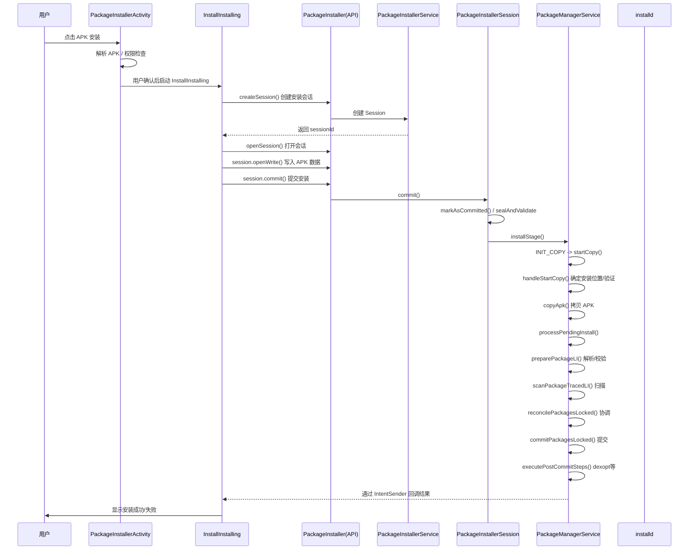

The user is asking about the APK installation process via PackageInstaller in Android 10. Let me look at the codebase to find relevant source files related to PackageInstaller and the APK installation process.
我来帮你分析 Android 10 中 PackageInstaller 安装 APK 的过程。让我先在代码库中查找相关的源文件。
让我继续深入查看关键流程代码：
现在我已经收集了足够的信息来全面分析 PackageInstaller 安装 APK 的全过程。让我整理一下：

---

## PackageInstaller 安装 APK 过程详解

Android 10 中，PackageInstaller 安装 APK 的完整流程涉及多个关键类，下面从用户点击安装到安装完成进行逐步分析：

---

### 整体流程概览



---

### 第一阶段：应用层 - PackageInstallerActivity

用户点击 APK 文件后，系统启动 `PackageInstallerActivity`。

**1. 初始化与权限检查**

```66:100:d:\frameworks\cells-android10\frameworks\base\packages\PackageInstaller\src\com\android\packageinstaller\PackageInstallerActivity.java
public class PackageInstallerActivity extends AlertActivity {
    private static final String TAG = "PackageInstaller";
    private int mSessionId = -1;
    private Uri mPackageURI;
    PackageManager mPm;
    PackageInstaller mInstaller;
    PackageInfo mPkgInfo;
```

主要工作：
- 解析 APK 的 Uri，获取 `mPackageURI`
- 检查是否允许安装未知来源应用 (`checkIfAllowedAndInitiateInstall`)
- 解析 APK 获取 `PackageInfo`
- 如果已安装则提示替换确认

**2. 用户确认安装 → 启动 InstallInstalling**

```555:584:d:\frameworks\cells-android10\frameworks\base\packages\PackageInstaller\src\com\android\packageinstaller\PackageInstallerActivity.java
    private void startInstall() {
        Intent newIntent = new Intent();
        newIntent.putExtra(PackageUtil.INTENT_ATTR_APPLICATION_INFO,
                mPkgInfo.applicationInfo);
        newIntent.setData(mPackageURI);
        newIntent.setClass(this, InstallInstalling.class);
```

---

### 第二阶段：InstallInstalling - 创建会话并写入数据

`InstallInstalling` 是实际执行安装的 Activity，它通过 `InstallingAsyncTask` 异步完成。

**1. 创建安装会话 (Session)**

```130:173:d:\frameworks\cells-android10\frameworks\base\packages\PackageInstaller\src\com\android\packageinstaller\InstallInstalling.java
                PackageInstaller.SessionParams params = new PackageInstaller.SessionParams(
                        PackageInstaller.SessionParams.MODE_FULL_INSTALL);
                params.setInstallAsInstantApp(false);
                params.setReferrerUri(getIntent().getParcelableExtra(Intent.EXTRA_REFERRER));
                params.setOriginatingUri(getIntent()
                        .getParcelableExtra(Intent.EXTRA_ORIGINATING_URI));
                params.setOriginatingUid(getIntent().getIntExtra(Intent.EXTRA_ORIGINATING_UID,
                        UID_UNKNOWN));
                params.setInstallerPackageName(getIntent().getStringExtra(
                        Intent.EXTRA_INSTALLER_PACKAGE_NAME));
                params.setInstallReason(PackageManager.INSTALL_REASON_USER);
                // ...
                mSessionId = getPackageManager().getPackageInstaller().createSession(params);
```

**2. 通过 Session 写入 APK 数据**

```337:406:d:\frameworks\cells-android10\frameworks\base\packages\PackageInstaller\src\com\android\packageinstaller\InstallInstalling.java
        protected PackageInstaller.Session doInBackground(Void... params) {
            PackageInstaller.Session session;
            session = getPackageManager().getPackageInstaller().openSession(mSessionId);
            session.setStagingProgress(0);
            try {
                File file = new File(mPackageURI.getPath());
                try (InputStream in = new FileInputStream(file)) {
                    long sizeBytes = file.length();
                    try (OutputStream out = session
                            .openWrite("PackageInstaller", 0, sizeBytes)) {
                        byte[] buffer = new byte[1024 * 1024];
                        while (true) {
                            int numRead = in.read(buffer);
                            if (numRead == -1) {
                                session.fsync(out);
                                break;
                            }
                            out.write(buffer, 0, numRead);
                            if (sizeBytes > 0) {
                                float fraction = ((float) numRead / (float) sizeBytes);
                                session.addProgress(fraction);
                            }
                        }
                    }
                }
                return session;
```

**3. 提交安装 (commit)**

```393:406:d:\frameworks\cells-android10\frameworks\base\packages\PackageInstaller\src\com\android\packageinstaller\InstallInstalling.java
        protected void onPostExecute(PackageInstaller.Session session) {
            if (session != null) {
                Intent broadcastIntent = new Intent(BROADCAST_ACTION);
                // ...
                PendingIntent pendingIntent = PendingIntent.getBroadcast(
                        InstallInstalling.this,
                        mInstallId,
                        broadcastIntent,
                        PendingIntent.FLAG_UPDATE_CURRENT);
                session.commit(pendingIntent.getIntentSender());
```

---

### 第三阶段：PackageInstallerSession - 会话提交处理

`session.commit()` 最终调用到 `PackageInstallerSession.commit()`。

**1. commit() → markAsCommitted() → MSG_COMMIT**

```843:880:d:\frameworks\cells-android10\frameworks\base\services\core\java\com\android\server\pm\PackageInstallerSession.java
    public void commit(@NonNull IntentSender statusReceiver, boolean forTransfer) {
        if (hasParentSessionId()) {
            throw new IllegalStateException(
                    "Session " + sessionId + " is a child of multi-package session "
                            + mParentSessionId +  " and may not be committed directly.");
        }
        if (!markAsCommitted(statusReceiver, forTransfer)) {
            return;
        }
        // ... multi-package handling ...
        mHandler.obtainMessage(MSG_COMMIT).sendToTarget();
    }
```

**2. markAsCommitted() - 封装和验证会话**

```950:1016:d:\frameworks\cells-android10\frameworks\base\services\core\java\com\android\server\pm\PackageInstallerSession.java
    public boolean markAsCommitted(
            @NonNull IntentSender statusReceiver, boolean forTransfer) {
        Preconditions.checkNotNull(statusReceiver);
        List<PackageInstallerSession> childSessions = getChildSessions();
        final boolean wasSealed;
        synchronized (mLock) {
            assertCallerIsOwnerOrRootLocked();
            assertPreparedAndNotDestroyedLocked("commit");
            final PackageInstallObserverAdapter adapter = new PackageInstallObserverAdapter(
                    mContext, statusReceiver, sessionId,
                    isInstallerDeviceOwnerOrAffiliatedProfileOwnerLocked(), userId);
            mRemoteObserver = adapter.getBinder();
            // ... permission & transfer checks ...
            wasSealed = mSealed;
            if (!mSealed) {
                try {
                    sealAndValidateLocked(childSessions);
                } catch (IOException e) {
                    throw new IllegalArgumentException(e);
                } catch (PackageManagerException e) {
                    destroyInternal();
                    dispatchSessionFinished(e.error, ExceptionUtils.getCompleteMessage(e), null);
                    return false;
                }
            }
            mClientProgress = 1f;
            computeProgressLocked(true);
            mActiveCount.incrementAndGet();
            mCommitted = true;
        }
```

**3. handleCommit() → commitNonStagedLocked() → PMS.installStage()**

```1235:1312:d:\frameworks\cells-android10\frameworks\base\services\core\java\com\android\server\pm\PackageInstallerSession.java
    private void handleCommit() {
        // ... staged & apex handling ...
        List<PackageInstallerSession> childSessions = getChildSessions();
        try {
            synchronized (mLock) {
                commitNonStagedLocked(childSessions);
            }
        } catch (PackageManagerException e) {
            // ...
        }
    }

    private void commitNonStagedLocked(List<PackageInstallerSession> childSessions)
            throws PackageManagerException {
        final PackageManagerService.ActiveInstallSession committingSession =
                makeSessionActiveLocked();
        if (committingSession == null) {
            return;
        }
        if (isMultiPackage()) {
            // ... multi-package handling ...
            mPm.installStage(activeChildSessions);
        } else {
            mPm.installStage(committingSession);
        }
    }
```

注意：`makeSessionActiveLocked()` 中如果需要用户确认权限，会返回 null 并通过 `ACTION_CONFIRM_INSTALL` Intent 通知用户，用户确认后重新触发 `MSG_COMMIT`。

---

### 第四阶段：PackageManagerService - 核心安装流程

**1. installStage() - 发送 INIT_COPY 消息**

```13168:13186:d:\frameworks\cells-android10\frameworks\base\services\core\java\com\android\server\pm\PackageManagerService.java
    void installStage(ActiveInstallSession activeInstallSession) {
        final Message msg = mHandler.obtainMessage(INIT_COPY);
        final InstallParams params = new InstallParams(activeInstallSession);
        params.setTraceMethod("installStage").setTraceCookie(System.identityHashCode(params));
        msg.obj = params;
        mHandler.sendMessage(msg);
    }
```

**2. INIT_COPY → startCopy() → handleStartCopy() + handleReturnCode()**

```1431:1443:d:\frameworks\cells-android10\frameworks\base\services\core\java\com\android\server\pm\PackageManagerService.java
        void doHandleMessage(Message msg) {
            switch (msg.what) {
                case INIT_COPY: {
                    HandlerParams params = (HandlerParams) msg.obj;
                    if (params != null) {
                        params.startCopy();
                    }
                    break;
                }
```

```14851:14858:d:\frameworks\cells-android10\frameworks\base\services\core\java\com\android\server\pm\PackageManagerService.java
        final void startCopy() {
            if (DEBUG_INSTALL) Slog.i(TAG, "startCopy " + mUser + ": " + this);
            handleStartCopy();
            handleReturnCode();
        }

        abstract void handleStartCopy();
        abstract void handleReturnCode();
```

**3. handleStartCopy() - 安装位置确定与验证**

```15202:15306:d:\frameworks\cells-android10\frameworks\base\services\core\java\com\android\server\pm\PackageManagerService.java
        public void handleStartCopy() {
            int ret = PackageManager.INSTALL_SUCCEEDED;
            // 已 staged 的文件直接设为内部安装
            if (origin.staged) {
                if (origin.file != null) {
                    installFlags |= PackageManager.INSTALL_INTERNAL;
                }
            }
            // 获取最小包信息
            pkgLite = PackageManagerServiceUtils.getMinimalPackageInfo(mContext,
                    origin.resolvedPath, installFlags, packageAbiOverride);
            // 空间不足时尝试清理缓存
            if (!origin.staged && pkgLite.recommendedInstallLocation
                    == PackageHelper.RECOMMEND_FAILED_INSUFFICIENT_STORAGE) {
                // freeCache ...
            }
            // 安装位置策略检查
            // ...
            final InstallArgs args = createInstallArgs(this);
            mArgs = args;
            // 包验证 (Package Verification)
            // ...
```

核心工作：
- 确定安装位置（内部/外部存储）
- 检查存储空间，不足则尝试清理缓存
- 安装位置策略验证
- 创建 `InstallArgs`（`FileInstallArgs` 或 `MoveInstallArgs`）
- **包验证（Package Verification）**：发送 `ACTION_PACKAGE_NEEDS_VERIFICATION` 广播，等待验证器响应

**4. handleReturnCode() - 拷贝 APK 并处理安装**

```15543:15566:d:\frameworks\cells-android10\frameworks\base\services\core\java\com\android\server\pm\PackageManagerService.java
        void handleReturnCode() {
            if (mVerificationCompleted && mEnableRollbackCompleted) {
                if (mRet == PackageManager.INSTALL_SUCCEEDED) {
                    mRet = mArgs.copyApk();
                }
                processPendingInstall(mArgs, mRet);
            }
        }
```

**5. processPendingInstall() → processInstallRequestsAsync()**

```14597:14628:d:\frameworks\cells-android10\frameworks\base\services\core\java\com\android\server\pm\PackageManagerService.java
    private void processPendingInstall(final InstallArgs args, final int currentStatus) {
        if (args.mMultiPackageInstallParams != null) {
            args.mMultiPackageInstallParams.tryProcessInstallRequest(args, currentStatus);
        } else {
            PackageInstalledInfo res = createPackageInstalledInfo(currentStatus);
            processInstallRequestsAsync(
                    res.returnCode == PackageManager.INSTALL_SUCCEEDED,
                    Collections.singletonList(new InstallRequest(args, res)));
        }
    }

    private void processInstallRequestsAsync(boolean success,
            List<InstallRequest> installRequests) {
        mHandler.post(() -> {
            if (success) {
                for (InstallRequest request : installRequests) {
                    request.args.doPreInstall(request.installResult.returnCode);
                }
                synchronized (mInstallLock) {
                    installPackagesTracedLI(installRequests);
                }
                for (InstallRequest request : installRequests) {
                    request.args.doPostInstall(
                            request.installResult.returnCode, request.installResult.uid);
                }
            }
            for (InstallRequest request : installRequests) {
                restoreAndPostInstall(request.args.user.getIdentifier(), request.installResult,
                        new PostInstallData(request.args, request.installResult, null));
            }
        });
    }
```

---

### 第五阶段：installPackagesLI - 四步核心安装

这是安装的核心四阶段流程：

```16971:17067:d:\frameworks\cells-android10\frameworks\base\services\core\java\com\android\server\pm\PackageManagerService.java
    private void installPackagesLI(List<InstallRequest> requests) {
        // ...
        try {
            for (InstallRequest request : requests) {
                // 阶段1: 准备 (Prepare)
                prepareResult = preparePackageLI(request.args, request.installResult);
                // 阶段2: 扫描 (Scan)
                final List<ScanResult> scanResults = scanPackageTracedLI(
                        prepareResult.packageToScan, prepareResult.parseFlags,
                        prepareResult.scanFlags, System.currentTimeMillis(),
                        request.args.user);
            }
            // 阶段3: 协调 (Reconcile)
            reconciledPackages = reconcilePackagesLocked(
                    reconcileRequest, mSettings.mKeySetManagerService);
            // 阶段4: 提交 (Commit)
            commitPackagesLocked(commitRequest);
            success = true;
        }
        // 阶段5: 后处理
        executePostCommitSteps(commitRequest);
```

四个阶段的具体作用：

| 阶段          | 方法                        | 主要工作                                               |
| ------------- | --------------------------- | ------------------------------------------------------ |
| **Prepare**   | `preparePackageLI()`        | 解析 APK、收集签名、检查权限、检查版本降级、替换策略等 |
| **Scan**      | `scanPackageTracedLI()`     | 扫描包，构建 PackageSetting，分配 UID 等               |
| **Reconcile** | `reconcilePackagesLocked()` | 协调共享用户、KeySet、权限等                           |
| **Commit**    | `commitPackagesLocked()`    | 写入 Settings、更新 mPackages、创建数据目录            |

**executePostCommitSteps() - 安装后优化**

```17097:17176:d:\frameworks\cells-android10\frameworks\base\services\core\java\com\android\server\pm\PackageManagerService.java
    private void executePostCommitSteps(CommitRequest commitRequest) {
        for (ReconciledPackage reconciledPkg : commitRequest.reconciledPackages.values()) {
            // 1. 准备应用数据
            prepareAppDataAfterInstallLIF(pkg);
            // 2. 准备应用 profile
            mArtManagerService.prepareAppProfiles(pkg, ...);
            // 3. dexopt 优化
            if (performDexopt) {
                mPackageDexOptimizer.performDexOpt(pkg, ...);
            }
            // 4. 通知后台优化服务
            BackgroundDexOptService.notifyPackageChanged(packageName);
        }
    }
```

---

### 第六阶段：安装完成通知

安装完成后：
1. **`restoreAndPostInstall()`**：如果需要，触发 BackupManager 恢复数据
2. **发送 `POST_INSTALL` 消息**：处理安装后广播（`ACTION_PACKAGE_ADDED` / `ACTION_PACKAGE_REPLACED`）
3. **通过 IntentSender 回调**：通知 `InstallInstalling` 安装结果
4. **UI 显示**：跳转到 `InstallSuccess` 或 `InstallFailed` 页面

---

### 完整调用链总结

```
PackageInstallerActivity
  └─ startInstall() → InstallInstalling
       └─ InstallingAsyncTask.doInBackground()
            ├─ PackageInstaller.createSession() → PackageInstallerService.createSession()
            ├─ PackageInstaller.openSession() → PackageInstallerSession
            ├─ session.openWrite() → 写入 APK 数据到 staging 目录
            └─ session.commit()
                 └─ PackageInstallerSession.commit()
                      ├─ markAsCommitted() → sealAndValidateLocked()
                      └─ MSG_COMMIT → handleCommit()
                           └─ commitNonStagedLocked()
                                └─ PMS.installStage()
                                     └─ INIT_COPY → startCopy()
                                          ├─ handleStartCopy() → 安装位置/验证
                                          └─ handleReturnCode()
                                               ├─ copyApk() → 拷贝到最终目录
                                               └─ processPendingInstall()
                                                    └─ processInstallRequestsAsync()
                                                         ├─ doPreInstall()
                                                         ├─ installPackagesTracedLI()
                                                         │    └─ installPackagesLI()
                                                         │         ├─ preparePackageLI()    [准备]
                                                         │         ├─ scanPackageTracedLI() [扫描]
                                                         │         ├─ reconcilePackagesLocked() [协调]
                                                         │         └─ commitPackagesLocked() [提交]
                                                         ├─ doPostInstall()
                                                         ├─ executePostCommitSteps() → dexopt
                                                         └─ restoreAndPostInstall() → 广播/回调
```

这就是 Android 10 中 PackageInstaller 从用户点击安装到完成安装的完整过程，涉及从应用层 UI 到系统服务 `PackageManagerService` 的多层协作。