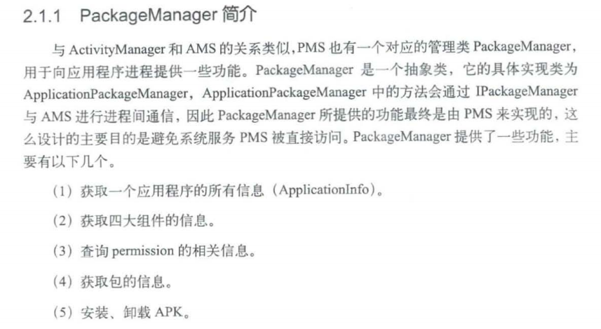

## PackageManagerService (PMS) 详解

### 基本信息

```java
// 第 414-415 行
public class PackageManagerService extends IPackageManager.Stub
        implements PackageSender {
    static final String TAG = "PackageManager";   // 日志 TAG
```

**位置**: `frameworks/base/services/core/java/com/android/server/pm/PackageManagerService.java` (~30000+ 行，1.16MB)

**角色**: Android 系统中最核心的服务之一，管理所有应用的 **安装、卸载、解析、权限、解析、查询** 等功能

---

### 核心数据结构

| 字段 | 类型 | 说明 |
|------|------|------|
| `mPackages` | `ArrayMap<String, PackageParser.Package>` | **核心缓存**：所有已安装包的内存映射（包名→Package对象），同时作为全局锁 |
| `mSettings` | `Settings` | 持久化设置：packages.xml / packages-backup.xml |
| `mInstallLock` | `Object` | 安装操作锁（防止并发安装） |
| `mInstaller` | `Installer` | 与 installd 守护进程通信的接口 |
| `mPermissionManager` | `PermissionManagerService` | 权限管理子服务 |
| `mComponentResolver` | `ComponentResolver` | Intent 解析器 |
| `mHandlerThread` | `ServiceThread` | PMS 专用工作线程 |

---

### 启动流程 (`main()` → 构造函数)

```java
// 第 2306-2318 行
public static PackageManagerService main(Context context, Installer installer,
        boolean factoryTest, boolean onlyCore) {
    PackageManagerService m = new PackageManagerService(context, installer,
            factoryTest, onlyCore);
    m.enableSystemUserPackages();
    ServiceManager.addService("package", m);          // 注册到 ServiceManager
    ServiceManager.addService("package_native", pmn);  // 注册 native 接口
    return m;
}
```

#### BOOT_PROGRESS 阶段时序图

```
BOOT_PROGRESS_PMS_START           (第 2407 行)  ← 构造函数开始
    │
    ├── 创建子组件
    │   ├── UserManagerService
    │   ├── ComponentResolver
    │   ├── PermissionManagerService
    │   └── Settings (读取 packages.xml)
    │
    ├── 注册共享用户 (system/phone/log/bluetooth/shell...)
    │
    ├── 创建 PackageDexOptimizer / DexManager / ArtManagerService
    │
    ▼
BOOT_PROGRESS_PMS_SYSTEM_SCAN_START  (第 2565 行)  ← 扫描系统分区
    │
    ├── scanDirTracedLI(VENDOR_OVERLAY_DIR)     ← Vendor 覆盖层
    ├── scanDirTracedLI(PRODUCT_OVERLAY_DIR)    ← Product 覆盖层
    ├── scanDirTracedLI(ODM_OVERLAY_DIR)        ← ODM 覆盖层
    ├── scanDirTracedLI(OEM_OVERLAY_DIR)         ← OEM 覆盖层
    │
    ├── scanDirTracedLI(/system/framework)      ← Framework 资源包
    │       [必须包含 "android" 包]
    │
    ├── scanDirTracedLI(/system/priv-app)       ← 特权系统应用
    ├── scanDirTracedLI(/system/app)            ← 普通系统应用
    ├── scanDirTracedLI(/vendor/priv-app)       ← Vendor 特权应用
    ├── scanDirTracedLI(/vendor/app)            ← Vendor 应用
    ├── scanDirTracedLI(/odm/priv-app)          ← ODM 特权应用
    ├── scanDirTracedLI(/odm/app)               ← ODM 应用
    │
    ▼
BOOT_PROGRESS_PMS_DATA_SCAN_START    (第 2935 行)  ← 扫描数据分区
    │
    ├── scanDirTracedLI(/data/app)             ← 第三方应用
    ├── pruneCachedApps()                      ← 清理过期缓存
    │
    ▼
BOOT_PROGRESS_PMS_SCAN_END           (第 3165 行)  ← 扫描完成
    │
    ├── 更新共享库
    ├── 权限默认策略
    ├── 读写 packages.xml
    │
    ▼
BOOT_PROGRESS_PMS_READY            (第 3291 行)  ← PMS 就绪
```

#### 系统扫描目录顺序

| 目录 | 说明 | 标志位 |
|------|------|--------|
| `/vendor/overlay` | Vendor 覆盖资源 | SCAN_AS_VENDOR |
| `/product/overlay` | Product 覆盖资源 | SCAN_AS_PRODUCT |
| `/odm/overlay`, `/oem/overlay` | ODM/OEM 覆盖 | SCAN_AS_ODM/SCAN_AS_OEM |
| `/system/framework` | Framework 包（无 DEX） | SCAN_NO_DEX, SCAN_AS_PRIVILEGED |
| `/system/priv-app` | 特权系统应用 | SCAN_AS_PRIVILEGED |
| `/system/app` | 普通系统应用 | - |
| `/vendor/priv-app`, `/vendor/app` | Vendor 应用 | SCAN_AS_VENDOR |
| `/odm/priv-app`, `/odm/app` | ODM 应用 | SCAN_AS_VENDOR |
| `/data/app` | 第三方安装应用 | - |
| `/data/app-private` | 加密应用 | - |

---

### 核心功能模块

```
┌─────────────────────────────────────────────────────────────┐
│                    PackageManagerService                     │
├─────────────────────────────────────────────────────────────┤
│                                                             │
│  ┌──────────────┐  ┌──────────────┐  ┌──────────────────┐  │
│  │ 包扫描解析    │  │ 包安装/卸载   │  │ 权限管理         │  │
│  │              │  │              │  │                  │  │
│  │ scanDirLI()  │  │ installPackage│  │ grantRuntimePerm │  │
│  │ scanPackage  │  │ deletePackage │  │ checkPermission  │  │
│  │ PackageParser│  │ InstallParams │  │ PermissionMgr   │  │
│  └──────────────┘  └──────────────┘  └──────────────────┘  │
│                                                             │
│  ┌──────────────┐  ┌──────────────┐  ┌──────────────────┐  │
│  │ 组件解析     │  │ 设置持久化    │  │ Dex 优化         │  │
│  │              │  │              │  │                  │  │
│  │ resolveIntent│  │ packages.xml │  │ dexopt           │  │
│  │ queryIntent  │  │ packages.list│  │ DexManager       │  │
│  │ ComponentResolver│ readLPw()  │  │ ART Manager      │  │
│  └──────────────┘  └──────────────┘  └──────────────────┘  │
│                                                             │
│  ┌──────────────┐  ┌──────────────┐  ┌──────────────────┐  │
│  │ 用户管理     │  │ 即时应用     │  │ APEX 管理        │  │
│  │              │  │              │  │                  │  │
│  │ UserManager  │  │ InstantApp   │  │ ApexManager      │  │
│  │ multi-user   │  │ EphemeralApp │  │ 模块化系统组件   │  │
│  └──────────────┘  └──────────────┘  └──────────────────┘  │
└─────────────────────────────────────────────────────────────┘
```

### 双锁机制

```java
// 第 2422-2423 行
synchronized (mInstallLock) {        // 安装锁：保护文件系统操作
    synchronized (mPackages) {        // 包锁：保护内存数据结构
        // 操作...
    }
}
```

| 锁对象 | 保护范围 |
|--------|---------|
| `mInstallLock` | APK 文件的复制、DEX 优化、数据目录创建等文件系统操作 |
| `mPackages` | mPackages 映射表、Settings 数据等内存中数据结构的读写 |

### 与其他进程的关系

```
┌─────────────┐    Binder IPC     ┌──────────────────────┐
│  App 进程   │ ◄──────────────► │                      │
│ (Client)    │  IPackageManager │   SystemServer 进程   │
│             │                  │                      │
│ Context.pm  │                  │  PackageManagerService │
│ getPackageManager()            │  (运行在 system_server) │
└─────────────┘                  └──────────┬───────────┘
                                           │
                                    Socket IPC
                                           │
                                  ┌────────▼────────┐
                                  │   installd       │
                                  │  (Native 守护进程)│
                                  │                  │
                                  │  install/dexopt  │
                                  │  rm/rmdir        │
                                  └─────────────────┘
```

### 关键方法速查

| 方法                           | 功能             |
| ---------------------------- | -------------- |
| `installPackage()`           | 安装新应用          |
| `deletePackage()`            | 卸载应用           |
| `getPackageInfo()`           | 获取包信息          |
| `getApplicationInfo()`       | 获取应用信息         |
| `resolveIntent()`            | 解析 Intent 匹配组件 |
| `queryIntentActivities()`    | 查询匹配 Activity  |
| `getInstalledPackages()`     | 获取所有已安装包       |
| `grantRuntimePermission()`   | 授予运行时权限        |
| `checkPermission()`          | 检查权限           |
| `clearApplicationUserData()` | 清除应用数据         |
