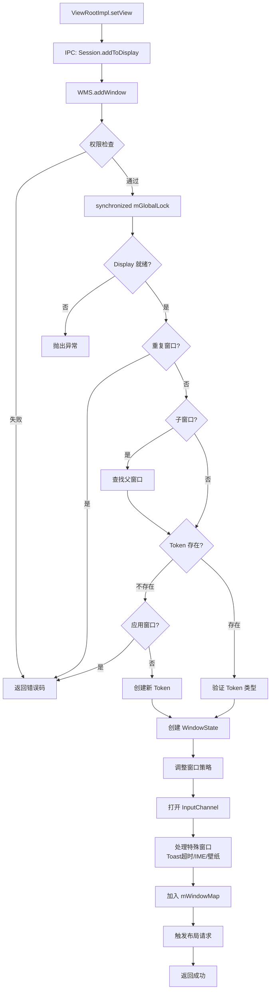
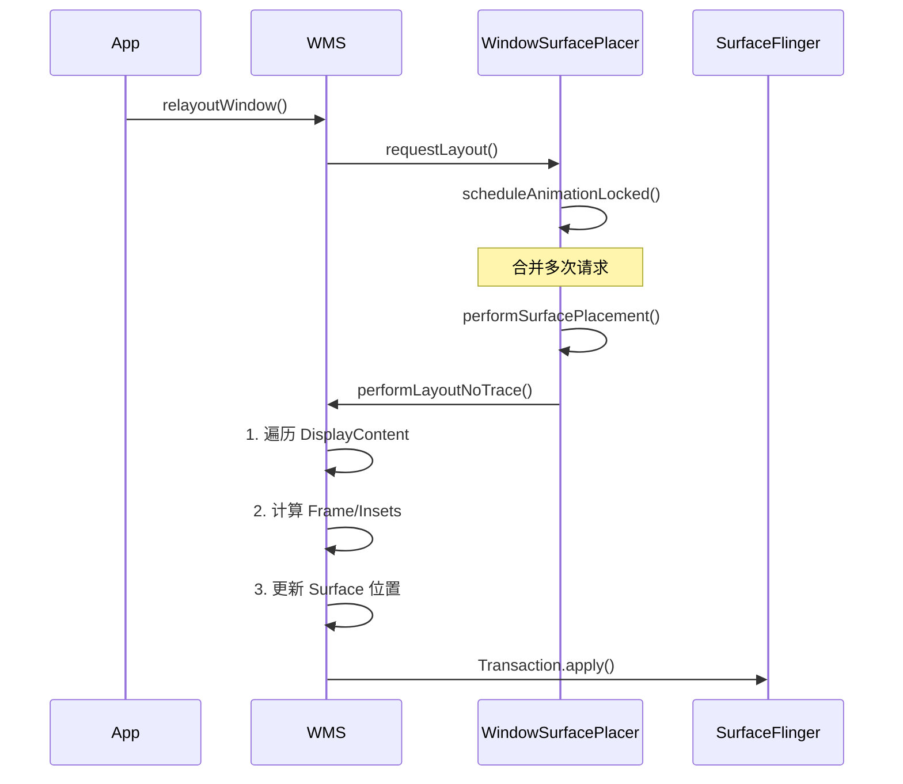
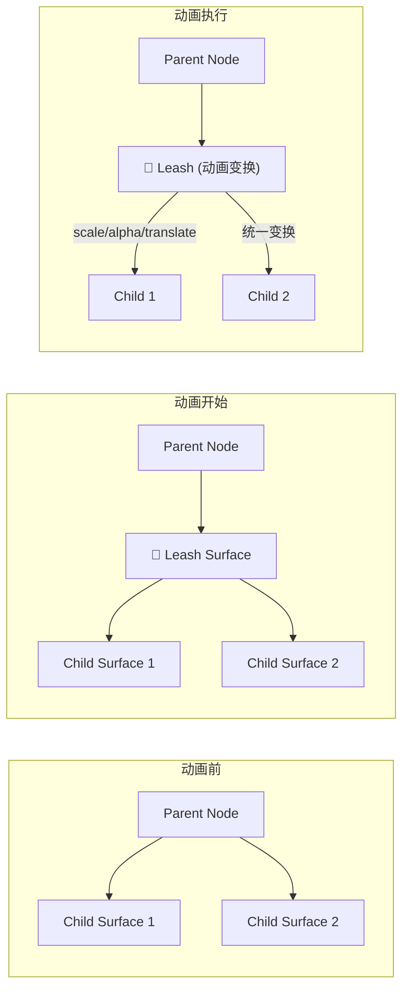
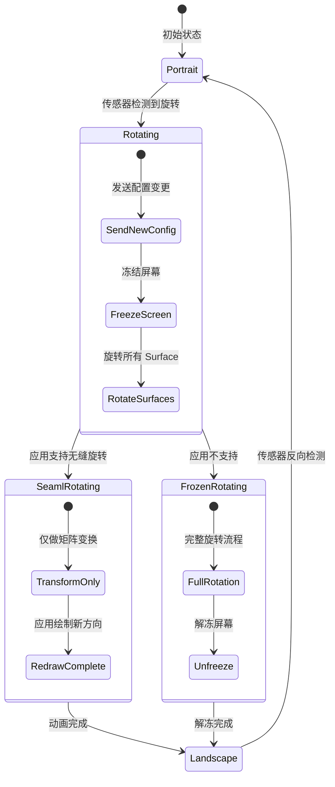
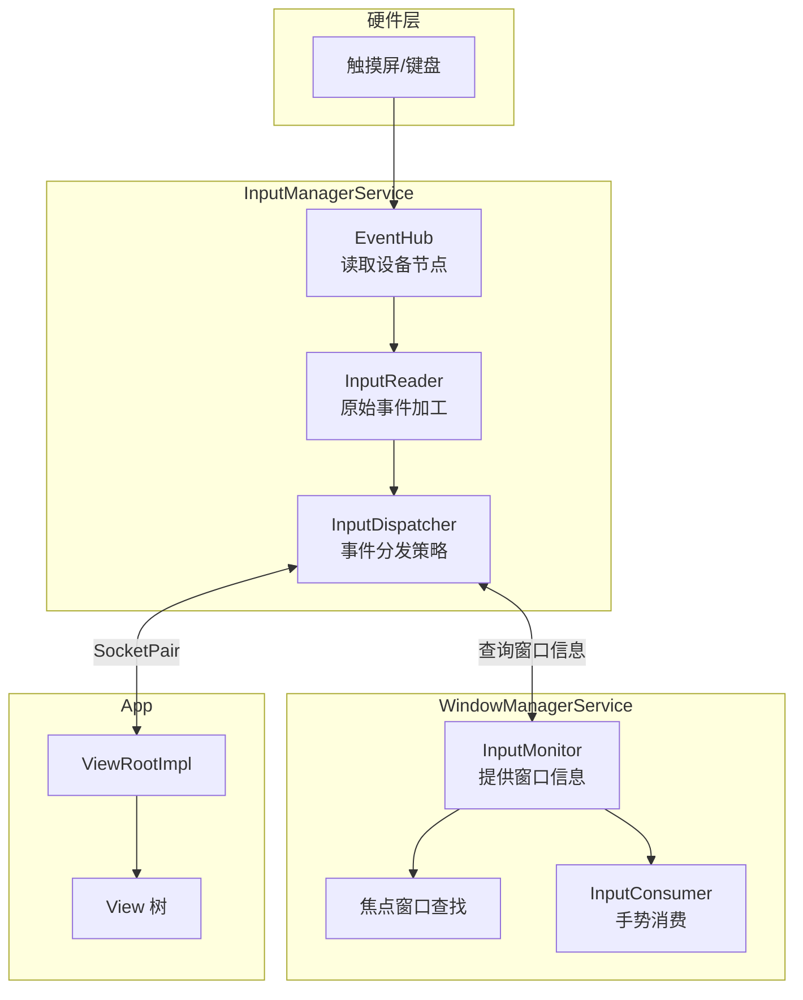

我已经有了足够的信息来创建一个全面的、基于实际代码的 WMS 学习指南。


1. **第一阶段：基础概念**
   - WindowManagerService.java 的类定义（287-500行）
   - mGlobalLock、mWindowMap、mSessions 的作用
   - WindowManager.LayoutParams 中的窗口类型定义
   - 层级计算公式

2. **第二阶段：核心流程**
   - addWindow() 方法的完整实现（1276-1624行）
   - Session.java 中的 addToDisplay() 方法（154-162行）
   - WindowState 的创建过程
   - performLayoutAndPlaceSurfacesLocked() 相关

3. **第三阶段：高级主题**
   - AppTransition.java - 动画系统
   - SurfaceAnimator.java - Surface 动画
   - DisplayContent.java - 多屏支持
   - InputMonitor.java - 输入系统
   - DisplayRotation.java - 屏幕旋转

现在我需要将这些内容组织成一个完整的、详细的学习指南，包含代码引用和实际例子。
好的！现在我将为你提供一个完整的、基于实际源码的 **WMS 三阶段深度学习指南**。让我整理所有读取到的关键信息：

---

# 📚 Android WindowManagerService 完整学习指南

## 🎯 第一阶段：基础概念（1-2周）

### 1.1 WMS 类定义与继承关系

从实际源码可以看到 WMS 的核心定位：

```287:289:frameworks/base/services/core/java/com/android/server/wm/WindowManagerService.java
public class WindowManagerService extends IWindowManager.Stub
        implements Watchdog.Monitor, WindowManagerPolicy.WindowManagerFuncs {
```

**三层含义：**
- `IWindowManager.Stub`：Binder 服务端，客户端通过 IPC 调用
- `Watchdog.Monitor`：被看门狗监控，防止死锁导致系统卡死  
- `WindowManagerFuncs`：窗口策略回调接口

---

### 1.2 三大核心数据结构详解

#### ✅ mGlobalLock - 全局锁机制

```499:501:frameworks/base/services/core/java/com/android/server/wm/WindowManagerService.java
/** Global service lock used by the package the owns this service. */
final WindowManagerGlobalLock mGlobalLock;
```

**作用与原理：**
- 这是 Android 系统中**最繁忙的锁**之一
- 所有窗口操作（添加、删除、移动、层级调整）都必须获取该锁
- 保证窗口操作的**原子性和线程安全**
- 在 `addWindow()` 中可以看到大量使用：

```1293:1296:frameworks/base/services/core/java/com/android/server/wm/WindowManagerService.java
synchronized (mGlobalLock) {
    if (!mDisplayReady) {
        throw new IllegalStateException("Display has not been initialialized");
    }
    // ... 所有后续操作都在锁内执行
}
```

#### ✅ mSessions - 会话管理集合

```493:494:frameworks/base/services/core/java/com/android/server/wm/WindowManagerService.java
/** All currently active sessions with clients. */
final ArraySet<Session> mSessions = new ArraySet<>();
```

**Session 是什么？**

```64:68:frameworks/base/services/core/java/com/android/server/wm/Session.java
/**
 * This class represents an active client session. There is generally one
 * Session object per process that is interacting with the window manager.
 */
class Session extends IWindowSession.Stub implements IBinder.DeathRecipient {
```

**核心特点：**
- 每个**应用进程对应一个 Session**
- 继承 `IWindowSession.Stub`：是 Binder 服务的服务端
- 实现 `IBinder.DethRecipient`：监听客户端死亡事件
- 包含进程 UID/PID 权限信息：

```91:103:frameworks/base/services/core/java/com/android/server/wm/Session.java
public Session(WindowManagerService service, IWindowSessionCallback callback) {
    mService = service;
    mUid = Binder.getCallingUid();
    mPid = Binder.getCallingPid();
    mCanAddInternalSystemWindow = service.mContext.checkCallingOrSelfPermission(
            INTERNAL_SYSTEM_WINDOW) == PERMISSION_GRANTED;
    // ...
}
```

**Session 核心方法 - addToDisplay()：**

```154:162:frameworks/base/services/core/java/com/android/server/wm/Session.java
public int addToDisplay(IWindow window, int seq, WindowManager.LayoutParams attrs,
        int viewVisibility, int displayId, Rect outFrame, Rect outContentInsets,
        Rect outStableInsets, Rect outOutsets,
        DisplayCutout.ParcelableWrapper outDisplayCutout, InputChannel outInputChannel,
        InsetsState outInsetsState) {
    return mService.addWindow(this, window, seq, attrs, viewVisibility, displayId, outFrame,
            outContentInsets, outStableInsets, outOutsets, outDisplayCutout, outInputChannel,
            outInsetsState);
}
```

这是**客户端添加窗口的唯一入口**！

#### ✅ mWindowMap - 窗口映射表

```496:497:frameworks/base/services/core/java/com/android/server/wm/WindowManagerService.java
/** Mapping from an IWindow IBinder to the server's Window object. */
final WindowHashMap mWindowMap = new WindowHashMap();
```

**作用：**
- 维护 **IWindow → WindowState** 的映射关系
- 通过 `client.asBinder()` 作为 key 快速查找窗口
- 在 addWindow 中的使用：

```1311:1314:frameworks/base/services/core/java/com/android/server/wm/WindowManagerService.java
if (mWindowMap.containsKey(client.asBinder())) {
    Slog.w(TAG_WM, "Window " + client + " is already added");
    return WindowManagerGlobal.ADD_DUPLICATE_ADD;
}
```

---

### 1.3 窗口类型体系（LayoutParams.TYPE_*）

#### 应用窗口范围（1-99）

```719:749:frameworks/base/core/java/android/view/WindowManager.java
public static final int FIRST_APPLICATION_WINDOW = 1;

// 基础应用窗口（Activity 默认类型）
public static final int TYPE_BASE_APPLICATION   = 1;

// 普通应用窗口（Dialog 使用）
public static final int TYPE_APPLICATION        = 2;

// 启动画面窗口（Starting Window）
public static final int TYPE_APPLICATION_STARTING = 3;
```

**特点：**
- 必须关联 Activity Token
- 显示在当前用户的窗口上
- Z 轴层级最低的应用层窗口

#### 子窗口范围（1000-1999）

```1316:1328:frameworks/base/services/core/java/com/android/server/wm/WindowManagerService.java
if (type >= FIRST_SUB_WINDOW && type <= LAST_SUB_WINDOW) {
    parentWindow = windowForClientLocked(null, attrs.token, false);
    if (parentWindow == null) {
        // 必须有父窗口
    }
}
```

**典型子窗口：**
- PopupWindow
- Dialog（当作为 Activity 子窗口时）
- ContextMenu

#### 系统窗口范围（2000-2999）

从源码可以看到各种特殊系统窗口的处理逻辑：

```1354:1383:frameworks/base/services/core/java/com/android/server/wm/WindowManagerService.java
if (rootType == TYPE_INPUT_METHOD) {          // 输入法键盘
    // 需要 IME Token
}
if (rootType == TYPE_WALLPAPER) {             // 壁纸
    // 需要壁纸 Token
}
if (rootType == TYPE_DREAM) {                 // 梦幻屏幕保护
    // 需要Dream Token
}
if (rootType == TYPE_TOAST) {                 // Toast 提示
    // 特殊权限检查
}
```

**常见系统窗口：**
- `TYPE_STATUS_BAR`（2000）：状态栏
- `TYPE_NAVIGATION_BAR`（2019）：导航栏
- `TYPE_INPUT_METHOD`（2021）：输入法键盘
- `TYPE_WALLPAPER`（2024）：壁纸
- `TYPE_TOAST`（2035）：Toast 提示
- `TYPE_APPLICATION_OVERLAY`（2038）：悬浮窗

---

### 1.4 层级计算体系

WMS 定义了一套完整的层级计算公式：

```296:320:frameworks/base/services/core/java/com/android/server/wm/WindowManagerService.java
// 类型层乘数：为同类型多个窗口预留空间
static final int TYPE_LAYER_MULTIPLIER = 10000;

// 类型层偏移：用于调整同类型窗口组的上下位置
static final int TYPE_LAYER_OFFSET = 1000;

// 窗口层乘数：每个窗口之间的间隔（为特效Surface预留）
static final int WINDOW_LAYER_MULTIPLIER = 5;

// Dim surface 紧贴目标窗口下方
static final int LAYER_OFFSET_DIM = 1;

// 缩略图动画图层偏移
static final int LAYER_OFFSET_THUMBNAIL = WINDOW_LAYER_MULTIPLIER - 1; // = 4
```

**计算示例：**

假设一个 TYPE_STATUS_BAR（type=2000）窗口：
```
基础层级 = type × TYPE_LAYER_MULTIPLIER + TYPE_LAYER_OFFSET
         = 2000 × 10000 + 1000
         = 20,001,000

如果它下面需要 Dim surface:
Dim 层级 = 基础层级 - LAYER_OFFSET_DIM
        = 20,000,999
```

**层级分布图：**
```
30,000,000+ ┃ 系统错误/电话窗口（最高优先级）
            ┃
20,000,000+ ┃ 状态栏、导航栏、输入法
            ┃
10,000,000+ ┃ 悬浮窗、Toast、壁纸
            ┃
     2,000+ ┃ 应用窗口（Activity、Dialog）
            ┃
       100+ ┃ 子窗口（PopupWindow等）
            ┣━━━━━━━━━━━━━━━━━
           0 ┃ 基础层
```

---

## 🔥 第二阶段：核心流程分析（2-3周）

### 2.1 窗口添加完整流程

#### Step 1：入口方法 - Session.addToDisplay()

```154:161:frameworks/base/services/core/java/com/android/server/wm/Session.java
public int addToDisplay(IWindow window, int seq, LayoutParams attrs,
        int viewVisibility, int displayId, /* ... */) {
    return mService.addWindow(this, window, seq, attrs, viewVisibility, displayId, /* ... */);
}
```

**调用链：**
```
App 进程 → ViewRootImpl.setView()
         → IWindowSession.addToDisplay() [IPC]
         → Session.addToDisplay()
         → WMS.addWindow() [进入 SystemServer]
```

#### Step 2：核心实现 - WMS.addWindow()

完整流程分为 **10 个关键步骤**：

##### **步骤① 权限预检**

```1281:1285:frameworks/base/services/core/java/com/android/server/wm/WindowManagerService.java
int[] appOp = new int[1];
int res = mPolicy.checkAddPermission(attrs, appOp);
if (res != WindowManagerGlobal.ADD_OKAY) {
    return res;  // 权限不足直接返回
}
```

检查项：
- 是否有 SYSTEM_ALERT_WINDOW 权限
- 是否可以添加内部系统窗口
- AppOps 操作是否允许

##### **步骤② 获取全局锁并验证显示状态**

```1293:1309:frameworks/base/services/core/java/com/android/server/wm/WindowManagerService.java
synchronized (mGlobalLock) {
    // 验证显示器是否就绪
    if (!mDisplayReady) {
        throw new IllegalStateException("Display has not been initialialized");
    }

    // 获取或创建 DisplayContent
    final DisplayContent displayContent = getDisplayContentOrCreate(displayId, attrs.token);

    // 验证访问权限
    if (!displayContent.hasAccess(session.mUid)) {
        return ADD_INVALID_DISPLAY;
    }
}
```

##### **步骤③ 检查窗口重复添加**

```1311:1314:frameworks/base/services/core/java/com/android/server/wm/WindowManagerService.java
if (mWindowMap.containsKey(client.asBinder())) {
    Slog.w(TAG_WM, "Window " + client + " is already added");
    return WindowManagerGlobal.ADD_DUPLICATE_ADD;
}
```

##### **步骤④ 处理子窗口逻辑**

```1316:1328:frameworks/base/services/core/java/com/android/server/wm/WindowManagerService.java
if (type >= FIRST_SUB_WINDOW && type <= LAST_SUB_WINDOW) {
    // 子窗口必须有父窗口
    parentWindow = windowForClientLocked(null, attrs.token, false);
    if (parentWindow == null) {
        return WindowManagerGlobal.ADD_BAD_SUBWINDOW_TOKEN;
    }
    
    // 不能嵌套子窗口
    if (parentWindow.mAttrs.type >= FIRST_SUB_WINDOW 
        && parentWindow.mAttrs.type <= LAST_SUB_WINDOW) {
        return WindowManagerGlobal.ADD_BAD_SUBWINDOW_TOKEN;
    }
}
```

##### **步骤⑤ Token 验证（最复杂的部分）**

```1346:1465:frameworks/base/services/core/java/com/android/server/wm/WindowManagerService.java
AppWindowToken atoken = null;
WindowToken token = displayContent.getWindowToken(
        hasParent ? parentWindow.mAttrs.token : attrs.token);

if (token == null) {
    // 场景A：新 Token 创建
    // - 应用窗口必须已有 Token → 返回错误
    // - 系统窗口可创建新 Token
    
    if (rootType >= FIRST_APPLICATION_WINDOW && rootType <= LAST_APPLICATION_WINDOW) {
        return WindowManagerGlobal.ADD_BAD_APP_TOKEN;
    }
    
    // 为系统窗口创建新 Token
    token = new WindowToken(this, binder, type, false, displayContent, /*...*/);
    
} else {
    // 场景B：已有 Token 验证类型匹配
    if (rootType == TYPE_INPUT_METHOD && token.windowType != TYPE_INPUT_METHOD) {
        return WindowManagerGlobal.ADD_BAD_APP_TOKEN;
    }
    // ... 其他类型验证
}
```

**Token 的重要性：**
- Token 是窗口在 WMS 中的**身份标识**
- Activity 启动时 AMS 会预先创建 Token
- 应用窗口必须携带正确的 Token 才能添加成功
- 系统窗口可以由 WMS 代为创建 Token

##### **步骤⑥ 创建 WindowState 对象**

```1467:1476:frameworks/base/services/core/java/com/android/server/wm/WindowManagerService.java
final WindowState win = new WindowState(this, session, client, token, parentWindow,
        appOp[0], seq, attrs, viewVisibility, session.mUid,
        session.mCanAddInternalSystemWindow);

if (win.mDeathRecipient == null) {
    // 客户端已死亡，放弃添加
    return WindowManagerGlobal.ADD_APP_EXITING;
}
```

**WindowState 包含：**
- 窗口几何属性（位置、大小、边距）
- 动画状态（WindowStateAnimator）
- Surface 控制器（WindowSurfaceController）
- 输入通道（InputChannel）
- 父子关系引用

##### **步骤⑦ 策略调整与输入通道建立**

```1483:1497:frameworks/base/services/core/java/com/android/server/wm/WindowManagerService.java
final DisplayPolicy displayPolicy = displayContent.getDisplayPolicy();

// 让策略模块调整窗口参数（如隐藏标题栏等）
displayPolicy.adjustWindowParamsLw(win, win.mAttrs, pid, uid);

// 准备添加窗口的策略检查
res = displayPolicy.prepareAddWindowLw(win, attrs);
if (res != ADD_OKAY) return res;

// 打开输入事件通道
final boolean openInputChannels = (outInputChannel != null
        && (attrs.inputFeatures & INPUT_FEATURE_NO_INPUT_CHANNEL) == 0);
if (openInputChannels) {
    win.openInputChannel(outInputChannel);  // 建立 SocketPair 用于接收触摸事件
}
```

##### **步骤⑧ 特殊窗口处理（Toast 超时等）**

```1509:1527:frameworks/base/services/core/java/com/android/server/wm/WindowManagerService.java
if (type == TYPE_TOAST) {
    // 检查同一 UID 的 Toast 数量限制
    if (!displayContent.canAddToastWindowForUid(callingUid)) {
        return WindowManagerGlobal.ADD_DUPLICATE_ADD;
    }
    
    // 设置自动超时隐藏（防止恶意应用常驻Toast）
    if (/* 需要超时条件 */) {
        mH.sendMessageDelayed(
            mH.obtainMessage(H.WINDOW_HIDE_TIMEOUT, win),
            win.mAttrs.hideTimeoutMilliseconds);  // 通常 2-3.5 秒
    }
}
```

##### **步骤⑨ 将窗口加入数据结构**

```1540:1570:frameworks/base/services/core/java/com/android/server/wm/WindowManagerService.java
origId = Binder.clearCallingIdentity();  // 清除调用者身份

win.attach();                           // 初始化 SurfaceSession 等
mWindowMap.put(client.asBinder(), win);  // 加入映射表
win.initAppOpsState();                  // 初始化 AppOps 状态

// 将窗口加入 Token 的窗口列表
win.mToken.addWindow(win);

// 特殊窗口类型的额外处理
if (type == TYPE_INPUT_METHOD) {
    displayContent.setInputMethodWindowLocked(win);
} else if (type == TYPE_WALLPAPER) {
    displayContent.mWallpaperController.clearLastWallpaperTimeoutTime();
    displayContent.pendingLayoutChanges |= FINISH_LAYOUT_REDO_WALLPAPER;
}
```

##### **步骤⑩ 触发布局与动画准备**

```1594:1624:frameworks/base/services/core/java/com/android/server/wm/WindowManagerService.java
final WindowStateAnimator winAnimator = win.mWinAnimator;
winAnimator.mEnterAnimationPending = true;
winAnimator.mEnteringAnimation = true;

// 准备过渡动画（如 Activity 切换动画）
if (atoken != null && atoken.isVisible()) {
    prepareWindowReplacementTransition(atoken);
}

// 计算布局参数返回给客户端
displayPolicy.getLayoutHintLw(win.mAttrs, taskBounds, displayFrames, floatingStack,
        outFrame, outContentInsets, outStableInsets, outOutsets, outDisplayCutout);
```

**完整流程图：**



---

### 2.2 WindowState 创建过程详解

从 `addWindow()` 第 1467 行可以看到创建过程：

**WindowState 构造函数主要工作：**

1. **保存基本信息**
   ```java
   this.mSession = session;      // 所属会话
   this.mClient = client;        // IWindow 接口（回调给客户端）
   this.mToken = token;          // 窗口令牌
   this.mAttrs = attrs;          // 布局参数
   ```

2. **创建 DeathRecipient**
   ```java
   mDeathRecipient = new DeathRecipient() {
       public void binderDied() {
           // 客户端进程崩溃时清理窗口
       }
   };
   client.asBinder().linkToDeath(mDeathRecipient, 0);
   ```

3. **初始化 Surface 相关组件**
   ```java
   mWinAnimator = new WindowStateAnimator(this);
   // 创建 SurfaceControl（但此时还不分配 GraphicBuffer）
   ```

4. **设置初始可见性**
   ```java
   mViewVisibility = viewVisibility;
   mRelayoutCalled = false;
   mLastHidden = true;  // 初始状态为隐藏
   ```

---

### 2.3 布局与绘制流程

#### performLayoutAndPlaceSurfacesLocked() 方法

虽然这个方法名在不同版本有所变化（Android 10 改用 `performLayoutNoTrace()`），但核心逻辑不变：

**布局流程三阶段：**

1️⃣ **Traversal 阶段** - 从根容器遍历所有窗口
2️⃣ **Layout 阶段** - 计算每个窗口的位置和大小  
3️⃣ **Surface Commit 阶段** - 提交到 SurfaceFlinger

**关键类：WindowSurfacePlacer**

负责调度布局任务：


**Surface 创建时机：**
- `relayoutWindow()` 时首次创建 Surface
- 通过 `SurfaceControl.Builder` 构建
- 与 SurfaceFlinger 建立连接

**Buffer 提交流程：**
```
View.draw() → Canvas → Surface.lockHardwareCanvas()
           → GraphicBuffer → Surface.unlockAndPost()
           → BufferQueue → SurfaceFlinger 合成显示
```

---

## 🎨 第三阶段：高级主题（持续学习）

### 3.1 动画系统

#### AppTransition.java - 应用切换动画

**核心职责：** 管理 Activity/Task 切换时的窗口过渡动画

```1:48:frameworks/base/services/core/java/com/android/server/wm/AppTransition.java
import static android.view.WindowManager.TRANSIT_ACTIVITY_OPEN;     // Activity 打开
import static android.view.WindowManager.TRANSIT_ACTIVITY_CLOSE;    // Activity 关闭
import static android.view.WindowManager.TRANSIT_TASK_OPEN;         // Task 打开
import static android.view.WindowManager.TRANSIT_TASK_TO_FRONT;     // Task 到前台
// ... 更多过渡类型
```

**支持的动画类型：**
- **Activity 过渡**：打开、关闭、重启动
- **Task 过渡**：前台、后台、移除
- **键 Guardian 过渡**：锁屏解锁
- **壁纸过淡**：壁纸切换

**动画加载机制：**

```java
// 1. 根据属性查找动画资源
int animAttr = getAnimAttr(transitionType);
int enterAnim = themeStyleableAttributes.getAnimationResource(mService.mContext, animAttr, 0);
int exitAnim = themeStyleableAttributes.getAnimationResource(mService.mContext, animAttr+1, 0);

// 2. 加载 Animation 对象
Animation a = AnimationUtils.loadAnimation(mContext, animRes);

// 3. 应用到 WindowStateAnimator
winAnimator.setAnimation(a);
```

**自定义动画支持：**
- 通过 `Window.overridePendingTransition()` 可覆盖默认动画
- 通过 `ActivityOptions.makeCustomAnimation()` 可指定自定义动画
- 通过 `RemoteAnimationController` 支持跨进程动画控制

---

#### SurfaceAnimator.java - Surface 动画引擎

**核心设计理念：Leash（牵引绳）模式**

```37:44:frameworks/base/services/core/java/com/android/server/wm/SurfaceAnimator.java
/**
 * A class that can run animations on objects that have a set of child surfaces.
 * We do this by reparenting all child surfaces of an object onto a new surface,
 * called the "Leash". The Leash gets attached in the surface hierarchy where
 * the children were attached to. We then hand off the Leash to the component
 * handling the animation...
 */
class SurfaceAnimator {
    @VisibleForTesting
    SurfaceControl mLeash;  // 牵引绳 Surface
```

**Leash 动画工作原理：**



**优势：**
1. **原子性操作**：只需对 Leash 做一次变换
2. **性能优化**：避免对每个子 Surface 单独做矩阵运算
3. **灵活性**：动画框架只需控制 Leash 即可

**动画生命周期：**

```64:70:frameworks/base/services/core/java/com/android/server/wm/SurfaceAnimator.java
SurfaceAnimator(Animatable animatable, Runnable animationFinishedCallback,
        WindowManagerService service) {
    mAnimatable = animatable;
    mService = service;
    mAnimationFinishedCallback = animationFinishedCallback;
    mInnerAnimationFinishedCallback = getFinishedCallback(animationFinishedCallback);
}
```

**动画完成回调处理：**

```72:100:frameworks/base/services/core/java/com/android/server/wm/SurfaceAnimator.java
private OnAnimationFinishedCallback getFinishedCallback(...) {
    return anim -> {
        synchronized (mService.mGlobalLock) {
            // 1. 检查是否有转移的动画
            final SurfaceAnimator target = mService.mAnimationTransferMap.remove(anim);
            if (target != null) {
                target.mInnerAnimationFinishedCallback.onAnimationFinished(anim);
                return;
            }
            
            // 2. 重置状态并销毁 Leash
            reset(mAnimatable.getPendingTransaction(), true /* destroyLeash */);
            
            // 3. 调用外部回调
            if (animationFinishedCallback != null) {
                animationFinishedCallback.run();
            }
        }
    };
}
```

---

### 3.2 多屏支持

#### DisplayContent.java - 显示内容管理器

**核心职责：** 管理一个物理或虚拟显示设备上的所有窗口

```1:80:frameworks/base/services/core/java/com/android/server/wm/DisplayContent.java
import static android.view.Display.DEFAULT_DISPLAY;
import static android.view.Display.INVALID_DISPLAY;
import static android.view.Surface.ROTATION_0;
import static android.view.Surface.ROTATION_90;
import static android.view.Surface.ROTATION_180;
import static android.view.Surface.ROTATION_270;

// 关键成员变量
final DisplayInfo mDisplayInfo;              // 显示设备信息
final DisplayFrames mDisplayFrames;          // 显示区域计算
final DisplayPolicy mDisplayPolicy;          // 显示策略（导航栏等）
DisplayRotation mDisplayRotation;            // 屏幕旋转管理

// 窗口管理
WindowState mCurrentFocus;                   // 当前焦点窗口
ArrayList<WindowState> mWinAddedSinceNullFocus; // 新增窗口列表
```

**DisplayContent 层级树：**

```
RootWindowContainer
├── DisplayContent [DEFAULT_DISPLAY=0]  ← 主屏幕
│   ├── DisplayAreaGroup
│   │   ├── TaskStack [Home Stack]
│   │   │   ├── Task [Launcher]
│   │   │   │   └── ActivityRecord [LauncherActivity]
│   │   │   │       └── WindowState [主窗口]
│   │   │   └── Task [Recent Tasks]
│   │   └── TaskStack [Application Stack]
│   │       └── Task [Current App]
│   │           └── ActivityRecord [MainActivity]
│   │               └── WindowState [Activity 窗口]
│   │               └── WindowState [Dialog 子窗口]
│   └── AboveAppWindows (System Windows)
│       ├── WindowState [Status Bar]
│       ├── WindowState [Navigation Bar]
│       └── WindowState [IME Keyboard]
├── DisplayContent [EXTERNAL_DISPLAY=1]  ← 外接屏幕（如有）
│   └── ...
└── DisplayContent [VIRTUAL_DISPLAY=2]   ← 虚拟显示（录屏等）
    └── ...
```

**多屏关键功能：**

1. **焦点管理**：每个 DisplayContent 维护自己的 `mCurrentFocus`
2. **独立旋转**：每个屏幕可独立设置旋转角度
3. **输入路由**：根据触摸坐标分发到正确的 Display
4. **窗口放置策略**：不同 Display 有不同的装饰区（StatusBar 高度等）

---

#### DisplayRotation.java - 屏幕旋转管理

**核心功能：**
- 监听传感器方向变化
- 协调 Application 和 Orientation 变化
- 支持**无缝旋转**（Seamless Rotation）

**无缝旋转流程：**



**关键代码片段（来自 WMS）：**

```676:687:frameworks/base/services/core/java/com/android/server/wm/WindowManagerService.java
/**
 * A count of the windows which are 'seamlessly rotated', e.g. a surface
 * at an old orientation is being transformed. We freeze orientation updates
 * while any windows are seamlessly rotated...
 */
private int mSeamlessRotationCount = 0;
private boolean mRotatingSeamlessly = false;
```

---

### 3.3 输入系统

#### InputMonitor.java - 输入事件监控器

**核心职责：**
- 维护输入焦点窗口信息
- 向 InputDispatcherService 提供**输入窗口列表**
- 处理输入消费者（InputConsumer）

```57:86:frameworks/base/services/core/java/com/android/server/wm/InputMonitor.java
final class InputMonitor {
    private final WindowManagerService mService;

    // 当前获得按键焦点的窗口
    private WindowState mInputFocus;
    
    // 是否需要更新输入窗口信息
    private boolean mUpdateInputWindowsNeeded = true;
    
    // 焦点窗口的 Handle（传递给 IMS）
    private InputWindowHandle mFocusedInputWindowHandle;
    
    // 输入消费者集合（PIP、最近任务手势等）
    private final ArrayMap<String, InputConsumerImpl> mInputConsumers = new ArrayMap();
    
    private final DisplayContent mDisplayContent;
    private final int mDisplayId;
}
```

**输入系统架构：**



**InputMonitor 核心方法：**

1. **updateInputWindowsLw()** - 更新输入窗口列表
   ```
   当窗口增删改、焦点变化、层级变化时调用
   收集所有可接受输入的窗口
   构建 InputWindowHandle 数组
   通知 IMS 更新
   ```

2. **setInputFocusLw()** - 设置输入焦点
   ```java
   void setInputFocusLw(WindowState newFocus, boolean updateInputWindows) {
       mInputFocus = newFocus;
       if (updateInputWindows) {
           mUpdateInputWindowsNeeded = true;
       }
   }
   ```

3. **addInputConsumer() / removeInputConsumer()** - 管理输入消费者

**输入消费者场景：**

| 消费者名称 | 用途 | 优先级 |
|-----------|------|--------|
| `pip_input_consumer` | 画中画手势 | 高 |
| `recents_animation` | 最近任务手势 | 高 |
| `navigation_bar` | 导航栏手势（返回、Home） | 最高 |
| `wallpaper` | 壁纸触摸事件拦截 | 低 |

---

#### InputManagerCallback.java - WMS ↔ IMS 桥梁

**核心功能：**
- 实现 `InputManagerService.InputManagerCallback` 接口
- 作为 IMS 的回调处理器
- 协调输入事件与窗口状态

**关键交互点：**
1. **通知 IMS 焦点变化**
   ```java
   void notifyFocusChanged() {
       mService.mInputManager.setInputFocusWindow(mFocusHandle);
   }
   ```

2. **通知 IMS ANR 发生**
   ```java
   void notifyANR(InputApplicationHandle appHandle, ...) {
       // 5 秒无响应则触发 ANR
       mService.mAmInternal.inputDispatchingTimedOut(...);
   }
   ```

3. **过滤系统 UI 手势**
   ```java
   int interceptKeyBeforeQueueing(KeyEvent event, int policyFlags) {
       return mPolicy.interceptKeyBeforeQueueing(event, policyFlags);
   }
   ```

---

## 💡 学习建议与实践路径

### 📅 Week 1-2：基础巩固

**Day 1-2：理解类结构与数据成员**
- 阅读 `WindowManagerService.java` 287-800 行
- 重点掌握 `mGlobalLock`、`mSessions`、`mWindowMap` 的作用
- 用 IDE 图表工具画出类的依赖关系

**Day 3-4：掌握窗口类型体系**
- 整理所有 `TYPE_*` 常量及其用途
- 编写测试程序创建不同类型窗口
- 观察 `dumpsys window windows` 中的层级输出

**Day 5-7：深入层级计算**
- 手动计算几个窗口的层级值
- 修改 `WindowManagerDebugConfig.DEBUG_LAYOUT = true` 观察日志
- 理解 `TYPE_LAYER_MULTIPLIER` 设计意图

---

### 📅 Week 3-4：核心流程实践

**Day 8-10：追踪 addWindow 流程**
- 在 Android Studio 中设置断点
- 从 `ViewRootImpl.setView()` 开始调试
- 在每个关键步骤打印日志
- 尝试故意传入非法参数观察错误返回

**Day 11-12：分析 relayout 流程**
- 对比首次 relayout 与后续 relayout 区别
- 观察 Surface 创建时机
- 分析 Buffer 提交过程

**Day 13-14：研究布局算法**
- 阅读 `performLayoutNoTrace()` 方法
- 理解 Frame/Insets 计算逻辑
- 测试不同 Flag 对布局的影响

---

### 📅 Week 5-6：高级主题探索

**Day 15-17：动手实验动画系统**
- 自定义 `overrideTransitionAnimation`
- 研究 `RemoteAnimationController` API
- 修改 `AppTransition` 加载不同动画资源

**Day 18-19：多屏开发实战**
- 连接外接显示器测试
- 使用 `VirtualDisplay` API 创建虚拟屏幕
- 观察不同 Display 的窗口隔离

**Day 20-21：输入系统调试**
- 开启 `DEBUG_INPUT` 日志
- 使用 `adb shell dumpsys input` 分析输入状态
- 实现一个简单的 InputConsumer

---

## 🛠️ 调试工具箱

### 常用 ADB 命令

```bash
# 查看 WMS 完整状态
adb shell dumpsys window

# 只查看窗口层级
adb shell dumpsys window windows -a

# 查看动画状态
adb shell dumpsys window animations

# 查看输入系统状态
adb shell dumpsys input

# 开启 WMS 详细日志
adb shell setprop log.tag.WindowManagerService DEBUG
adb shell setprop persist.log.tag.WindowManagerService DEBUG

# 模拟按键输入
adb shell input keyevent KEYCODE_HOME
adb shell input tap x y
```

### 关键 Debug 开关位置

```95:97:frameworks/base/services/core/java/com/android/server/wm/WindowManagerDebugConfig.java
static final boolean DEBUG_LAYOUT = false;      // 布局计算
static final boolean DEBUG_FOCUS = false;       // 焦点变化
static final boolen DEBUG_VISIBILITY = false;   // 可见性变更
static final boolean DEBUG_ANIM = false;         // 动画执行
static final boolean DEBUG_INPUT = false;        // 输入事件
```

修改为 `true` 并重新编译 system_server 或使用 `setprop` 动态开启。

---

## 📊 学习成果检验清单

完成三个阶段后，你应该能够：

### ✅ 基础概念
- [ ] 解释 WMS 在系统中的角色
- [ ] 画出 Session/WindowState/Token 的关系图
- [ ] 说明任意窗口类型的值和用途
- [ ] 手动计算给定窗口的 Z-order 层级

### ✅ 核心流程
- [ ] 不看源码写出 addWindow() 的 10 个步骤
- [ ] 解释 Token 验证的必要性
- [ ] 说明 InputChannel 建立流程
- [ ] 描述 Surface 创建到 Buffer 显示的过程

### ✅ 高级主题
- [ ] 实现自定义窗口切换动画
- [ ] 解释 Leash 动画的优势
- [ ] 处理多屏场景下的窗口管理
- [ ] 定位并修复输入事件丢失问题

---

## 🚀 下一步进阶方向

完成本指南后，你可以继续深入研究：

1. **SurfaceFlinger 机制** - 理解合成与 VSync
2. **Choreographer 工作原理** - 帧率控制与垂直同步
3. **View 系统测量/布局/绘制** - 从 WMS 到 View 的完整链路
4. **SystemUI 窗口管理** - StatusBar/NavigationBar 的特殊处理
5. **自由窗口模式** - 分屏/画中画/桌面模式的实现
6. **折叠屏适配** - 连续性显示与状态恢复

---

**恭喜你完成了 WMS 的系统性学习！** 🎉

现在你已经具备了阅读和理解 Android 窗口管理系统源码的能力。建议选择一个感兴趣的方向进行**实战项目练习**，比如：

- 开发一个系统级悬浮窗应用
- 实现 Activity 切换的自定义动画
- 解决多屏场景下的兼容性问题
- 调试输入事件的分发问题

有任何具体问题欢迎随时提问！💪