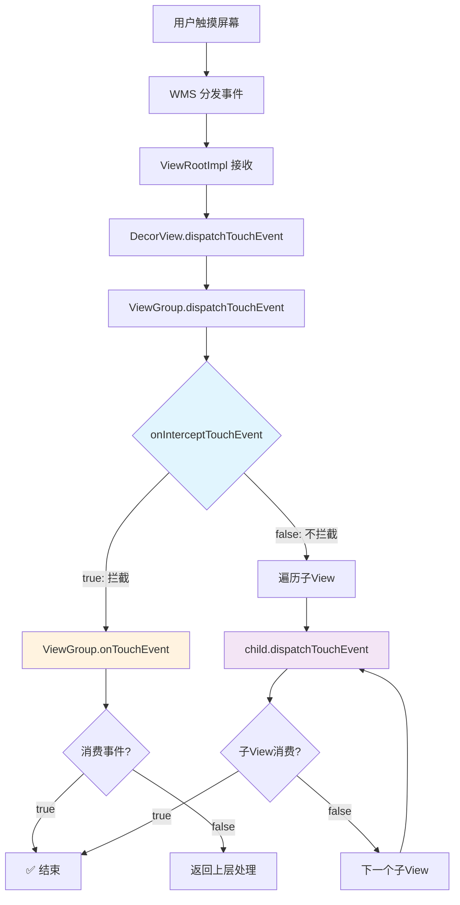

用户问的是 WMS 触摸事件传递机制。这是一个 Android 系统层面的知识问题，我需要详细解释 Android 触摸事件传递的完整流程。

让我整理一下完整的触摸事件传递机制，包括：
1. 硬件层 → InputReader → InputDispatcher
2. WMS (Window Manager Service) 的角色
3. Activity → DecorView → ViewGroup → View 的分发流程
4. 三个关键方法的调用顺序：dispatchTouchEvent → onInterceptTouchEvent → onTouchEvent

同时结合项目中可能遇到的触摸事件问题（如 WebView 嵌套滑动、DrawerLayout 滑动冲突等）给出建议。
## Android WMS 触摸事件传递机制详解

### 一、整体架构图

```
┌─────────────────────────────────────────────────────────────────────────────┐
│                              硬件层                                         │
│                         (触摸屏/鼠标/键盘)                                   │
└───────────────────────────────┬─────────────────────────────────────────────┘
                                │ 原始事件 (Raw Event)
                                ▼
┌─────────────────────────────────────────────────────────────────────────────┐
│                           内核驱动层 (Kernel)                                │
│                      /dev/input/eventX (节点文件)                            │
└───────────────────────────────┬─────────────────────────────────────────────┘
                                │
                                ▼
┌─────────────────────────────────────────────────────────────────────────────┐
│                         InputReader (读取线程)                               │
│  • 读取 /dev/input 节点                                                      │
│  • 解析原始事件 (坐标、压力、时间戳等)                                          │
│  • 转换为 MotionEvent 对象                                                   │
│  • 放入 InputDispatcher 队列                                                  │
└───────────────────────────────┬─────────────────────────────────────────────┘
                                │
                                ▼
┌─────────────────────────────────────────────────────────────────────────────┐
│                        InputDispatcher (分发线程)                             │
│  • 找到目标窗口 (通过 WMS 查询)                                                │
│  • 判断是否需要分发                                                            │
│  • 通过 Socket 发送到目标进程                                                  │
└───────────────────────────────┬─────────────────────────────────────────────┘
                                │ Binder/Socket IPC
                                ▼
┌─────────────────────────────────────────────────────────────────────────────┐
│                    WMS (WindowManagerService) - 系统服务                       │
│                                                                              │
│   ┌─────────────────────────────────────────────────────────────────────┐    │
│   │                     关键职责                                          │    │
│   │  • 管理所有窗口的层级关系 (Z-order)                                     │    │
│   │  • 维护窗口状态 (可见性、焦点、大小、位置)                                  │    │
│   │  • 决定触摸事件应该发送给哪个窗口                                         │    │
│   │  • 处理触摸事件的 "焦点窗口" 和 "触摸目标"                                 │    │
│   └─────────────────────────────────────────────────────────────────────┘    │
└───────────────────────────────┬─────────────────────────────────────────────┘
                                │ 找到目标 Window
                                ▼
┌─────────────────────────────────────────────────────────────────────────────┐
│                          应用进程 (App Process)                              │
│                                                                              │
│   ┌─────────────┐     ┌─────────────┐     ┌─────────────┐                   │
│   │ ViewRootImpl │ ──> │   DecorView  │ ──> │   Activity  │                   │
│   │              │     │             │     │             │                   │
│   │ 接收事件入口  │     │ 根视图       │     │             │                   │
│   └─────────────┘     └──────┬──────┘     └─────────────┘                   │
│                              │ dispatchTouchEvent()                          │
│                              ▼                                              │
│   ══════════════════════════════════════════════════════════════════════     │
│                        View 事件分发链                                        │
│   ══════════════════════════════════════════════════════════════════════     │
│                                                                              │
│   Activity.dispatchTouchEvent()                                              │
│          │                                                                   │
│          ▼                                                                   │
│   PhoneWindow.superDispatchTouchEvent()                                       │
│          │                                                                   │
│          ▼                                                                   │
│   DecorView.dispatchTouchEvent()                                             │
│          │                                                                   │
│          ▼                                                                   │
│   ViewGroup.dispatchTouchEvent()  ←──────────────────────────────┐          │
│          │                                                       │          │
│          ├── onInterceptTouchEvent()  (是否拦截?)                  │          │
│          │      │ true: 自己处理 onTouchEvent()                   │          │
│          │      │ false: 继续分发给子 View                        │          │
│          │      ▼                                               │          │
│          │   child.dispatchTouchEvent()  (递归调用) ◄────────────┘          │
│          │           │                                                 │
│          │           ▼                                                 │
│          │   View.dispatchTouchEvent()                                 │
│          │           │                                                 │
│          │           ├── OnTouchListener.onTouch() (如果设置)            │
│          │           │        │ true: 事件消费, 返回 true               │
│          │           │        │ false: 继续走 onTouchEvent()            │
│          │           │        ▼                                         │
│          │           └── onTouchEvent() (View 自身处理)                  │
│          │                   │ true: 事件消费                          │
│          │                   │ false: 返回父View 处理                  │
│          │                   ▼                                         │
│          └─── 回溯: 如果子 View 都不消费, 父 View onTouchEvent()         │
│                                                                              │
└─────────────────────────────────────────────────────────────────────────────┘
```

---

### 二、WMS 如何决定触摸目标

```java
// InputDispatcher.java (简化逻辑)
void findTouchedWindowTargets(...) {
    // 1. 获取当前焦点窗口
    WindowState focusedWindow = mFocusedWindow;
    
    // 2. 遍历所有窗口 (从 Z-order 最高的开始)
    for (WindowState window : mWindows) {
        // 3. 检查窗口区域是否包含触摸点
        if (window.frame.contains(x, y)) {
            // 4. 检查窗口是否可接受触摸
            if (window.acceptsTouch()) {
                targetWindow = window;
                break;  // 找到最上层的目标窗口
            }
        }
    }
    
    // 5. 将事件发送给目标窗口
    sendMotionEvent(targetWindow, event);
}
```

**窗口优先级规则：**

| 层级 | 窗口类型 | 说明 |
|------|---------|------|
| 最高 | **系统弹窗** | Dialog、PopupWindow、Toast |
| 高 | **Activity 窗口** | 普通 Activity |
| 中 | **子窗口** | DrawerLayout 侧滑、BottomSheet |
| 底层 | **壁纸/输入法** | Wallpaper、IME |

---

### 三、ViewGroup 事件分发核心流程



---

### 四、你项目中的触摸事件相关代码分析

#### 1️⃣ `MyDrawerLayout.java` - 侧滑菜单触摸拦截

```java:1548:1590:c:/D/android_project/erp-pda/app/src/main/java/com/yto/customermanmager/util/MyDrawerLayout.java
@Override
public boolean onInterceptTouchEvent(MotionEvent ev) {
    final int action = ev.getActionMasked();

    final boolean interceptForDrag = mLeftDragger.shouldInterceptTouchEvent(ev)
            | mRightDragger.shouldInterceptTouchEvent(ev);

    boolean interceptForTap = false;

    switch (action) {
        case MotionEvent.ACTION_DOWN:
            // 记录初始触摸位置
            mInitialMotionX = ev.getX();
            mInitialMotionY = ev.getY();
            // 如果遮罩层透明度 > 0 且点击的是内容区，则拦截
            if (mScrimOpacity > 0) {
                final View child = mLeftDragger.findTopChildUnder((int) x, (int) y);
                if (child != null && isContentView(child)) {
                    interceptForTap = true;  // 拦截用于关闭抽屉
                }
            }
            break;
            
        case ACTION_MOVE:
            // 超过 touchSlop 取消延迟预览
            if (mLeftDragger.checkTouchSlop(ViewDragHelper.DIRECTION_ALL)) {
                mLeftCallback.removeCallbacks();
                mRightCallback.removeCallbacks();
            }
            break;
            
        case ACTION_UP:
        case ACTION_CANCEL:
            closeDrawers(true);  // 抬起时关闭抽屉
            break;
    }

    return interceptForDrag || interceptForTap || hasPeekingDrawer() || mChildrenCanceledTouch;
}
```

**作用：** 决定是否将触摸事件拦截给 DrawerLayout 自身处理（如边缘拖拽打开/关闭侧滑）

---

#### 2️⃣ `NestedScrollableHost.kt` - 嵌套滚动触摸处理

```java:51:53:c:/D/android_project/erp-pda/app/src/main/java/com/yto/customermanmagererp/ui/widget/NestedScrollableHost.kt
override fun onInterceptTouchEvent(e: MotionEvent): Boolean {
    // 解决 RecyclerView 嵌套在 NestedScrollView 中的滑动冲突
    return super.onInterceptTouchEvent(e)
}
```

---

### 五、常见触摸事件问题及解决方案

#### ❌ 问题 1：WebView 与原生 View 触摸冲突

```java
// 场景：WebView 页面内嵌原生按钮，点击无响应或被 WebView 吞噬
// 原因：WebView 默认会消费大部分触摸事件

// ✅ 解决方案：在父容器拦截特定区域的触摸事件
@Override
public boolean onInterceptTouchEvent(MotionEvent ev) {
    float x = ev.getX();
    float y = ev.getY();
    // 如果触摸在原生按钮区域内，拦截事件不让 WebView 处理
    if (isInNativeButtonArea(x, y)) {
        return true;  // 拦截
    }
    return super.onInterceptTouchEvent(ev);
}
```

#### ❌ 问题 2：RecyclerView 嵌套滑动冲突

```kotlin
// 你的项目中已有此组件
class NestedScrollableHost : FrameLayout {

    override fun onInterceptTouchEvent(e: MotionEvent): Boolean {
        // 判断是垂直还是水平滚动，决定是否拦截
        when (e.action) {
            MotionEvent.ACTION_DOWN -> {
                startTouchX = e.x
                startTouchY = e.y
                parent.requestDisallowInterceptTouchEvent(false)
            }
            MotionEvent.ACTION_MOVE -> {
                val dx = abs(e.x - startTouchX)
                val dy = abs(e.y - startTouchY)
                // 水平滑动更多时，请求父容器不要拦截
                if (dx > dy) {
                    parent.requestDisallowInterceptTouchEvent(true)
                }
            }
        }
        return super.onInterceptTouchEvent(e)
    }
}
```

#### ❌ 问题 3：触摸事件被某个 View 全部消费

```java
// 调试技巧：添加日志追踪事件流向
@Override
public boolean dispatchTouchEvent(MotionEvent ev) {
    Log.d("Touch", "dispatchTouchEvent: " + actionToString(ev.getAction()));
    boolean handled = super.dispatchTouchEvent(ev);
    Log.d("Touch", "dispatchTouchEvent 结果: " + handled);
    return handled;
}

@Override
public boolean onInterceptTouchEvent(MotionEvent ev) {
    Log.d("Touch", "onInterceptTouchEvent: " + actionToString(ev.getAction()));
    return super.onInterceptTouchEvent(ev);
}

@Override
public boolean onTouchEvent(MotionEvent ev) {
    Log.d("Touch", "onTouchEvent: " + actionToString(ev.getAction()));
    return super.onTouchEvent(ev);
}
```

---

### 六、完整的事件流转伪代码

```
用户手指按下 (ACTION_DOWN)
        │
        ▼
【内核】生成 Raw Event 写入 /dev/input/event0
        │
        ▼
【InputReaderThread】读取并解析为 NotifyMotionArgs
        │
        ▼
【InputDispatcherThread】查询 WMS 找到目标 WindowState
        │  ├─ 检查窗口可见性
        │  ├─ 检查窗口是否包含触点坐标
        │  └─ 检查窗口 FLAG (FLAG_NOT_TOUCHABLE 等)
        │
        ▼
【InputChannel】通过 Socket 将事件发送给应用进程
        │
        ▼
【ViewRootImpl】enqueueInputEvent() → doProcessInputEvents()
        │
        ▼
【DecorView】dispatchTouchEvent(MotionEvent)
        │
        ▼
【ViewGroup】onInterceptTouchEvent()
        │  ├─ return true  → 自己的 onTouchEvent()
        │  └─ return false → child.dispatchTouchEvent()
        │                       │
        │                       ▼
        │                 【View】OnTouchListener.onTouch()
        │                       │
        │                       ▼
        │                 【View】onTouchEvent()
        │                       │  ├─ return true  → 事件消费完成 ✅
        │                       └─ return false → 向上回溯 ⬆️
        │
        └── 如果所有子View都不消费 → 父View.onTouchEvent()
                                      │
                                      └── 最终回到 Activity → 丢弃事件 ❌
```

---
