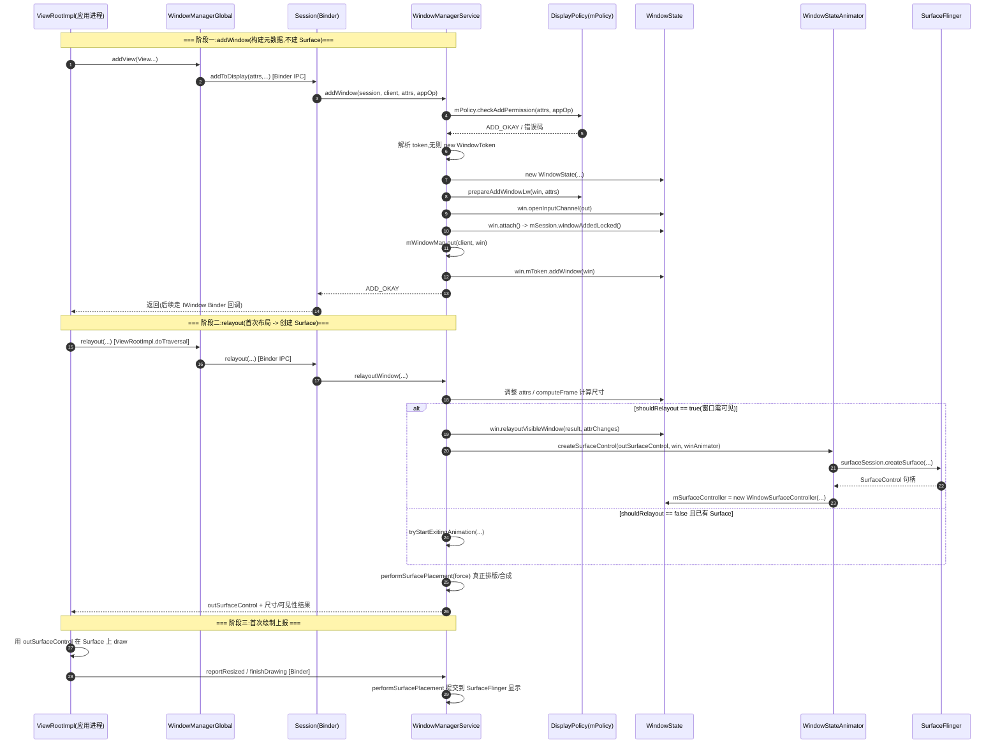
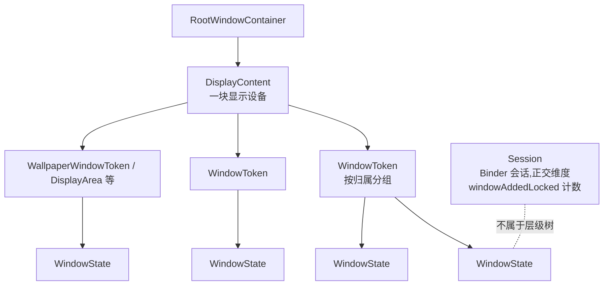
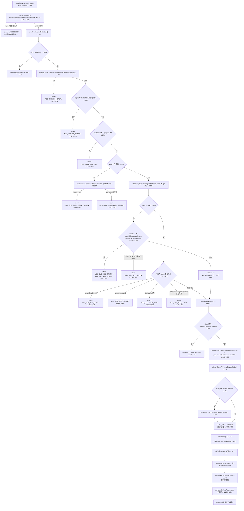

# WMS 窗口添加 / 移除流程总图（含 relayout 与 Surface 创建时机、层级关系）

> 基于 Android 10 (cells-android10) 源码。核心文件:
> - `frameworks/base/services/core/java/com/android/server/wm/WindowManagerService.java`
> - `frameworks/base/services/core/java/com/android/server/policy/PhoneWindowManager.java`
> - `frameworks/base/services/core/java/com/android/server/wm/WindowState.java`
> - `frameworks/base/services/core/java/com/android/server/wm/WindowStateAnimator.java`
> - `frameworks/base/services/core/java/com/android/server/wm/WindowToken.java`
> - `frameworks/base/services/core/java/com/android/server/wm/DisplayContent.java`

## 一、关键结论速览

- 客户端每加一个 View（`WindowManagerGlobal.addView`）→ 跨进程 `Session.addToDisplay` → `WMS.addWindow`。
- `addWindow` 只做"元数据建模"：权限校验、建 `WindowState`、挂入层级树、开输入通道，**不创建 Surface**。
- 真正的 `SurfaceControl` 在客户端第一次 `relayoutWindow`（`ViewRootImpl` 执行 `relayout`）时，于 `relayoutWindow` 内 `createSurfaceControl`（仅 `shouldRelayout == true`）创建。
- 移除是两段式：`removeIfPossible`（延迟判活）→ `removeImmediately`（立即销毁）→ `postWindowRemoveCleanupLocked`（收尾簿记）。
- 层级树归属维度：`DisplayContent → WindowToken → WindowState`；`Session` 是 Binder 会话，正交于此树。
- `mPolicy.checkAddPermission` 在 `addWindow` 第 1 步校验权限，并通过 `outAppOp[0]` 回写 AppOps 码供后续 `initAppOpsState` / `resetAppOpsState` 使用。

---

## 二、添加 / 移除 主流程总图

### 2.1 添加（addWindow）

```
客户端 ViewRootImpl
  └─ WindowManagerGlobal.addView
       └─ Session.addToDisplay (Binder IPC)
            └─ WMS.addWindow(session, client, attrs, appOp)
                 │
                 ├─ 1. mPolicy.checkAddPermission(attrs, appOp)   ← 权限守门员
                 │      返回 ADD_OKAY 才继续,否则直接返回错误码
                 ├─ 2. 解析/校验 attrs.token、displayId
                 │      找不到 WindowToken 时:new WindowToken(...) 新建
                 ├─ 3. new WindowState(...)  创建窗口对象
                 │      检查客户端是否还活着(DeathRecipient)
                 ├─ 4. displayPolicy.prepareAddWindowLw(win, attrs)  ← DisplayPolicy 再校验
                 ├─ 5. win.openInputChannel(outInputChannel)  开输入通道
                 ├─ 6. win.attach()  → mSession.windowAddedLocked()
                 │      mWindowMap.put(client.asBinder(), win)  登记全局索引
                 └─ 7. win.mToken.addWindow(win)  挂入 WindowToken 层级,返回 ADD_OKAY
```

### 2.2 移除（removeWindow）

```
Session.remove(window) / DeathRecipient 触发
  └─ WMS.removeWindow(session, client)
       └─ win.removeIfPossible()              ← 阶段一:延迟移除(可被打断)
            ├─ 标记 mWindowRemovalAllowed = true
            └─ 条件满足时 → removeImmediately()
       └─ win.removeImmediately()             ← 阶段二:立即销毁
            ├─ displayPolicy.removeWindowLw(this)
            ├─ disposeInputChannel()
            ├─ mWinAnimator.destroySurfaceLocked()  销毁 Surface
            ├─ mSession.windowRemovedLocked()  引用计数 -1
            └─ mClient.asBinder().unlinkToDeath(...)
       └─ mWmService.postWindowRemoveCleanupLocked(this)  ← 收尾
            ├─ mWindowMap.remove(win.mClient)
            ├─ win.resetAppOpsState()
            └─ 若 WindowToken 变空则清理 token
```

---

## 三、细化时序图（含 relayout 与 Surface 创建时机）

关键区别：`addWindow` 阶段**不创建 Surface**，只建立 `WindowState`、接入层级树、打开输入通道。
真正的 `SurfaceControl` 在客户端第一次 `relayoutWindow` 时才创建。



要点：
- Surface 按需、按可见性创建。`relayoutWindow` 内只有 `shouldRelayout == true` 才走到 `createSurfaceControl`（WMS 约 2204 行）；不可见或已有 Surface 走退出动画分支。
- `createSurfaceControl` → `winAnimator.createSurfaceLocked()` → 通过 `SurfaceSession` 向 `SurfaceFlinger` 申请 `SurfaceControl`，包装成 `WindowSurfaceController` 存入 `WindowStateAnimator.mSurfaceController`。
- `attach()` 阶段只做会话登记，绝不涉及 Surface。

---

## 四、WindowToken 与 DisplayContent 层级关系

WMS 窗口树是 `WindowContainer` 派生树：



各层职责：
- `DisplayContent`：代表一块显示设备。addWindow 时 `getDisplayContentOrCreate(displayId)` 取对应屏；`WindowToken` 创建后登记进 `DisplayContent` 的 token 映射，按屏分组布局与合成。它持有 `WindowToken`，不直接持有 `WindowState`。
- `WindowToken`（继承 `WindowContainer`）：把语义相关窗口聚合统一调度（可见性/动画/z 序）。addWindow 时若 `attrs.token` 为空或找不到对应 token，则 `new WindowToken(...)`；关键方法 `addWindow(WindowState)`（`WindowToken.java:199`）将 `WindowState` 加入 children。与 App 的绑定（`AppWindowToken` / `ActivityRecord`）由 Activity 启动时 AMS/WMS 协同建立。
- `WindowState`：树叶子，构造时保存 `mToken = token`（约 742 行），`attach()`（约 825 行）只触发 `mSession.windowAddedLocked`，真正"挂树"是 `mToken.addWindow(win)`；持有 `WindowStateAnimator mWinAnimator`（Surface/动画承载者）。
- `Session`：Binder 会话代理，一个应用进程一个，维护引用计数（`windowAddedLocked` / `windowRemovedLocked`），与层级树正交。

移除时回收：`WindowState.removeImmediately` → `displayPolicy.removeWindowLw` → `mSession.windowRemovedLocked` → `postWindowRemoveCleanupLocked`：从 `WindowToken` children 移除 `WindowState`，token 空则 `DisplayContent` 清理该 token，最后 `mWindowMap.remove(client)` 注销索引。

---

## 五、与 checkAddPermission 的衔接

`addWindow` 第 1 步 `mPolicy.checkAddPermission`（PhoneWindowManager 实现）返回 `ADD_OKAY` 才继续；
它通过 `outAppOp[0]` 回写对应 AppOps 码（`OP_SYSTEM_ALERT_WINDOW` / `OP_TOAST_WINDOW` / `OP_NONE`），
在步骤 7 之后由 `win.initAppOpsState()` 消费，移除时 `win.resetAppOpsState()` 复位。

---

## 六、添加 / 移除 代码详细流程图（精确到行号与分支）

下图把 `addWindow`（WMS 1276-1563）与 `removeIfPossible` → `removeImmediately` → `postWindowRemoveCleanupLocked` 的真实分支逐行展开。

### 6.1 addWindow 详细流程（WindowManagerService.java:1276）



要点：
- 所有 `return` 错误码都在 `synchronized(mGlobalLock)` 内、进入 `new WindowState` 之前完成（除 `ADD_APP_EXITING` 还会查 DeathRecipient）。
- `token` 为 null 且 rootType 属于应用/系统关键类型时一律 `ADD_BAD_APP_TOKEN`，普通系统窗口才 `new WindowToken` 兜底（1396）。
- `prepareAddWindowLw`（1488）是 DisplayPolicy 的二次闸门；通过后才 `attach`（1542）与 `mWindowMap.put`（1543）。

### 6.2 removeIfPossible → removeImmediately → 收尾 详细流程

```mermaid
flowchart TD
    A["removeWindow(session,client)  WMS L1808"] --> B["win=windowForClientLocked(session,client)  L1810"]
    B -->|win==null| BX["return  L1811-1813"]
    B -->|win 找到| C["win.removeIfPossible()  L1814"]
    C --> D["removeIfPossible(keepVisibleDeadWindow=false)  L1971<br/>super.removeIfPossible(); mWindowRemovalAllowed=true  L1970-1975"]
    D --> E["disposeInputChannel()  L1992"]
    E --> F{"mHasSurface && mToken.okToAnimate()?  L2017"}
    F -->|否| Z["removeImmediately()  L2088"]
    F -->|是| G{"mWillReplaceWindow?  L2018"}
    G -->|是| G1["mAnimatingExit=true; mReplacingRemoveRequested=true; return  L2027-2029<br/>(保留直到新窗加入)"]
    G -->|否| H{"keepVisibleDeadWindow?  L2035"}
    H -->|是| H1["mAppDied=true; 重建 input channel; return  L2039-2047<br/>(应用死但窗口可见,兼容保留)"]
    H -->|否| I{"wasVisible?  L2050"}
    I -->|是| I1["applyAnimationLocked(TRANSIT_EXIT)  L2054<br/>mAnimatingExit=true; requestTraversal()"]
    I -->|否| J
    I1 --> J{"Surface 正在显示 且 mAnimatingExit<br/>且 非最后 starting 窗?  L2075"}
    J -->|是| JX["setupWindowForRemoveOnExit(); return  L2080-2084<br/>(等退出动画播完)"]
    J -->|否| Z
    Z --> Z1["removeImmediately()  WS L1920"]
    Z1 --> Z2{"mRemoved?  L1923"}
    Z2 -->|是| Z2X["return  L1924-1928"]
    Z2 -->|否| Z3["mRemoved=true  L1930"]
    Z3 --> Z4{"isInputMethodTarget()?  L1938"}
    Z4 -->|是| Z4a["dc.computeImeTarget(true)  L1939"]
    Z4 -->|否| Z5
    Z4a --> Z5["从 mTapExcludedWindows /<br/>mTapExcludeProvidingWindows 移除  L1943-1949"]
    Z5 --> Z6["dc.getDisplayPolicy().removeWindowLw(this)  L1951"]
    Z6 --> Z7["disposeInputChannel()  L1953"]
    Z7 --> Z8["mWinAnimator.destroyDeferredSurfaceLocked()  L1955<br/>mWinAnimator.destroySurfaceLocked()  L1956"]
    Z8 --> Z9["mSession.windowRemovedLocked()  引用计数-1  L1957"]
    Z9 --> Z10["mClient.unlinkToDeath(mDeathRecipient)  L1959"]
    Z10 --> Z11["mWmService.postWindowRemoveCleanupLocked(this)  L1965"]

    Z11 --> C1["postWindowRemoveCleanupLocked(win)  WMS L1825"]
    C1 --> C2["mWindowMap.remove(win.mClient)  L1827"]
    C2 --> C3["win.resetAppOpsState()  复位 appOp  L1831"]
    C3 --> C4["mPendingRemove / mResizingWindows 移除  L1837-1838"]
    C4 --> C5["updateNonSystemOverlayWindowsVisibilityIfNeeded  L1839"]
    C5 --> C6{"displayContent.mInputMethodWindow==win?  L1844"}
    C6 -->|是| C6a["setInputMethodWindowLocked(null)  L1845"]
    C6 -->|否| C7["若 WindowToken 变空 → DisplayContent 清理 token<br/>(WindowToken 内部 removeChild)"]
    C7 --> C8["performSurfacePlacement 重排版/合成  L1848+"]
```



要点：
- 移除之所以拆两段，核心在 `removeIfPossible` 的 `L2017 / L2075` 判定：只要窗口**有 Surface 且正在播放退出动画**，就 `return` 暂不强拆，等动画结束由 `WindowStateAnimator` 回调再次进入 `removeImmediately`（`setupWindowForRemoveOnExit` 机制）。
- `mWillReplaceWindow`（2018）与 `keepVisibleDeadWindow`（2035）是两类"延迟保留"特例：前者等无缝替换的新窗，后者兼容"应用已死但窗口还可见"的用户可点击重启场景。
- `removeImmediately`（1920）是真正销毁点：`destroySurfaceLocked`（1956）销毁 Surface、`windowRemovedLocked`（1957）释放 Session 引用、`unlinkToDeath`（1959）解绑死亡监听，最后交给 `postWindowRemoveCleanupLocked`（1825）做全局簿记与 `mWindowMap` 注销。
- 整条链路都在 `synchronized(mGlobalLock)` 内，保证与 `addWindow`、布局、合成互斥。
