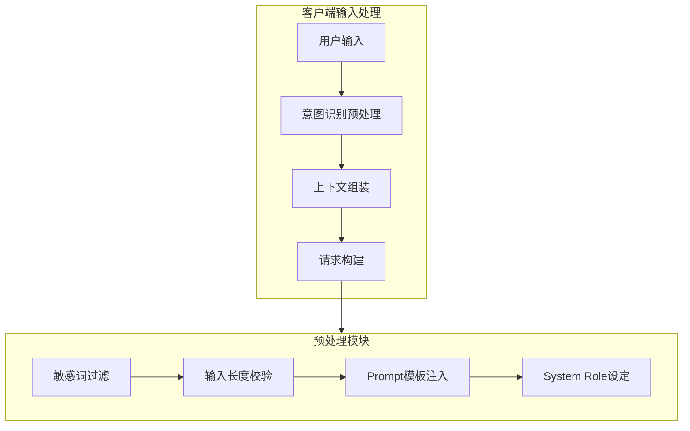
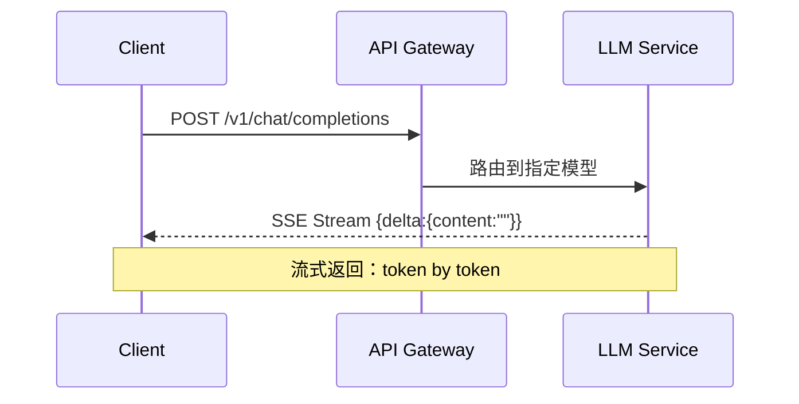
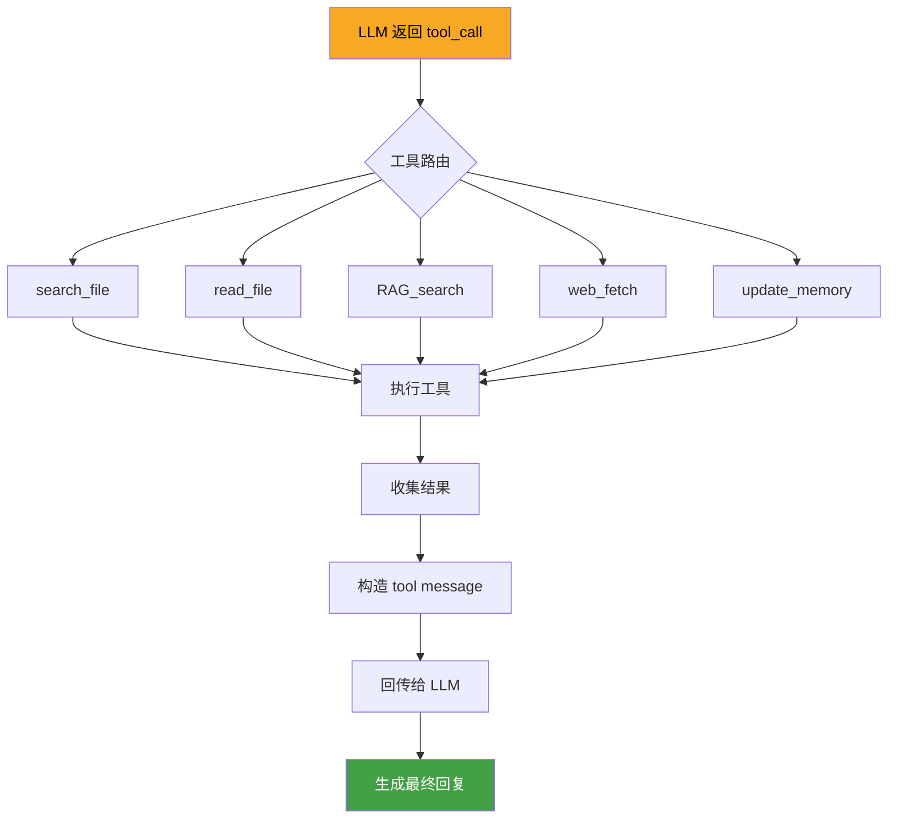
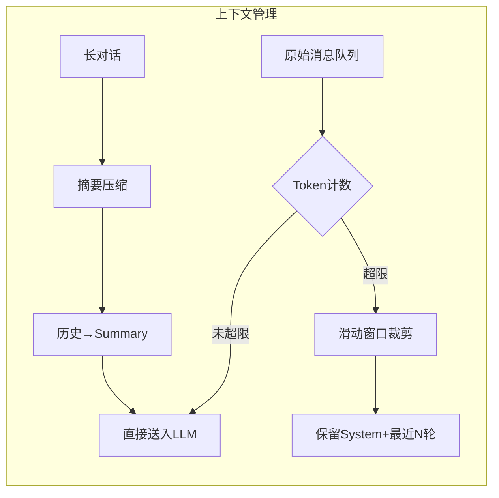
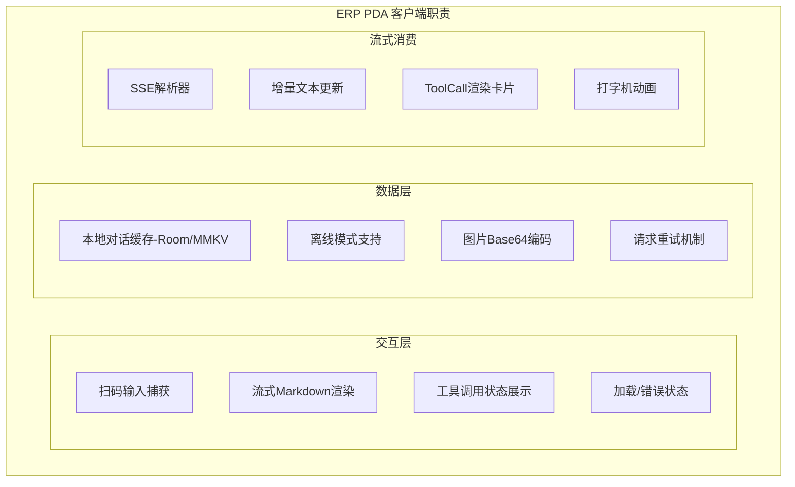
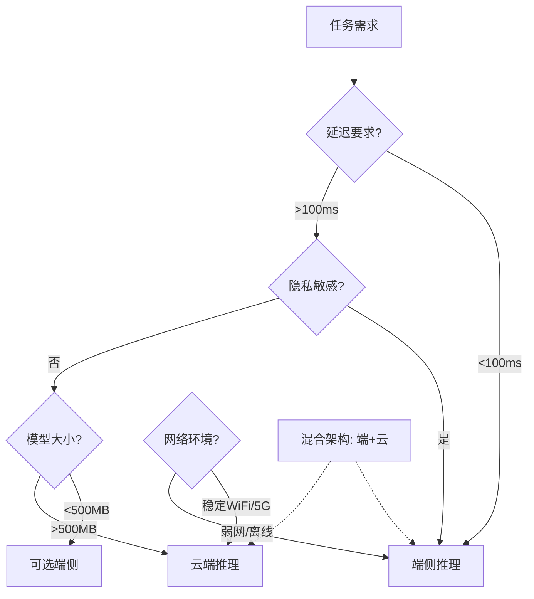
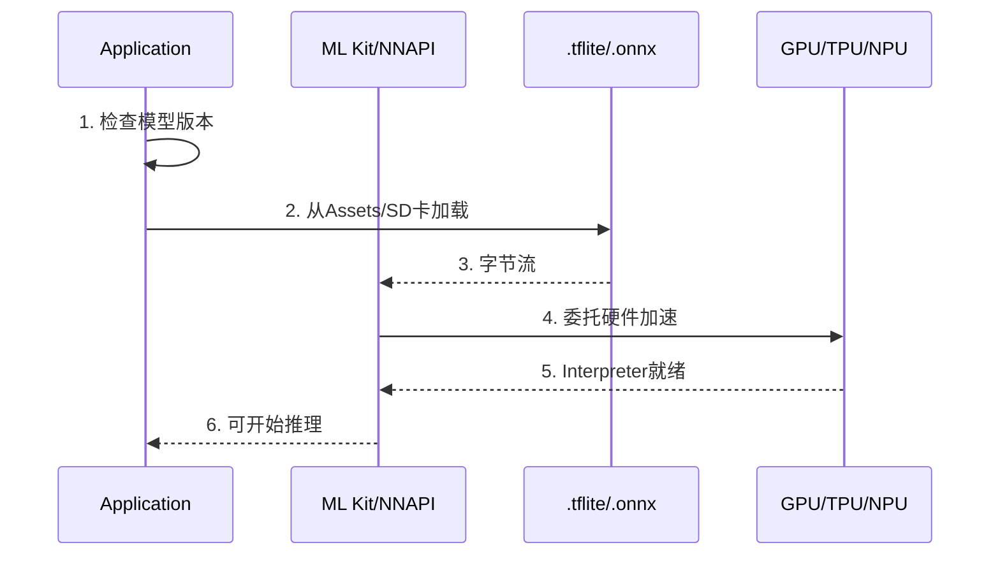
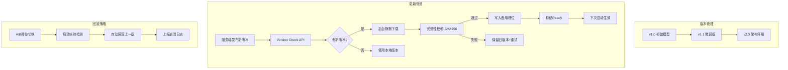
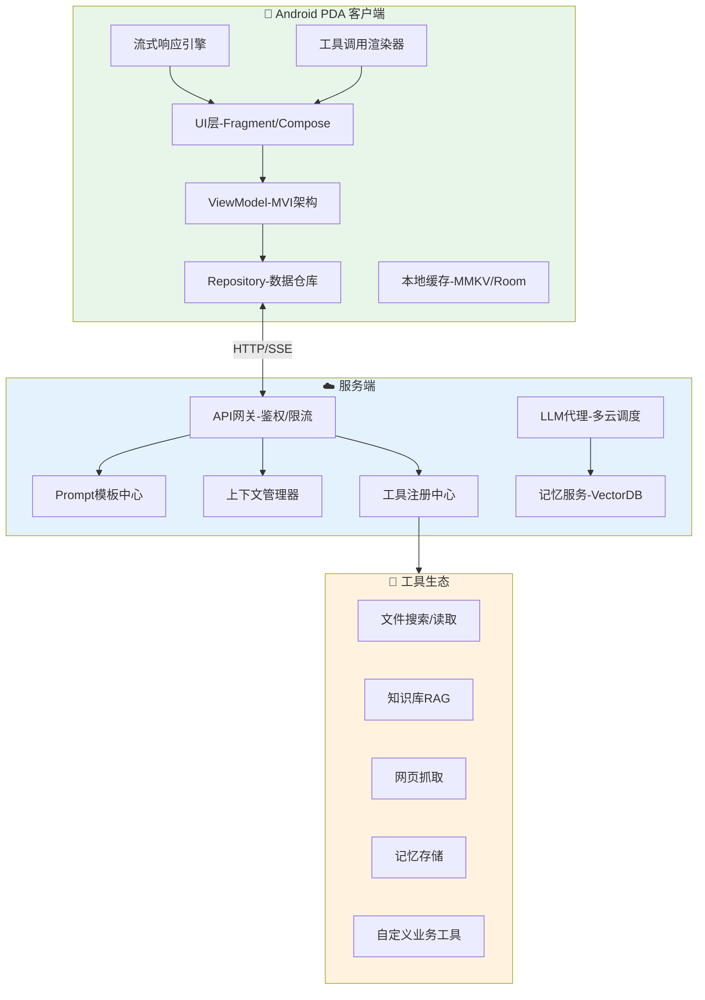
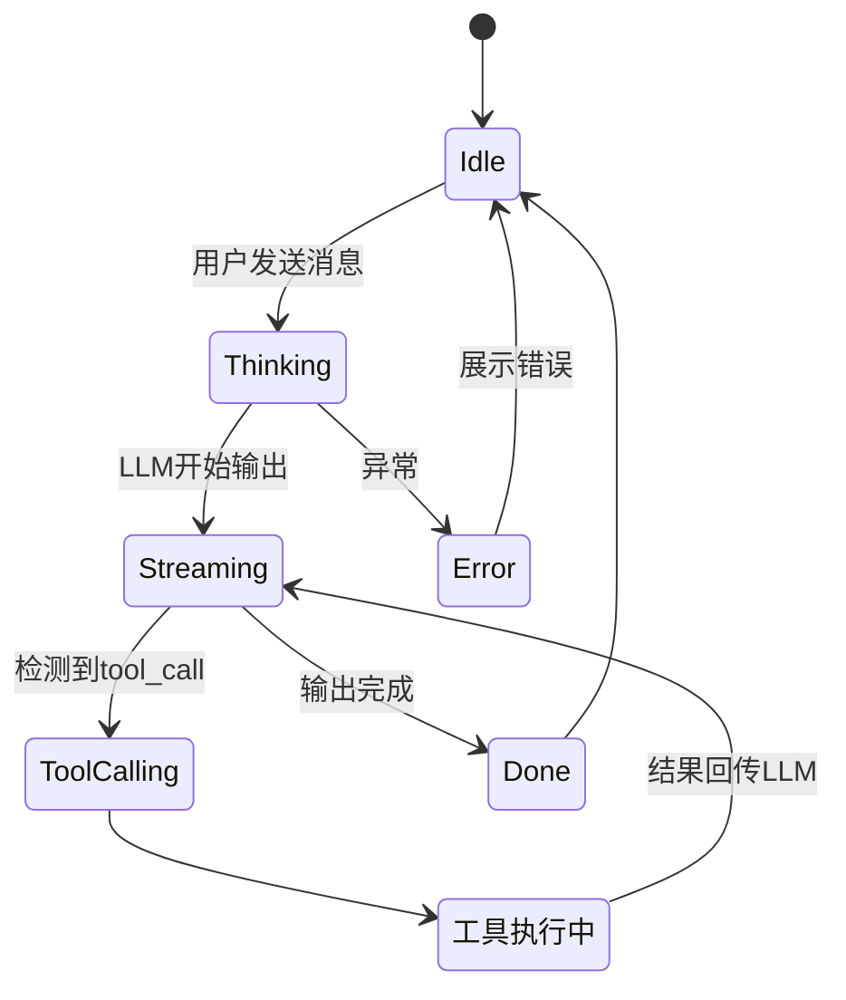

让我先看看当前打开的文件，了解项目上下文，然后给出一个系统性的回答。
我来为您系统性地解答这个 AI Agent + 模型部署的技术体系。先看一下您当前项目的代码，结合实际场景来分析。
用户分享了一个非常全面的技术学习路线图，涉及 AI Agent 架构、模型部署、端云协同、技术表达等多个技能点。让我结合当前项目的实际情况，给出系统性的技术解答。


我来为您系统性解答这套 **AI Agent + 模型部署** 技术体系。这是一个非常完整且实用的技术成长路线图！

---

# 📐 技能 10：AI Agent 架构设计

## Q13：AI Agent 完整架构（标准面试回答结构）

### 1. 输入处理层



**核心职责：**
| 模块 | 功能 | 您项目可应用场景 |
|------|------|------------------|
| 输入解析 | 扫描条码/语音/文本统一入口 | 盘点扫码 → 文本化 → 送入Agent |
| 预处理 | 脱敏、格式校验、Prompt注入 | 条码格式标准化、仓库ID自动注入 |
| 请求构建 | 组装 messages + tools 定义 | 构建 `{"role":"user","content":"扫描到条码xxx..."}` |

### 2. LLM 推理引擎



**关键能力矩阵：**

| 能力维度 | 说明 | 技术实现 |
|----------|------|----------|
| **多模态理解** | 文本+图像+条码 | Vision API / 多模态模型 |
| **推理决策** | 判断是否需要调用工具 | Function Calling |
| **流式输出** | SSE 实时推送 | `text/event-stream` |
| **上下文窗口** | 管理Token限制 | Sliding Window / Summary |

### 3. 工具调用系统 (Function Calling)

这是 AI Agent 的**核心差异化能力**：



**工具定义 Schema 示例（您当前对话中正在使用的模式）：**

```json
{
  "name": "search_file",
  "description": "支持通配符的文件搜索",
  "parameters": {
    "target_directory": "必须，绝对路径",
    "pattern": "*.kt",
    "recursive": true,
    "case_sensitive": false
  }
}
```

### 4. 上下文管理策略



**三种主流策略对比：**

| 策略 | 适用场景 | 优点 | 缺点 |
|------|----------|------|------|
| **Sliding Window** | 短对话 | 简单高效 | 丢失早期信息 |
| **Summarization** | 长对话 | 保留关键信息 | 压缩损失细节 |
| **Vector RAG** | 知识库场景 | 精准检索 | 需要额外基础设施 |

### 5. 客户端职责（Android/PDA 端）

结合您的 **InventoryQuickCheckFragment** 项目：



---

# 📦 技能 11：模型部署与端云协同

## Q14：端侧 AI vs 云 AI 决策框架

### 决策树



### 五维对比表

| 维度 | 端侧 AI (Edge) | 云 AI (Cloud) | 权衡建议 |
|------|----------------|---------------|----------|
| **延迟** | ⚡ 10-50ms | 🌐 200-2000ms | PDA扫码需即时反馈→端侧 |
| **成本** | 💰 一次性硬件 | 💳 按Token计费 | 高频调用→端侧 |
| **隐私** | 🔒 数据不出设备 | ☁️ 数据上传 | 敏感数据→端侧 |
| **能力** | 📦 小模型(1-7B) | 🚀 大模型(GPT-4级) | 复杂推理→云端 |
| **离线** | ✅ 完全可用 | ❌ 依赖网络 | 仓库弱网→端侧 |

### 针对 **ERP PDA 场景**的推荐方案：

```
┌──────────────────────────────────────────────────────┐
│                  PDA 端云协同架构                      │
├──────────────────────────────────────────────────────┤
│  ┌─────────────────┐    ┌─────────────────────────┐  │
│  │   端侧 (Edge)   │    │     云端 (Cloud)        │  │
│  ├─────────────────┤    ├─────────────────────────┤  │
│  │ • 条码/OCR识别   │    │ • 复杂盘点异常分析      │  │
│  │ • 商品分类(小模型)│   │ • 库存趋势预测          │  │
│  │ • 语音指令识别   │    │ • 自然语言报表生成      │  │
│  │ • 本地规则引擎   │    │ • 多仓库数据聚合        │  │
│  │ • 离线缓存回复   │    │ • 模型持续训练          │  │
│  └─────────────────┘    └─────────────────────────┘  │
│           ↓                       ↓                   │
│  ┌─────────────────────────────────────────────────┐ │
│  │              智能调度器 (Router)                  │ │
│  │  规则: 简单任务→端侧 | 复杂任务→云端 | 弹性降级  │ │
│  └─────────────────────────────────────────────────┘ │
└──────────────────────────────────────────────────────┘
```

## Q15：Android 模型部署完整流程

### 1️⃣ 模型加载流程



### 关键代码结构（以 TensorFlow Lite 为例）：

```kotlin
// Android 端侧推理核心流程
class EdgeModelEngine(context: Context) {
    
    // ① 模型加载
    private fun loadModel(): Interpreter {
        val buffer = loadModelFile("inventory_classifier.tflite")
        val options = Interpreter.Options().apply {
            setNumThreads(4)  // 多线程加速
            setUseNNAPI(true) // NPU加速委托
        }
        return Interpreter(buffer, options)
    }
    
    // ② 输入预处理
    fun preprocess(scanCode: String): FloatArray {
        return tokenizeAndEmbed(scanCode) // Tokenize → Embedding
    }
    
    // ③ 推理执行
    fun infer(input: FloatArray): FloatArray {
        val output = Array(1) { FloatArray(numClasses) }
        interpreter.run(input, output)
        return output[0]
    }
    
    // ④ 后处理
    fun postprocess(rawOutput: FloatArray): PredictionResult {
        val maxIdx = rawOutput.indices.maxByOrNull { rawOutput[it] }!!
        return PredictionResult(
            label = labels[maxIdx],
            confidence = rawOutput[maxIdx],
            latency = measureTimeMillis { } 
        )
    }
}
```

### 性能瓶颈与优化策略

| 瓶颈 | 优化方案 | 预期提升 |
|------|----------|----------|
| **模型加载慢** | 增量下载、预加载、懒加载 | 冷启动 -60% |
| **推理延迟高** | 模型量化(INT8)、GPU/NPU委托、算子融合 | 推理速度 3-5x |
| **内存占用大** | 模型剪枝、知识蒸馏 | 内存 -40%-70% |
| **电池消耗** | 批量推理、硬件加速 | 功耗 -30% |

## Q16：模型更新机制设计



**A/B 槽位更新机制（推荐）：**

```
/data/models/
├── slot_a/
│   ├── model.tflite       # 当前活跃模型
│   ├── version.json       # 版本元信息
│   └── checksum.sha256
└── slot_b/
    ├── model.tflite       # 下载中的新模型
    ├── version.json
    └── checksum.sha256    # 下载完成后校验
```

---

# 🎯 技能 12：技术表达与决策

## Q17：AI 助手 App 系统设计（综合题）

### 完整架构图



### 对话管理状态机



---

# 💡 结合您当前项目的落地建议

基于 `InventoryQuickCheckFragment.kt` 的盘点场景，AI Agent 可以这样赋能：

| 当前手动操作 | AI Agent 增强 | 技术方案 |
|-------------|---------------|----------|
| 扫码后人工匹配商品 | 自动识别+智能推荐 | 端侧轻量分类模型 |
| 盘点差异人工判断 | 异常原因智能分析 | 云端LLM + 历史数据 |
| 操作步骤死板 | 自然语言交互引导 | 对话式Agent |
| 错误提示固定文案 | 上下文化智能提示 | RAG + 操作手册库 |
| 离线无法辅助 | 端侧离线模型兜底 | Edge AI |

---

## ✅ 达标自检清单

| 技能 | 达标判定 | 您的状态 |
|------|----------|----------|
| **技能10** AI Agent 架构 | □ 有可运行 Demo | 📝 已掌握理论，建议搭建一个带工具调用的 Demo |
| **技能11** 模型部署 | □ 能画部署架构图 | ✅ 上面的 Mermaid 图可直接用于文档 |
| **技能12** 技术表达 | □ 每个项目都有量化数据 | 📝 建议为当前项目补充性能基线数据 |

---

如果您需要我：
1. **深入某个具体技能点**（比如写一个 Android 端侧推理的 Demo）
2. **帮您设计 ERP PDA 的 AI Agent 落地方案**
3. **准备面试模拟问答**

请告诉我！我可以进一步展开或提供代码示例。
