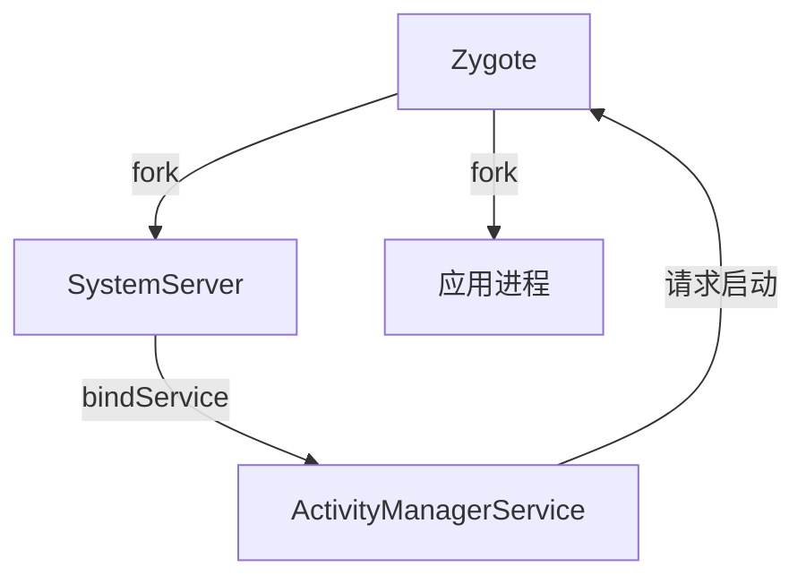

Android 系统为提升应用启动性能，除了 **USAP（Unspecialized App Process Pool）** 机制外，还实现了一系列优化措施，覆盖 **预加载、资源共享、进程管理、编译优化** 等多个维度。以下是关键机制的详细解析：  
  
  
### **一、Zygote 机制（核心基础）**  
#### **1. 预加载与写时复制（Copy-on-Write）**  
- **预加载**：Zygote 启动时预先加载常用类（如 `android.jar`）、资源（如 Drawable）和共享库（如 libart.so）。  
- **写时复制**：子进程通过 fork 共享 Zygote 内存空间，仅在修改时复制物理页面，显著减少内存占用和启动耗时。  
  
#### **2. 启动流程优化**  

  
  
### **二、ART 运行时优化**  
#### **1. AOT 编译（Ahead-Of-Time）**  
- **原理**：安装应用时将字节码编译为机器码，启动时直接加载，省去 JIT 编译过程。  
- **版本演进**：  
- Android 5.0（Lollipop）：强制 AOT 编译，安装慢但启动快。  
- Android 7.0（Nougat）：混合编译（AOT + JIT），平衡安装时间和运行效率。  
- Android 10+：Profile-guided AOT，基于用户使用习惯编译高频代码路径。  
  
#### **2. App Startup Time 优化**  
- **Profile 收集**：记录应用启动时加载的类和方法，生成 `profiles.pb` 文件。  
- **增量编译**：更新应用时，仅重新编译变化的代码。  
- **App Image 生成**：将常用类预编译为 `.art` 文件，加速类加载。  
  
  
### **三、资源与布局优化**  
#### **1. 资源预加载**  
- **资源表缓存**：Android 9+ 将资源表（Resource Table）缓存在内存中，避免重复解析 APK。  
- **Bitmap 预加载**：通过 `BitmapFactory.Options.inBitmap` 复用内存块，减少 GC 压力。  
  
#### **2. 布局优化**  
- **ViewStub**：延迟加载非关键布局，启动时仅加载必要部分。  
- **ConstraintLayout**：扁平化布局层级，减少测量和布局时间。  
- **布局加载器优化**：Android 12+ 引入 `ViewTreeLifecycleOwner`，提前初始化布局组件。  
  
  
### **四、进程管理与调度**  
#### **1. 进程优先级调整**  
- **前台进程特权**：启动前台应用时，系统临时提升 Zygote 优先级（`SCHED_FIFO`），确保快速响应。  
- **后台进程限制**：通过 `oom_adj` 控制后台进程资源分配，避免与前台应用竞争。  
  
#### **2. 快速启动（Quick Boot）**  
- **状态恢复**：Android 10+ 支持将系统状态保存到磁盘，重启时快速恢复（如 `adb reboot quickboot`）。  
- **应用快照**：冻结应用状态，下次启动时直接恢复界面（需应用支持）。  
  
  
### **五、代码与编译优化**  
#### **1. 冷启动路径优化**  
- **Application 轻量化**：减少 `Application.onCreate()` 中的耗时操作。  
- **懒加载**：将非关键初始化推迟到主线程空闲时（如 `IdleHandler`）。  
  
#### **2. 编译工具链优化**  
- **R8 混淆器**：比 ProGuard 更高效，减少 APK 体积并优化字节码。  
- **Dex 优化**：通过 `dex2oat` 参数（如 `--instruction-set-features`）针对特定设备优化。  
  
  
### **六、系统级优化机制**  
#### **1. 内存预读（Memory Prefetching）**  
- **Page Cache 优化**：系统预测应用启动时需要的页面，提前加载到内存。  
- **Swap 策略**：优先换出不常用进程，确保启动时内存充足。  
  
#### **2. 系统服务优化**  
- **服务延迟启动**：非关键系统服务（如 `media.audio_flinger`）延迟到系统空闲时启动。  
- **服务共享**：多个应用共享同一服务实例（如 `ContentProvider`）。  
  
#### **3. 省电模式优化**  
- **Doze 模式**：后台应用进入深度休眠，前台应用启动时临时豁免。  
- **App Standby**：未使用应用限制后台活动，启动时快速激活。  
  
  
### **七、硬件加速与驱动优化**  
#### **1. GPU 预渲染**  
- **SurfaceFlinger 优化**：提前合成界面帧，减少首屏显示延迟。  
- **HWC（Hardware Composer）**：硬件层合成，减轻 CPU 负担。  
  
#### **2. 存储优化**  
- **F2FS 文件系统**：相比 ext4，读写性能提升 30%+，加速 APK 解析。  
- **分区存储**：Android 10+ 限制应用访问共享存储，减少 I/O 开销。  
  
  
### **八、应用侧优化建议**  
1. **减少主线程阻塞**：  
```java  
// 错误示例：主线程执行网络请求  
public void onCreate() {  
String data = fetchDataFromNetwork(); // 阻塞主线程  
setContentView(data);  
}  
  
// 正确示例：异步加载  
public void onCreate() {  
setContentView(R.layout.main);  
CompletableFuture.runAsync(() -> {  
String data = fetchDataFromNetwork();  
runOnUiThread(() -> updateUI(data));  
});  
}  
```  
  
2. **懒加载非关键组件**：  
```java  
// 使用 ViewTreeObserver 监听布局完成后再加载  
view.getViewTreeObserver().addOnGlobalLayoutListener(() -> {  
loadNonCriticalResources();  
});  
```  
  
3. **使用 Jetpack App Startup**：  
```kotlin  
// 声明式初始化，避免 Application 膨胀  
class MyInitializer : Initializer<Unit> {  
override fun create(context: Context) {  
// 初始化代码  
}  
  
override fun dependencies() = emptyList<Class<out Initializer<*>>>()  
}  
```  
  
  
### **总结**  
Android 系统通过 **分层协作** 提升启动性能：  
- **底层优化**：ART 编译、内存管理、存储 I/O。  
- **系统级机制**：Zygote、USAP、进程调度。  
- **应用侧支持**：懒加载、异步初始化、工具链优化。  
  
这些机制共同作用，确保应用启动时间从早期 Android 的 **数秒级** 优化至现代设备的 **毫秒级**，显著提升用户体验。


