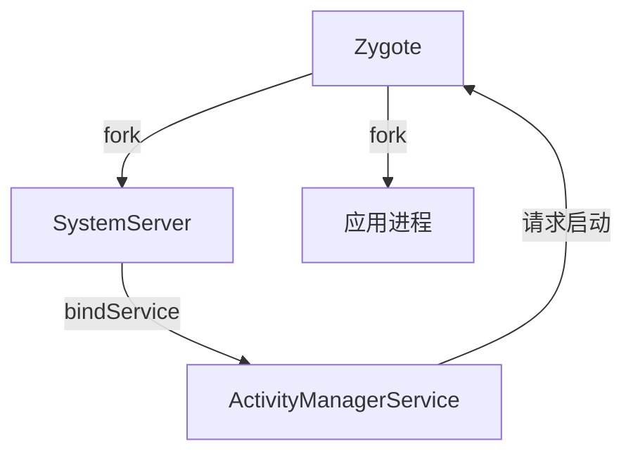

Android 系统为提升应用启动性能，除了 **USAP（Unspecialized App Process Pool）** 机制外，还实现了一系列优化措施，覆盖 **预加载、资源共享、进程管理、编译优化** 等多个维度。以下是关键机制的详细解析：  
  
  
### **一、Zygote 机制（核心基础）**  
#### **1. 预加载与写时复制（Copy-on-Write）**  
- **预加载**：Zygote 启动时预先加载常用类（如 `android.jar`）、资源（如 Drawable）和共享库（如 libart.so）。  
- **写时复制**：子进程通过 fork 共享 Zygote 内存空间，仅在修改时复制物理页面，显著减少内存占用和启动耗时。  
  
#### **2. 启动流程优化**  

  
  
### **二、ART 运行时优化**  
#### **1. AOT 编译（Ahead-Of-Time）**  
- **原理**：安装应用时将字节码编译为机器码，启动时直接加载，省去 JIT 编译过程。  
- **版本演进**：  
- Android 5.0（Lollipop）：强制 AOT 编译，安装慢但启动快。  
- Android 7.0（Nougat）：混合编译（AOT + JIT），平衡安装时间和运行效率。  
- Android 10+：Profile-guided AOT，基于用户使用习惯编译高频代码路径。  
  
#### **2. App Startup Time 优化**  
- **Profile 收集**：记录应用启动时加载的类和方法，生成 `profiles.pb` 文件。  
- **增量编译**：更新应用时，仅重新编译变化的代码。  
- **App Image 生成**：将常用类预编译为 `.art` 文件，加速类加载。  
  
  
### **三、资源与布局优化**  
#### **1. 资源预加载**  
- **资源表缓存**：Android 9+ 将资源表（Resource Table）缓存在内存中，避免重复解析 APK。  
- **Bitmap 预加载**：通过 `BitmapFactory.Options.inBitmap` 复用内存块，减少 GC 压力。  
  
#### **2. 布局优化**  
- **ViewStub**：延迟加载非关键布局，启动时仅加载必要部分。  
- **ConstraintLayout**：扁平化布局层级，减少测量和布局时间。  
- **布局加载器优化**：Android 12+ 引入 `ViewTreeLifecycleOwner`，提前初始化布局组件。  
  
  
### **四、进程管理与调度**  
#### **1. 进程优先级调整**  
- **前台进程特权**：启动前台应用时，系统临时提升 Zygote 优先级（`SCHED_FIFO`），确保快速响应。  
- **后台进程限制**：通过 `oom_adj` 控制后台进程资源分配，避免与前台应用竞争。  
  
#### **2. 快速启动（Quick Boot）**  
- **状态恢复**：Android 10+ 支持将系统状态保存到磁盘，重启时快速恢复（如 `adb reboot quickboot`）。  
- **应用快照**：冻结应用状态，下次启动时直接恢复界面（需应用支持）。  
  
  
### **五、代码与编译优化**  
#### **1. 冷启动路径优化**  
- **Application 轻量化**：减少 `Application.onCreate()` 中的耗时操作。  
- **懒加载**：将非关键初始化推迟到主线程空闲时（如 `IdleHandler`）。  
  
#### **2. 编译工具链优化**  
- **R8 混淆器**：比 ProGuard 更高效，减少 APK 体积并优化字节码。  
- **Dex 优化**：通过 `dex2oat` 参数（如 `--instruction-set-features`）针对特定设备优化。  
  
  
### **六、系统级优化机制**  
#### **1. 内存预读（Memory Prefetching）**  
- **Page Cache 优化**：系统预测应用启动时需要的页面，提前加载到内存。  
- **Swap 策略**：优先换出不常用进程，确保启动时内存充足。  
  
#### **2. 系统服务优化**  
- **服务延迟启动**：非关键系统服务（如 `media.audio_flinger`）延迟到系统空闲时启动。  
- **服务共享**：多个应用共享同一服务实例（如 `ContentProvider`）。  
  
#### **3. 省电模式优化**  
- **Doze 模式**：后台应用进入深度休眠，前台应用启动时临时豁免。  
- **App Standby**：未使用应用限制后台活动，启动时快速激活。  
  
  
### **七、硬件加速与驱动优化**  
#### **1. GPU 预渲染**  
- **SurfaceFlinger 优化**：提前合成界面帧，减少首屏显示延迟。  
- **HWC（Hardware Composer）**：硬件层合成，减轻 CPU 负担。  
  
#### **2. 存储优化**  
- **F2FS 文件系统**：相比 ext4，读写性能提升 30%+，加速 APK 解析。  
- **分区存储**：Android 10+ 限制应用访问共享存储，减少 I/O 开销。  
  
  
### **八、应用侧优化建议**  
1. **减少主线程阻塞**：  
```java  
// 错误示例：主线程执行网络请求  
public void onCreate() {  
String data = fetchDataFromNetwork(); // 阻塞主线程  
setContentView(data);  
}  
  
// 正确示例：异步加载  
public void onCreate() {  
setContentView(R.layout.main);  
CompletableFuture.runAsync(() -> {  
String data = fetchDataFromNetwork();  
runOnUiThread(() -> updateUI(data));  
});  
}  
```  
  
2. **懒加载非关键组件**：  
```java  
// 使用 ViewTreeObserver 监听布局完成后再加载  
view.getViewTreeObserver().addOnGlobalLayoutListener(() -> {  
loadNonCriticalResources();  
});  
```  
  
3. **使用 Jetpack App Startup**：  
```kotlin  
// 声明式初始化，避免 Application 膨胀  
class MyInitializer : Initializer<Unit> {  
override fun create(context: Context) {  
// 初始化代码  
}  
  
override fun dependencies() = emptyList<Class<out Initializer<*>>>()  
}  
```  
  
  
### **总结**  
Android 系统通过 **分层协作** 提升启动性能：  
- **底层优化**：ART 编译、内存管理、存储 I/O。  
- **系统级机制**：Zygote、USAP、进程调度。  
- **应用侧支持**：懒加载、异步初始化、工具链优化。  
  
这些机制共同作用，确保应用启动时间从早期 Android 的 **数秒级** 优化至现代设备的 **毫秒级**，显著提升用户体验。


---


以下是一些 Android 系统启动优化的实际案例：

### 某电商 APP 启动优化1

- **优化背景**：该电商 APP 冷启动在低端机型耗时 3.2 秒，主线程阻塞占比超 60%，存在类加载与初始化耗时、资源加载竞争、第三方 SDK 初始化阻塞等问题。
- **优化策略**：
    - **编译期优化**：采用 Dex 分包策略，将核心启动类保留在主 Dex，非核心类拆分至二级 Dex，主 Dex 文件缩小 42%，类加载耗时减少 180ms；启用 R8 代码压缩，移除未使用的类、方法与字段，启动阶段内存占用下降 8%。
    - **资源加载优化**：将资源加载逻辑从 AsyncTask 迁移至 Kotlin 协程，通过`Dispatchers.IO`指定 IO 线程池，避免 UI 线程竞争；在 SplashActivity 中预加载高频资源，利用`ContentResolver.openInputStream()`实现零拷贝加载，首帧渲染时间缩短 15%。
    - **第三方 SDK 治理**：将非关键 SDK 的初始化操作移至后台线程，通过`HandlerThread.postDelayed()`设置 500ms 延迟；某地图 SDK 初始化时同步读取`/data`目录文件，改为使用`Context.getExternalFilesDir()`获取应用私有目录，避免磁盘 IO 阻塞。
    - **系统级调优**：在启动阶段临时提升 CPU 大核频率，通过`cpufreq - set`命令将频率上限从 1.8GHz 提升至 2.3GHz；将应用数据目录的 I/O 优先级设置为`IONICE_CLASS_RT`；针对高频用户，在系统层实现应用进程预加载。
- **优化效果**：冷启动时间从 3.2 秒压缩至 1.8 秒（低端机），主线程阻塞率从 62% 降至 28%，首帧渲染缩短至 800ms 内，ANR 率下降 73%，用户投诉量减少 58%，启动阶段峰值内存从 420MB 降至 310MB。

### 抖音 BoostMultiDex 优化2

- **优化背景**：Android 4.x 及以下机型在应用安装或更新后的首次启动时，因 MultiDex.install 对非首个 dex 进行优化耗时漫长，导致首次启动慢。
- **优化策略**：通过挖掘 Dalvik 虚拟机底层系统机制，重新设计 DEX 相关处理逻辑。具体为从 APK 中解压获取原始的非首个 dex 文件字节码，调用`Dalvik_dalvik_system_DexFile_openDexFile_bytearray`加载，将 DexFile 添加到 APP 的`PathClassLoader`的`DexPathList`里，延后异步对非首个 dex 进行 odex 优化。
- **优化效果**：在 Android 低版本设备上，可减少 80% 以上的黑屏等待时间，有效提升了低版本用户的升级安装体验。

### 抖音 ContentProvider 优化2

- **优化背景**：ContentProvider 在启动阶段会自动实例化并执行相关生命周期，当用于初始化的 ContentProvider 较多时，其创建、生命周期执行等会耗时较长。
- **优化策略**：对于耗时较少的如官方 Lifecycle 组件的初始化，通过 JetPack 提供的 Startup 将多个初始化的 ContentProvider 聚合成一个来优化；对于自己的 ContentProvider，如果初始化耗时，则通过重构的方式将自动初始化改为按需初始化。
- **优化效果**：减少了 ContentProvider 初始化带来的耗时，优化了启动流程。