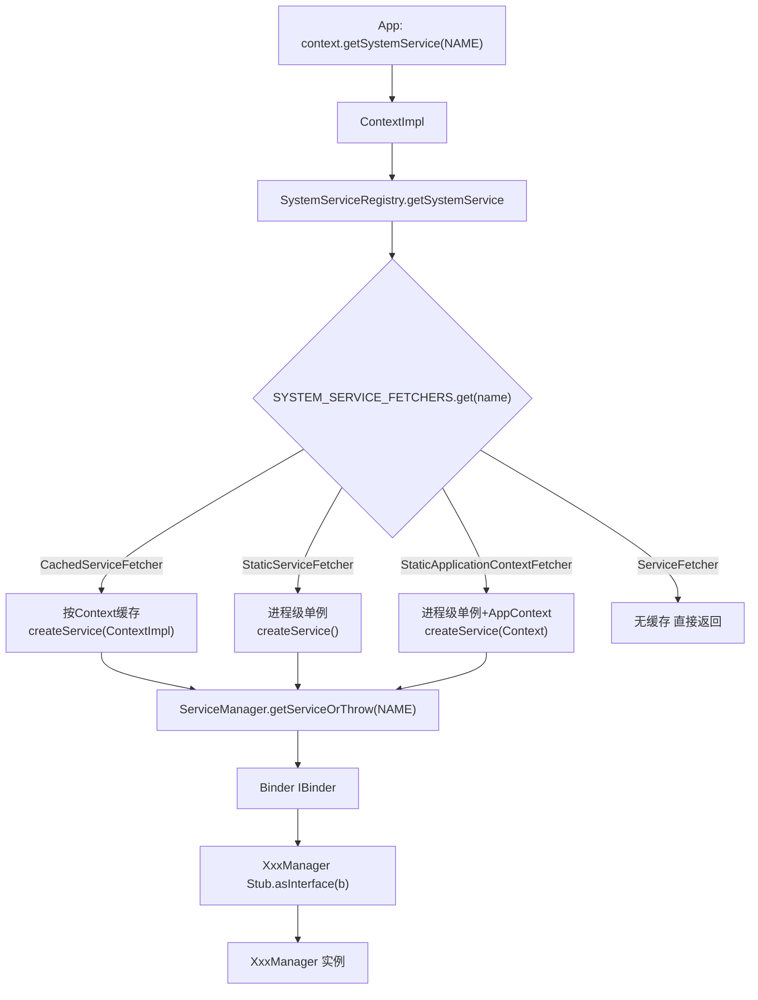

# SystemServiceRegistry 深度解析

## 一、概述

**文件路径**: `frameworks/base/core/java/android/app/SystemServiceRegistry.java` (共 1504 行)

**所属包**: `android.app`

`SystemServiceRegistry` 是 Android 框架中管理所有可通过 `Context.getSystemService()` 返回的系统服务的注册中心。它被 `ContextImpl` 使用，是连接**应用层**与**系统服务 Binder**之间的桥梁。

> 类注释原文：
> ```java
> /**
>  * Manages all of the system services that can be returned by {@link Context#getSystemService}.
>  * Used by {@link ContextImpl}.
>  */
> final class SystemServiceRegistry {
> ```

---

## 二、核心数据结构

```java
final class SystemServiceRegistry {
    private static final String TAG = "SystemServiceRegistry";

    // 服务名称映射：Class -> 服务名字符串
    private static final Map<Class<?>, String> SYSTEM_SERVICE_NAMES =
            new ArrayMap<Class<?>, String>();

    // 服务获取器映射：服务名字符串 -> ServiceFetcher
    private static final Map<String, ServiceFetcher<?>> SYSTEM_SERVICE_FETCHERS =
            new ArrayMap<String, ServiceFetcher<?>>();

    // 缓存数组大小（等于 CachedServiceFetcher 的注册数量）
    private static int sServiceCacheSize;

    // 不可实例化
    private SystemServiceRegistry() { }
}
```

| 数据结构 | 类型 | Key | Value | 用途 |
|---------|------|-----|-------|------|
| `SYSTEM_SERVICE_NAMES` | `Map<Class<?>, String>` | Manager 的 Class 对象 | 服务名字符串 | 反查：`getSystemServiceName(Class)` |
| `SYSTEM_SERVICE_FETCHERS` | `Map<String, ServiceFetcher<?>>` | 服务名字符串 | ServiceFetcher 实例 | 正查：`getSystemService(name)` |
| `sServiceCacheSize` | `int` | — | — | 记录 CachedServiceFetcher 的数量，用于分配缓存数组大小 |

---

## 三、三种 ServiceFetcher 策略

### 3.1 类继承关系

```
ServiceFetcher<T> (interface)
├── CachedServiceFetcher<T> (abstract class)      — 按 Context 缓存
├── StaticServiceFetcher<T> (abstract class)       — 进程级单例
└── StaticApplicationContextServiceFetcher<T> (abstract class) — 进程级单例(带 AppContext)
```

### 3.2 对比表

| 特性 | `CachedServiceFetcher` | `StaticServiceFetcher` | `StaticApplicationContextServiceFetcher` |
|------|----------------------|----------------------|----------------------------------------|
| 缓存粒度 | **每个 ContextImpl** | **进程级单例** | **进程级单例** |
| `createService` 参数 | `ContextImpl ctx` | 无参数 | `Context applicationContext` |
| 并发控制 | gate 状态机 + wait/notifyAll | `synchronized(this)` | `synchronized(this)` |
| 缓存位置 | `ctx.mServiceCache[index]` | `mCachedInstance` 字段 | `mCachedInstance` 字段 |
| 典型服务 | PowerManager, ActivityManager | InputManager, JobScheduler | ConnectivityManager |

### 3.3 各 Fetcher 源码

#### ServiceFetcher（基础接口）

```java
static abstract interface ServiceFetcher<T> {
    T getService(ContextImpl ctx);
}
```

#### CachedServiceFetcher（按 Context 缓存）

```java
static abstract class CachedServiceFetcher<T> implements ServiceFetcher<T> {
    private final int mCacheIndex;

    CachedServiceFetcher() {
        mCacheIndex = sServiceCacheSize++;
    }

    @Override
    @SuppressWarnings("unchecked")
    public final T getService(ContextImpl ctx) {
        final Object[] cache = ctx.mServiceCache;
        final int[] gates = ctx.mServiceInitializationStateArray;

        for (;;) {
            boolean doInitialize = false;
            synchronized (cache) {
                // ① 缓存命中？直接返回
                T service = (T) cache[mCacheIndex];
                if (service != null || gates[mCacheIndex] == ContextImpl.STATE_NOT_FOUND) {
                    return service;
                }
                // ② 状态为 READY 但被清空？重置为 UNINITIALIZED
                if (gates[mCacheIndex] == ContextImpl.STATE_READY) {
                    gates[mCacheIndex] = ContextImpl.STATE_UNINITIALIZED;
                }
                // ③ 抢占：第一个线程设为 INITIALIZING
                if (gates[mCacheIndex] == ContextImpl.STATE_UNINITIALIZED) {
                    doInitialize = true;
                    gates[mCacheIndex] = ContextImpl.STATE_INITIALIZING;
                }
            }

            if (doInitialize) {
                // ④ 第一个线程：创建服务（不持有 cache 锁，避免阻塞其他服务访问）
                T service = null;
                @ServiceInitializationState int newState = ContextImpl.STATE_NOT_FOUND;
                try {
                    service = createService(ctx);
                    newState = ContextImpl.STATE_READY;
                } catch (ServiceNotFoundException e) {
                    onServiceNotFound(e);
                } finally {
                    synchronized (cache) {
                        cache[mCacheIndex] = service;
                        gates[mCacheIndex] = newState;
                        cache.notifyAll();
                    }
                }
                return service;
            }

            // ⑤ 其他线程：等待第一个线程完成
            synchronized (cache) {
                while (gates[mCacheIndex] < ContextImpl.STATE_READY) {
                    try {
                        cache.wait();
                    } catch (InterruptedException e) {
                        Log.w(TAG, "getService() interrupted");
                        Thread.currentThread().interrupt();
                        return null;
                    }
                }
            }
            // 被唤醒后回到 for 循环顶部重新检查
        }
    }

    public abstract T createService(ContextImpl ctx) throws ServiceNotFoundException;
}
```

#### StaticServiceFetcher（进程级单例）

```java
static abstract class StaticServiceFetcher<T> implements ServiceFetcher<T> {
    private T mCachedInstance;

    @Override
    public final T getService(ContextImpl ctx) {
        synchronized (StaticServiceFetcher.this) {
            if (mCachedInstance == null) {
                try {
                    mCachedInstance = createService();
                } catch (ServiceNotFoundException e) {
                    onServiceNotFound(e);
                }
            }
            return mCachedInstance;
        }
    }

    public abstract T createService() throws ServiceNotFoundException;
}
```

#### StaticApplicationContextServiceFetcher（进程级单例 + ApplicationContext）

```java
static abstract class StaticApplicationContextServiceFetcher<T> implements ServiceFetcher<T> {
    private T mCachedInstance;

    @Override
    public final T getService(ContextImpl ctx) {
        synchronized (StaticApplicationContextServiceFetcher.this) {
            if (mCachedInstance == null) {
                Context appContext = ctx.getApplicationContext();
                try {
                    mCachedInstance = createService(appContext != null ? appContext : ctx);
                } catch (ServiceNotFoundException e) {
                    onServiceNotFound(e);
                }
            }
            return mCachedInstance;
        }
    }

    public abstract T createService(Context applicationContext) throws ServiceNotFoundException;
}
```

---

## 四、关键方法

```java
// 创建每个 Context 的服务缓存数组
public static Object[] createServiceCache() {
    return new Object[sServiceCacheSize];
}

// 根据 name 获取系统服务
public static Object getSystemService(ContextImpl ctx, String name) {
    ServiceFetcher<?> fetcher = SYSTEM_SERVICE_FETCHERS.get(name);
    return fetcher != null ? fetcher.getService(ctx) : null;
}

// 根据 Class 反查服务名
public static String getSystemServiceName(Class<?> serviceClass) {
    return SYSTEM_SERVICE_NAMES.get(serviceClass);
}

// 静态注册服务（仅在 static{} 块中调用）
private static <T> void registerService(String serviceName, Class<T> serviceClass,
        ServiceFetcher<T> serviceFetcher) {
    SYSTEM_SERVICE_NAMES.put(serviceClass, serviceName);
    SYSTEM_SERVICE_FETCHERS.put(serviceName, serviceFetcher);
}

// 服务未找到时的日志处理
public static void onServiceNotFound(ServiceNotFoundException e) {
    if (android.os.Process.myUid() < android.os.Process.FIRST_APPLICATION_UID) {
        Log.wtf(TAG, e.getMessage(), e);   // 系统进程：严重日志
    } else {
        Log.w(TAG, e.getMessage());         // 普通应用：警告日志
    }
}
```

---

## 五、注册的系统服务列表

在 `static {}` 块中注册了 **80+ 个系统服务**：

| 服务类别 | 示例服务 |
|---------|---------|
| 通信/网络 | ConnectivityManager, WifiManager, BluetoothManager, NsdManager, EthernetManager |
| 硬件 | SensorManager, CameraManager, PowerManager, Vibrator, ConsumerIrManager |
| 输入/显示 | InputManager, WindowManager, DisplayManager, ColorDisplayManager |
| 系统/用户 | ActivityManager, ActivityTaskManager, UserManager, NotificationManager |
| 安全/生物 | FingerprintManager, FaceManager, IrisManager, BiometricManager |
| 媒体 | AudioManager, MediaRouter, MediaSessionManager, TvInputManager, MidiManager |
| 位置 | LocationManager, CountryDetector |
| 存储 | StorageManager, StorageStatsManager |
| 其他 | JobScheduler, ClipboardManager, WallpaperManager, RoleManager 等 |

### 注册示例（以 PowerManager 为例）

```java
registerService(Context.POWER_SERVICE, PowerManager.class,
    new CachedServiceFetcher<PowerManager>() {
        @Override
        public PowerManager createService(ContextImpl ctx) throws ServiceNotFoundException {
            IBinder b = ServiceManager.getServiceOrThrow(Context.POWER_SERVICE);
            IPowerManager service = IPowerManager.Stub.asInterface(b);
            return new PowerManager(ctx.getOuterContext(), service, ctx.mMainThread.getHandler());
        }
    });
```

---

## 六、完整使用流程

### 6.1 阶段一：类加载时静态注册（仅一次）

当 `SystemServiceRegistry` 类首次被加载时，`static {}` 块执行，注册所有服务映射关系。

同时，每个 `CachedServiceFetcher` 构造时执行 `mCacheIndex = sServiceCacheSize++`，为自己分配缓存数组索引位。

### 6.2 阶段二：ContextImpl 创建时初始化缓存

```java
// ContextImpl.java
final Object[] mServiceCache = SystemServiceRegistry.createServiceCache();  // Object[size]
final int[] mServiceInitializationStateArray = new int[mServiceCache.length]; // 全 0 = UNINITIALIZED
```

状态机定义：
```
STATE_UNINITIALIZED(0) → STATE_INITIALIZING(1) → STATE_READY(2)
                                                   或 STATE_NOT_FOUND(3)
```

### 6.3 阶段三：App 调用 getSystemService

以 `context.getSystemService(Context.POWER_SERVICE)` 为例：

#### 步骤 1：App 发起调用
```java
PowerManager pm = (PowerManager) context.getSystemService(Context.POWER_SERVICE);
```

#### 步骤 2：ContextImpl 委托
```java
// ContextImpl.java 第 1804 行
@Override
public Object getSystemService(String name) {
    return SystemServiceRegistry.getSystemService(this, name);
}
```

#### 步骤 3：SystemServiceRegistry 查找 Fetcher
```java
public static Object getSystemService(ContextImpl ctx, String name) {
    ServiceFetcher<?> fetcher = SYSTEM_SERVICE_FETCHERS.get(name);  // "power" -> CachedServiceFetcher
    return fetcher != null ? fetcher.getService(ctx) : null;
}
```

#### 步骤 4：CachedServiceFetcher.getService — 检查缓存 + 并发控制

详见第三章 `CachedServiceFetcher` 源码，核心逻辑：
1. 缓存命中 → 直接返回
2. 未命中 → 第一个线程设 INITIALIZING 并创建服务（不持锁）
3. 其他线程 wait 等待 notifyAll

#### 步骤 5：createService — 通过 Binder 获取远端服务
```java
public PowerManager createService(ContextImpl ctx) throws ServiceNotFoundException {
    IBinder b = ServiceManager.getServiceOrThrow(Context.POWER_SERVICE);
    IPowerManager service = IPowerManager.Stub.asInterface(b);
    return new PowerManager(ctx.getOuterContext(), service, ctx.mMainThread.getHandler());
}
```

#### 步骤 6：ServiceManager 查找 Binder
```java
// ServiceManager.java
public static IBinder getServiceOrThrow(String name) throws ServiceNotFoundException {
    final IBinder binder = getService(name);
    if (binder != null) return binder;
    else throw new ServiceNotFoundException(name);
}

public static IBinder getService(String name) {
    IBinder service = sCache.get(name);       // ① 先查本地缓存
    if (service != null) return service;
    else return Binder.allowBlocking(rawGetService(name));  // ② 缓存未命中 → IPC
}

private static IBinder rawGetService(String name) throws RemoteException {
    final IBinder binder = getIServiceManager().getService(name);  // Binder IPC 到 servicemanager
    return binder;
}
```

#### 步骤 7：Stub.asInterface — 转换为 AIDL 代理
```java
IPowerManager service = IPowerManager.Stub.asInterface(b);
// → 返回 IPowerManager.Stub.Proxy 实例（本地代理）
// → 后续 service.xxx() 通过 Binder 发起跨进程 IPC
```

#### 步骤 8：写入缓存 + 返回
```
new PowerManager(ctx, service, handler)
  → cache[mCacheIndex] = pm
  → gates[mCacheIndex] = STATE_READY
  → notifyAll()
  → 返回 PowerManager 给 App
```

### 6.4 完整时序图

```
App                 ContextImpl         SystemServiceRegistry       ServiceManager        servicemanager(native)
 |                       |                       |                       |                       |
 |--getSystemService--->|                       |                       |                       |
 |                       |---getSystemService-->|                       |                       |
 |                       |                       |--FETCHERS.get(name)->|                       |
 |                       |                       |<--CachedServiceFetcher|                      |
 |                       |                       |                       |                       |
 |                       |                       |  (检查 mServiceCache) |                       |
 |                       |                       |  未命中→createService()|                      |
 |                       |                       |---getServiceOrThrow-->|                       |
 |                       |                       |                       |--sCache.get(name)-->|
 |                       |                       |                       |  未命中→rawGetService  |
 |                       |                       |                       |----getService-------->|
 |                       |                       |                       |<--------IBinder-------|
 |                       |                       |<--------IBinder-------|                      |
 |                       |                       |                       |                       |
 |                       |                       |  Stub.asInterface(binder)                      |
 |                       |                       |  new PowerManager(ctx, proxy)                 |
 |                       |                       |  cache[index] = pm                             |
 |                       |                       |  gate = STATE_READY                            |
 |                       |                       |  notifyAll()                                   |
 |                       |<------PowerManager---|                       |                       |
 |<----PowerManager-----|                       |                       |                       |
 |                       |                       |                       |                       |
 |  (第二次调用同一服务)  |                       |                       |                       |
 |--getSystemService--->|---getSystemService-->|                       |                       |
 |                       |                       |  (检查 mServiceCache) |                       |
 |                       |                       |  命中! 直接返回       |                       |
 |<----PowerManager-----|<------PowerManager---|                       |                       |
```

---

## 七、与 ContextImpl 的关系

`ContextImpl` 是 `SystemServiceRegistry` 的核心调用方：

```java
// ContextImpl.java
// 创建缓存
final Object[] mServiceCache = SystemServiceRegistry.createServiceCache();

// 获取服务
@Override
public Object getSystemService(String name) {
    return SystemServiceRegistry.getSystemService(this, name);
}

// 反查服务名
@Override
public String getSystemServiceName(Class<?> serviceClass) {
    return SystemServiceRegistry.getSystemServiceName(serviceClass);
}
```

---

## 八、架构图



---

## 九、关键设计要点总结

1. **三级延迟加载**：注册时只创建 Fetcher 对象 → 首次调用时才创建 Manager → Manager 内部的 Binder 代理也是首次获取时才查表
2. **双重缓存**：`SystemServiceRegistry` 缓存 Manager 实例 + `ServiceManager.sCache` 缓存 IBinder 引用
3. **线程安全无锁创建**：`CachedServiceFetcher` 在 `createService()` 时不持有 `cache` 锁，避免 Binder IPC 阻塞其他线程访问其他服务
4. **Context 级隔离**：不同 Context（如不同 Activity）拥有独立的 `mServiceCache`，但 `StaticServiceFetcher` 是进程共享的
5. **gate 状态机**：`UNINITIALIZED → INITIALIZING → READY/NOT_FOUND`，确保并发场景下只有一个线程创建服务
6. **不可实例化**：构造函数为 private，所有注册在 static 块中完成，运行时不可动态修改

---

## 十、相关文件索引

| 文件 | 路径 | 说明 |
|------|------|------|
| SystemServiceRegistry.java | `frameworks/base/core/java/android/app/SystemServiceRegistry.java` | 服务注册中心（本文主角） |
| ContextImpl.java | `frameworks/base/core/java/android/app/ContextImpl.java` | 调用方，持有 mServiceCache |
| ServiceManager.java | `frameworks/base/core/java/android/os/ServiceManager.java` | Binder 服务查找 |
| SystemServiceRegistry_Accessor.java | `frameworks/layoutlib/bridge/src/android/app/SystemServiceRegistry_Accessor.java` | LayoutLib 桥接访问器 |
| SystemServiceRegistry_AccessorTest.java | `frameworks/layoutlib/bridge/tests/src/android/app/SystemServiceRegistry_AccessorTest.java` | 测试类 |
