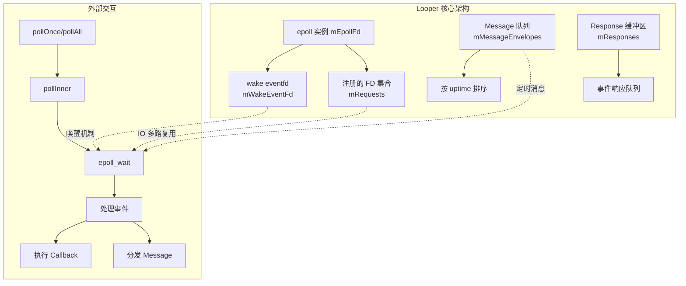
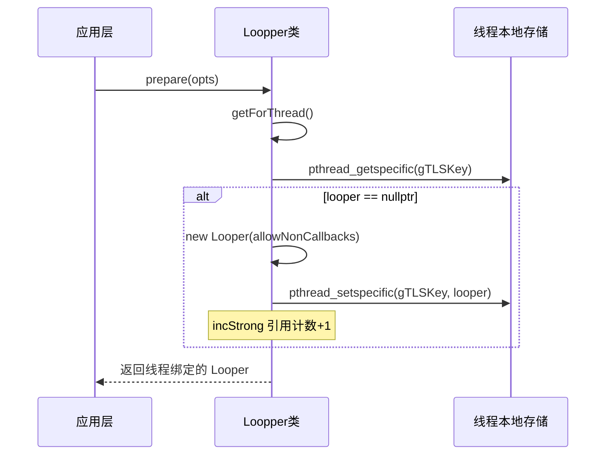
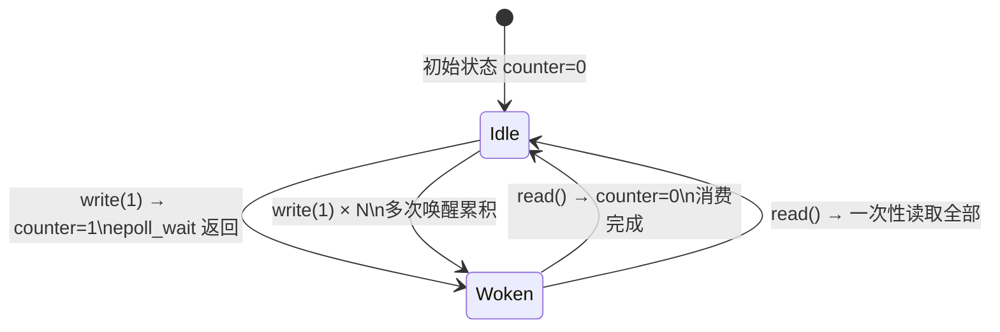
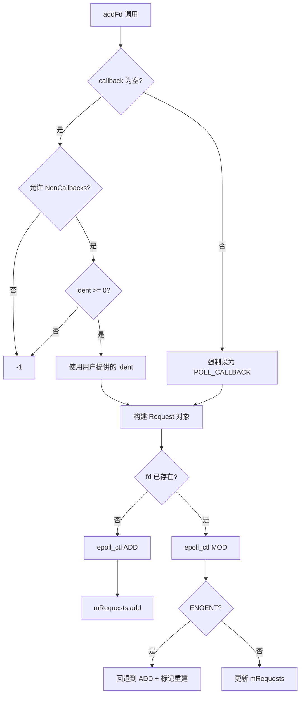
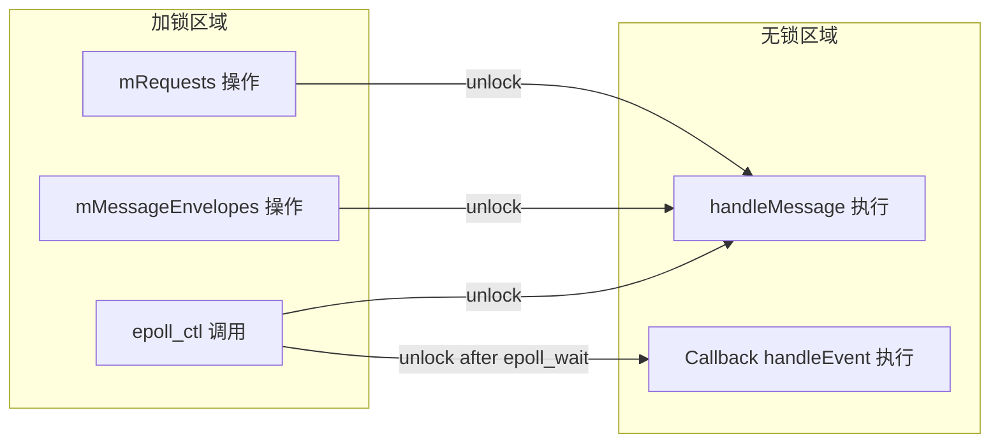
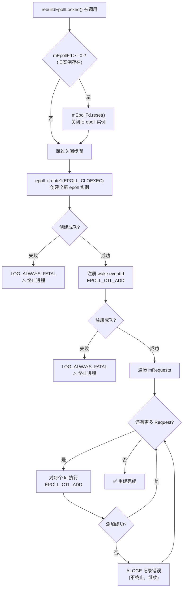
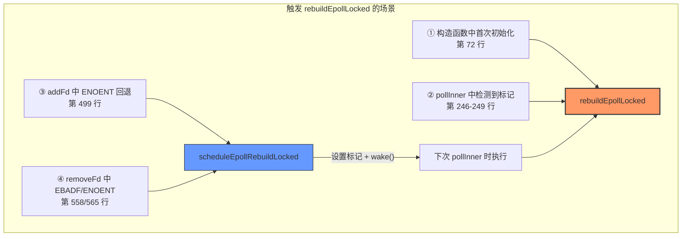
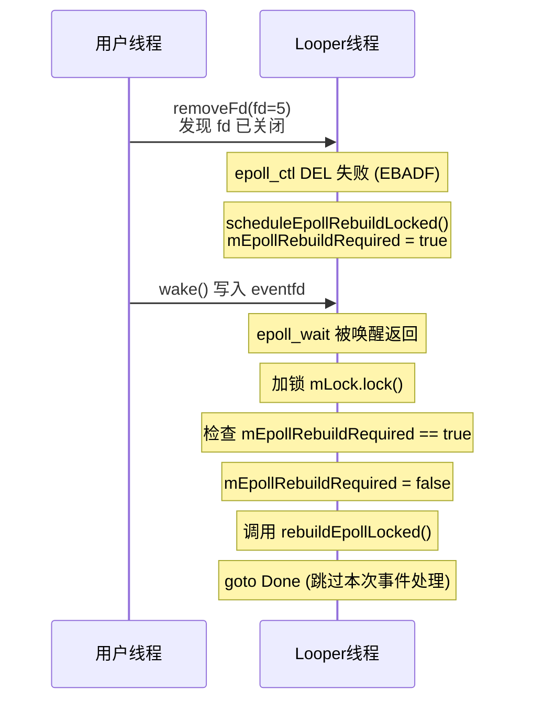
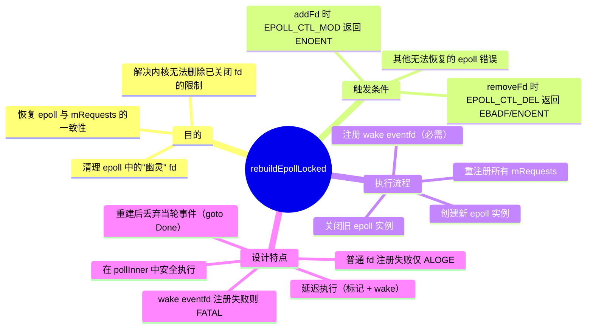

用户想要我深入解析 `system/core/libutils/Looper.cpp` 这个文件。这是 Android 系统中 Looper 的核心实现，基于 epoll 的事件循环机制。

让我先仔细阅读这个文件的内容，然后提供一个全面的核心解析。文件内容已经在附加信息中提供了，我可以直接分析。

这个文件实现了 Android 的 Looper 类，这是一个基于 epoll 的消息循环机制。主要包含：

1. WeakMessageHandler - 弱引用的消息处理器
2. SimpleLooperCallback - 简单的回调封装
3. Looper - 核心的 Looper 实现

让我详细分析各个部分。
# Android Looper.cpp 核心深度解析

基于你打开的 `Looper.cpp` 文件，这是一个**基于 epoll 的 Android 消息轮询器（Looper）实现**。下面我将从架构设计、核心机制、关键流程三个维度进行完整剖析。

---

## 一、整体架构概览



---

## 二、核心数据结构

### 2.1 成员变量分析

| 变量名 | 类型 | 用途 |
|--------|------|------|
| `mWakeEventFd` | `base::unique_fd` | **唤醒文件描述符**，使用 `eventfd` 创建，用于从外部唤醒 `epoll_wait` |
| `mEpollFd` | `base::unique_fd` | **epoll 实例**，核心 IO 多路复用句柄 |
| `mRequests` | `KeyedVector<int, Request>` | **已注册的 FD 映射表**，key 是 fd，value 是请求信息 |
| `mResponses` | `Vector<Response>` | **事件响应缓冲区**，存储本次 poll 触发的事件 |
| `mMessageEnvelopes` | `Vector<MessageEnvelope>` | **消息队列**，按执行时间排序 |
| `mLock` | `Mutex` | **互斥锁**，保护共享数据 |
| `mPolling` | `bool` | 标记是否正在 `epoll_wait` 阻塞中 |
| `mSendingMessage` | `bool` | 标记是否正在分发消息（优化用） |
| `mEpollRebuildRequired` | `bool` | 标记是否需要重建 epoll 实例 |

### 2.2 Request 结构（第 657-665 行）

```startLine:657:665:c:/D/android_project/cells-android10/system/core/libutils/Looper.cpp
void Looper::Request::initEventItem(struct epoll_event* eventItem) const {
    int epollEvents = 0;
    if (events & EVENT_INPUT) epollEvents |= EPOLLIN;
    if (events & EVENT_OUTPUT) epollEvents |= EPOLLOUT;

    memset(eventItem, 0, sizeof(epoll_event));
    eventItem->events = epollEvents;
    eventItem->data.fd = fd;
}
```

**解析：**
- 将 Looper 抽象的事件类型（`EVENT_INPUT/EVENT_OUTPUT`）转换为 epoll 原生事件类型
- 使用 `data.fd` 存储原始 fd，便于后续在 `pollInner` 中反向查找 Request

---

## 三、初始化流程

### 3.1 构造函数（第 60-73 行）

```startLine:60:73:c:/D/android_project/cells-android10/system/core/libutils/Looper.cpp
Looper::Looper(bool allowNonCallbacks)
    : mAllowNonCallbacks(allowNonCallbacks),
      mSendingMessage(false),
      mPolling(false),
      mEpollRebuildRequired(false),
      mNextRequestSeq(0),
      mResponseIndex(0),
      mNextMessageUptime(LLONG_MAX) {
    mWakeEventFd.reset(eventfd(0, EFD_NONBLOCK | EFD_CLOEXEC));
    LOG_ALWAYS_FATAL_IF(mWakeEventFd.get() < 0, "Could not make wake event fd: %s", strerror(errno));

    AutoMutex _l(mLock);
    rebuildEpollLocked();
}
```

**关键点：**

1. **eventfd 创建唤醒机制**：
   - `EFD_NONBLOCK`：非阻塞模式，避免读写阻塞
   - `EFD_CLOEXEC`：fork 后自动关闭，防止文件描述符泄漏
   - `eventfd(0, ...)`：初始计数器值为 0

2. **rebuildEpollLocked 初始化 epoll**：

```startLine:129:161:c:/D/android_project/cells-android10/system/core/libutils/Looper.cpp
void Looper::rebuildEpollLocked() {
    // Close old epoll instance if we have one.
    if (mEpollFd >= 0) {
        mEpollFd.reset();
    }

    // Allocate the new epoll instance and register the wake pipe.
    mEpollFd.reset(epoll_create1(EPOLL_CLOEXEC));
    
    struct epoll_event eventItem;
    memset(& eventItem, 0, sizeof(epoll_event));
    eventItem.events = EPOLLIN;
    eventItem.data.fd = mWakeEventFd.get();
    int result = epoll_ctl(mEpollFd.get(), EPOLL_CTL_ADD, mWakeEventFd.get(), &eventItem);
    // ... 注册所有已有的 requests
}
```

**设计精髓：**
- 先创建 epoll 实例
- **立即将 wake eventfd 注册到 epoll**（这是第一个也是必须的监听 fd）
- 如果有之前注册的 request，重新添加到新的 epoll 实例

---

## 四、线程本地存储（TLS）机制

### 4.1 TLS 相关方法（第 78-123 行）



**为什么需要 TLS？**
- Android 要求**每个线程最多绑定一个 Looper**
- 使用 `pthread_key_create` 创建线程私有数据键
- `threadDestructor` 作为析构函数，在线程退出时自动释放 Looper

---

## 五、核心轮询机制 ⭐

### 5.1 pollOnce — 入口函数（第 173-207 行）

```startLine:173:207:c:/D/android_project/cells-android10/system/core/libutils/Looper.cpp
int Looper::pollOnce(int timeoutMillis, int* outFd, int* outEvents, void** outData) {
    int result = 0;
    for (;;) {
        // 第一阶段：消费 Response 缓冲区中的已有事件
        while (mResponseIndex < mResponses.size()) {
            const Response& response = mResponses.itemAt(mResponseIndex++);
            int ident = response.request.ident;
            if (ident >= 0) {  // 非 POLL_CALLBACK 类型直接返回
                // ... 填充输出参数
                return ident;
            }
        }

        // 第二阶段：如果上轮有结果且不是 CALLBACK，返回
        if (result != 0) { ... return result; }

        // 第三阶段：调用 pollInner 进行实际的 epoll_wait
        result = pollInner(timeoutMillis);
    }
}
```

**三层过滤机制的设计意图：**

| 层级 | 处理对象 | 返回值特征 |
|------|----------|------------|
| 第一层 | Response 缓冲区中 `ident >= 0` 的事件 | 返回用户的自定义 ident |
| 第二层 | 上次 pollInner 返回的非 CALLBACK 结果 | POLL_WAKE/POLL_TIMEOUT/POLL_ERROR |
| 第三层 | 调用 pollInner 执行实际 I/O | 全部类型 |

### 5.2 pollInner — 真正的事件等待（第 209-365 行）

这是整个 Looper 的**心脏**，逻辑复杂度最高。我将其拆解为 **7 个阶段**：

#### 阶段 1：超时时间调整（第 214-226 行）

```startLine:214:226:c:/D/android_project/cells-android10/system/core/libutils/Looper.cpp
// Adjust the timeout based on when the next message is due.
if (timeoutMillis != 0 && mNextMessageUptime != LLONG_MAX) {
    nsecs_t now = systemTime(SYSTEM_TIME_MONOTONIC);
    int messageTimeoutMillis = toMillisecondTimeoutDelay(now, mNextMessageUptime);
    if (messageTimeoutMillis >= 0
            && (timeoutMillis < 0 || messageTimeoutMillis < timeoutMillis)) {
        timeoutMillis = messageTimeoutMillis;
    }
}
```

**作用：** 如果有待处理的定时消息，将 `epoll_wait` 的超时时间调整为「下一个消息到期时间」，确保消息能及时被分发。

#### 阶段 2：epoll_wait 阻塞等待（第 233-240 行）

```startLine:233:240:c:/D/android_project/cells-android10/system/core/libutils/Looper.cpp
mPolling = true;

struct epoll_event eventItems[EPOLL_MAX_EVENTS];
int eventCount = epoll_wait(mEpollFd.get(), eventItems, EPOLL_MAX_EVENTS, timeoutMillis);

mPolling = false;
```

- `EPOLL_MAX_EVENTS = 16`：单次最多返回 16 个事件
- `mPolling = true` 标记进入阻塞状态，供 `isPolling()` 查询

#### 阶段 3：检查 epoll 是否需要重建（第 246-250 行）

```startLine:246:250:c:/D/android_project/cells-android10/system/core/libutils/Looper.cpp
if (mEpollRebuildRequired) {
    mEpollRebuildRequired = false;
    rebuildEpollLocked();
    goto Done;
}
```

当 FD 被回收后 epoll 无法删除旧 fd 时，标记需要重建。

#### 阶段 4：错误和超时处理（第 253-269 行）

```startLine:253:269:c:/D/android_project/cells-android10/system/core/libutils/Looper.cpp
if (eventCount < 0) {
    if (errno == EINTR) { goto Done; }  // 被信号中断，正常情况
    result = POLL_ERROR;
    goto Done;
}

if (eventCount == 0) {
    result = POLL_TIMEOUT;
    goto Done;
}
```

#### 阶段 5：事件分发（第 276-299 行）⭐ 最核心

```startLine:276:299:c:/D/android_project/cells-android10/system/core/libutils/Looper.cpp
for (int i = 0; i < eventCount; i++) {
    int fd = eventItems[i].data.fd;
    uint32_t epollEvents = eventItems[i].events;
    if (fd == mWakeEventFd.get()) {
        // 唤醒事件：读取并清空计数器
        if (epollEvents & EPOLLIN) {
            awoken();
        }
    } else {
        // 普通 IO 事件：转换为 Response 并缓存
        ssize_t requestIndex = mRequests.indexOfKey(fd);
        if (requestIndex >= 0) {
            int events = 0;
            if (epollEvents & EPOLLIN) events |= EVENT_INPUT;
            if (epollEvents & EPOLLOUT) events |= EVENT_OUTPUT;
            if (epollEvents & EPOLLERR) events |= EVENT_ERROR;
            if (epollEvents & EPOLLHUP) events |= EVENT_HANGUP;
            pushResponse(events, mRequests.valueAt(requestIndex));
        }
    }
}
```

**两种事件的处理差异：**

| 事件类型 | 处理方式 | 目的 |
|----------|----------|------|
| wake eventfd | 立即调用 `awoken()` 清空 | 唤醒 poll 循环，不产生 Response |
| 其他 fd | 转换后 `pushResponse` | 延迟到锁外执行 callback |

#### 阶段 6：消息分发（第 303-334 行）

```startLine:303:334:c:/D/android_project/cells-android10/system/core/libutils/Looper.cpp
while (mMessageEnvelopes.size() != 0) {
    nsecs_t now = systemTime(SYSTEM_TIME_MONOTONIC);
    const MessageEnvelope& messageEnvelope = mMessageEnvelopes.itemAt(0);
    if (messageEnvelope.uptime <= now) {
        { // obtain handler - 加锁获取并移除消息
            sp<MessageHandler> handler = messageEnvelope.handler;
            Message message = messageEnvelope.message;
            mMessageEnvelopes.removeAt(0);
            mSendingMessage = true;
            mLock.unlock();  // 🔑 关键：解锁后再调用 handler
            
            handler->handleMessage(message);  // 用户代码可能耗时
        } // release handler - handler 强引用在此释放
        
        mLock.lock();
        mSendingMessage = false;
        result = POLL_CALLBACK;
    } else {
        mNextMessageUptime = messageEnvelope.uptime;
        break;
    }
}
```

**🔑 锁策略精妙之处：**
- 在持有锁的状态下取出消息并从队列移除
- **解锁后再调用 `handleMessage`**，避免死锁（handler 可能会发送新消息）
- 使用 `{}` 作用域控制 `sp<MessageHandler>` 的生命周期

#### 阶段 7：Response 回调执行（第 340-363 行）

```startLine:340:363:c:/D/android_project/cells-android10/system/core/libutils/Looper.cpp
for (size_t i = 0; i < mResponses.size(); i++) {
    Response& response = mResponses.editItemAt(i);
    if (response.request.ident == POLL_CALLBACK) {
        int callbackResult = response.request.callback->handleEvent(fd, events, data);
        if (callbackResult == 0) {
            removeFd(fd, response.request.seq);  // 返回 0 表示移除监听
        }
        response.request.callback.clear();  // 及时释放 callback 引用
        result = POLL_CALLBACK;
    }
}
```

**注意：此时已经 `mLock.unlock()`（第 337 行），callback 执行时无锁**

---

## 六、唤醒机制

### 6.1 wake() 和 awoken()



**wake() 写入端**（第 393-406 行）：
```startLine:393:406:c:/D/android_project/cells-android10/system/core/libutils/Looper.cpp
void Looper::wake() {
    uint64_t inc = 1;
    ssize_t nWrite = TEMP_FAILURE_RETRY(write(mWakeEventFd.get(), &inc, sizeof(uint64_t)));
    if (nWrite != sizeof(uint64_t)) {
        if (errno != EAGAIN) {
            LOG_ALWAYS_FATAL("Could not write wake signal...");
        }
    }
}
```

**awoken() 读取端**（第 408-415 行）：
```startLine:408:415:c:/D/android_project/cells-android10/system/core/libutils/Looper.cpp
void Looper::awoken() {
    uint64_t counter;
    TEMP_FAILURE_RETRY(read(mWakeEventFd.get(), &counter, sizeof(uint64_t)));
}
```

**为什么使用 eventfd 而非 pipe？**
- 更轻量，只需一个 fd（pipe 需要 2 个）
- 内核维护 64 位计数器，支持批量唤醒合并
- 无需缓冲区管理

---

## 七、FD 注册与移除

### 7.1 addFd 流程（第 428-509 行）



**特殊场景处理：FD 回收竞争**

当 fd 被关闭后又重新分配了相同编号的新 fd，会出现 `EPOLL_CTL_MOD` 返回 `ENOENT`（因为旧 fd 已经不在 epoll 中）。解决方案是：
1. 尝试 `EPOLL_CTL_ADD` 新 fd
2. 调用 `scheduleEpollRebuildLocked()` 标记需要重建 epoll（可能残留无效 fd）

### 7.2 removeFd（第 515-571 行）

类似地，当 fd 已被关闭时，`EPOLL_CTL_DEL` 会失败：
- `EBADF` / `ENOENT` + seq 已知 → 容忍，安排重建
- 其他错误 → 记录日志并重建

---

## 八、消息机制

### 8.1 消息投递（第 584-616 行）

```startLine:584:616:c:/D/android_project/cells-android10/system/core/libutils/Looper.cpp
void Looper::sendMessageAtTime(nsecs_t uptime, const sp<MessageHandler>& handler,
        const Message& message) {
    size_t i = 0;
    { // acquire lock
        AutoMutex _l(mLock);

        size_t messageCount = mMessageEnvelopes.size();
        while (i < messageCount && uptime >= mMessageEnvelopes.itemAt(i).uptime) {
            i += 1;  // 按 uptime 升序找到插入位置
        }

        MessageEnvelope messageEnvelope(uptime, handler, message);
        mMessageEnvelopes.insertAt(messageEnvelope, i, 1);

        if (mSendingMessage) {
            return;  // 优化：正在发消息时不需要额外唤醒
        }
    }

    if (i == 0) {
        wake();  // 只有插入到队头才需要唤醒（改变了最近执行时间）
    }
}
```

**两个优化点：**
1. **`mSendingMessage` 检查**：当前正在 `handleMessage` 中，发送新消息无需唤醒（循环结束后自然会检查）
2. **`i == 0` 条件唤醒**：只有插入到队列头部（最早执行时间提前了）才需唤醒

---

## 九、关键设计总结

### 9.1 线程安全模型



### 9.2 性能优化技巧

| 优化点 | 实现位置 | 效果 |
|--------|----------|------|
| eventfd 替代 pipe | 构造函数 | 减少 fd 数量，内核更高效 |
| 按需唤醒 | `sendMessageAtTime` 第 607-609 行 | 减少 unnecessary wake |
| Response 缓存 | `pushResponse` + `pollOnce` 两阶段 | 减少锁持有时间 |
| epoll 重建延迟 | `scheduleEpollRebuildLocked` | 避免频繁重建 |

### 9.3 与 Java 层 Looper 的关系

```
Java MessageQueue.nativePollOnce()
        ↓ JNI 调用
C++ Looper::pollOnce()
        ↓
C++ Looper::pollInner()
        ↓
epoll_wait() ← 内核态阻塞
```

这个 native Looper 是 Android 消息机制的底层基石，Java 层的 `MessageQueue`/`Looper` 最终都会调用到这里。

---

如果你对某个具体部分想深入了解（比如 epoll 的事件转换细节、消息优先级的实现、或者与 SurfaceFlinger 的配合），请告诉我！


用户想深入了解 `rebuildEpollLocked` 函数的详细解析。让我重新仔细阅读这个函数，并提供更深入的分析。
# `rebuildEpollLocked()` 深度解析

这个方法是 Looper 中处理 **epoll 实例重建** 的核心函数，涉及 fd 回收竞争、内核限制等底层问题。让我逐行深度剖析。

---

## 一、完整代码

```startLine:129:161:c:/D/android_project/cells-android10/system/core/libutils/Looper.cpp
void Looper::rebuildEpollLocked() {
    // Close old epoll instance if we have one.
    if (mEpollFd >= 0) {
#if DEBUG_CALLBACKS
        ALOGD("%p ~ rebuildEpollLocked - rebuilding epoll set", this);
#endif
        mEpollFd.reset();
    }

    // Allocate the new epoll instance and register the wake pipe.
    mEpollFd.reset(epoll_create1(EPOLL_CLOEXEC));
    LOG_ALWAYS_FATAL_IF(mEpollFd < 0, "Could not create epoll instance: %s", strerror(errno));

    struct epoll_event eventItem;
    memset(& eventItem, 0, sizeof(epoll_event)); // zero out unused members of data field union
    eventItem.events = EPOLLIN;
    eventItem.data.fd = mWakeEventFd.get();
    int result = epoll_ctl(mEpollFd.get(), EPOLL_CTL_ADD, mWakeEventFd.get(), &eventItem);
    LOG_ALWAYS_FATAL_IF(result != 0, "Could not add wake event fd to epoll instance: %s",
                        strerror(errno));

    for (size_t i = 0; i < mRequests.size(); i++) {
        const Request& request = mRequests.valueAt(i);
        struct epoll_event eventItem;
        request.initEventItem(&eventItem);

        int epollResult = epoll_ctl(mEpollFd.get(), EPOLL_CTL_ADD, request.fd, &eventItem);
        if (epollResult < 0) {
            ALOGE("Error adding epoll events for fd %d while rebuilding epoll set: %s",
                  request.fd, strerror(errno));
        }
    }
}
```

---

## 二、执行流程图



---

## 三、逐步详解

### 步骤 1：销毁旧 epoll 实例（第 131-136 行）

```startLine:131:136:c:/D/android_project/cells-android10/system/core/libutils/Looper.cpp
if (mEpollFd >= 0) {
#if DEBUG_CALLBACKS
    ALOGD("%p ~ rebuildEpollLocked - rebuilding epoll set", this);
#endif
    mEpollFd.reset();
}
```

**为什么要先关闭旧的？**

- `mEpollFd.reset()` 调用 `unique_fd` 的析构，内部执行 `close(mEpollFd)`
- 这会导致**旧 epoll 实例中的所有监听 fd 自动被移除**（内核清理）
- 关键点：**close(epoll_fd)** 比逐个 `epoll_ctl(DEL)` 更高效且更安全

### 步骤 2：创建新 epoll 实例（第 139-140 行）

```startLine:139:140:c:/D/android_project/cells-android10/system/core/libutils/Looper.cpp
mEpollFd.reset(epoll_create1(EPOLL_CLOEXEC));
LOG_ALWAYS_FATAL_IF(mEpollFd < 0, "Could not create epoll instance: %s", strerror(errno));
```

**`EPOLL_CLOEXEC` 标志的作用：**
- 设置 **close-on-exec** 标志
- 当进程调用 `exec()` 系列函数（如 `fork()` + `execve()`）时，自动关闭该 fd
- 防止文件描述符泄漏到子进程

### 步骤 3：注册 wake eventfd（第 142-148 行）

```startLine:142:148:c:/D/android_project/cells-android10/system/core/libutils/Looper.cpp
struct epoll_event eventItem;
memset(& eventItem, 0, sizeof(epoll_event)); // zero out unused members of data field union
eventItem.events = EPOLLIN;
eventItem.data.fd = mWakeEventFd.get();
int result = epoll_ctl(mEpollFd.get(), EPOLL_CTL_ADD, mWakeEventFd.get(), &eventItem);
LOG_ALWAYS_FATAL_IF(result != 0, "Could not add wake event fd to epoll instance: %s",
                    strerror(errno));
```

**关键细节：**

1. **`memset` 清零**：`epoll_event.data` 是联合体（union），必须清零未使用的字段避免脏数据
2. **只监听 `EPOLLIN`**：wake eventfd 只关心「可读」（有唤醒信号）
3. **使用 `data.fd` 存储**：在 `pollInner` 第 279 行通过 `fd == mWakeEventFd.get()` 判断是否为唤醒事件
4. **FATAL 级别错误检查**：wake eventfd 注册失败意味着 Looper 完全无法工作，只能终止

### 步骤 4：批量重注册所有 Requests（第 150-160 行）

```startLine:150:160:c:/D/android_project/cells-android10/system/core/libutils/Looper.cpp
for (size_t i = 0; i < mRequests.size(); i++) {
    const Request& request = mRequests.valueAt(i);
    struct epoll_event eventItem;
    request.initEventItem(&eventItem);

    int epollResult = epoll_ctl(mEpollFd.get(), EPOLL_CTL_ADD, request.fd, &eventItem);
    if (epollResult < 0) {
        ALOGE("Error adding epoll events for fd %d while rebuilding epoll set: %s",
              request.fd, strerror(errno));
    }
}
```

**注意与 wake fd 的区别：**
- 这里出错只是 `ALOGE` 记录日志，**不会 FATAL**
- 因为某些 fd 可能已经失效（被关闭），这是可接受的
- `mRequests` 中保存的是用户注册时的快照，可能已与实际状态不同步

---

## 四、为什么需要重建？—— 触发场景分析

### 4.1 三种触发路径



### 4.2 核心问题：Linux 内核的 FD 回收限制 ⭐

这是理解 `rebuildEpollLocked` 存在意义的关键。

#### 问题场景复现：

```
时间线：
─────────────────────────────────────────────────────→

T1: 用户通过 addFd(5) 注册 fd=5 到 epoll
    → epoll 内部记录：监听 fd=5

T2: callback 执行中关闭了 fd=5 → close(5)

T3: 另一个线程/操作分配了新的 fd=5
    （内核回收了 fd 编号）

T4: 用户调用 removeFd(5)
    → epoll_ctl(epoll_fd, EPOLL_CTL_DEL, 5, nullptr)
    → ❌ 返回 ENOENT 或 EBADF！
    
原因：当前 epoll 中的 "fd=5" 引用的是 T1-T2 期间的那个文件，
     但 T2 时它已被关闭，epoll 内部条目已失效。
     而 T3 新开的 fd=5 对 epoll 来说是"未知"的。
```

#### 为什么不能简单地忽略这个错误？

```
epoll 内部状态（假设）：
┌──────────────────────────────────────┐
│  epoll 实例                          │
│  ┌──────────┬──────────┬──────────┐ │
│  │ 条目 1   │ 条目 2   │  ...     │ │
│  │ fd=3 ✅  │ fd=5 ❌  │          │ │
│  │ (有效)   │ (幽灵)   │          │ │
│  └──────────┴──────────┴──────────┘ │
└──────────────────────────────────────┘

"幽灵" fd=5 的问题：
• 它指向的文件已经被 close()
• 内核无法从 epoll 中删除它（因为引用无效）
• 如果 fd=5 被回收用于新文件，不会自动加入 epoll
• 但如果新文件有 IO 活动，**不会触发 epoll 事件**（正确）
• 更危险的情况：如果内核后来把同一个内存地址分配给新 fd...
  可能会产生**虚假的事件通知**！
```

### 4.3 代码中的具体体现

**addFd 中的场景**（第 471-503 行）：

```startLine:471:503:c:/D/android_project/cells-android10/system/core/libutils/Looper.cpp
} else {
    int epollResult = epoll_ctl(mEpollFd.get(), EPOLL_CTL_MOD, fd, &eventItem);
    if (epollResult < 0) {
        if (errno == ENOENT) {
            // Tolerate ENOENT because it means that an older file descriptor was
            // closed before its callback was unregistered and meanwhile a new
            // file descriptor with the same number has been created and is now
            // being registered for the first time.
            //
            // Unfortunately due to kernel limitations we need to rebuild the epoll
            // set from scratch because it may contain an old file handle that we are
            // now unable to remove since its file descriptor is no longer valid.
            epollResult = epoll_ctl(mEpollFd.get(), EPOLL_CTL_ADD, fd, &eventItem);
            // ...
            scheduleEpollRebuildLocked();  // ← 安排重建！
        }
    }
}
```

注释翻译：
> 容忍 ENOENT，因为这意味着**较旧的文件描述符在回调注销之前已被关闭**，同时**具有相同编号的新文件描述符已被创建**并正在首次注册。
>
> 不幸的是，由于**内核的限制**，我们需要从头重建 epoll 集合，因为它可能包含一个**我们现在无法移除的旧文件句柄**（因为其文件描述符不再有效）。

**removeFd 中的场景**（第 540-568 行）：

```startLine:540:568:c:/D/android_project/cells-android10/system/core/libutils/Looper.cpp
int epollResult = epoll_ctl(mEpollFd.get(), EPOLL_CTL_DEL, fd, nullptr);
if (epollResult < 0) {
    if (seq != -1 && (errno == EBADF || errno == ENOENT)) {
        // Tolerate when the sequence number is known because it means that
        // the file descriptor was closed before its callback was unregistered.
        //
        // Unfortunately due to kernel limitations we need to rebuild the epoll
        // set from scratch because it may contain an old file handle...
#if DEBUG_CALLBACKS
        ALOGD("%p ~ removeFd - EPOLL_CTL_DEL failed due to file descriptor "
                "being closed: %s", this, strerror(errno));
#endif
        scheduleEpollRebuildLocked();  // ← 安排重建！
    } else {
        // Some other error occurred... defensively rebuild
        ALOGE("Error removing epoll events for fd %d: %s", fd, strerror(errno));
        scheduleEpollRebuildLocked();  // ← 也安排重建！
    }
}
```

---

## 五、延迟重建机制 —— `scheduleEpollRebuildLocked`

### 5.1 为什么不立即重建？

```startLine:163:171:c:/D/android_project/cells-android10/system/core/libutils/Looper.cpp
void Looper::scheduleEpollRebuildLocked() {
    if (!mEpollRebuildRequired) {
#if DEBUG_CALLBACKS
        ALOGD("%p ~ scheduleEpollRebuildLocked - scheduling epoll set rebuild", this);
#endif
        mEpollRebuildRequired = true;
        wake();  // ← 唤醒正在阻塞的 pollInner
    }
}
```

**延迟的原因：**

1. **线程安全**：`addFd/removeFd` 可能在任意线程调用，而 `pollInner` 在 Looper 线程执行
2. **避免频繁重建**：连续多个 fd 出现问题时，只需重建一次
3. **时机恰当**：在 `pollInner` 中重建，此时持有锁且状态一致

### 5.2 执行时机的时序图



注意第 247-249 行的 `goto Done`：

```startLine:246:250:c:/D/android_project/cells-android10/system/core/libutils/Looper.cpp
// Rebuild epoll set if needed.
if (mEpollRebuildRequired) {
    mEpollRebuildRequired = false;
    rebuildEpollLocked();
    goto Done;  // ← 丢弃本轮事件，下一轮重新开始
}
```

**为什么 goto Done？**
- 重建后 epoll 是全新的，本轮从 `epoll_wait` 获取的事件基于旧 epoll 实例，已不可靠
- 安全的做法是丢弃这轮结果，让循环重新进入 `pollInner`

---

## 六、`rebuildEpollLocked` vs `epoll_ctl` 逐个操作的对比

| 特性 | `rebuildEpollLocked` | 逐个 `epoll_ctl` |
|------|---------------------|------------------|
| 操作方式 | **整体替换** epoll 实例 | 增量修改单个 fd |
| 时间复杂度 | O(n)，n = requests 数量 | O(1) 单次操作 |
| 解决幽灵 fd | ✅ 完全清除 | ❌ 无法删除无效 fd |
| 性能开销 | 较高（需重新注册所有 fd） | 低 |
| 使用频率 | 低（仅在异常场景） | 高（正常路径） |
| 对正在进行的 epoll_wait 影响 | 无（旧实例已关闭，会自动唤醒） | 无 |

---

## 七、潜在风险与防御措施

### 7.1 重建期间的竞态条件

```
风险场景：
Thread A (Looper): 正在执行 pollInner → epoll_wait 阻塞中
Thread B (User):   调用 removeFd → 发现错误 → scheduleEpollRebuildLocked → wake()
Thread A (Looper): epoll_wait 返回 → 重建 epoll → goto Done

问题：如果 Thread B 在 wake 之后、Thread A 重建之前又调用了 addFd？
       这个新 fd 会添加到旧的 mEpollFd 上吗？
```

**答案：不会！** 因为：
1. `addFd` 和 `removeFd` 都在持有 `mLock` 的情况下操作 `mEpollFd`
2. `scheduleEpollRebuildLocked` 只设标志位和 wake，不操作 epoll
3. 下次 `addFd` 时获取锁后，如果 `mEpollRebuildRequired` 为 true 且还未执行重建... 

等等，这里有个微妙之处！让我再看一下 `addFd`：

实际上 `addFd` **不会**检查 `mEpollRebuildRequired`，它会直接对当前的 `mEpollFd` 做 `epoll_ctl`。这意味着：

- 如果 `rebuildEpollLocked` 还没执行，新的 `addFd` 会作用于**即将被废弃的旧 epoll 实例**
- 但由于新 fd 同时也被加入了 `mRequests`，重建时会重新注册到新 epoll
- 所以最终状态是**一致的**，只是中间多了一次无用的 `epoll_ctl` 调用

### 7.2 `unique_fd` 的 RAII 保护

```cpp
mEpollFd.reset();           // 旧 fd 自动 close
mEpollFd.reset(epoll_create1(...));  // 新 fd 自动管理
```

使用 Android 的 `base::unique_fd`（类似 `std::unique_ptr`），确保：
- 异常路径上也不会泄漏 fd
- 赋值新值时自动释放旧值

---

## 八、总结



如果你还想深入了解 `Request::initEventItem` 的细节，或者 `pushResponse` / Response 缓冲区机制，随时告诉我！