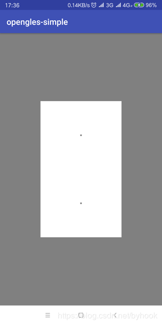
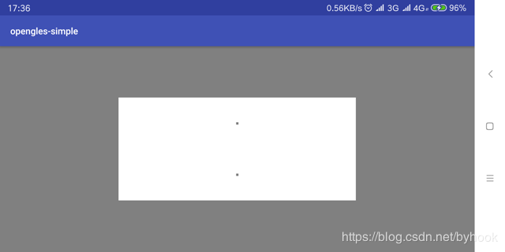
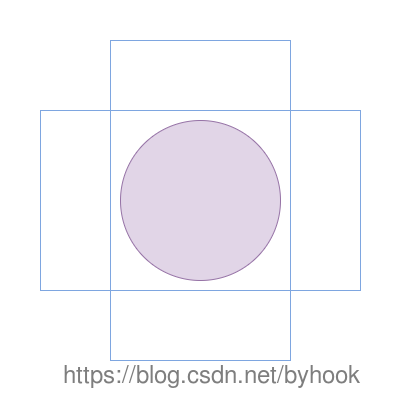
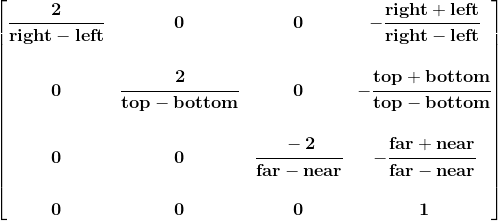
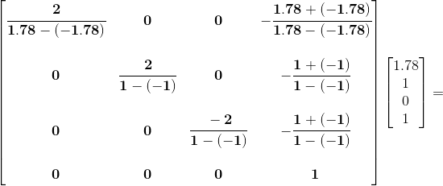
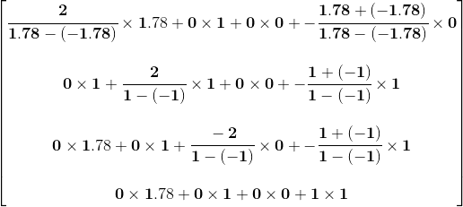
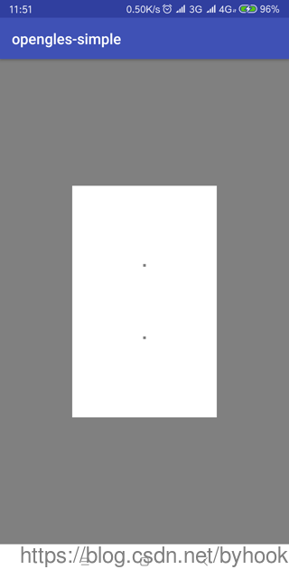
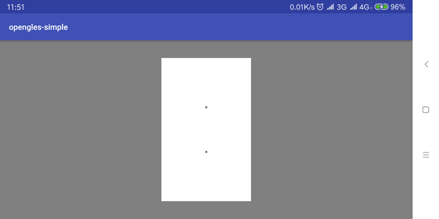
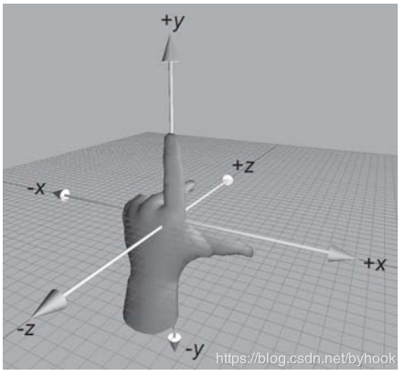
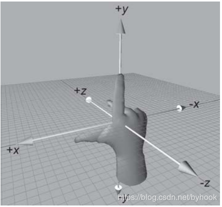

## 目录

- [绘制矩形]()
- [宽高比的问题]()
- [适应宽高比]()
- [使用虚拟坐标空间]()
- [矩阵和向量]()
- [正交投影]()
- [左手与右手坐标系]()

#### 绘制矩形

新建一个矩形渲染器：
```java
public class RectangleRenderer implements GLSurfaceView.Renderer
```

`定义顶点着色器：`

```java
#version 300 es
layout (location = 0) in vec4 vPosition;
layout (location = 1) in vec4 aColor;
out vec4 vColor;
void main() {
     gl_Position  =  vPosition;
     gl_PointSize = 10.0;
     vColor = aColor;
}
```

`定义片段着色器：`

```java
#version 300 es
precision mediump float;
in vec4 vColor;
out vec4 fragColor;
void main() {
     fragColor = vColor;
}
```

`定义坐标点数据：`

```java
private float[] vertexPoints = new float[]{
            //前两个是坐标,后三个是颜色RGB
            0.0f, 0.0f, 1.0f, 1.0f, 1.0f,
            -0.5f, -0.5f, 1.0f, 1.0f, 1.0f,
            0.5f, -0.5f, 1.0f, 1.0f, 1.0f,
            0.5f, 0.5f, 1.0f, 1.0f, 1.0f,
            -0.5f, 0.5f, 1.0f, 1.0f, 1.0f,
            -0.5f, -0.5f, 1.0f, 1.0f, 1.0f,

            0.0f, 0.25f, 0.5f, 0.5f, 0.5f,
            0.0f, -0.25f, 0.5f, 0.5f, 0.5f,
};
```

```java
public RectangleRenderer() {
        //分配内存空间,每个浮点型占4字节空间
        vertexBuffer = ByteBuffer.allocateDirect(vertexPoints.length * 4)
                .order(ByteOrder.nativeOrder())
                .asFloatBuffer();
        //传入指定的坐标数据
        vertexBuffer.put(vertexPoints);
        vertexBuffer.position(0);
}
```

`开始编译和链接着色器：`

```java
@Override
    public void onSurfaceCreated(GL10 gl, EGLConfig config) {
        //设置背景颜色
        GLES30.glClearColor(0.5f, 0.5f, 0.5f, 0.5f);

        //编译
        final int vertexShaderId = ShaderUtils.compileVertexShader(vertextShader);
        final int fragmentShaderId = ShaderUtils.compileFragmentShader(fragmentShader);
        //鏈接程序片段
        mProgram = ShaderUtils.linkProgram(vertexShaderId, fragmentShaderId);
        //在OpenGLES环境中使用程序片段
        GLES30.glUseProgram(mProgram);

        aPositionLocation = GLES30.glGetAttribLocation(mProgram, "vPosition");
        aColorLocation = GLES30.glGetAttribLocation(mProgram, "aColor");

        vertexBuffer.position(0);
        //获取顶点数组 (POSITION_COMPONENT_COUNT = 2)
        GLES30.glVertexAttribPointer(aPositionLocation, POSITION_COMPONENT_COUNT, GLES30.GL_FLOAT, false, STRIDE, vertexBuffer);

        GLES30.glEnableVertexAttribArray(aPositionLocation);

        vertexBuffer.position(POSITION_COMPONENT_COUNT);
        //颜色属性分量的数量 COLOR_COMPONENT_COUNT = 3
        GLES30.glVertexAttribPointer(aColorLocation, COLOR_COMPONENT_COUNT, GLES30.GL_FLOAT, false, STRIDE, vertexBuffer);

        GLES30.glEnableVertexAttribArray(aColorLocation);
}
```

注意：`glVertexAttribPointer`这个方法的`第5个参数`，`stride`，这个参数表示：

`每个顶点由size指定的顶点属性分量顺序存储。stride指定顶 点索引I和(I+1），表示的顶点数据之间的位移。如果stride为0，则每个顶点的属性数据顺序存储。如果stride大于0, 则使用该值作为获取下一个索引表示的顶点数据的跨距。`

```java
//之前定义的坐标数据中，每一行是5个数据，前两个表示坐标(x,y)，后三个表示颜色(r,g,b)
private static final int STRIDE = (POSITION_COMPONENT_COUNT + COLOR_COMPONENT_COUNT) * BYTES_PER_FLOAT;
//所以这里实际是 STRIDE = (2 + 3) x 4

```

`开始绘制：`

```java
@Override
public void onDrawFrame(GL10 gl) {
    GLES30.glClear(GLES30.GL_COLOR_BUFFER_BIT);

    //绘制矩形
    GLES30.glDrawArrays(GLES30.GL_TRIANGLE_STRIP, 0, 6);

    //绘制两个点
    GLES30.glDrawArrays(GLES30.GL_POINTS, 6, 2);
}
```

竖屏状态下显示：



横屏模式下显示：



#### 宽高比的问题

假设实际手机分辨率以像素为单位是`720x1280`，我们默认使用`OpenGL`占用整个显示屏。
设备在竖屏模式下，那么`[-1，1]`的范围对应的高有`1280像素`，而宽却只有`720像素`。
图像会在`x轴`显得扁平，如果在横屏模式，图像会在`y轴`显得扁平。通过上面的例子可以看到`竖屏`和`横屏`模式下就有种被拉伸的感觉。

其实在`OpenGL中`，我们要渲染的一切物体都要映射到`x轴`和`y轴`上`[-1， 1]`的范围内，对z轴也是一样的。这个范围内的坐标被称为`归一化设备坐标`，其独立于屏幕实际的尺寸或形状，但是因为它们独立于实际的屏幕尺寸，如果直接使用它们，我们就会遇到刚才的问题。

`归一化设备坐标`假定坐标空间是一个正方形，然而，我们实际的视口`viewport`可能不是一个正方形，就像我刚刚手机上显示的一样，图像在一个方向上被拉伸，在另外一个方向上被压扁。因此在一个竖屏设备上，`归一化设备坐标`上定义的图像看上去就是在水平方向上被压扁，在横屏模式下，同样的图像就在垂直方向上看起来是压扁的。




#### 适应宽高比

这个时候我们就需要调整坐标空间，让它把屏幕的形状考虑在内，可行的一个方法是把较小的范围固定在`[-1，1]`内，而按屏幕尺寸的比例调整较大的范围。

举例来说，在竖屏情况下，其`宽度是720`，而`髙度是1280`，因此我们可以把宽度范围限定在`[-1，1]`，并把高度范围调整为`[-1280/720，1280/720]`或`[-1.78，1.78]`。同理，在横屏模式情况下，把宽度范围设为`[-1.78，1.78]`，而把高度范围设为`[-1，1]`。
通过调整已有的坐标空间，最终会改变我们可用的空间，通过这个方法，不论是竖屏模式还是横屏模式，物体看起来就都一样了。

#### 使用虚拟坐标空间

我们需要调整坐标空间，以便我们把屏幕方向考虑进来，需要停止直接在归一化设备坐标上工作，而开始在虚拟坐标空间里工作。需要找到某种可以把虚拟空间坐标转换回归一化设备坐标的方法，让`OpenGL`可以正确地渲染它们，这个操作叫作`正交投影`，不管多远 或多近，所有的物体看上去大小总是相同的。

#### 矩阵和向量

在`正交投影`之前，可以先来复习一下`矩阵以及向量相关的知识`，因为在`OpenGL`中大量地使用了`向量和矩阵`，矩阵的最重要的用途之一就是建立`正交和透视投影`。其原因之一是，使用矩阵做投影只涉及对一组数据按顺序执行大量的加法和乘法，这些运算在现代GPU上执行得非常快。

- 向量

一个向量是一个有多个元索的一维数组。在`OpenGL`里，一个`位置`通常是一个四元素向量，`颜色`也是一样。我们使用的大多数向量一般都有四个元素。一个`位置向量`，它有`一个x、一个y、一个z和一个w`分量。


我们在`三维空间`中，`x，y，z分量用的比较多`

- 矩阵

—个矩阵(`Matrix`)是一个有多个元素的二维数组。在`OpenGL`里，我们一般使用矩阵作向量投影，如`正交或者透视投影`，并且也用它们使物体旋转(`rotation`)、平移(`translatum`)以及缩放(`scaling`)。我们把矩阵与每个要变换的向最相乘即可实现这些变换。


`矩阵与向量相乘`


对于第一行，我们让Xx和x相乘、Xy和y相乘、Xz和z相乘以及Xw和w相乘，然后把 所有四个结果加起来得到这个结果的x分量。
矩阵第一行的所有四个分都影响了那个结果`x`，第二行的所有4个分量都影响了那个结果`y`，以此类推。在矩阵的每一行内，第一个分量与向量的`x`相乘，第二个分量也与向虽的`y`相乘，以此类推。

- 单位矩阵


`这个矩阵乘以任何向量都是得到与之前结果相同的向量`


结果


- 平移矩阵

`平移矩阵可以把一个物体沿着指定的方向移动`


`计算过程：`


`最终的结果：`


#### 正交投影

在`android`中可以使用`Matrix类`来定义正交投影，这个类有一个称为`orthoM`的方法，它可以为我们生成一个正交投影。我们将使用这个投影调整坐标空间。正交投影与平移矩阵是非常相似的。

`方法的参数描述：`

|参数|描述|
|:--|:--|
|`float[]` m|目标数组，这个数组的长度至少有16个元素，这样它才能存储正交投影矩阵|
|`int` mOffset|结果矩阵起始的偏移值|
|`float` left| x轴的最小范围|
|`float` right| x轴的最大范围|
|`float` bottom|y轴的最小范围|
`float` top|y轴的最大范围|
|`float` near|z轴的最小范围|
|`float` far|z轴的最大范围|

这个方法会产生下面的正交投影矩阵：



`经过上述正交投影矩阵转换之后，转换回归一矩阵`





`输出结果`


在`RectangleRenderer类`中定义目标数组
```java
private final float[] mMatrix = new float[16];
```

修改`顶点着色器`

```java
#version 300 es
layout (location = 0) in vec4 vPosition;
layout (location = 1) in vec4 aColor;
uniform mat4 u_Matrix;
out vec4 vColor;
void main() {
     gl_Position  = u_Matrix * vPosition;
     gl_PointSize = 10.0;
     vColor = aColor;
}
```

修改`onSurfaceCreated`回调
```java
@Override
    public void onSurfaceCreated(GL10 gl, EGLConfig config) {
        ......
        //在OpenGLES环境中使用程序片段
        GLES30.glUseProgram(mProgram);

        uMatrixLocation = GLES30.glGetUniformLocation(mProgram, "u_Matrix");

        aPositionLocation = GLES30.glGetAttribLocation(mProgram, "vPosition");
        aColorLocation = GLES30.glGetAttribLocation(mProgram, "aColor");

        ......
}
```
在`onSurfaceChanged`回调中

```java
@Override
    public void onSurfaceChanged(GL10 gl, int width, int height) {
        GLES30.glViewport(0, 0, width, height);
        final float aspectRatio = width > height ?
                (float) width / (float) height :
                (float) height / (float) width;
        if (width > height) {
            //横屏
            Matrix.orthoM(mMatrix, 0, -aspectRatio, aspectRatio, -1f, 1f, -1f, 1f);
        } else {
            //竖屏
            Matrix.orthoM(mMatrix, 0, -1f, 1f, -aspectRatio, aspectRatio, -1f, 1f);
        }
}
```

在`onDrawFrame`回调中

```java
@Override
    public void onDrawFrame(GL10 gl) {
        GLES30.glClear(GLES30.GL_COLOR_BUFFER_BIT);

        GLES30.glUniformMatrix4fv(uMatrixLocation, 1, false, mMatrix, 0);

        //绘制矩形
        GLES30.glDrawArrays(GLES30.GL_TRIANGLE_STRIP, 0, 6);

        //绘制两个点
        GLES30.glDrawArrays(GLES30.GL_POINTS, 6, 2);

}
```
我们来观察一下最终的横竖屏状态

竖屏状态



横屏状态



#### 左手与右手坐标系

`左手坐标系`



`右手坐标系`



项目地址：
https://github.com/byhook/opengles4android

参考：
《OpenGL ES 3.0 编程指南第2版》
《OpenGL ES应用开发实践指南Android卷》
