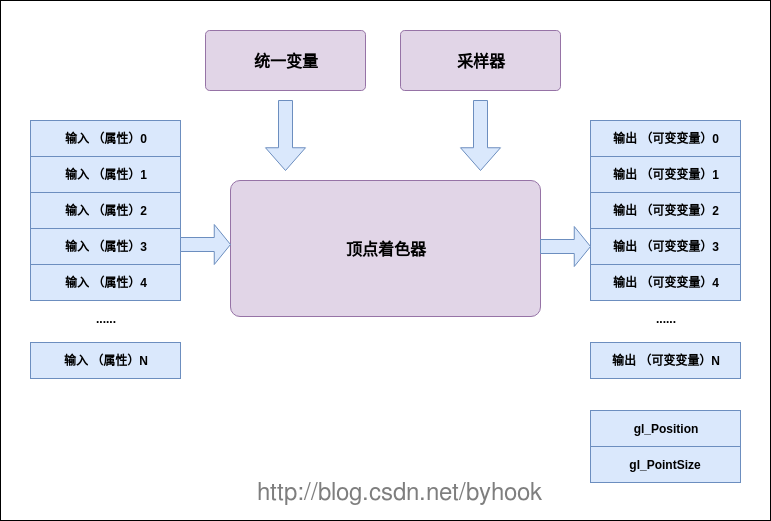
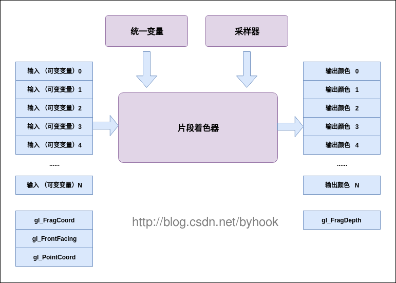
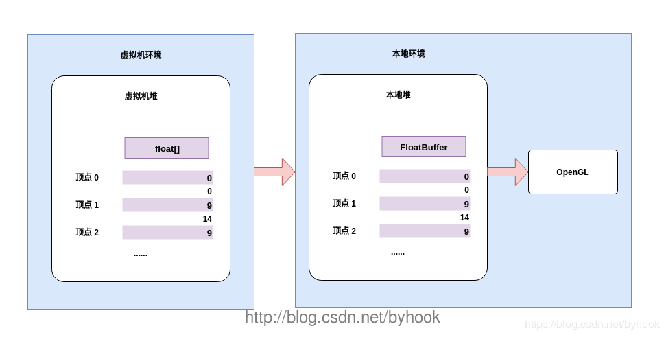

## 目录

- [OpenGL ES对Android平台的支持情况]()
- [OpenGL ES 3.0概述]()
- [OpenGL ES 3.0图形管线图]()
- [顶点着色器]()
- [片段着色器]()
- [图元装配]()
- [光栅化]()
- [逐片段操作]()
- [虚拟机和OpenGL ES 3.0的数据传输]()

#### OpenGL ES对Android平台的支持情况

`OpenGL ES当前主要版本有1.0/1.1/2.0/3.0/3.1`。

|OpenGL ES版本|Android版本|描述|
|:-|:-|:-|
|OpenGL ES1.0|Ａndroid 1.0+|OpenGL ES 1.x是针对固定硬件管线的，Ａndroid 1.0和更高的版本支持这个API规范。|
|**OpenGL ES2.0**|**Android 2.2(API 8)+**|OpenGL ES 2.x是针对可编程硬件管线的，不兼容OpenGL ES 1.x，Android 2.2(API 8)和更高的版本支持这个API规范。|
|**OpenGL ES3.0**|**Android 4.3(API 18)+**|向下兼容OpenGL ES 2.x，Android 4.3(API 18)及更高的版本支持这个API规范。|
|OpenGL ES3.1|Android 5.0 (API 21)+|向下兼容OpenGL ES3.0/2.0，Android 5.0（API 21）和更高的版本支持这个API规范|

#### OpenGL ES 3.0概述

OpenGL ES 3.0实现了具有可编程着色功能的图形管线，由两个规范组成：`OpenGL ES 3.0 API 规范`和`OpenGL ES着色语言3.0规范(OpenGL ES SL)`。

#### OpenGL ES 3.0图形管线图


#### 顶点着色器
顶点着色器实现了顶点操作的通用可编程方法，`着色器（Shader）是在GPU上运行的小程序`。
顶点着色器的输入包括：
- 着色器程序一一描述顶点上执行操作的顶点着色器程序源代码或者可执行文件。
- 顶点着色器输人(或者属性)一一用顶点数组提供的每个顶点的数据。
- 统一变量(`uniform`)一一顶点(或者片段)着色器使用的不变数据。
- 采样器一一代表顶点着色器使用纹理的特殊统一变量类型。


`顶点着色器的输入输出模型`



`顶点着色器取得一个位置及相关的颜色数据作为输入属性，用一个 4x4矩阵变换位置，并输出变换后的位置和颜色。`
```java
#version 300 es
uniform mat4 u_mvpMatrix;

int vec4 a_postion;
int vec4 a_color;

out vec4 v_color;
void main(){
	v_color = a_color;
	gl_Position = u_mvpMatrix * a_postion
}
```

#### 片段着色器
片段着色器片段着色器为片段上的操作实现了通用的可编程方法。
对光栅化阶段生成的每个片段执行这个着色器，采用如下输入：
- 着色器程序——描述片段上所执行操作的片段着色器程序源代码或者可执行文件。
- 输人变量——光姗化单元用插值为每个片段生成的顶点着色器钧出。
- 统一变量——片段(或者顶点)着色器使用的不变数据。
- 采样器——讨七表片段着色器所用纹理的特殊统一变量类型。



#### 图元装配
图元装配顶点着色器之后， 0pennGL ES 3.0 图形管线的下一阶段就是图元装配。
`图元(Primitive)是三角形、直线或者点精灵等几何对象。图元的每个顶点被发送到顶点着色器的不同拷贝。
在图元装配期间，这些顶点被组合成图元。对于每个图元，必须确定图元是否位于视锥体（屏幕上可见的 3D 空间区域）内。如果图元没有完全在视锥体内，则可能需要进行裁剪。如果图元完全处于该区域之外，它就会被抛弃。裁剪之后，顶点位置被转换为屏幕坐标。也可以执行一次淘汰操作，根据图元面向前方或者后方抛弃它们。裁剪和淘汰之后，图元便准备传递给管线的下一阶段 ― 光栅化阶段。

 #### 光栅化
 下一阶段是光栅化，在此阶段绘制对应的图元（点精灵、直线或者三角形）。光栅化是将图元转化为一组二维片段的过程，然后，这些片段由片段着色器处理。这些二维片段代表着可在屏幕上绘制的像素。

`OpenGL ES 3.0 光栅化阶段`


#### 逐片段操作

片段着色器之后，下一个阶段就是`逐片段操作`。


#### OpenGL ES 数据存储
android中的程序都是运行在`虚拟机`中的，而`OpenGL`作为本地系统库是运行在硬件上的，虚拟机与`OpenGL`数据传输的方式由两种
- 第一种：使用Java调用本地接口`JNI`的方式，当我们使用`GLES20包`里的方法时，内部实现其实就是调用本地方法。
- 第二种：改变内存的分配方式，Java当中有个特殊的类(如`ByteBuffer`)集合，可以直接分配本地内存块，并把Java的数据复制到本地内存，本地内存可以被本地环境存取，而不受垃圾回收器管控。

`从虚拟机到本地环境的数据传输过程`



参考：
《OpenGL ES 3.0 编程指南第2版》
《OpenGL ES应用开发实践指南Android卷》
