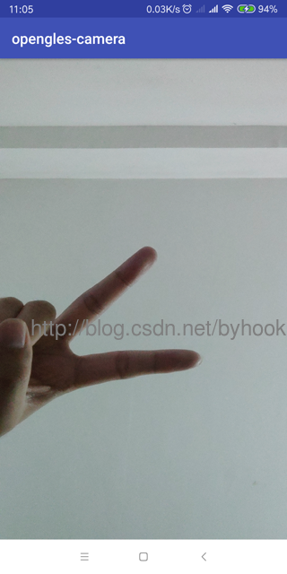
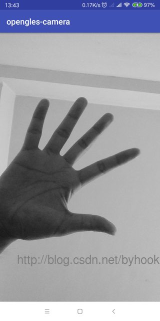
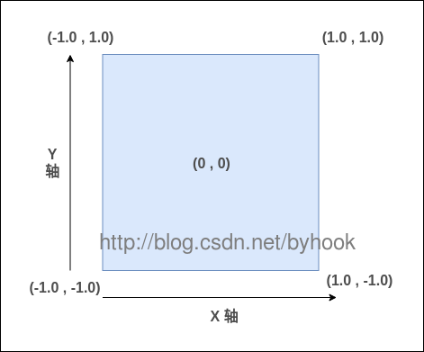
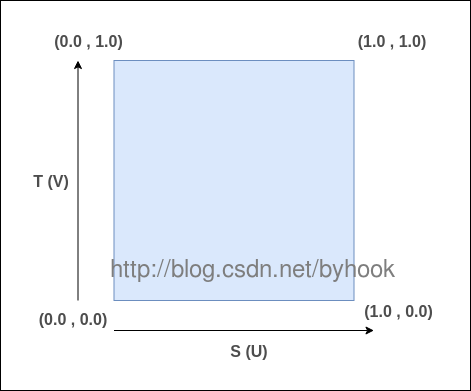
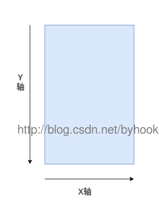

## 相机预览数据格式

`android相机`输出的原始数据格式一般都是`NV21(实际上就是YUV420SP的格式)`或者`NV12(实际上就是YUV420P的格式)`，笔者的`小米MIX 2S`的默认输出格式就是`NV21`的，关于格式的问题，后续博客再详细说明。

前面的博客以及说明了如何通过`OpenGL ES`来渲染图像，一般`YUV格式`的数据是无法直接用`OpenGL ES`来渲染的，而在OpenGL中使用的绝大部分纹理ID都是RGBA的格式，在`OpenGL ES 3.0`的扩展`#extension GL_OES_EGL_image_external_essl3`定义了一个纹理的扩展类型，即`GL_TEXTURE_EXTERNAL_OES`，否则整个转换过程将会非常复杂。同时这种纹理目标对纹理的使用方式也会有一些限制，纹理绑定需要绑定到类型`GL_TEXTURE_EXTERNAL_OES`上，而不是类型GL_TEXTURE_2D上，对纹理设置参数也要使用`GL_TEXTURE_EXTERNAL_OES`类型，生成纹理与设置纹理参数的代码如下：

```java
int[] tex = new int[1];
//创建一个纹理
GLES30.glGenTextures(1, tex, 0);
//绑定到外部纹理上
GLES30.glBindTexture(GLES11Ext.GL_TEXTURE_EXTERNAL_OES, tex[0]);
//设置纹理过滤参数
GLES30.glTexParameterf(GLES11Ext.GL_TEXTURE_EXTERNAL_OES, GLES30.GL_TEXTURE_MIN_FILTER, GLES30.GL_NEAREST);
GLES30.glTexParameterf(GLES11Ext.GL_TEXTURE_EXTERNAL_OES, GLES30.GL_TEXTURE_MAG_FILTER, GLES30.GL_LINEAR);
GLES30.glTexParameterf(GLES11Ext.GL_TEXTURE_EXTERNAL_OES, GLES30.GL_TEXTURE_WRAP_S, GLES30.GL_CLAMP_TO_EDGE);
GLES30.glTexParameterf(GLES11Ext.GL_TEXTURE_EXTERNAL_OES, GLES30.GL_TEXTURE_WRAP_T, GLES30.GL_CLAMP_TO_EDGE);
```
`在实际的渲染过程中绑定纹理的代码如下：`

```java
GLES30.glActiveTexture(GL_TEXTURE0);
GLES30.glBindTexture(GL_TEXTURE_EXTERNAL_OES, textureId);
GLES30.glUniform1i(uniformSamplers, 0);
```

在OpenGL ES的`顶点着色器`中，任何需要从纹理中采样的OpenGL ES的`顶点着色器`都需要声明其对此扩展的使用，使用指令如下：

```java
//这行是OpenGL ES 2.0中的声明
#extension GL_OES_EGL_image_external : require
//这行是OpenGL ES 3.0中的声明
#extension GL_OES_EGL_image_external_essl3 : require
```

上面的过程就是使用这种扩展类型的纹理ID从创建到设置参数，再到真正的渲染整个过程，接下来再根据`一个完整的示例`看一下具体的旋转角度问题，因为在使用摄像头的时候很容易在预览的时候会出现倒立、镜像等问题。

## 开始项目实践

先不多说，直接实践看效果，基于之前的[项目工程](https://github.com/byhook/opengles4android)，新建`CameraSurfaceRenderer.java`文件：

```java
/**
 * @anchor: andy
 * @date: 2018-11-09
 * @description: 基于相机
 */
public class CameraSurfaceRenderer implements GLSurfaceView.Renderer {

    private static final String TAG = "TextureRenderer";

    private final FloatBuffer vertexBuffer, mTexVertexBuffer;

    private final ShortBuffer mVertexIndexBuffer;

    private int mProgram;

    private int textureId;

    /**
     * 顶点坐标
     * (x,y,z)
     */
    private float[] POSITION_VERTEX = new float[]{
            0f, 0f, 0f,     //顶点坐标V0
            1f, 1f, 0f,     //顶点坐标V1
            -1f, 1f, 0f,    //顶点坐标V2
            -1f, -1f, 0f,   //顶点坐标V3
            1f, -1f, 0f     //顶点坐标V4
    };

    /**
     * 纹理坐标
     * (s,t)
     */
    private static final float[] TEX_VERTEX = {
            0.5f, 0.5f, //纹理坐标V0
            1f, 1f,     //纹理坐标V1
            0f, 1f,     //纹理坐标V2
            0f, 0.0f,   //纹理坐标V3
            1f, 0.0f    //纹理坐标V4
    };

    /**
     * 索引
     */
    private static final short[] VERTEX_INDEX = {
            0, 1, 2,  //V0,V1,V2 三个顶点组成一个三角形
            0, 2, 3,  //V0,V2,V3 三个顶点组成一个三角形
            0, 3, 4,  //V0,V3,V4 三个顶点组成一个三角形
            0, 4, 1   //V0,V4,V1 三个顶点组成一个三角形
    };

    private float[] transformMatrix = new float[16];

    /**
     * 渲染容器
     */
    private GLSurfaceView mGLSurfaceView;

    /**
     * 相机ID
     */
    private int mCameraId;

    /**
     * 相机实例
     */
    private Camera mCamera;

    /**
     * Surface
     */
    private SurfaceTexture mSurfaceTexture;

    /**
     * 矩阵索引
     */
    private int uTextureMatrixLocation;

    private int uTextureSamplerLocation;

    public CameraSurfaceRenderer(GLSurfaceView glSurfaceView) {
        this.mCameraId = Camera.CameraInfo.CAMERA_FACING_FRONT;
        this.mGLSurfaceView = glSurfaceView;
        mCamera = Camera.open(mCameraId);
        setCameraDisplayOrientation(mCameraId, mCamera);

        //分配内存空间,每个浮点型占4字节空间
        vertexBuffer = ByteBuffer.allocateDirect(POSITION_VERTEX.length * 4)
                .order(ByteOrder.nativeOrder())
                .asFloatBuffer();
        //传入指定的坐标数据
        vertexBuffer.put(POSITION_VERTEX);
        vertexBuffer.position(0);

        mTexVertexBuffer = ByteBuffer.allocateDirect(TEX_VERTEX.length * 4)
                .order(ByteOrder.nativeOrder())
                .asFloatBuffer()
                .put(TEX_VERTEX);
        mTexVertexBuffer.position(0);

        mVertexIndexBuffer = ByteBuffer.allocateDirect(VERTEX_INDEX.length * 2)
                .order(ByteOrder.nativeOrder())
                .asShortBuffer()
                .put(VERTEX_INDEX);
        mVertexIndexBuffer.position(0);
    }

    private void setCameraDisplayOrientation(int cameraId, Camera camera) {
        Activity targetActivity = (Activity) mGLSurfaceView.getContext();
        android.hardware.Camera.CameraInfo info =
                new android.hardware.Camera.CameraInfo();
        android.hardware.Camera.getCameraInfo(cameraId, info);
        int rotation = targetActivity.getWindowManager().getDefaultDisplay()
                .getRotation();
        int degrees = 0;
        switch (rotation) {
            case Surface.ROTATION_0: degrees = 0; break;
            case Surface.ROTATION_90: degrees = 90; break;
            case Surface.ROTATION_180: degrees = 180; break;
            case Surface.ROTATION_270: degrees = 270; break;
        }

        int result;
        if (info.facing == Camera.CameraInfo.CAMERA_FACING_FRONT) {
            result = (info.orientation + degrees) % 360;
            result = (360 - result) % 360;  // compensate the mirror
        } else {  // back-facing
            result = (info.orientation - degrees + 360) % 360;
        }
        camera.setDisplayOrientation(result);
    }

    /**
     * 加载外部纹理
     * @return
     */
    public int loadTexture() {
        int[] tex = new int[1];
        //创建一个纹理
        GLES30.glGenTextures(1, tex, 0);
        //绑定到外部纹理上
        GLES30.glBindTexture(GLES11Ext.GL_TEXTURE_EXTERNAL_OES, tex[0]);
        //设置纹理过滤参数
        GLES30.glTexParameterf(GLES11Ext.GL_TEXTURE_EXTERNAL_OES, GLES30.GL_TEXTURE_MIN_FILTER, GLES30.GL_NEAREST);
        GLES30.glTexParameterf(GLES11Ext.GL_TEXTURE_EXTERNAL_OES, GLES30.GL_TEXTURE_MAG_FILTER, GLES30.GL_LINEAR);
        GLES30.glTexParameterf(GLES11Ext.GL_TEXTURE_EXTERNAL_OES, GLES30.GL_TEXTURE_WRAP_S, GLES30.GL_CLAMP_TO_EDGE);
        GLES30.glTexParameterf(GLES11Ext.GL_TEXTURE_EXTERNAL_OES, GLES30.GL_TEXTURE_WRAP_T, GLES30.GL_CLAMP_TO_EDGE);
        //解除纹理绑定
        GLES30.glBindTexture(GLES11Ext.GL_TEXTURE_EXTERNAL_OES, 0);
        return tex[0];
    }

    @Override
    public void onSurfaceCreated(GL10 gl, EGLConfig config) {

        //设置背景颜色
        GLES30.glClearColor(0.5f, 0.5f, 0.5f, 0.5f);
        //编译
        final int vertexShaderId = ShaderUtils.compileVertexShader(ResReadUtils.readResource(R.raw.vertex_camera_shader));
        final int fragmentShaderId = ShaderUtils.compileFragmentShader(ResReadUtils.readResource(R.raw.fragment_camera_shader));
        //链接程序片段
        mProgram = ShaderUtils.linkProgram(vertexShaderId, fragmentShaderId);

        uTextureMatrixLocation = GLES30.glGetUniformLocation(mProgram, "uTextureMatrix");
        //获取Shader中定义的变量在program中的位置
        uTextureSamplerLocation = GLES30.glGetUniformLocation(mProgram, "yuvTexSampler");

        //加载纹理
        textureId = loadTexture();
        //加载SurfaceTexture
        loadSurfaceTexture(textureId);
    }

    @Override
    public void onSurfaceChanged(GL10 gl, int width, int height) {
        GLES30.glViewport(0, 0, width, height);
    }

    @Override
    public void onDrawFrame(GL10 gl) {
        GLES30.glClear(GLES30.GL_COLOR_BUFFER_BIT);

        //使用程序片段
        GLES30.glUseProgram(mProgram);

        //更新纹理图像
        mSurfaceTexture.updateTexImage();
        mSurfaceTexture.getTransformMatrix(transformMatrix);

        //激活纹理单元0
        GLES30.glActiveTexture(GLES30.GL_TEXTURE0);
        //绑定外部纹理到纹理单元0
        GLES30.glBindTexture(GLES11Ext.GL_TEXTURE_EXTERNAL_OES, textureId);
        //将此纹理单元床位片段着色器的uTextureSampler外部纹理采样器
        GLES30.glUniform1i(uTextureSamplerLocation, 0);

        //将纹理矩阵传给片段着色器
        GLES30.glUniformMatrix4fv(uTextureMatrixLocation, 1, false, transformMatrix, 0);

        GLES30.glEnableVertexAttribArray(0);
        GLES30.glVertexAttribPointer(0, 3, GLES30.GL_FLOAT, false, 0, vertexBuffer);

        GLES30.glEnableVertexAttribArray(1);
        GLES30.glVertexAttribPointer(1, 2, GLES30.GL_FLOAT, false, 0, mTexVertexBuffer);

        // 绘制
        GLES20.glDrawElements(GLES20.GL_TRIANGLES, VERTEX_INDEX.length, GLES20.GL_UNSIGNED_SHORT, mVertexIndexBuffer);

    }

    public boolean loadSurfaceTexture(int textureId) {
        //根据纹理ID创建SurfaceTexture
        mSurfaceTexture = new SurfaceTexture(textureId);
        mSurfaceTexture.setOnFrameAvailableListener(new SurfaceTexture.OnFrameAvailableListener() {
            @Override
            public void onFrameAvailable(SurfaceTexture surfaceTexture) {
                mGLSurfaceView.requestRender();
            }
        });
        //设置SurfaceTexture作为相机预览输出
        try {
            mCamera.setPreviewTexture(mSurfaceTexture);
        } catch (IOException e) {
            e.printStackTrace();
            return false;
        }
        //开启相机预览
        mCamera.startPreview();
        return true;
    }
}
```

`顶点着色器：`

```java
#version 300 es
layout (location = 0) in vec4 vPosition;
layout (location = 1) in vec4 aTextureCoord;
//纹理矩阵
uniform mat4 uTextureMatrix;
out vec2 yuvTexCoords;
void main() {
     gl_Position  = vPosition;
     gl_PointSize = 10.0;
     //只保留x和y分量
     yuvTexCoords = (uTextureMatrix * aTextureCoord).xy;
}
```

`片段着色器：`

```java
#version 300 es
//OpenGL ES3.0外部纹理扩展
#extension GL_OES_EGL_image_external_essl3 : require
precision mediump float;
uniform samplerExternalOES yuvTexSampler;
in vec2 yuvTexCoords;
out vec4 vFragColor;
void main() {
     vFragColor = texture(yuvTexSampler,yuvTexCoords);
}
```

`注意：` 外部纹理扩展在`OpenGL ES 2.0`和`OpenGL ES 3.0`中不太一样。

```java
//OpenGL ES2.0外部纹理扩展
#extension GL_OES_EGL_image_external : require
```

`在启动的Activity中处理初始化的部分：`

```java
private void setupView() {
     //实例化一个GLSurfaceView
     mGLSurfaceView = new GLSurfaceView(this);
     mGLSurfaceView.setEGLContextClientVersion(3);
     mGLSurfaceView.setRenderer(new CameraSurfaceRenderer(mGLSurfaceView));
     setContentView(mGLSurfaceView);
}
```

`来个剪刀手看看效果：`



## 简单的滤镜处理

通过纹理将相机采集的数据渲染到`GLSurfaceView`的过程中，我们也可以添加各种滤镜。

给相机添加黑白滤镜，修改`片段着色器`

```java
#version 300 es
//OpenGL ES3.0外部纹理扩展
#extension GL_OES_EGL_image_external_essl3 : require
precision mediump float;
uniform samplerExternalOES yuvTexSampler;
in vec2 yuvTexCoords;
out vec4 vFragColor;
void main() {
     vec4 vCameraColor = texture(yuvTexSampler,yuvTexCoords);
     float fGrayColor = (0.3*vCameraColor.r + 0.59*vCameraColor.g + 0.11*vCameraColor.b);
     vFragColor = vec4(fGrayColor, fGrayColor, fGrayColor, 1.0);
}
```



可以参照下面的几个转换公式：

`标清电视使用的标准BT.601`


`标清电视使用的标准BT.709`


## 相机从采集到显示的过程

上述的例子完整的实现了相机预览数据通过`OpenGL ES 3.0`实时渲染到`GLSurfaceView`上。但是如果你稍不注意，很可能会出现手机摄像头预览的时候会出现倒立、镜像等问题，下面来看看这个过程。

`前置摄像头从采集到最终显示的过程：`


`后置摄像头从采集到最终显示的过程：`


`OpenGL坐标：`



`OpenGL二维纹理坐标：`




`不做任何旋转的纹理坐标：`

```java
private static final float[] TEX_VERTEX = {
        0.0f, 0.0f,     //图像左下角
        1.0f, 0.0f,     //图像右下角
        0.0f, 1.0f,   	//图像左上角
        1.0f, 1.0f    	//图像右上角
};
```

`顺时针旋转90度的纹理坐标：(可以想象一下将上述的OpenGL二维纹理坐标顺时针旋转90度)`

```java
private static final float[] TEX_VERTEX = {
 		1.0f, 0.0f,     //图像右下角
 		1.0f, 1.0f,    	//图像右上角
        0.0f, 0.0f,     //图像左下角
        0.0f, 1.0f   	//图像左上角
};
```

`顺时针旋转180度的纹理坐标：`

```java
private static final float[] TEX_VERTEX = {
 		1.0f, 0.0f,     //图像右下角
 		0.0f, 1.0f,   	//图像左上角
 		1.0f, 1.0f,    	//图像右上角
        0.0f, 0.0f      //图像左下角
};
```

`顺时针旋转270度的纹理坐标：`

```java
private static final float[] TEX_VERTEX = {
		0.0f, 1.0f,   	//图像左上角
		0.0f, 0.0f,     //图像左下角
		1.0f, 1.0f,    	//图像右上角
 		1.0f, 0.0f     //图像右下角
};
```

我们再来看看之前说的计算机中的图像坐标系：




所以我们实际在处理相机的预览图像时要对每一个纹理坐标做一个`VFlip`的变换`(即把每一个顶点的y值由0变为1或者由1变为0)`，这样就可以得到一个正确的图像旋转了。而前置摄像头还存在镜像的问题，因此需要对每一个纹理坐标做一个`HFlip`的变换`(即把每一个顶点的x值由0变为1或者由1变为0)`，从而让图片在预览界面中看起来就像在镜子中的一样。

