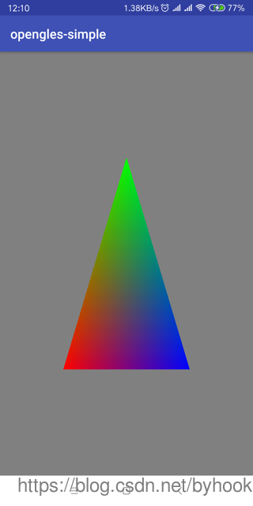

本例基于[android平台下OpenGLES3.0绘制圆点、直线和三角形](https://blog.csdn.net/byhook/article/details/83719500)

## 目录

- [顶点着色器]()
- [片段着色器]()
- [基于sdk绘制彩色三角形]()
- [基于ndk绘制彩色三角形]()

#### 顶点着色器

```java
#version 300 es
layout (location = 0) in vec4 vPosition;
layout (location = 1) in vec4 aColor;
out vec4 vColor;
void main() {
     gl_Position  = vPosition;
     gl_PointSize = 10.0;
     vColor = aColor;
}
```
上述顶点着色器的描述：
- 第一行表示：着色器的版本，OpenGL ES 2.0版本可以不写。
- 第二行表示：输入一个名为`vPosition`的4分量向量，`layout (location = 0)`表示这个变量的位置是顶点属性0。
- 第三行表示：输入一个名为`aColor`的4分量向量，`layout (location = 1)`表示这个变量的位置是顶点属性1。
- 第四行表示：输出一个名为`vColor`的4分量向量
- 第八行表示：将输入数据`aColor`拷贝到`vColor`的变量中。

#### 片段着色器
```java
#version 300 es
precision mediump float;
in vec4 vColor;
out vec4 fragColor;
void main() {
     fragColor = vColor;
}

```
上述片段着色器的描述：
- 第一行表示：着色器的版本，OpenGL ES 2.0版本可以不写。
- 第二行表示：声明着色器中浮点变量的默认精度。
- 第三行表示: 声明一个输入名为`vColor`的4分向量
- 第四行表示：着色器声明一个`输出变量fragColor`，这个是一个4分量的向量。
- 第六行表示：表示将输入的颜色值数据拷贝到`fragColor`变量中，输出到颜色缓冲区。

#### 基于sdk绘制彩色三角形

```java
private float color[] = {
            0.0f, 1.0f, 0.0f, 1.0f,
            1.0f, 0.0f, 0.0f, 1.0f,
            0.0f, 0.0f, 1.0f, 1.0f
};
```

由于`虚拟机`和`OpenGL`运行环境不同,需要将`虚拟机数据传输到native层供其使用`

构造函数中: 将颜色数据传输到`native`层
```java
colorBuffer = ByteBuffer.allocateDirect(color.length * 4)
                .order(ByteOrder.nativeOrder())
                .asFloatBuffer();
//传入指定的数据
colorBuffer.put(color);
colorBuffer.position(0);
```

开始绘制:

```java
@Override
public void onDrawFrame(GL10 gl) {
    GLES30.glClear(GLES30.GL_COLOR_BUFFER_BIT);

    //准备坐标数据
    GLES30.glVertexAttribPointer(0, POSITION_COMPONENT_COUNT, GLES30.GL_FLOAT, false, 0, vertexBuffer);
    //启用顶点的句柄
    GLES30.glEnableVertexAttribArray(0);

    //绘制三角形颜色
    GLES30.glEnableVertexAttribArray(1);
    GLES30.glVertexAttribPointer(1, 4, GLES30.GL_FLOAT, false, 0, colorBuffer);

    GLES30.glDrawArrays(GLES30.GL_TRIANGLES, 0, 3);

    //禁止顶点数组的句柄
    GLES30.glDisableVertexAttribArray(0);
    GLES30.glDisableVertexAttribArray(1);
}
```

#### 基于ndk绘制彩色三角形

基于ndk的绘制示例在下面的地址中，需要定义好`jni的接口`，原理跟上述方式类型，不再赘述



 
