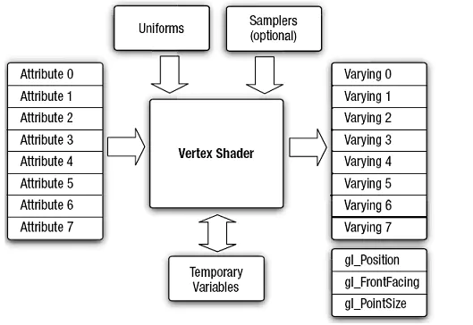
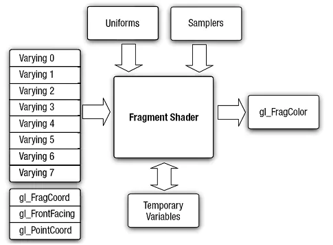
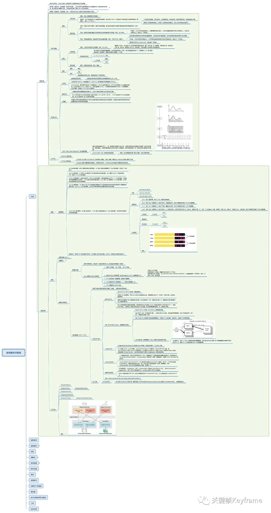

# OpenGl

### 顶点着色器

> 着色器（Shader）是在GPU上运行的小程序。从名称可以看出，可通过处理它们来处理顶点。此程序使用OpenGL ES SL语言来编写。它是一个描述顶点或像素特性的简单程序。

对于发送给GPU的每一个顶点，都要执行一次顶点着色器。其功能是把每个顶点在虚拟空间中的三维坐标变换为可以在屏幕上显示的二维坐标，并带有用于z-buffer的深度信息。顶点着色器可以操作的属性有：位置、颜色、纹理坐标，但是不能创建新的顶点。
 顶点着色器的输入输出模型如下：

### 片元着色器

> 片元着色器计算每个像素的颜色和其它属性。它通过应用光照值、凹凸贴图，阴影，镜面高光，半透明等处理来计算像素的颜色并输出。它也可改变像素的深度(z-buffering)或在多个渲染目标被激活的状态下输出多种颜色。一个片元着色器不能产生复杂的效果，因为它只在一个像素上进行操作，而不知道场景的几何形状。
>  片元着色器的输入输出模型如下：

### 坐标系

OpenGL ES采用的是右手坐标，`选取屏幕中心为原点`，从原点到屏幕边缘默认长度为1，也就是说默认情况下，从原点到（1,0,0）的距离和到（0,1,0）的距离在屏幕上展示的并不相同。即向右为X正轴方向，向左为X负轴方向，向上为Y轴正轴方向，向下为Y轴负轴方向，屏幕面垂直向上为Z轴正轴方向，垂直向下为Z轴负轴方向。

### 光照

如果利用直接给出颜色的方式来对3D场景中的物体进行着色渲染，很难使3D场景拥有较强的真实感。一般来说，曲面物体比平面物体更能体现出光照效果。想用数学模型完全模拟真实世界的光照情况是很难的，而OpenGL ES 2.0采用的光照模型相对真实世界的光照是进行了很大的简化。在OpenGL ES 2.0中，光照由三种元素组成（也可以说是三种通道组成），分别为环境光、镜面光及散射光。

- 环境光是指从四面八方照射到物体上，其具体公式为：
   环境光照射结果=材质反射系数∗环境光强度
- 散射光是指现实世界中组草的物体表面被光照射时，反射光在各个方向基本均匀的情况，其具体公式为：
   散射光照射结果=材质的反射系数∗散射光强度∗max(cos(入射角)，0)
   实际开发中往往分两步计算：
   散射光最终强度=散射光强度∗max(cos(入射角)，0) 散射光照射结果=材质的反射系数∗散射光最终强度
- 镜面光是指现实世界中光滑的表面被照射时会有方向很集中的反射光，与散射光最终强度依赖于入射光与被照射点的法向量夹角不同，镜面光的强度还依赖于观察者的位置，具体公式如下：
   镜面光照射结果=材质的反射系数∗镜面光强度∗max(0,cos(半向量与法向量的夹角)粗糙度)

实际开发中也是往往分两步计算：
 镜面光最终强度=镜面光强度∗max(0,cos(半向量与法向量的夹角)粗糙度) 镜面光照射结果=材质的反射系数∗镜面光最终强度

### 纹理映射

现实世界中的物体往往是绚丽多彩的，要模拟现实世界的绚丽多彩，绘制出更加真实、酷炫的3D物体，就需要用到纹理映射了。**纹理映射是将2D的纹理映射到3D场景中的立体物体上**。

# OpenGL ES 2.0过程及理解

从OpenGL ES 2.0的渲染管线图中，可以看到OpenGL ES 2.0渲染过程为：
 读取顶点数据——执行顶点着色器——组装图元——光栅化图元——执行片元着色器——写入帧缓冲区——显示到屏幕上。

- OpenGL作为本地库直接运行在硬件上，没有虚拟机，也没有垃圾回收或者内存压缩。在Java层定义图像的数据需要能被OpenGL存取，因此，需要把内存从Java堆复制到本地堆。
- 顶点着色器是针对每个顶点都会执行的程序，是确定每个顶点的位置。同理，片元着色器是针对每个片元都会执行的程序，确定每个片元的颜色。
- 着色器需要进行编译，然后链接到OpenGL程序中。一个OpenGL的程序就是把一个顶点着色器和一个片段着色器链接在一起变成单个对象。

