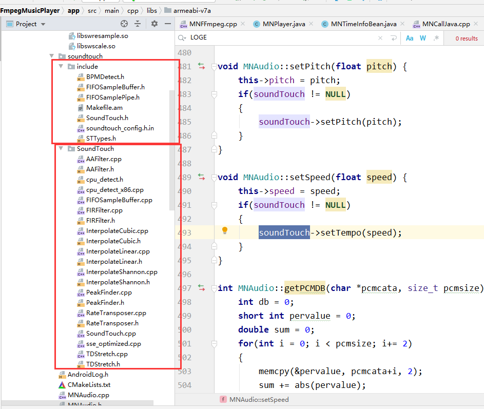
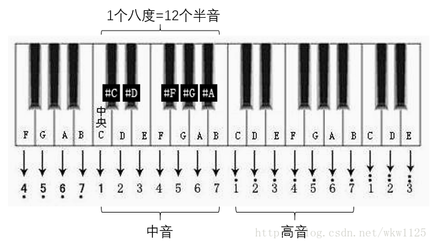

TimeBase

**一、time_base**

`AVStream`的`time_base`的单位是秒。每种格式的`time_base`的值不一样，根据采样来计算，比如`mpeg`的`pts`、`dts`都是以`90kHz`来采样的，**所以采样间隔就是`1/900000`秒。**

​	`AVCodecContext`的`time_base`单位同样为秒，不过精度没有`AVStream->time_base`高，大小为`1/framerate`。
`AVPacket`下的`pts`和`dts`以`AVStream->time_base`为单位(数值比较大)，时间间隔就是`AVStream->time_base`。
`AVFrame`里面的`pkt_pts`和`pkt_dts`是拷贝自`AVPacket`，同样以`AVStream->time_base`为单位；而`pts`是为输出(显示)准备的，以`AVCodecContex->time_base`为单位。
输入流`InputStream`下的`pts`和`dts`以`AV_TIME_BASE`为单位(微秒)，至于为什么要转化为微秒，可能是为了避免使用浮点数。
输出流`OutputStream`涉及音视频同步，结构和`InputStream`不同，暂时只作记录，不分析。

#### 1.1 SoundTouch详解

是一个用C++编写的开源的音频处理库，可以改变音频文件或实时音频流的节拍(Tempo)、音调(Pitch)、回放率(Playback Rates)，还支持估算音轨的稳定节拍率(BPM rate)。ST的3个效果互相独立，也可以一起使用。这些效果通过**采样率转换**、**时间拉伸**结合实现。

- **Tempo节拍** ：通过拉伸时间，改变声音的播放速率而不影响音调。
- **Playback Rate回放率** : 以不同的转率播放唱片（DJ打碟？），通过采样率转换实现。
- **Pitch音调** ：在保持节拍不变的前提下改变声音的音调，结合采样率转换+时间拉伸实现。如：增高音调的处理过程是：将原音频拉伸时长，再通过采样率转换，同时减少时长与增高音调变为原时长。

#### 1.2 处理对象

ST处理的对象是PCM（Pulse Code Modulation，脉冲编码调制），.wav文件中主要是这种格式，因此ST的示例都是处理wav音频。mp3等格式经过了压缩，需转换为PCM后再用ST处理。

#### 1.3主要特性

- 易于实现：ST为所有支持gcc编译器或者visual Studio的处理器或操作系统进行了编译，支持Windows、Mac OS、Linux、Android、Apple iOS等。

- 完全开源：ST库与示例工程完全开源可下载

- 容易使用：编程接口使用单一的C++类

- 支持16位整型或32位浮点型的单声道、立体声、多通道的音频格式

- 可实现实时音频流处理

  ：

  - 输入/输出延迟约为100ms
  - 实时处理44.1kHz/16bit的立体声，需要133Mhz英特尔奔腾处理器或更好

#### 1.4 相关链接

官网提供了ST的可执行程序、C++源码、说明文档、不同操作系统的示例工程，几个重要链接：

- [SoundTouch官网](https://www.surina.net/soundtouch/)
- [ST处理效果预览](https://www.surina.net/soundtouch/soundstretch.html#examples)（SoundStretch是官网用ST库实现的处理WAV音频的工具）
- [源码编译方法、算法以及参数说明](https://www.surina.net/soundtouch/README.html)
- [常见问题（如实时处理）](http://www.surina.net/soundtouch/faq.html)

#### 1.5 Android中如何使用SoundTouch

Android中使用ST，需将ST的C++代码使用NDK编译为.so库，再通过JNI调用。参考：[SoundTouch in Android](https://www.surina.net/soundtouch/README-SoundTouch-Android.html)

#### 1.6下载源码

下载：[soundtouch-1.9.2.zip](http://www.surina.net/soundtouch/sourcecode.html) ,包含ST的C++源码、Android-lib示例工程。

 

**copy头文件 和  库文件 直接用AndroidStudio编译**

#### 1.7调用接口与参数

示例工程中的SoundTouch.cpp是ST的调用接口，音调、音速的变化是通过为ST设置新的参数，这些参数需在正式开始处理前设置好。接口的调用示例可以参考soundtouch-jni.cpp中的_processFile函数。

**采样：**

- `setChannels(int)` 设置声道，1 = mono单声道, 2 = stereo立体声
- `setSampleRate(uint)` 设置采样率

**速率：**

- `setRate(double)` 指定播放速率，原始值为1.0，大快小慢
- `setTempo(double)` 指定节拍，原始值为1.0，大快小慢
- `setRateChange(double)`、`setTempoChange(double)` 在原速1.0基础上，按百分比做增量，取值(-50 .. +100 %)

**音调：**

- `setPitch(double)` 指定音调值，原始值为1.0
- `setPitchOctaves(double)` 在原音调基础上以八度音为单位进行调整，取值为[-1.00,+1.00]
- `setPitchSemiTones(int)` 在原音调基础上以半音为单位进行调整，取值为[-12,+12]

以上调音函数根据乐理进行单位换算，最后进入相同的处理流程calcEffectiveRateAndTempo()。三个函数对参数没有上下界限限制，只是参数过大失真越大。SemiTone指半音，通常说的“降1个key”就是降低1个半音。所以我认为使用SemiTone为单位即可满足需求，并且容易理解。

**处理：**

- `putSamples(const SAMPLETYPE *samples, uint nSamples)` 输入采样数据
- `receiveSamples(SAMPLETYPE *output, uint maxSamples)` 输出处理后的数据，需要循环执行
- `flush()` 冲出处理管道中的最后一组“残留”的数据，应在最后执行

**八度音Octave、半音SemiTone与Key**

作为音痴，顺道了解下乐理的皮毛：

> 
> 钢琴键盘上的一个黑键或白键就是一个key，乐理中叫semiTone半音。 上图的白键c d e f g a b，加黑键#c #d #f #g #a，共12个半音称为1个八度音。我们唱的do re mi fa so la si对应其中的7个白键。
>
> 12个半音从低到高分别是： c #c d #d e f #f g #g a #a b
>
> 2个半音=1个全音，相邻的键差1个半音（如c与#c），相隔的键差1个全音（如c与d）。
>
> “降3个key”就是将原本的g音唱为e；
> “降1个八度”是指原本唱高音组中的g，唱为中音组中的g，是降了12个key。
> “升key降八度”是一种歌唱方法： 歌手音准在a2，歌曲在d3，这时候有2个办法：
> 1、把伴奏降key，从d3降到a2，这样伴奏和歌手都在a2上
> 2、把伴奏升key，从d3升到a3，歌手用a2来唱。这样歌手a2和伴奏a3虽然不同，但是都在a调上，所以不会别扭。
> 采用方法2“升key降八度”是因为伴奏升key的音质损失更小。

#### 1.8SoundTouch实时处理音频流

ST对音频的处理是输入函数putSamples()与输出函数receiveSamples()。实时处理音频流的思路就是，循环读取音频数据段，放入ST进行输出，输出处理后的数据段用于播放。

由于业务要求使用Android的AudioEffect机制实现变调处理，得空后再尝试以JNI形式直接处理音频数据的工程。