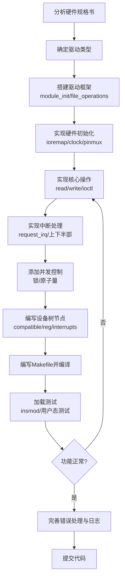

The user is asking about how to write low-level device drivers (底层驱动), which is unrelated to the current project. They want to understand the steps for writing a device driver, likely in the context of Linux kernel driver development.

Let me provide a comprehensive explanation about writing Linux kernel device drivers, which is the most common context for "底层驱动" (low-level drivers).
明白，您问的是通用的**底层驱动编写步骤**，以下是 Linux 内核驱动开发的详细步骤说明：

---

## 底层驱动编写步骤（Linux Kernel Driver）

### 一、前置知识准备

- C 语言编程
- Linux 内核基础概念（进程管理、内存管理、中断机制）
- 硬件基础知识（寄存器、总线、中断、DMA）
- 设备树（Device Tree）了解
- Makefile 与 Kbuild 系统

---

### 二、编写驱动的核心步骤

#### 第 1 步：确定驱动类型

```
字符设备驱动（char device）  →  如：串口、LED、按键
块设备驱动（block device）   →  如：硬盘、Flash
网络设备驱动（net device）   →  如：网卡
平台设备驱动（platform driver）→  如：SoC 片上外设
USB/I2C/SPI 驱动             →  如：总线类外设
```

#### 第 2 步：搭建最简驱动框架

```c
#include <linux/module.h>
#include <linux/init.h>
#include <linux/fs.h>
#include <linux/cdev.h>
#include <linux/device.h>

// 1. 设备号
dev_t dev_num;
struct cdev my_cdev;
struct class *my_class;
struct device *my_device;

// 2. 文件操作集合
static int my_open(struct inode *inode, struct file *filp) {
    printk(KERN_INFO "device opened\n");
    return 0;
}

static ssize_t my_read(struct file *filp, char __user *buf,
                       size_t count, loff_t *f_pos) {
    printk(KERN_INFO "device read\n");
    return 0;
}

static ssize_t my_write(struct file *filp, const char __user *buf,
                        size_t count, loff_t *f_pos) {
    printk(KERN_INFO "device write\n");
    return count;
}

static int my_release(struct inode *inode, struct file *filp) {
    printk(KERN_INFO "device closed\n");
    return 0;
}

// 3. file_operations 结构体
static struct file_operations my_fops = {
    .owner   = THIS_MODULE,
    .open    = my_open,
    .read    = my_read,
    .write   = my_write,
    .release = my_release,
};

// 4. 模块加载函数
static int __init my_driver_init(void) {
    // a. 动态申请设备号
    alloc_chrdev_region(&dev_num, 0, 1, "my_device");

    // b. 初始化 cdev 并绑定 file_operations
    cdev_init(&my_cdev, &my_fops);

    // c. 添加 cdev 到内核
    cdev_add(&my_cdev, dev_num, 1);

    // d. 创建设备类和设备节点（自动创建 /dev/my_device）
    my_class = class_create(THIS_MODULE, "my_class");
    my_device = device_create(my_class, NULL, dev_num, NULL, "my_device");

    printk(KERN_INFO "driver init success, major=%d\n", MAJOR(dev_num));
    return 0;
}

// 5. 模块卸载函数
static void __exit my_driver_exit(void) {
    device_destroy(my_class, dev_num);
    class_destroy(my_class);
    cdev_del(&my_cdev);
    unregister_chrdev_region(dev_num, 1);
    printk(KERN_INFO "driver exit\n");
}

module_init(my_driver_init);
module_exit(my_driver_exit);

MODULE_LICENSE("GPL");
MODULE_AUTHOR("Your Name");
MODULE_DESCRIPTION("A simple char device driver");
```

#### 第 3 步：编写 Makefile

```makefile
obj-m := my_driver.o

KDIR := /lib/modules/$(shell uname -r)/build

all:
	make -C $(KDIR) M=$(PWD) modules

clean:
	make -C $(KDIR) M=$(PWD) clean
```

#### 第 4 步：编译与加载

```bash
# 编译
make

# 加载模块
sudo insmod my_driver.ko

# 查看是否加载成功
dmesg | tail
lsmod | grep my_driver

# 查看设备节点
ls -l /dev/my_device
```

#### 第 5 步：编写用户态测试程序

```c
#include <stdio.h>
#include <fcntl.h>
#include <unistd.h>

int main() {
    int fd = open("/dev/my_device", O_RDWR);
    if (fd < 0) {
        perror("open failed");
        return -1;
    }

    char buf[128] = "hello driver";
    write(fd, buf, sizeof(buf));
    read(fd, buf, sizeof(buf));

    close(fd);
    return 0;
}
```

#### 第 6 步：卸载驱动

```bash
sudo rmmod my_driver
```

---

### 三、进阶：不同类型驱动的扩展

| 功能                       | 涉及的关键 API / 机制                                        |
| -------------------------- | ------------------------------------------------------------ |
| **硬件寄存器操作**         | `ioremap()` / `iounmap()` / `readl()` / `writel()`           |
| **中断处理**               | `request_irq()` / `free_irq()` / 中断上下半部（tasklet / workqueue） |
| **DMA 传输**               | `dma_alloc_coherent()` / `dma_map_single()`                  |
| **用户态与内核态数据交互** | `copy_to_user()` / `copy_from_user()`                        |
| **并发控制**               | 自旋锁 `spinlock_t` / 互斥锁 `mutex` / 原子操作              |
| **设备树匹配**             | `of_match_table` + `platform_driver_register()`              |
| **I2C 驱动**               | `i2c_driver` / `i2c_transfer()`                              |
| **SPI 驱动**               | `spi_driver` / `spi_sync()`                                  |
| **USB 驱动**               | `usb_driver` / `usb_register()`                              |

---

### 四、完整开发流程图



---

### 五、关键注意事项

1. **不要在驱动中使用标准 C 库**（`printf` → `printk`，`malloc` → `kmalloc`）
2. **中断上下文中不能睡眠**（不能调用 `msleep`、`mutex_lock` 等可能阻塞的函数）
3. **用户态指针必须用 `copy_to_user` / `copy_from_user`** 访问，不能直接解引用
4. **设备树中 `compatible` 属性必须与驱动中 `of_match_table` 一致**
5. **合理使用 `dev_err` / `dev_info` 替代 `printk`**，便于调试和日志管理

---

如果您想深入某个具体类型的驱动（比如 I2C、SPI、平台驱动、USB 驱动等），可以告诉我，我可以给出更针对性的步骤和代码模板。